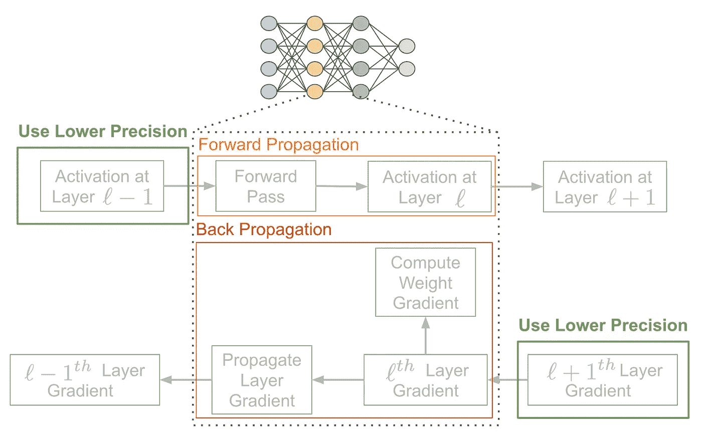
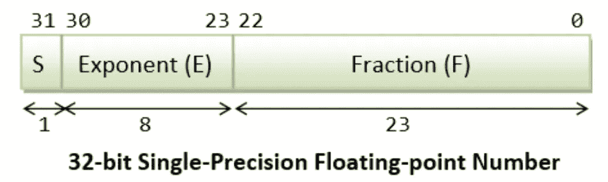
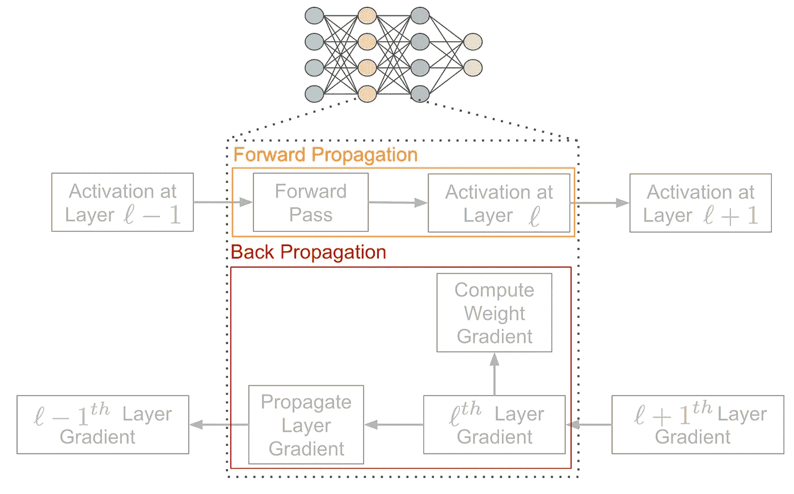
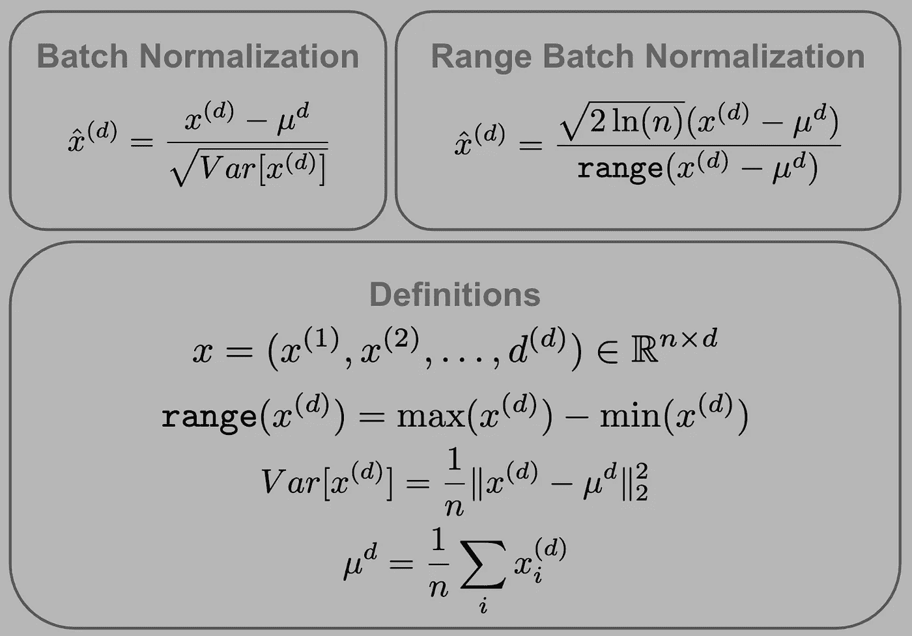
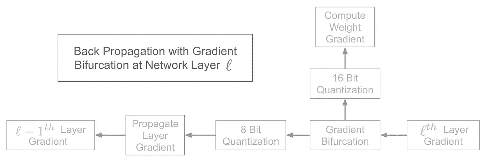
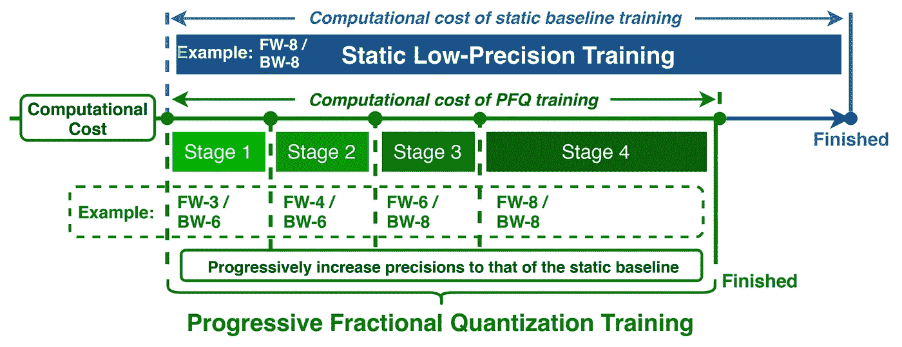
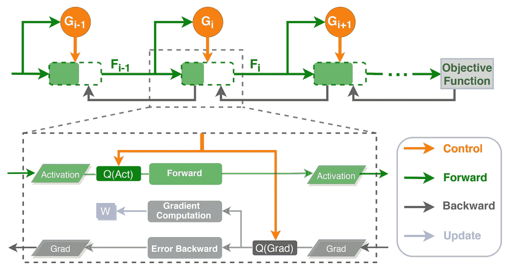
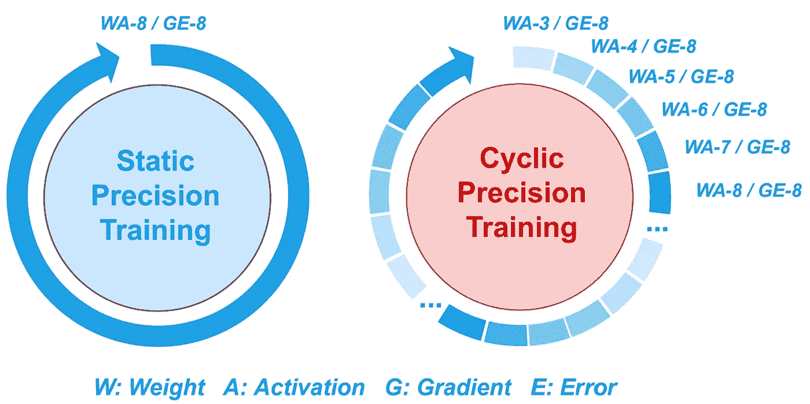
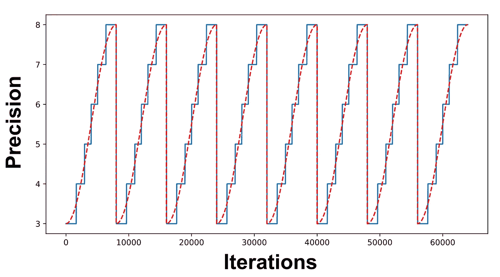

# 深度网络量化训练

> 原文：<https://towardsdatascience.com/quantized-training-with-deep-networks-82ea7f516dc6>

## 如何以最小的努力将神经网络训练时间减少一半

*在神经网络的正向/反向传递中应用量化(由作者创建)*

# 量子化一瞥

存在许多方法来减少神经网络训练的开销，但是最有希望的方法之一是低精度/量化训练。方法很简单— *只需在整个训练过程中减少网络中用于表示激活和梯度的位数*。然后，如上图所示，这些低精度表示使网络的正向和反向传递中的常见操作更快，从而在训练时间和能量效率方面产生改进。

尽管低精度训练背后的想法很简单，但由于可能遇到的几个问题，有效实施这一想法更加困难:

*   梯度表示对较低精度的敏感性
*   批处理规范化模块中的数值不稳定性
*   将精度级别设置得太低，无法获得良好的性能

尽管存在这些问题，但最近的研究发现，神经网络训练对低精度激活和梯度表示的使用具有惊人的鲁棒性，使得能够在神经网络训练的最基本位水平上获得显著的成本节约。然而，除了简单地利用低精度表示之外，现有方法还探索了在训练期间对网络精度的动态适应(例如，循环或依赖于输入的精度)，从而在训练效率方面产生了更大的改进。

在整个概述中，我将阐述量化培训的现有方法，围绕它们的背景，以及如何正确地解决人们可能遇到的问题——如上所述。在我讨论这些主题时，我将试图强调对从业者最有用的量化训练的各个方面，揭示如何利用这些技术以最小的努力显著减少神经网络训练时间。

# 背景资料

在这里，我将提供全面理解神经网络量化训练所需的所有背景信息。首先，我将简要概述可能在量化训练中使用的不同浮点表示。然后，我将解释神经网络内量化的一般方法，它可以被修改以形成具有各种属性的不同量化训练变量。

## 浮点表示法

虽然浮点表示的完整概述超出了本概述的范围，但是基本掌握数字在计算机中的表示方式对于理解低精度训练技术非常重要。关于这个话题的众多、[深入讨论](https://www3.ntu.edu.sg/home/ehchua/programming/java/datarepresentation.html#:~:text=In%2032%2Dbit%20single%2Dprecision,bits%20represents%20fraction%20(%20F%20).)可以在网上找到。

要理解量化训练，首先要理解浮点数在 PyTorch 这样的深度学习包中是如何表示的，因为这种表示方式将用于神经网络训练。这种包使用 32 位浮点表示，如下图所示。

*32 位浮点表示(* [*来源*](https://www3.ntu.edu.sg/home/ehchua/programming/java/datarepresentation.html#:~:text=In%2032%2Dbit%20single%2Dprecision,bits%20represents%20fraction%20%28%20F%20%29.) *)*

因为计算机表示是二进制的，所以它们是实际的全精度数字的近似值，有一些误差(希望很小)。这种误差由表示的精度控制，其中增加(减少)表示中的位数将提供更精确(更不精确)的近似。例如，浮点数也可以用 64 位或 16 位(即“双”或“半”表示)来表示，以提供不同级别的精度。

简而言之，修改浮点表示的精度类似于允许在表示数字时使用更多/更少的小数位数。例如，在试图表示数字 pi 时，可以声称 pi 等于 3.14，尽管 3.14159265 是更准确/精确的表示。

## 低精度的好处

假设浮点数可以用不同的精度表示，人们可能会开始怀疑为什么低精度表示有用。难道我们不想总是使用最精确的表示吗？嗯，这取决于我们的目标是什么…

例如，考虑一个科学计算应用程序。在这些情况下，精度往往至关重要——数值精度的微小误差都会对结果产生重大影响。因此，在这些情况下，应该尽可能以最高的精度来表示数字(例如，64 位双精度表示)。

在神经网络应用中，可以使用较低精度的表示(例如，16 位[9])，而性能不会明显下降。此外，神经网络训练中的常见操作(例如，向量/矩阵乘法和加法)在较低精度输入的情况下要快得多，因此提供了显著的效率益处。这个基本思想是量化训练的关键——我们希望找到降低精度的方法，以便:

*   没有观察到网络性能的恶化
*   减少了训练开销(例如，时间、能量、计算、等待时间)

## 提高神经网络效率的技术

尽管低精度训练是用于改进神经网络训练和能量效率的流行方法，但是存在许多替代方法。例如，已经提出了许多方法来减少神经网络 vai 修剪的大小(感兴趣的读者可以查看我的[之前的概述](https://cameronrwolfe.me/blog/lottery-ticket-hypothesis)本主题)、权重共享、低秩近似，甚至权重量化[10，11，12]。

尽管这种方法能够极大地减少神经网络中的参数数量，但是在提高神经网络效率方面的许多早期工作集中在网络评估/推断上，考虑到与网络评估/推断相比，训练迭代需要大约三倍以上的计算(即，由于除了前向传递之外的梯度计算)，这种方法的影响有限。然而，后来的工作开始侧重于量化网络参数和训练阶段的中间激活，从而节省更多的成本和能源[9，13]。

## 量子化的全局观点

*描述神经网络层中的前向和反向传播(由作者创建)*

此时，我们应该理解量化训练利用低精度浮点表示来减少训练开销。然而，现在还不清楚这种量化在神经网络中应用于何处/如何应用。为了更清楚地说明这一点，我在上图中示意性地图示了单个神经网络层的向后和向前传递的组件。对于那些不熟悉反向传播的人，我鼓励你用网上众多[高质量描述](https://www.jeremyjordan.me/neural-networks-training/)中的一个来补充这个插图。

可以看出，可以应用量化的前向/后向传递有两个主要部分，即**激活和梯度**。也就是说，可以使用低精度表示来存储激活，以使得前向传递更便宜，同时可以量化层梯度，以使得权重梯度计算和梯度到之前层的传播更便宜。可以看出，反向传递在每一层都需要两个单独的操作，计算量是正向传递的两倍，这揭示了为什么在训练期间执行量化(与仅执行正向传播的推断相反)是如此有益。

应当注意，在前向和后向传递中可以采用不同的量化级别(例如，4 位前向传递和 6 位后向传递)。相对于前向通道，后向通道中的量化级别通常不太积极，因为梯度通常对量化更敏感。

## 静态与动态量化方案

神经网络中量化训练的方法可以大致分为两类——**静态和动态方案**。早期的量化工作采用了静态方法，在整个训练过程中执行相同数量的量化——网络梯度和激活采用了固定数量的比特，在训练过程中不会改变。这种方法非常受欢迎，因为它得到了现代混合精度深度学习工具的支持，如 [Apex](https://nvidia.github.io/apex/) ，这些工具可以通过最少的代码更改轻松加速网络训练。

尽管静态方法流行，但最近的工作已经探索了动态低精度训练，其沿着训练轨迹改变网络精度(即，用于激活/梯度的精度随着训练的进行而改变)。这些方法通常应用于静态量化方案之上，使得精度水平在精度的下限和上限之间动态变化。这个上限与静态方法[2，3]使用的精度相匹配。因此，通过在网络训练的某些阶段将精度降低到静态水平之外，可以节省成本。

# 出版物

现在我们已经对量化培训和相关背景有了基本的了解，我将概述一些关于这个主题的有用论文。我将从一种高性能的静态量化技术开始，这种技术大大降低了神经网络有效训练的精度。然后，我将概述最近提出的两种动态量化方法。第一种提出了一种独特的方法，该方法既(I)沿着训练轨迹动态地适应量化，又(ii)训练补充神经网络以根据输入的方式适应精度。另一个实验性地分析了在训练期间用于适应神经网络精度的不同的循环的、动态的方案，并且为量化的训练提供了许多实际的见解。

## 神经网络 8 位训练的可扩展方法[1]

**主旨*。*** 在训练期间尝试超过 16 位精度的量化的先前工作遇到了网络性能的显著降级。在这项工作中，作者探索了量化过程和一般网络架构的修改，使网络梯度，激活和权重的 8 位量化。令人惊讶的是，他们达成了一个静态的低精度训练程序，称为 SBM，实现了这个目标，*证明神经网络训练比以前认为的对量化更鲁棒。*

导出的训练过程使用 8 位精度执行除参数更新和权重梯度计算之外的所有操作。为了能够以如此低的精度进行训练，必须解决神经网络训练中最敏感的部分——批量标准化和反向传播。特别地，作者通过以下方式降低了这些分量对量化的敏感性:

*   开发一种量化友好的批量标准化变体，称为**范围批量标准化**，它不太容易出现数值不稳定性。
*   使用**梯度分叉**在每一层维护网络梯度的两个副本，以便能够以更高的 16 位精度计算对使用较低精度敏感的权重梯度。

总之，这种修改显示出能够在量化训练中探索显著较低的精度，从而在神经网络训练成本、等待时间和能量使用方面提供大量节约。

*普通批处理规范化与范围批处理规范化(由作者创建)*

**方法论。**如上所述，作者发现，在执行低精度训练时，批量标准化和反向传播操作是神经网络训练过程和架构中最有问题的部分。为了理解这背后的原因，我们必须分别检查每个组件。

批处理规范化——如上所述，更全面的描述参见此处的——通过 *:* 转换一些输入中的每个组件

*   减去分量的平均值
*   除以成分的标准偏差

计算该标准偏差需要平方和，这可能会导致在较低精度下处理大值时出现数值不稳定和算术溢出。为了避免这种不稳定性，作者提出了范围批量归一化，如上图所示，它通过输入分布的范围进行归一化(通过依赖于维度的常数进行缩放)。由于不涉及导致数值不稳定的大数之和，该量对量化更为宽容，并且可证明接近高斯数据假设下的标准偏差(更多详细信息，请参见[1]的第 3 节)。

在背景信息部分中描述了在单个网络层上执行的反向传播过程。可以看出，在每一层执行两个操作:

1.  计算前一层梯度
2.  计算重量梯度

该过程的第一步对网络中的每一层顺序重复，使其成为完成反向传播的瓶颈。因此，该过程必须加速(即，使用较低精度的运算)以实现提高的效率。相比之下，权重梯度是针对每一层单独计算的，并且没有顺序相关性，这意味着该步骤可以以更高的精度(并且是并行的)执行，而不会恶化网络性能。

考虑到这一点，作者引入了梯度分叉过程，该过程在 8 位和 16 位保持层梯度的单独副本。然后，可以使用较低精度的表示来计算层梯度，以加速顺序计算，同时可以以较高精度单独计算权重梯度。这种量化反向传播的更明智的方法，如下图所示，对于实现较低精度的训练至关重要。

*量化反向传播的梯度分叉(作者创建)*

**发现。**

*   即使在 ImageNet 上的大规模实验中，也可以用范围批处理规范化替换普通批处理规范化，而没有明显的性能差异。
*   当采用较低精度时，范围批处理规范化显示出相对于普通批处理规范化保持较高的性能水平。
*   将范围批量归一化与所提出的用于量化反向传播的方法相结合，使得能够以令人惊讶的低精度进行训练，而不会恶化网络性能。

## FracTrain:在时间和空间上分数压缩比特节省，用于有效的 DNN 训练[2]

*FracTrain 方法中 PFQ 训练的描述(来源【2】)*

**大意。** 以前的量化训练工作通常采用静态方法，在整个训练过程中使用固定精度[1，4，5]。除了静态方法，FracTrain 还探索了训练过程中精度的动态适应。特别地，所提出的方法在两个方面适应精度:

*   **暂时**通过在训练过程的不同阶段采用不同的精度水平
*   **在空间上**通过基于输入的属性学习适应网络的每一层/块中使用的精度水平

这种用于动态适应精度的时间和空间策略分别被称为**渐进分数量化(PFQ)** 和**动态分数量化(DFQ)** 。为了最大限度地降低培训成本，这些策略被串联应用，形成了 **FracTrain** 策略。

在实践中，FracTrain 应用于静态量化方案之上，这意味着训练期间使用的最高精度水平与静态精度基线相匹配。以这种方式使用 FracTrain，可以大大减少训练过程中产生的训练、能量和延迟成本。此外，生成的模型与通过静态精度基线获得的模型性能相当，没有观察到对网络性能的显著影响。

**方法论。** 如上所述，FracTrain 方法由两个部分组成——PFQ 和 DFQ——在整个训练过程中串联应用。这些方法应用于静态的、低精度的训练方法之上。因此，训练期间使用的最高精度与该静态基线的精度相匹配，而 FracTrain 进一步降低了超过该点的精度。

PFQ 背后的想法很简单——在训练的早期阶段使用较低的精度，然后随着训练的进行慢慢提高精度。这种方法受到以下事实的启发:在网络训练的早期阶段学习到的特征对噪声(例如，来自量化)和更高的学习速率具有鲁棒性[6，7，8]。为了在实践中应用 PFQ，必须选择低的初始精度(例如，4 位前向和 6 位后向精度)。然后，当网络损耗在几个时期内没有改善时，该精度增加，最终在训练的后期达到静态基线的精度。

*经由 DFQ 的动态的、依赖于输入的量化(来源【2】)*

不幸的是，DFQ 不像 PFQ 那样直白。为了在整个网络中以依赖于输入的方式修改精度，作者利用每个层/块的单独的、学习过的[递归神经网络](https://www.jeremyjordan.me/introduction-to-recurrent-neural-networks/),该网络:

*   接受与网络本身相同的输入
*   预测要使用的正确精度级别

上图中描述的这个补充网络可以是轻量级的，并且通过在网络的目标函数中加入正则化项来训练，该目标函数捕获训练成本，允许在网络性能和训练效率之间实现折衷。

**发现。**

*   当一起应用时，相对于静态的低精度训练方法，PFQ 和 DFQ(或 FracTrain)在网络训练成本、能量使用和延迟方面产生显著改善，同时保持类似的性能水平。这种结果是在使用现代卷积神经网络(例如，各种 ResNets 和 MobileNetV2)和变压器架构的大规模实验中获得的。
*   孤立地应用，PFQ 和 DFQ 都被发现相对于静态的，低精度的训练提高了训练效率。有趣的是，发现 DFQ 在非常低的精度水平下特别有效，尽管静态基线方法的性能显著下降，但它仍保持令人印象深刻的精度水平。

## CPT:通过循环精度的高效深度神经网络训练[3]

*循环与静态精确训练(来源[3])*

**主旨。**与 FracTrain 有些类似,【3】中提出的循环精度训练(CPT)策略进一步探索了训练过程中时间量化的可能性。特别地，采用循环调度来在整个训练过程中在最小值和最大值之间改变网络精度。有趣的是，作者发现，相对于静态量化过程，在整个训练过程中循环变化的精度可以产生显著的计算节省，甚至在许多情况下提高网络的泛化能力。

为了激励循环精度时间表的使用，作者对网络精度和学习速率进行了比较。也就是说，在训练期间使用较低的精度提供了帮助网络“探索”损失情况的噪声，类似于对学习率使用较大的值。相比之下，更高的精度水平允许模型收敛到最终解，类似于使用低学习率。

作者通过证明改变这两个超参数对神经网络训练具有相似的影响，发现学习速率和精度之间的这种联系在经验上是有效的。CPT 方法受这一类比的启发，因为它根据余弦时间表循环改变精度，这与实践中经常用于设置学习率的超参数时间表相同。事实上，利用这种学习率的循环时间表是如此普遍，以至于在 PyTorch 中专门实现了。

*描述 CPT 中使用的循环精确时间表(来源[3])*

**方法论。***CPT 背后的方法论相当简单。首先，必须选择训练中使用的最小和最大精度。然后，在整个训练过程中，精度水平按照循环余弦时间表在该最小和最大水平之间变化，如上图所示。与 FracTrain 类似，这种程序应用于静态、低精度训练方法之上，这意味着循环时间表中使用的最高精度水平与静态精度基线相匹配。*

*虽然训练中使用的最大精度可以采用任何静态的低精度基线方法，但还必须确定 CPT 使用的精度下限。为了根据经验做到这一点，作者提出了一个简单的**精度范围测试**，其操作如下:*

*   *从最低的可能精度(例如，2 位)开始*

*逐步提高精度，监控训练精度*

*   *将所述精度下限设置为第一精度，所述第一精度使得训练精度的增加超过预设阈值*

*这种精度范围测试可以在 CPT 的第一个周期中执行——它不需要与网络训练过程本身分开执行。然后，未来的循环简单地采用在第一个循环中进行的范围测试所确定的精度下限。在执行精度范围测试时，只损失了几次迭代训练，这使得它成为确定 CPT 中使用的理想精度范围的低成本和有效的方法。*

***调查结果。***

*   *发现精度水平与学习速率类似地影响神经网络训练过程。使用低精度是高学习速率的伪替代，反之亦然，因此鼓励使用模拟学习速率的精度循环调度。*
*   *发现在训练期间使用精确的动态时间表有助于网络泛化。使用 CPT 训练的网络往往比使用静态、低精度基线训练的网络更容易泛化。*
*   *相对于静态精度基线，CPT 显著降低了计算成本、能量使用和神经网络训练的延迟，同时匹配或改善了它们的性能，即使在大规模实验中也是如此。*
*   *发现更紧凑的网络(例如 MobileNetV2 与 ResNet)对较低的量化级别不太鲁棒，这意味着 CPT 中使用的精度下限必须稍微提高。*

## *我们在实践中可以用什么？*

*尽管动态量化方案取得了令人印象深刻的结果，但这种方法不能在当前的硬件上实际使用。特别是，当前的 NVIDIA GPUs 仅支持半精度的混合精度训练(例如，16 位格式)。然而，这种精度的降低仍然可以在许多常见深度学习工作流的模型训练时间方面产生高达 3 倍的加速。另外，当前的语言/软件包(例如 PyTorch、TensorFlow、Julia 等。)开始建立对任意的、低精度的算术的支持，因为量化训练的研究证明了它的好处。*

*尽管当前的硬件不支持更复杂的量化技术，但使用半精度对于深度学习实践者来说非常有用，因为它可以显著减少模型训练时间，而不会明显降低性能。此外，半精度的培训是由 Apex 等工具抽象的，允许从业者在不进行大量实施更改的情况下显著减少培训时间。请看[这里](https://github.com/NVIDIA/apex/tree/master/examples/imagenet)的例子。*

*鉴于在本概述中描述的许多量化方法还不被现代硬件支持，人们可能想知道我们实际上如何知道这样的方法实际上有益于训练效率。有许多指标和方法可以量化这一优势，例如:*

*   *计算训练期间使用的有效 FLOPS 数，如[4](也称为 MACs [2]或 GBitOPs [3])所述*
*   *在 [FPGA](https://www.xilinx.com/products/silicon-devices/fpga/what-is-an-fpga.html#:~:text=Field%20Programmable%20Gate%20Arrays%20%28FPGAs,or%20functionality%20requirements%20after%20manufacturing.) 上实施低精度训练，并测量实际性能指标(例如，能耗、延迟等。)*
*   *使用模拟器测量性能指标(如 BitFusion [14])*

*通过利用这些技术，量化训练中的现有工作可以证明，尽管当前硬件中的支持有限，但所提出的方法对训练效率提供了显著的益处。*

# *外卖食品*

*这一概述的主要要点可以简单陈述如下:*

*   *神经网络训练对于网络激活和梯度的低精度表示的使用是鲁棒的*
*   *在训练期间利用低精度可以在训练时间、能量效率和计算成本方面产生显著的改进*

*这些发现在本质上是非常重要的。此外，即使是操纵神经网络精度的更复杂的方法也只是利用这些基本发现并扩展它们，以产生进一步降低精度的更智能/更复杂的方法。因此，量化培训是一种简单易懂的方法，具有不可思议的潜力和广泛的实际影响。*

*在了解低精度训练时，出现了几个基本的深度学习概念:*

*   ***前向/后向传播**(以及量化可能发生的地方)*
*   ***批量归一化**(及其对数值不稳定性的敏感性)*
*   ***超参数计划**(例如，循环学习率/精度)*
*   ***梯度对噪声的敏感度**(例如，来自较低精度)*

*这些概念中的每一个都经常出现在深度学习文献中，对于任何想要更深入了解的深度学习实践者来说，理解这些概念都很重要。这些想法大多很容易理解。然而，对于那些有兴趣了解更多量化梯度难度背后的细节的人，我推荐阅读[1]中的第 4 节到第 6.1 节。*

## *结论*

*非常感谢您阅读这篇文章——非常感谢您对我的内容的支持和兴趣。如果你喜欢它，请订阅我的[深度(学习)焦点时事通讯](https://cameronrwolfe.me/signup)，在那里，我每两周对深度学习研究中的一个相关主题进行情境化、解释和检查。欢迎在 [medium](https://medium.com/@wolfecameron) 上关注我，或者浏览我网站的其他部分，那里有我的社交媒体和其他内容的链接。如果您有任何建议/反馈，请直接联系我或在此帖子上留言！*

# *文献学*

*[1] Banner，Ron 等，“神经网络 8 位训练的可扩展方法”*神经信息处理系统进展* 31 (2018)。*

*[2]傅，，等.“分形训练:在时间和空间上分数压缩比特节省，用于有效的 dnn 训练”*神经信息处理系统进展*33(2020):12127–12139。*

*[3]傅，，等.“CPT:基于循环精度的高效深度神经网络训练”arXiv 预印本 arXiv:2101.09868 (2021)。*

*[4]周，舒畅，等.“Dorefa-net:用低位宽梯度训练低位宽卷积神经网络” *arXiv 预印本 arXiv:1606.06160* (2016)。*

*[5]杨，于宽等，“用全 8 位整数训练高性能大规模深度神经网络。”神经网络 125(2020):70–82。*

*[6] Rahaman，Nasim，等，“论神经网络的谱偏差”*机器学习国际会议*。PMLR，2019。*

*[7]阿奇利、亚历山德罗、马特奥·罗韦尔和斯特凡诺·索阿托。"深度网络中的关键学习期."*国际学术交流会议*。2018.*

*[8]李，，魏，马腾宇."解释神经网络训练中初始大学习率的正则化效应."*神经信息处理系统进展* 32 (2019)。*

*[9] Das，Dipankar 等，“使用整数运算的卷积神经网络的混合精度训练” *arXiv 预印本 arXiv:1802.00930* (2018)。*

*[10]陈，文林，等.“用散列法压缩神经网络”*机器学习国际会议*。PMLR，2015 年。*

*[11] Jaderberg，Max，Andrea Vedaldi 和 Andrew Zisserman。"用低秩展开加速卷积神经网络." *arXiv 预印本 arXiv:1405.3866* (2014)。*

*[12]乌烈芝、卡伦、爱德华·密德斯和马克斯·韦林。"用于神经网络压缩的软加权共享." *arXiv 预印本 arXiv:1702.04008* (2017)。*

*[13] Gupta，Suyog，等，“有限数值精度的深度学习”*机器学习国际会议*。PMLR，2015 年。*

*Sharma，Hardik 等人，“位融合:用于加速深度神经网络的位级动态组合架构” *2018 年 ACM/IEEE 第 45 届计算机体系结构国际年会(ISCA)* 。IEEE，2018。*