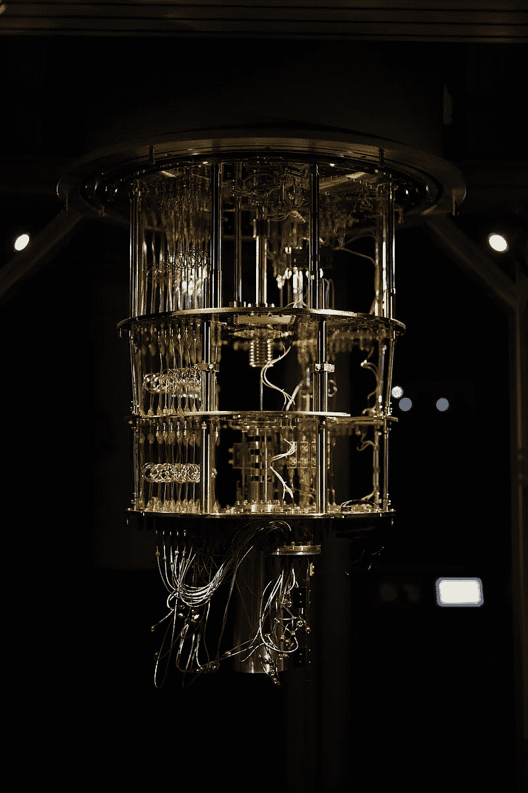
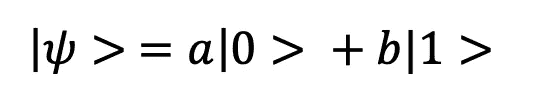
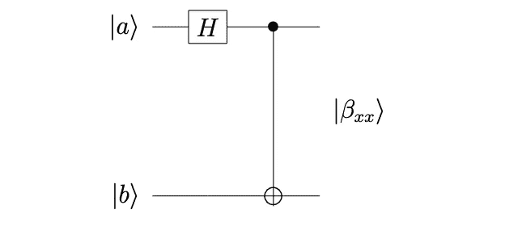
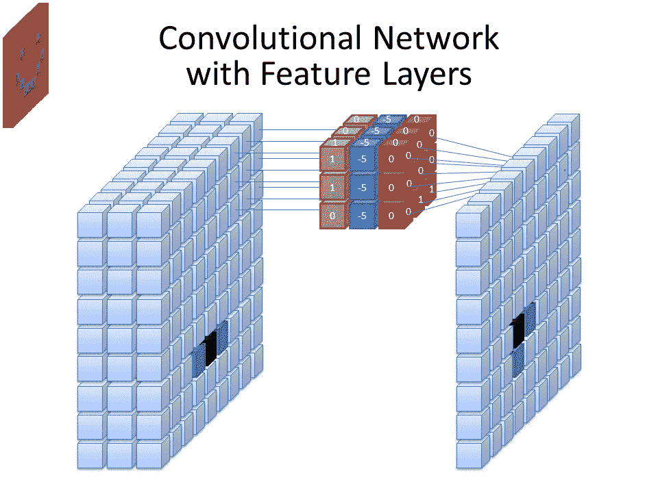

# 量子深度学习:量子卷积神经网络快速指南

> 原文：<https://towardsdatascience.com/quantum-deep-learning-a-quick-guide-to-quantum-convolutional-neural-networks-d65284e21fc4>

## *你需要知道的关于量子卷积神经网络(QCNNs)的一切，包括与经典计算方法相比，这些方法的优势和局限性*

芬兰埃斯波的 IQM 量子计算机 [Ragsxl](https://commons.wikimedia.org/wiki/File:IQM_Quantum_Computer_Espoo_Finland.jpg)

近年来[对量子计算的投资显著增加](https://semiengineering.com/progress-in-quantum-computing/)，安全和网络通信等领域的量子方法有望颠覆现有的经典计算技术。

Garg 和 Ramakrishnan 等研究人员认为，量子计算的核心是“通过计算成本更低的技术解决经典难题”。或许不足为奇的是，正如近年来深度学习和量子计算的研究平行增长一样，许多人现在正在研究这两个领域交汇的可能性:量子深度学习。

在本文中，我们将在高层次上讨论量子深度学习的现有研究和应用，重点是混合量子卷积神经网络(QCNNs)。首先，提供了与经典计算相比的量子计算的简要定义。从这里，纠缠被定义，以及纠缠态和它们的应用。

接下来，讨论了经典卷积神经网络(CCNNs，或 CNN)的概述。最后，讨论了 QCNNs 及其性能，以及这些方法的优点和局限性。

# 经典计算和量子计算的区别

如果你对量子计算完全陌生，一个重要的介绍性概念是经典计算(我们通常用于计算任务)和量子计算之间的区别。在传统的计算机上，当一个程序被执行时，编译器被用来把程序的语句翻译成二进制位上的操作。

不像经典计算机上的比特在任何时候都代表 1 或 0，量子比特能够在这两种状态之间“徘徊”。只有在测量时，量子位才会“坍缩”成它的一种状态。

这种性质被称为叠加，对量子计算任务至关重要(Ganguly，Cambier，2021)。通过叠加，量子计算机可以并行执行任务，不需要完全并行的架构或 GPU 来处理并行计算任务。这是因为如果每个叠加态对应于不同的值，如果叠加态被作用，那么该作用在所有状态上同时执行。

叠加量子态的一个例子如下:

和 **a** 和 **b** 指的是概率幅度，其给出了一旦执行测量就投射到一个状态的概率。叠加量子态是通过使用量子逻辑门产生的。如果 Bra-ket 符号对你来说是新的，那么强烈推荐 Perry 的量子计算的*圣殿。*

# 纠缠的简要介绍

正如叠加是量子物理中的一个重要原理一样，另一个要讨论的关键领域是纠缠。纠缠是指在两个或多个粒子之间产生或导致相互作用的行为，这意味着这些粒子的量子状态不再能够彼此独立地描述，即使当[相隔很远](https://www.ofcom.org.uk/__data/assets/pdf_file/0013/222601/Executive-Summary.pdf)时也是如此。当粒子变得纠缠时，如果一个粒子被测量，那么与之纠缠的另一个粒子将测量为相反的状态，瞬间(这些粒子没有局域态)。

# 纠缠——贝尔态

随着对量子位和纠缠的理解，现在可以讨论贝尔态了。这些是量子比特的最大纠缠态，它们是:

|00⟩ → β → 1 √ 2 (|00⟩ + |11⟩) = |β00⟩,

|01⟩ → β → 1 √ 2 (|01⟩ + |10⟩) = |β01⟩

|10⟩ → β → 1 √ 2 (|00⟩ − |11⟩) = |β10⟩

|11⟩ → β → 1 √ 2 (|01⟩ − |10⟩) = |β11⟩

贝尔态是由以下量子电路产生的:

*贝尔态电路来自佩里的量子计算圣殿。*

这里显示了一个贝尔态电路，它接受量子位输入，并应用哈达玛和 CNOT 门来创建一个纠缠的贝尔态。

虽然理解不同的量子门超出了本文的范围，但是考虑到旋转和 CNOT 门将作为 QCNNs 部分的一部分来讨论，建议使用指南的[。](https://qiskit.org/textbook/ch-states/single-qubit-gates.html..)

贝尔态已经被用来开发一系列的量子计算应用。例如， [Hegazy、Bahaa-Eldin 和 Dakroury 已经从理论上证明了贝尔态和超密集编码可以用来获得“无条件安全”。](https://arxiv.org/abs/1402.6219)

# 经典深度学习:卷积神经网络

随着对量子计算的介绍，我们现在将讨论深度学习的经典方法，特别是卷积神经网络(CNN)。

正如 Franç ois Chollet 在*用 Python 进行深度学习*中指出的那样，卷积神经网络(CNN)已被证明在图像分类等任务中很受欢迎，因为它们能够建立模式的层次结构，例如首先表示线条，然后表示这些线条的边缘。这允许 CNN 建立在层之间的信息上，并表示复杂的视觉数据。

CNN 有卷积层，它由过滤器组成，过滤器“滑过”输入并产生一个[“特征图”，允许检测输入中的模式](https://books.google.co.uk/books/about/Practical_Convolutional_Neural_Networks.html?id=v3XyvQEACAAJ&redir_esc=y)。CNN 还使用池层来减少特征图的大小，从而减少学习所需的资源。关于这方面的更多信息，[哦，崔和金的 2020 年 CNN 指南被强烈推荐](https://arxiv.org/abs/2009.09423)。

[Cecbur](https://commons.wikimedia.org/wiki/File:Convolutional_Neural_Network_NeuralNetworkFeatureLayers.gif) 所示的卷积神经网络(CNN)

# 量子卷积神经网络——一个混合网络例子

回到手头的主题，定义了经典 CNN，现在可以探索量子 CNN 如何利用这些传统方法并扩展它们。Garg 和 Ramakrishnan 发现，开发量子神经网络的一种常见方法是开发一种“混合”方法，引入所谓的“量子层，一种基于随机量子电路的变换，作为经典 CNN 的附加组件”。

在这一节中，我们将讨论由 [Lü等人](https://arxiv.org/abs/2107.03630)开发并在 MNIST 手写数字数据集上测试的混合 QCNN。对于他们的混合 QCNN， [Lü等人，](https://arxiv.org/abs/2107.03630)在他们 2021 年的论文中，使用量子电路和纠缠作为经典模型的一部分来获取输入图像，然后生成预测作为输出。

在这种方法中，量子卷积神经网络(QCNN)将图像数据作为输入，并将其编码为量子态 **|x >** ，然后进行转换，并使用量子卷积层和池层提取特征(Lü等人，2021)。

最后，使用强纠缠电路的全连接层用于执行分类，并通过测量获得预测(Lü等人，2021)。

用于减少训练数据标签和由 QCNN 预测的标签之间的差异的优化由随机梯度下降(SGD)处理。关注量子电路，量子卷积层中使用的门如下所示，结合了旋转和 CNOT 门运算符。

在汇集层，测量量子位的子集，然后得出的结果决定是否对它们的邻居应用单量子位门:

全连接层由“通用单量子比特量子门”和产生纠缠态的 CNOT 门组成。为了将 QCNN 与其他方法进行比较，Lü等人使用了 MNIST 数据集和模拟的 QCNN。按照典型方法，创建了一个训练/测试数据集，并开发了一个由以下层组成的 QCNN:

*   2 个量子卷积层
*   2 个量子池层
*   1 量子全连接层

该 QCNN 对数据集的测试集准确率达到了 96.65%。相比之下，根据代码为的[论文，这个数据集的最高准确率为 99.91%。然而，值得注意的是，对于这个实验，只有两类 MNIST 数据集被分类，这意味着与其他 MNIST 模型性能的全面比较是有限的。](https://paperswithcode.com/sota/image-classification-on-mnist)

# 评估 QCNNs 的可行性

虽然 Lü等人的研究人员已经开发了量子 CNN 的方法，但该领域的一个关键挑战是实现理论模型所需的[硬件还不可用](https://arxiv.org/pdf/2005.04316.pdf)。除此之外，还有与混合方法特别相关的挑战，混合方法在经典计算方法的基础上引入了量子层。

如果我们认为量子计算的一个关键好处是，它可以通过计算成本更低的技术来解决“经典的棘手问题”，这些解决方案的一个重要方面是“量子加速”:当探索量子机器学习的好处时，Phillipson (2020)提出，与经典实现相比，预计量子算法将[具有多项式甚至指数加速时间](http://ceur-ws.org/Vol-2561/paper5.pdf)。然而，Lü等人的方法的局限性在于，对于需要经典数据和测量的一致解码/编码的算法，例如 QCNN,“量子加速”增益是有限的。阿伦森和[亨德森等人](https://arxiv.org/abs/1904.04767)对此进行了讨论。，在他们各自的论文中。目前，关于如何最好地设计编码/解码和需要最小测量的协议以受益于“量子加速”的信息有限。

更一般地，纠缠已经被证明是量子机器学习的一个重要属性。Lü等人提出的 QCNN 利用强纠缠电路，可以产生纠缠态作为其全连接层，允许模型进行预测。纠缠已经在其他地方被用来帮助深度学习模型，例如[刘等人利用纠缠](https://www.frontiersin.org/articles/10.3389/fams.2021.716044/full)从图像中提取重要特征。此外，Sharma 等人[发现，在数据集中使用纠缠可能意味着模型能够从比之前预期的更小的训练数据集中学习](https://arxiv.org/abs/2007.04900)，从而完善了所谓的“没有免费的午餐”定理。

# 关于 QCNNs 的结论

在这篇文章中，提供了经典和量子深度学习方法的比较，以及利用量子层(包括强纠缠电路)来生成预测的 QCNN 的概述。量子深度学习的好处和局限性已经讨论过了，包括纠缠在机器学习中更普遍的应用。

考虑到这一点，现在可以考虑量子深度学习的下一步，特别是 QCNNs。Garg 和 Ramakrishnan 发现，除了图像识别，量子方法已经开始用于自然语言处理(NLP)等领域，例如 [Galofaro 等人检测仇恨言论的工作](https://arxiv.org/abs/1811.03275v1)。

与此同时，我们也看到了量子硬件的进步，像 [PsiQuantum 这样的公司致力于开发百万量子位量子处理器](https://www.forbes.com/sites/moorinsights/2022/09/21/psiquantum-has-a-goal-for-its-million-qubit-photonic-quantum-computer-to-outperform-every-supercomputer-on-the-planet/?sh=16f56ea18db3)。因此，尽管我们已经看到了与应用量子神经网络相关的挑战，但随着研究在深度学习和量子计算的“交界处”继续进行，我们可以期待看到量子深度学习的进一步发展。

# 相关资源

对于那些感兴趣的人，提供了一个关于相关量子计算和深度学习资源的小型参考书目，以及文章中的链接。

Aaronson，S. (2015)“阅读小字”，《自然物理学》，11(4)，第 291–293 页。doi: 10.1038/nphys3272。

比亚蒙特，j .等人..(2017)《量子机器学习》，Nature，549(7671)，第 195–202 页。doi: 10.1038/nature23474。

Chollet，(2021 年)。用 Python 进行深度学习。第二版。庇护岛(纽约，Estados Unidos):曼宁。

Ganguly 和 t . Cambier，2021 年。量子计算与 Silq 编程。打包。

Garg，s .和 Ramakrishnan，G. (2020)量子深度学习的进展:概述，arXiv.org。地点:【https://arxiv.org/abs/2005】T2。

Hegazy，o .，Bahaa-Eldin，a .和 Dakroury，Y. (2014 年)使用纠缠和超密集编码的量子安全直接通信，arXiv.org。地点:【https://arxiv.org/abs/1402.6219 

Henderson，m .等人，(2019)量子神经网络:用量子电路为图像识别提供动力，arXiv.org。上市地点:[https://arxiv.org/abs/1904.04767](https://arxiv.org/abs/1904.04767)

Karn，U. (2016)卷积神经网络的直观解释— KDnuggets。可从以下网址获得:[https://www . kdnugges . com/2016/11/intuitive-explain-convolutionary-neural-networks . html](https://www.kdnuggets.com/2016/11/intuitive-explanation-convolutional-neural-networks.html)

刘，杨等，(2021)“基于纠缠的张量网络机器学习特征提取”，应用数学与统计前沿，7。doi: 10.3389/fams.2021.716044。

吕，y .等人，(2021)用于图像分类的量子卷积神经网络，arXiv.org。可在:[https://arxiv.org/abs/2107.03630](https://arxiv.org/abs/2107.03630)买到。

北达科他州梅塔，2020 年。量子计算。【S.l .】:实用主义书架。

Ofcom，(2021)量子通信:未来通信的新潜力可从以下网址获得:[https://www . ofcom . org . uk/_ _ data/assets/pdf _ file/0013/222601/Executive-summary . pdf](https://www.ofcom.org.uk/__data/assets/pdf_file/0013/222601/Executive-Summary.pdf)

Oh，s .，Choi，j .和 Kim，J. (2020)量子卷积神经网络教程(QCNN)，arXiv.org。地点:【https://arxiv.org/abs/2009.09423 

s . pattanayak(2021 年)。使用 Python 的量子机器学习:使用来自 Google Research 和 IBM Qiskit 的 Cirq。阿普瑞斯。

菲利普森，F (2020)。量子机器学习:好处和实例。地点:【http://ceur-ws.org/Vol-2561/paper5.pdf 

T. R .佩里(2004 年)。量子计算的殿堂:1.1 版—2006 年 4 月 29 日。莱利·t·佩里。

Sewak，Karim，Pujari，P .(2018 年)。实用卷积神经网络。伯明翰:Packt。

Sharma，k .等人(2022) “纠缠数据集的无免费午餐定理的重新表述”，《物理评论快报》，128(7)。doi:10.1103/physrevlett . 128.070501。

Voorhoede，D. (2022)叠加和纠缠，量子激励。可从以下网址获得:[https://www . quantum-inspire . com/kbase/叠加和纠缠/](https://www.quantum-inspire.com/kbase/superposition-and-entanglement/)