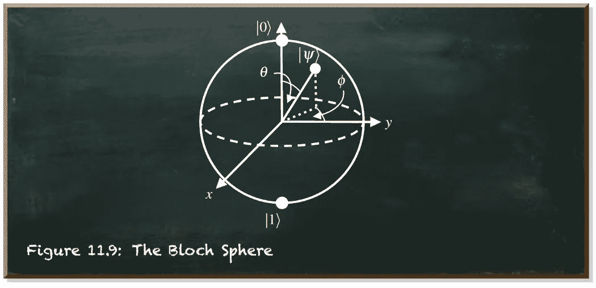

# 用 Qiskit 减轻量子测量

> 原文：<https://towardsdatascience.com/quantum-measurement-mitigation-with-qiskit-bb35b3d28eec>

## 参与 IBM 量子开放科学奖的下一步

量子机器学习要不要入门？看看 [**动手量子机器学习用 Python**](https://www.pyqml.com/page?ref=medium_measmitig&dest=/) **。**

今天，我们将使用 Qiskit 实现一种量子测量误差缓解方法。我们这样做是为了参加 IBM 的第二届量子开放科学奖。他们要求解决一个量子模拟问题。他们希望我们在他们的 7 量子位 Jakarta 系统上使用 Trotterization 模拟一个三粒子系统的海森堡模型哈密顿量。难的部分不是模拟海森堡模型的哈密顿量。对一个三粒子系统来说，这样做也不成问题。并且，使用 Trotterization 是—是的，没错—也没问题。

令人惊讶的是，问题是在一个实际的 7 量子位设备上做所有这些。量子系统极其脆弱。它们易受环境干扰，容易出错。不幸的是，我们没有资源来纠正这些硬件或低软件级别的错误。我们能做的最好的事情就是减少噪声对计算的影响。

幸运的是，有很多减少量子错误的方法。例如，在以前的帖子中，我们[仔细研究了 Clifford 数据回归(CDR)方法](https://pyqml.medium.com/mitigating-quantum-errors-using-clifford-data-regression-98ab663bf4c6)。我们甚至在模拟和实际的量子设备上使用它来降低噪声[(](/how-to-implement-quantum-error-mitigation-with-qiskit-and-mitiq-e2f6a933619c)[https://towards data science . com/practical-error-impression-on-a-real-quantum-computer-41 a99 dddf 740](/practical-error-mitigation-on-a-real-quantum-computer-41a99dddf740))。

CDR 降低了计算可观察值的期望值时的噪声。但是要参与 IBM 的挑战，我们需要减少测量计数中的误差。IBM 使用量子状态层析算法来计算结果状态与预期状态的匹配程度。这种算法适用于测量计数。

不幸的是，虽然我们可以从计数中计算期望值，但我们不能反过来做。因此，相反，我们需要调整我们的量子误差缓解方法来处理测量计数。换句话说，我们正在实施量子测量误差缓解。

我说过用 Trotterization 模拟一个三粒子系统的海森堡模型哈密顿量不成问题吗？我是一个守信用的人。下面的源代码提供了所需的模拟。IBM 提供这些代码作为他们的典型 GitHub 项目的一部分。

只有一个变化。如果我们将变量`measure`设置为`True`，我们将在电路中添加一个`ClassicalRegister`来接收测量值。

今天，我们想把重点放在度量缓解上。因此，我们照原样接受代码。我们最终以`qc`作为我们的量子电路。

下图描述了电路图。


接下来，我们需要一个运行时环境。今天，我们可以接受模拟环境。但是为了尽可能接近真实的量子计算机，我们从真实的设备加载噪声特征。为此，我们连接到我们的 IBM 帐户并从中获取雅加达后端。[这篇文章](/how-to-run-code-on-a-real-quantum-computer-c1fc61ff5b4)详细阐述了如果你还没有一个免费的 IBM 帐户，你如何获得它。

其实我们需要两个环境。在嘈杂的模拟器旁边，我们需要一个没有噪音的环境。Qiskit `QasmSimulator`为我们做了这项工作。

现在让我们用两个模拟器运行我们的量子电路。

```
noisy:       {'101': 106, '111': 124, '011': 141, '000': 113, '010': 124, '100': 115, '110': 207, '001': 94}
noise-free:  {'101': 34, '110': 866, '011': 124}
```

计数差异很大。所以，让我们去除噪音吧！我们可以为每个状态计算一个将噪声值变为无噪声值的修改量。

例如，我们在有噪声的模拟中观察到状态|101⟩ 105 次，但在无噪声的模拟中只有 30 次。当我们将噪声值乘以修正值 30/105 时，我们得到无噪声值。

让我们对所有八个州都这样做。

```
modifier:  [0.0, 0.0, 0.0, 0.8794326241134752, 0.0, 0.32075471698113206, 4.183574879227053, 0.0]
```

首先，我们添加一个小助手函数`sorted_counts`。它做两件事。一方面，它确保所有的状态键都存在。例如，代表州|000⟩的关键字`000`在无噪声计数中不存在。另一方面，该函数按键对计数进行排序，从`000`开始，到`111`结束。

这是下一步的前提。我们将两个`counts`字典转换成列表，然后`zip`它们。这意味着我们得到成对的值。位置 0 时无噪声，位置 1 时有噪声。因此，我们通过将无噪声值除以有噪声值来计算每个状态的修正值。

我们可以使用这些修改器来减轻电路的后续测量。所以，让我们重新运行电路。

```
noise-free:  {'000': 0, '001': 0, '010': 0, '011': 124, '100': 0, '101': 34, '110': 866, '111': 0}
noisy:       {'000': 114, '001': 109, '010': 120, '011': 114, '100': 126, '101': 105, '110': 211, '111': 125}
mitigated:   {'000': 0.0, '001': 0.0, '010': 0.0, '011': 100.25531914893618, '100': 0.0, '101': 33.679245283018865, '110': 882.7342995169082, '111': 0.0}
```

我们一眼就可以看出，与未减轻的计数相比，减轻的计数更接近无噪声。因此，让我们将这种缓解用于 IBM 挑战。

IBM 基于量子状态层析成像的保真度来评估我们的缓解性能。这听起来比实际更复杂。

简单来说，量子态层析术是在测量的基础上重建量子态。保真度告诉我们重建的状态和预期的状态有多接近。保真度为 1 表示完全符合。

不过，有一个问题。量子位的量子状态是不可见的。它是两个基态的复合(如在复数中)线性组合。这些基本状态是零个|0⟩和一个|1⟩.布洛赫球是这种量子态最受欢迎的代表之一。



基本上，量子态是矢量|𝜓⟩.它的头部位于球体表面的任何地方。该表面还穿过基础状态，顶部是|0⟩，底部是|1⟩。

不幸的是，每当你看量子态时，你只会看到 0 或 1。状态向量与基态的接近度表示测量任一值的概率。所以，你可以通过重复运行电路来估计接近度。但是，我们谈论的是一个球体。有无限多种可能的量子态具有相同的概率。例如，看看球体的赤道。那里的任何一点到位于球体两极的基态都有相同的距离。

为了重现量子态，我们需要从不同的角度来看这个球体。这就是我们在量子态层析成像中所做的。这些是 X、Y 和 Z 轴。如果我们有两个量子位，就有九个角度:XX，XY，XZ，YX，YY，YZ，ZX，ZY 和 ZZ。如果我们有一个由三个量子位组成的量子系统，就有 27 个不同的角度。因此，我们必须创建 27 个版本的量子电路，每个版本代表一个视角。

幸运的是，Qiskit 为我们提供了创建这些电路的功能。这个函数要求输入量子电路不包含任何测量，但是我们在调用函数时定义了要测量的量子位。因此，我们设置`measure=False`。

```
There are 27 circuits in the list
```

尽管这些电路几乎相同，但它们的测量结果却大相径庭。因此，我们为每个回路计算单独的修正系数。

```
noisy:      {'000': 125, '001': 120, '010': 136, '011': 123, '100': 115, '101': 125, '110': 132, '111': 148}
nose-free:  {'000': 144, '001': 88, '010': 208, '011': 84, '100': 66, '101': 213, '110': 93, '111': 128}
modifier:  [1.152, 0.7333333333333333, 1.5294117647058822, 0.6829268292682927, 0.5739130434782609, 1.704, 0.7045454545454546, 0.8648648648648649]

noisy:      {'000': 139, '001': 112, '010': 127, '011': 133, '100': 113, '101': 127, '110': 136, '111': 137}
nose-free:  {'000': 162, '001': 88, '010': 233, '011': 33, '100': 29, '101': 213, '110': 118, '111': 148}
modifier:  [1.1654676258992807, 0.7857142857142857, 1.8346456692913387, 0.24812030075187969, 0.25663716814159293, 1.6771653543307086, 0.8676470588235294, 1.0802919708029197]...
```

接下来，我们需要在状态层析成像函数中使用修饰符。我从 IBM 的源代码中取出原始代码并进行修改。进一步，我们用`OwnResult`。这是我们在上一篇文章中开发的一个类。它是 Qiskit `Result`的包装器，允许我们更改计数。

函数`state_tomo`将结果、层析成像电路和是否减轻的标志作为参数。`result`必须包含所有 27 个断层扫描电路的结果。我们从`target_state`的定义开始。这是我们与重建状态进行比较的状态。

`idx`变量是电流电路的计数器。我们用它来得到相应的修饰符。现在，我们遍历电路，计算减轻的计数，并把它们放入状态层析成像装配器的`OwnResult`对象中。最后，我们计算保真度。

让我们运行所有这些电路。无声的工作作为对比。

```
noisy state tomography fidelity = 0.2161 ± 0.0000
noise-free state tomography fidelity = 0.8513 ± 0.0000
mitigated state tomography fidelity = 0.8317 ± 0.0000
```

结果显示，通过我们的缓解措施，情况有了显著改善。我们几乎实现了无噪声保真度。然而，我们需要批判性地看待这些结果。

我们使用无噪声结果计算修改量。这是唯一可能的，因为我们的电路是经典可模拟的。所以，我们知道预期的结果。但是，当然，承担使用真正的量子计算机的所有压力只有在经典计算机难以完成的任务中才是有意义的。但是，如果我们不能经典地模拟它，我们就不能计算修改量。

然而，我们的结果作为概念的证明。我们看到，量子测量缓解效果很好，可以用于量子状态层析成像。

量子机器学习要不要入门？看看 [**动手量子机器学习用 Python**](https://www.pyqml.com/page?ref=medium_measmitig&dest=/) **。**


在这里免费获得前三章。