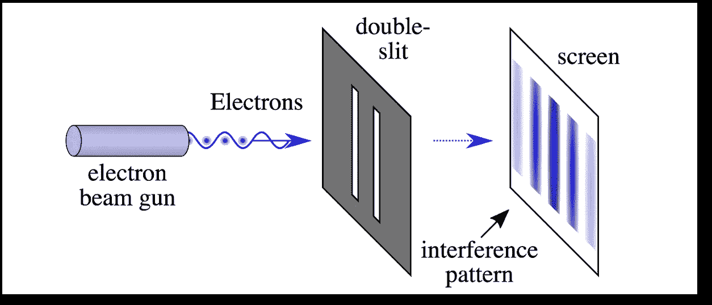
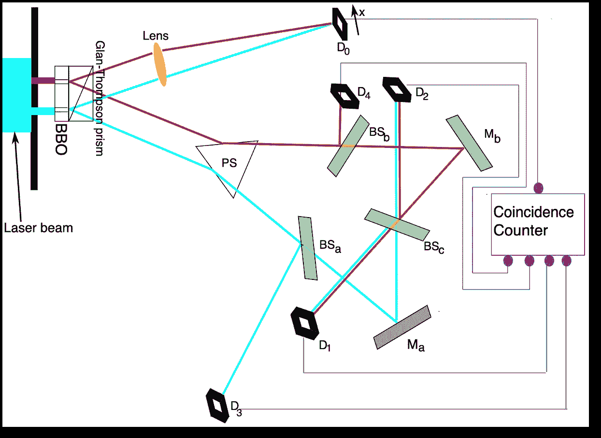
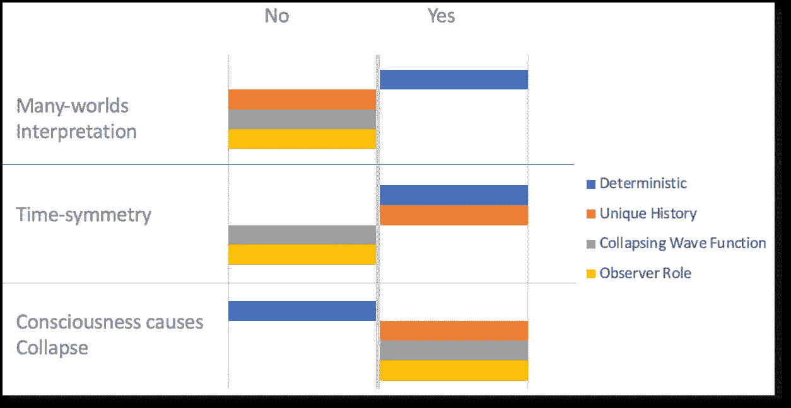

# 量子力学及其对现实的意义

> 原文：<https://towardsdatascience.com/quantum-mechanics-and-its-implications-for-reality-e88e33a53c09>

## 多重世界(多元宇宙)，回溯因果关系(时间对称)和意识导致崩溃

马库斯·斯皮斯克在 [Unsplash](https://unsplash.com?utm_source=medium&utm_medium=referral) 上的照片

这篇文章将触及量子力学对现实本质的三个非常规含义。它将提供高水平的量子实验和假设的描述，试图在量子水平上符合奇异的观察。值得注意的是，不同的著名物理学家团体对十几个学派的不同解释没有达成共识。

机器学习和研究量子力学之间有一些相似之处。在机器学习中，我们试图根据可用的数据建立模型。同样，物理学家正试图从宏观和量子两个层面建立一个基于实验数据的现实模型。

这篇文章中涉及的三个量子解释与下面的常识逻辑相矛盾。

1.  事件的结果与观察者无关。
2.  只有一种版本的事件会及时结束。
3.  时间在前进，过去的事情影响着现在。

这些解释可以在下面的实验中描述。

1.  双缝实验
2.  延迟选择量子擦除器

## 双缝实验

这是最受欢迎的量子实验，已经存在了一个多世纪。它证实了亚原子粒子的波粒二象性，并提出测量(观察)是粒子被观察属性的一个因素。在实验中，亚原子粒子(如光子、电子)被射向一面有两个狭缝的墙(一次一个)。当狭缝周围有一个观察者(或测量设备)时，粒子一次只通过一个狭缝，我们在探测器屏幕上得到两个条纹图案，即每个狭缝一个条纹。当没有测量装置时，电子同时穿过两个狭缝，如图 1 所示，在狭缝另一侧的检测屏上有多个条纹的可见干涉图案证明了这一点。

图 1:量子物理中“双缝实验”的图解|来源链接 [1](https://commons.wikimedia.org/wiki/Category:Double-slit_experiments#/media/File:Double-slit.svg) / [2](https://commons.wikimedia.org/wiki/Category:Double-slit_experiments) (CC BY-SA 4.0)

换句话说，当有观察者(或观察)时，电子的行为类似于粒子(物质)。当没有观测或没有办法知道粒子的路径时，它就像一个波，采取所有可能的路线(即，表现出所有的可能性)。这意味着观察或了解的行为会以某种方式影响粒子的渲染。随后，它提升了 ***意识*** 在粒子事件中的重要性。事实上，量子力学的两位创始人之一马克斯·普朗克(尼尔斯·玻尔是另一位)甚至说:

> “我视意识为根本。我认为物质是意识的衍生物。我们不能落后于意识。我们谈论的一切，我们认为存在的一切，都以意识为前提。”
> 来源:[https://big think . com/words-of-wisdom/max-Planck-I-视意识为根本/](https://bigthink.com/words-of-wisdom/max-planck-i-regard-consciousness-as-fundamental/)

请参阅我之前的帖子，了解量子特性的基础知识(例如*叠加、纠缠等)。*)和量子计算。

</what-is-a-quantum-computer-f1c44e87a379>  

如果仅仅一次观察就能把一个*叠加*的可能性瓦解成一个粒子的可能性，那么物质真的是意识的衍生物吗？许多人认为这种解释过于主观，不予考虑。还有另一种更客观的解释反驳了*因果观察者*和*坍缩波函数*的说法，称为 ***多世界解释*** 或***【MWI】***(***多元宇宙*** 假说的一个分支)。MWI 消除了对波函数坍缩的需要，也消除了对拥有无限多个宇宙的观察者的需要，在这些宇宙中，每一种可能性都被分别表现出来。

美国物理学家休·埃弗雷特最初提出了 MWI，并得到了包括斯蒂芬·霍金在内的许多杰出物理学家的支持，霍金称其为“*不言自明的正确*”([来源](https://www.nbcnews.com/mach/science/weirdest-idea-quantum-physics-catching-there-may-be-endless-worlds-ncna1068706))。同一篇文章援引埃弗雷特的话说:

> "..所有可能的结果都真的发生了——但是在我们居住的世界里只有一个版本。所有其他的可能性都从我们身上分离出来，各自产生了自己独立的世界。按照这种观点，没有什么东西会被浪费掉，因为任何可能发生的事情都会在某个世界发生。”

有些人认为 MWI 过于假设，而且从经验上看是不可证伪的。

## 延迟选择量子擦除器

这是最近(1999 年)对*双缝实验*的延伸，在这里事情变得更加怪异。在 DCQE 中，从双缝出来的亚原子粒子被分裂成纠缠粒子，并通过/反射通过棱镜(PS)、分束器(BSₓ)和反射镜(Mₓ)，如图 2 所示。他们走不同的路线到达 D₀-D₄.的 5 个探测器屏幕该实验不需要狭缝附近的测量装置，以消除装置干扰结果的可能性。

图 2:一个“延迟选择量子橡皮擦实验”的例子来源链接 [1](https://en.wikipedia.org/wiki/Delayed-choice_quantum_eraser) / [2](https://en.wikipedia.org/wiki/File:Kim_EtAl_Quantum_Eraser.svg) ， [GNU 自由文档许可证](https://en.wikipedia.org/wiki/en:GNU_Free_Documentation_License)，版本 1.2 / [知识共享](https://en.wikipedia.org/wiki/en:Creative_Commons)归属共享 [4.0 国际](https://creativecommons.org/licenses/by-sa/4.0/)

初级纠缠粒子经过最短的路径到达检测器 D₀，而其余的纠缠粒子经过较长的路径到达各自的检测器 D₁-D₄.沿着较长路径的分束器有 50%的机会通过，有 50%的机会反射纠缠的粒子。正如你在图 2 的架构中所看到的，如果在 D₃和 D₄检测到一个粒子，我们知道该粒子所经过的*路径*(狭缝),并通过双条纹图案进行确认。如果在 D₁或 D₂探测到一个粒子，就不可能知道*哪条路径*(狭缝)的信息，这也通过干涉图样得到了证实。因此，分束器反射或通过粒子的这种延迟选择保留或擦除了先前的*哪个路径*(或狭缝)信息，并且匹配图案被记录在粒子在到达 D₁-D₄.之前到达的 D₀这意味着**追溯因果关系**(时间对称)，即过去的事件与现在的事件相关联。杰出的物理学家如理查德·费曼和约翰·阿奇博尔德·惠勒通过在他们的*吸收体理论* ( [来源](https://authors.library.caltech.edu/11095/1/WHErmp45.pdf))中使用追溯因果关系，赋予了它可信度。下面是惠勒的一段话，来自[https://en . Wikipedia . org/wiki/Wheeler % 27s _ delayed-choice _ experiment](https://en.wikipedia.org/wiki/Wheeler%27s_delayed-choice_experiment)，

> “……过去不存在，除非记录在现在”，[宇宙也不存在]“存在，在那里独立于所有的观察行为。”

追溯因果关系是有争议的，大多数物理学家对此持怀疑态度，并拒绝它。

## 摘要

图 3 显示了本文中讨论的量子力学的三种解释与四种属性的比较。

图 3:根据[https://en . Wikipedia . org/wiki/interpretions _ of _ quantum _ mechanics](https://en.wikipedia.org/wiki/Interpretations_of_quantum_mechanics#Comparisons)中的信息创建的插图

这三种解释是量子力学十几种常见解释的一部分。使水更加浑浊的是，一个多世纪以来，科学家们无法调和物理学中的另一个主要矛盾:广义相对论(支配大型物体，如重力、恒星、星系等的定律)。)和*量子力学*(亚原子层面观察到的规律)。希望我们不会经历另一个世纪，而没有一个更巩固的框架来涵盖万物理论(T21)。

## 资源

1.  [https://en . Wikipedia . org/wiki/Interpretations _ of _ quantum _ mechanics](https://en.wikipedia.org/wiki/Interpretations_of_quantum_mechanics)
2.  https://en.wikipedia.org/wiki/Many-worlds_interpretation
3.  【https://en.wikipedia.org/wiki/Multiverse 
4.  [https://en.wikipedia.org/wiki/Retrocausality](https://en.wikipedia.org/wiki/Retrocausality)
5.  [https://en . Wikipedia . org/wiki/Von _ Neumann % E2 % 80% 93 wign er _ interpretation](https://en.wikipedia.org/wiki/Von_Neumann%E2%80%93Wigner_interpretation)
6.  [https://en.wikipedia.org/wiki/Double-slit_experiment](https://en.wikipedia.org/wiki/Double-slit_experiment)
7.  [https://en.wikipedia.org/wiki/Delayed-choice_quantum_eraser](https://en.wikipedia.org/wiki/Delayed-choice_quantum_eraser)
8.  [https://en . Wikipedia . org/wiki/Wheeler % 27s _ delayed-choice _ experiment](https://en.wikipedia.org/wiki/Wheeler%27s_delayed-choice_experiment)
9.  [https://en.wikipedia.org/wiki/Measurement_problem](https://en.wikipedia.org/wiki/Measurement_problem)
10.  [https://en . Wikipedia . org/wiki/Wheeler % E2 % 80% 93 费曼 _ 吸收器 _ 理论](https://en.wikipedia.org/wiki/Wheeler%E2%80%93Feynman_absorber_theory)
11.  [https://big think . com/words-of-wisdom/max-Planck-I-视意识为根本/](https://bigthink.com/words-of-wisdom/max-planck-i-regard-consciousness-as-fundamental/)
12.  [https://big think . com/hard-science/a-new-quantum-theory-predicts-the-future-be-influence-the-past/](https://bigthink.com/hard-science/a-new-quantum-theory-predicts-that-the-future-could-be-influencing-the-past/)
13.  没有回溯因果关系，量子理论的时间对称解释可能吗？ —英国皇家学会出版社
14.  [https://authors.library.caltech.edu/11095/1/WHErmp45.pdf](https://authors.library.caltech.edu/11095/1/WHErmp45.pdf)
15.  [https://www . NBC news . com/mach/science/weirdest-idea-quantum-physics-catching-there-may-be-endless-worlds-ncna 1068706](https://www.nbcnews.com/mach/science/weirdest-idea-quantum-physics-catching-there-may-be-endless-worlds-ncna1068706)
16.  [https://www . science alert . com/quantum-physics-theory-predicts-future-may-impact-the-past-retro 因果关系](https://www.sciencealert.com/quantum-physics-theory-predicts-future-might-influence-the-past-retrocausality)
17.  [https://www . the guardian . com/news/2015/nov/04/相对论-量子力学-宇宙-物理学家](https://www.theguardian.com/news/2015/nov/04/relativity-quantum-mechanics-universe-physicists)
18.  [https://en.m.wikipedia.org/wiki/Theory_of_everything](https://en.m.wikipedia.org/wiki/Theory_of_everything)
19.  [https://plato.stanford.edu/entries/qm-retrocausality/](https://plato.stanford.edu/entries/qm-retrocausality/)
20.  [https://thereader.mitpress.mit.edu/the-many-worlds-theory/](https://thereader.mitpress.mit.edu/the-many-worlds-theory/)