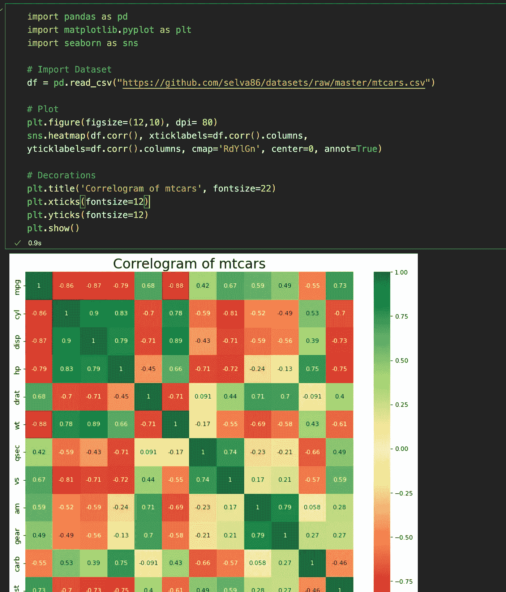
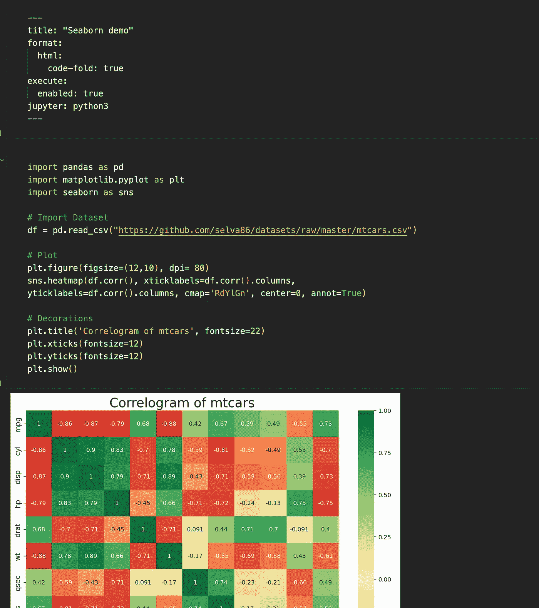
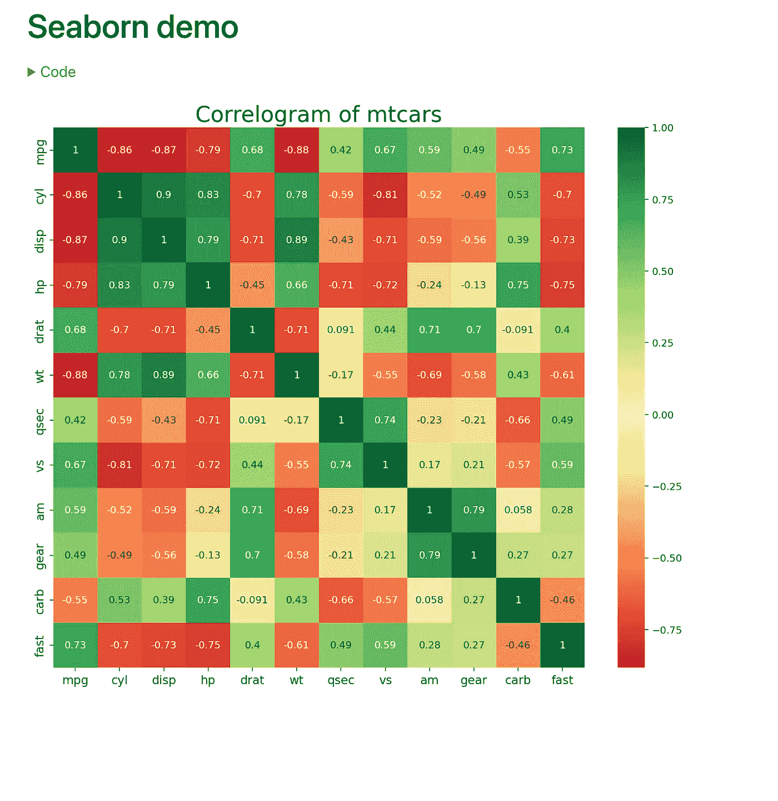
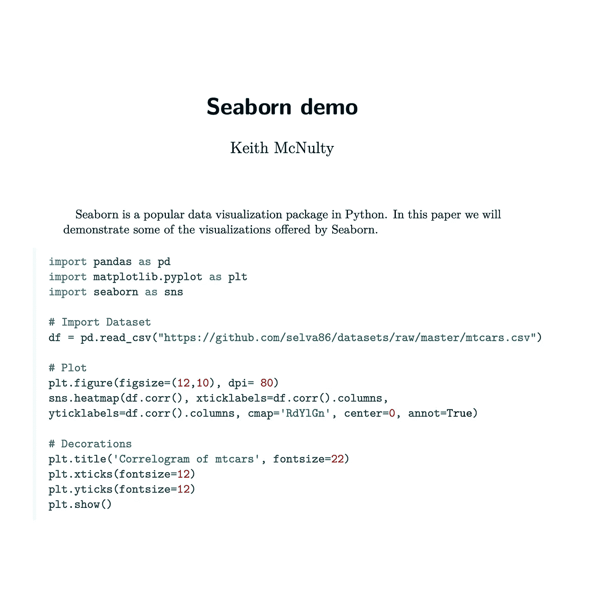
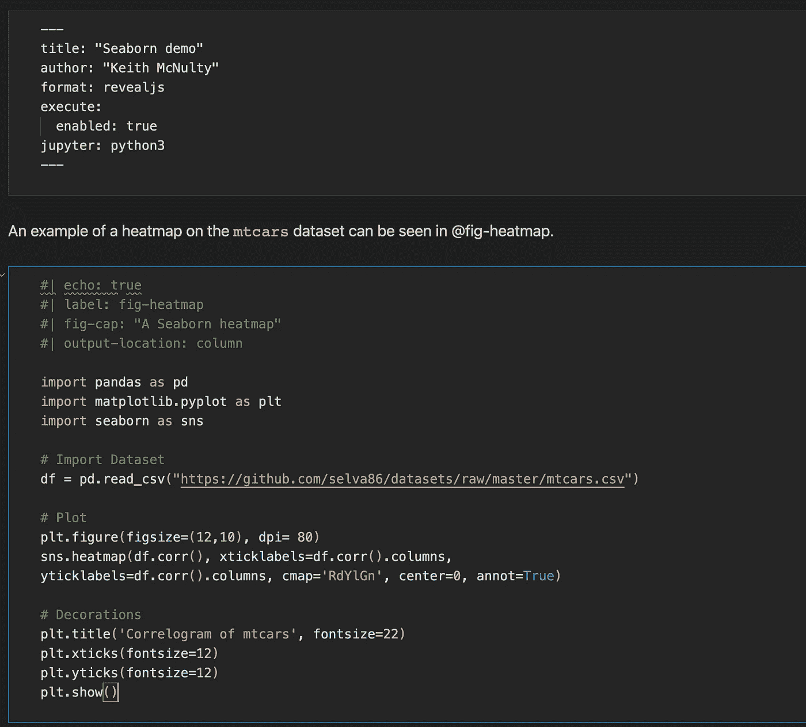
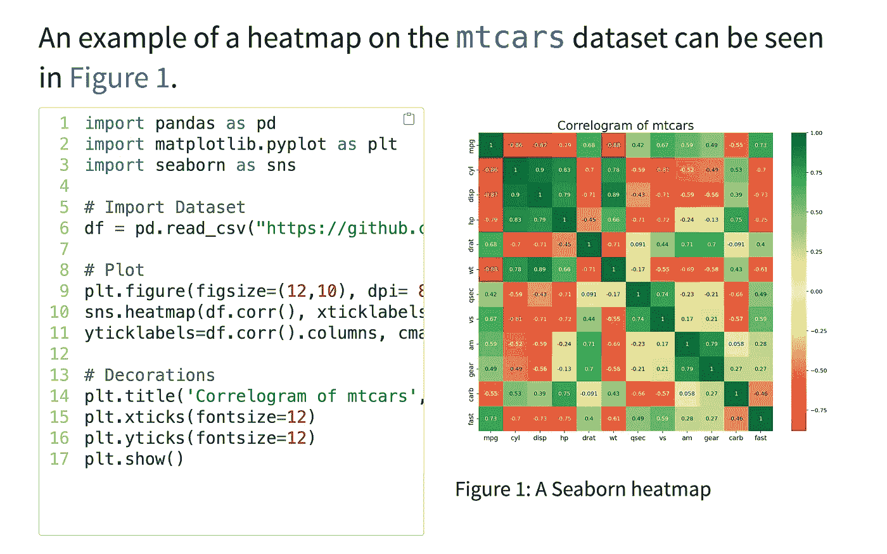

# quarto:Jupyter 笔记本渲染的游戏改变者

> 原文：<https://towardsdatascience.com/quarto-a-game-changer-for-rendering-jupyter-notebooks-826c885a531f>

## 借助 Quarto，您的 Jupyter 笔记本现在可以轻松发布为各种专业格式

由[卢卡斯·布拉塞克](https://unsplash.com/@goumbik?utm_source=unsplash&utm_medium=referral&utm_content=creditCopyText)在 [Unsplash](https://unsplash.com/s/photos/data-documents?utm_source=unsplash&utm_medium=referral&utm_content=creditCopyText) 拍摄的照片

作为一个同时使用 R 和 Python 工作的人，我一直希望有一个更好的解决方案将我的 Jupyter 笔记本变成专业外观的文档。R 生态系统在 R Markdown 中有这样一个选项已经有一段时间了，我非常喜欢使用它，事实上我已经在 R 环境中编写了我的 Python 代码，这样我就可以利用 R Markdown 所提供的优势。

我一直对 Jupyter 笔记本的外观和缺乏将它变成更“完美”和更具视觉吸引力的东西的选项有疑问。当然，交互式编程是有帮助的，但是当涉及到为观众发布你的作品时，外观和感觉从来没有切过芥末。

随着 [Quarto](https://quarto.org) 的发布，这一切都改变了。Quarto 是 R Markdown 的一个发展，现在可以在 Jupyter 笔记本上使用。渲染过程是相同的，除了不再使用`knitr`来生成 markdown，Quarto 现在可以使用`knitr`和`jupyter`。

随着一些非常聪明的功能的引入，您现在可以像往常一样编写 Jupyter 笔记本，但添加特定的指令将允许它们以多种格式呈现(如 pdf、html、docx、revealjs、Powerpoint、Wikis、网站、书籍)。特殊注释允许您对文档中的代码执行和放置进行大量的控制，还可以对代码输出的格式和放置进行更多的控制。

此外，您可以在不从根本上改变现有编码工作流程的情况下完成所有这些工作，因为所有 Quarto 参数都可以以一种在您的正常 Jupyter lab 会话中被忽略的方式输入。

在这篇文章中，我将带你通过几个基本的例子，如何把你的 Jupyter 笔记本和渲染成各种格式。我将举例说明一些特性，但是为了使阅读简短，我将只涉及一些简单的特性，并且将在以后的文章中返回来举例说明其他特性。

## 为 Quarto 设置现有笔记本——一个简单的例子

首先你需要在你的系统上安装 Quarto 命令行界面——见[这里](https://quarto.org/docs/get-started/)。如果您在 VSCode 中工作，已经有一个可以安装的 Quarto 附加组件。我相信我们很快也会看到皮查姆的作品。

现在让我们在适当的 Python 环境中获取一个现有的`ipynb`文件——我们称之为`my_notebook.ipynb`。这里有一个简单的例子，我生成了一个很好的相关图。

我们的 Jupyter 笔记本起点

现在我们准备把它渲染成一个四开文档。我们需要的第一件事是一个 YAML 标头，它提供了所需输出类型的信息。**重要的是**，这个 YAML 标题必须作为顶部的*原始块*输入笔记本。不要把它作为代码输入，否则编译器不会理解它，并且会影响 Jupyter 会话的运行。作为原始输入，它在你的交互式编程中被安全地忽略，但是当它被 Quarto 渲染时就有意义了。

添加原始 YAML 页眉

现在你已经创建了你的第一个基本的四开文档——就这么简单！让我们来看看我们放在 YAML 报头中的一些基本参数:

*   `title`是你的文档标题
*   `format`指示输出的格式和任何特定于该格式的进一步参数。在这种情况下，我已经指定我想要一个 HTML 输出，其中的代码是折叠的，这样我只有在单击适当的部分时才能看到代码(当您的读者是技术人员和非技术人员时，这是一个很好的特性)
*   `execute`给出了你希望代码何时在文档中执行的规范。设置`enable: true`意味着每次渲染时都会执行代码。否则，将保存代码输出，并且不会在后续渲染中重新执行该代码。如果您的代码计算量很大或者运行时间很长，这将非常有用。
*   `jupyter`指示使用什么来运行代码。在这种情况下，它显然是 Python 3，但也可能有其他引擎，如配置正确的 Julia。

现在您需要做的就是在终端中键入`quarto render my_notebook.ipynb`，您将获得这个简单的 HTML 输出，其中包含折叠的代码(您只需单击代码部分将其展开并查看代码)。

带有代码折叠的基本 HTML 输出

## 可用的四开格式

这是一个非常简单的例子，我们马上会看到一个更有趣的例子，但是 Quarto 有很多格式。只要在 YAML 文件头中用`pdf`替换`html`就会生成一个整洁的 PDF 输出，在 MS Word 中用`docx`替换就会生成。也有许多幻灯片演示输出，网站和各种其他。完整列表可在[这里](https://quarto.org/docs/output-formats/all-formats.html)获得。下面是一个 PDF 格式的渲染示例，带有摘要和作者(输出被分解到另一个页面上)。

带有作者和摘要的 PDF 输出

## 使用代码块参数控制输出

Quarto 最令人印象深刻的特性之一是能够使用特殊的注释语法来控制代码和输出的显示。除了在 YAML 头中定义全局输出选项之外，您还可以在每个代码块中放置 YAML 参数，以给出关于如何处理该代码块的特定指令。这些特殊的注释参数将在您的 Jupyter 实验会话中被忽略，因为它们以 hash 开头，但它们在 Quarto 中有特定的含义。

在这个例子中，我将以`revealjs`格式呈现我的文档，这是一个简洁的幻灯片演示。在主幻灯片上，我希望代码和输出以列的形式并排显示。我也想给我的剧情一个参考。为此，我使用特殊的注释向代码块添加了各种参数，然后在我的文本中引用了`fig-cap`。

带有块参数和引用的 revealjs 表示

请注意，在`revealjs`中，默认情况下不回显代码，因此，如果特定代码块需要回显，则需要显式的`echo: true`参数。其呈现的输出如下:

幻灯片上基于列的输出

代码框有一些简洁有用的特性，比如滚动和复制图标。

在这篇文章中，我仅仅触及了如何使用 Quarto 的皮毛。有大量的格式和参数可以让您更好地控制数据科学文档的外观。我将在不久的将来发布一些后续文章来说明一些更高级的特性。