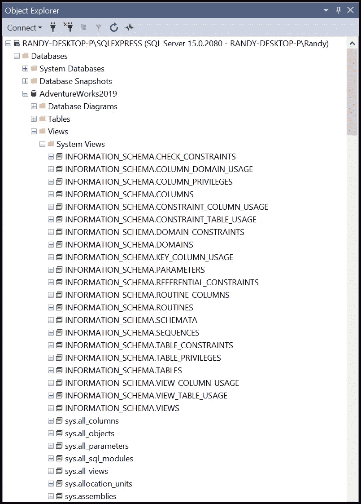
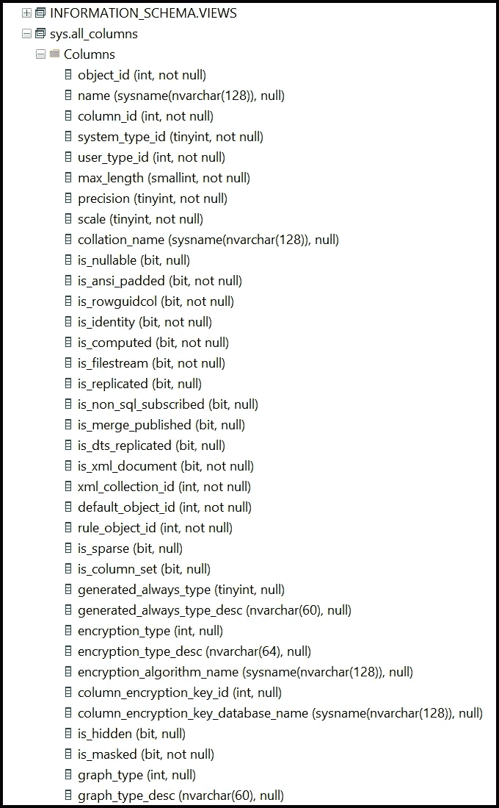
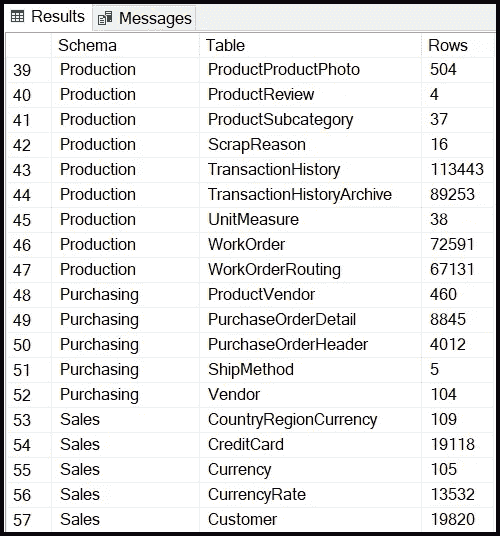
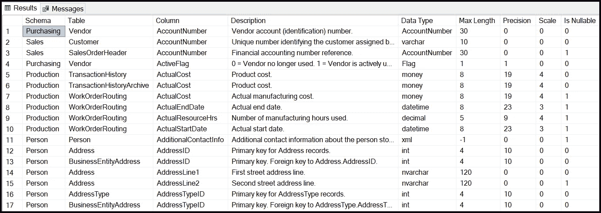
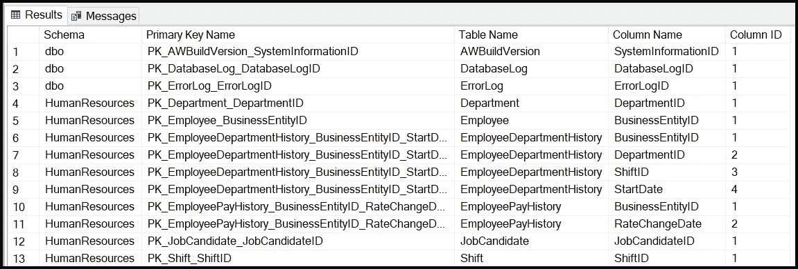
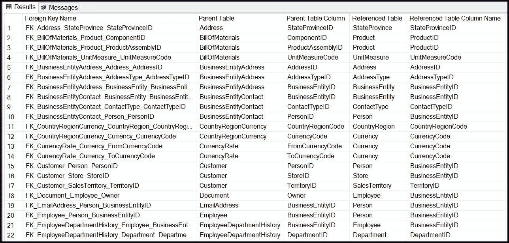

# 查询 SQL Server 系统表以对数据库进行反向工程

> 原文：<https://towardsdatascience.com/query-sql-server-system-tables-to-reverse-engineer-databases-fe26f98457d6>

## 数据工程、SQL 和 SQL Server

## 每个 Microsoft SQL Server 数据库中的系统表都包含有助于理解数据库的元数据

凯文·Ku 从[派克斯](https://www.pexels.com/photo/data-codes-through-eyeglasses-577585/?utm_content=attributionCopyText&utm_medium=referral&utm_source=pexels)拍摄的照片

在长期的信息技术职业生涯中，我担任过软件开发人员、数据库管理员和数据分析师等角色，需要对几个 SQL Server 数据库进行反向工程。通常，这是因为软件供应商不会为他们的应用程序数据库提供专有文档。作为一名数据分析师或工程师，在某些情况下，我需要编写 SQL 查询来为数据分析解决方案获取数据。但是当数据库文档丢失时，我求助于系统表和视图来理解数据库的结构及其包含的数据。

作为数据工程师、数据分析师或数据科学家，您知道对任何数据分析项目所用数据的良好理解是项目成功的关键。但是文档有时是不可用的。如果是这样，并且您的数据源是 SQL Server 数据库，那么应用本文中描述的查询和技术可以帮助您理解数据库的表、列、主键和外键关系，为您提供一个良好的开端。

# 本文的先决条件

要从本文中获得最大收益，您需要以下内容:

*   Windows 机器
*   Microsoft SQL Server 或 SQL Server Express 的任何最新版本
*   Microsoft SQL Server Management Studio(SSMS)
*   对用 SQL 编写 SELECT 语句的基本理解

如果您没有 SQL Server 或 SSMS，下一节将提供这些工具的基本安装说明。

# 什么是系统表？

每个 Microsoft SQL Server 最终用户数据库都包含几十个系统表，这些表由数据库的元数据(关于数据的数据)组成。例如，它存储有关数据库中定义的所有表、列、键、视图、存储过程和视图的数据。虽然您可以在[SQL Server Management Studio](https://docs.microsoft.com/en-us/sql/ssms/download-sql-server-management-studio-ssms?view=sql-server-ver15)(SSMS)中查看其中的一些内容，但是您可以编写 Transact-SQL 来查询从系统表中检索元数据的视图。

以下是存储在系统表中的几种元数据类型:

*   桌子
*   列
*   主键
*   指数
*   表关系(外键)
*   视图
*   存储过程

有关系统表和视图的详细信息，请参见微软的[系统表页面](https://docs.microsoft.com/en-us/sql/relational-databases/system-tables/system-tables-transact-sql?view=sql-server-ver15)。此外，您可以滚动浏览可用的系统视图，如下面 AdventureWorks2019 数据库的 SSMS 屏幕截图所示。

访问系统表的系统视图可以在 SSMS 中浏览。Randy Runtsch 在 SSMS 拍摄的快照。

要了解系统视图的结构，在 SSMS 中，单击其名称左侧的“+”号。然后，点击“+”号进入“栏目”为每一列显示名称、数据类型以及是否允许空值。下面的示例显示了“all_columns”视图中的列。

all_columns 视图中的列。Randy Runtsch 截图。

# 查询系统表以了解最终用户表和列

逆向工程是关于学习事物是如何构造或工作的，不管文档是否可用。虽然每个 SQL Server 数据库都包含许多系统视图，但本教程将向您展示如何使用其中的几个视图来了解数据库中的最终用户表和列。我曾使用类似这里所示的查询对包含数百或数千行的数据库进行逆向工程。虽然这项工作需要几天或几周的时间，但这项技术使我能够使用数据库的数据来创建满足客户需求的数据分析解决方案。

对于本教程，我使用了 SQL Server Express、SSSMS 和 AdventureWorks2019 示例数据库。下面显示的查询将适用于任何最新版本的 SQL Server 和任何 SQL Server 数据库。但是，如果您需要安装 SQL Server 和示例数据库，请查看以下链接:

*   [在 Windows 上安装 SQL Server Express 2019](https://www.microsoft.com/en-us/Download/details.aspx?id=101064)
*   [安装 SQL Server Management Studio](https://docs.microsoft.com/en-us/sql/ssms/download-sql-server-management-studio-ssms?view=sql-server-ver15)(SSMS)
*   安装 SQL Server 或 SQL Server Express 和 SSMS 后，将 [AdventureWorks2019.bak 文件](https://docs.microsoft.com/en-us/sql/samples/adventureworks-install-configure?view=sql-server-ver15&tabs=ssms)恢复到 SQL Server(此链接中提供了数据库恢复说明)

## 查询最终用户表

下面的查询检索 SQL Server 数据库中定义的每个最终用户表的架构名、表名和行数。因为表是任何关系数据库的基本构建块，所以该查询返回的结果应该提供对数据库存储的数据类型的大致理解。

查询以获取 SQL Server 数据库中所有用户定义的表。兰迪·朗奇的代码。

get_table.sql 查询的示例结果。Randy Runtsch 截图。

## 查询最终用户列

下面的查询检索 SQL Server 数据库的最终用户表中所有列的元数据。它比上面的表查询更复杂，因为它将 sys.columns 视图与其他四个视图连接起来以获得所需的列。

检索 SQL Server 数据库中所有最终用户列的查询。Randy Runtsch 的 SQL 代码。

虽然上面的查询按模式、表和列对结果进行了排序，但有时先按列对数据进行排序是有用的，如下面的屏幕截图所示。这允许您查看列在整个数据库中的使用位置。

列名按列排序 Randy Runtsch 截图。

## 查询主键

另一种有助于理解关系数据库的元数据是每个表的主键。主键定义唯一标识表中某一行的列值或列值组合。下面的查询返回每个主键的名称，以及它所应用的表和列。列 ID 值指示列在多部分键的键中的顺序。

检索所有 SQL Server 最终用户表的主键的查询。兰迪·朗奇的代码。

get_pk.sql 查询的示例结果。Randy Runtsch 截图。

## 查询外键关系

从系统视图中查询表和列元数据可以很好地理解数据库中存储的数据和数据元素的类型。但是要获得关系数据库的知识，理解表之间的外键关系是必不可少的。以下查询返回定义父表和被引用表之间外键关系的列。

查询来检索所有外键关系。兰迪·朗奇的代码。

get_fk_relationships.sql 查询的示例结果。Randy Runtsch 截图。

# 后续步骤

虽然对 SQL Server 数据库进行反向工程是一项耗时的艰苦工作，但有时这是很好地了解数据库的唯一方法。运行上面的查询应该可以提供对数据库的基本理解，除非其创建者对表和列进行了隐晦的命名或者省略了列定义。

一旦您很好地理解了数据库，您就可以通过对最终用户表运行 SELECT 查询来查看和理解它们存储的数据，从而获得更多的知识。然后，您可以使用您的新知识来很好地记录数据库，以支持您或其他数据分析师执行的数据分析项目。