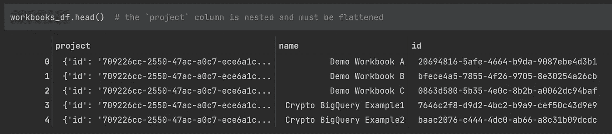
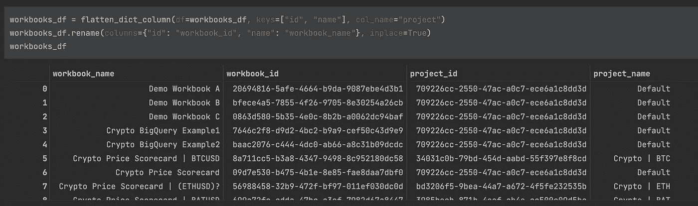
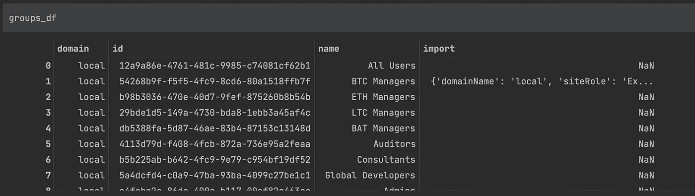
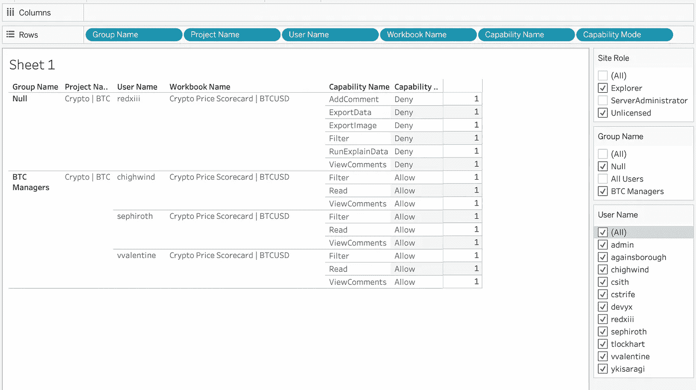

# 查询所有组和用户的 Tableau 工作簿权限

> 原文：<https://towardsdatascience.com/query-tableau-workbook-permissions-for-all-groups-and-users-4ae4e4cc404>

## TABLEAU REST API: TABLEAU-API-LIB 教程

## 使用 Python 和 Tableau REST API 来跟踪谁可以做什么


纳蕾塔·马丁在 [Unsplash](https://unsplash.com?utm_source=medium&utm_medium=referral) 上的照片

在您的 Tableau 环境中，跟踪谁可以访问什么可能是一件困难的事情。数据治理总是伴随着挑战。一个好的经验法则是将内容组织到特定的项目中，为这些项目分配特定的组权限，并避免完全分配基于用户的权限。

即使您遵循了最佳实践，也有足够的理由维护一个更新的视图，以了解哪些组和用户对您环境中的任何给定内容拥有各种权限。手动编译这些信息很繁琐，而自动化可以消除很多麻烦。

让我们来看看实现自动化的一种方法。

本文中看到的所有代码在最后都以更方便的格式提供，并带有代码所在的 GitHub gist 的链接。

本教程介绍了如何使用 Python [tableau-api-lib](https://github.com/divinorum-webb/tableau-api-lib) 包，并且是如何像使用小桶一样使用 tableau 服务器的系列教程的一部分，让您能够控制 Tableau 服务器的 REST API。

这些教程假设您已经安装了 Python 3。如果你还没有 Python 3，这将帮助你入门:[安装 Python 的指南](https://wiki.python.org/moin/BeginnersGuide/Download)。

## 搭建舞台

有许多 Tableau REST API 端点，您可以在 [Tableau 的 REST API 参考](https://help.tableau.com/current/api/rest_api/en-us/REST/rest_api_ref.htm)中阅读所有相关内容。在本教程中，我们将放大查询[工作簿权限](https://help.tableau.com/current/api/rest_api/en-us/REST/rest_api_ref_permissions.htm#query_workbook_permissions)。

这里演示的概念旨在强调什么是可能的，并且可以扩展到其他权限模型，如视图和数据源。如何将这些例子应用到您自己的产品代码中是您自己的选择。

`tableau-api-lib`库中的所有功能都基于 Tableau REST API。如果你选择使用另一个库，比如 Tableau 的`tableau-server-client`(或者从头开始编写你自己的代码)，请注意本教程依赖于`tableau-api-lib`中的帮助函数，这些函数旨在为我们做很多繁重的工作。

在高层次上，我们的目标是获得一个 Pandas 数据框架，它描述了每个工作簿的组及其各自用户的所有权限。以下是相关的里程碑:

1.  创建一个占位符 Pandas DataFrame 来存储所有权限
2.  获取描述我们所有工作簿的熊猫数据框架
3.  获得一个描述我们环境中所有群体的熊猫数据框架
4.  遍历每个工作簿，获取每个组和该组中每个用户的权限，并将数据追加到我们的占位符数据框架中
5.  获得一个描述我们环境中所有用户的熊猫数据框架
6.  遍历每个工作簿，获取单个用户的权限(用户级，而不是组级),并将数据追加到我们的占位符数据框架中
7.  将结果数据帧输出到一个 CSV 文件，该数据帧描述了我们工作簿的所有组和用户权限
8.  使用 Tableau Desktop 连接到 CSV 文件并与结果进行交互

## 步骤 1:确保你已经安装了 tableau-api-lib

即使你是这些教程的专家，帮自己一个忙，下载最新版本的库。它定期更新。

`pip install --upgrade tableau-api-lib`

不熟悉 Python 这个东西？别担心，你会很快明白的。跟随[这个入门教程](https://medium.com/snake-charmer-python-and-analytics/tableau-server-on-tap-getting-started-89bc5f0095fa)。该教程将引导您使用 tableau-api-lib 连接到 Tableau 服务器。

# 步骤 2:进入 Tableau 服务器环境

使用下面的代码作为连接到您的服务器的模板。在接下来的步骤中，我们将使用一次性代码行来构建这个 boiler 板。在本文的最后，您会发现一个合并的代码块，为了方便起见，您可以复制/粘贴它。

```
import pandas as pdfrom tableau_api_lib import TableauServerConnection
from tableau_api_lib.utils import querying, flatten_dict_column, flatten_dict_list_columntableau_server_config = {
        'my_env': {
                'server': '[https://YourTableauServer.com'](https://tableaupoc.interworks.com%27/),
                'api_version': '<YOUR_API_VERSION>',
                'username': '<YOUR_USERNAME>',
                'password': '<YOUR_PASSWORD>',
                'site_name': '<YOUR_SITE_NAME>',
                'site_url': '<YOUR_SITE_CONTENT_URL>'
        }
}conn = TableauServerConnection(tableau_server_config, env='my_env')
conn.sign_in()
```

有趣的事实:你也可以使用个人访问令牌，假设你在 Tableau Server 2019.4 或更新版本上。如果你对访问令牌很感兴趣，可以看看我的文章，了解如何使用它们的细节。

## 步骤 3(可选):了解相关的 API 端点

本教程深入探讨了两个端点:

1.  【查询工作簿权限】的[端点](https://help.tableau.com/current/api/rest_api/en-us/REST/rest_api_ref_permissions.htm#query_workbook_permissions)
2.  【站点查询工作簿】[端点](https://help.tableau.com/current/api/rest_api/en-us/REST/rest_api_ref_workbooks_and_views.htm#query_workbooks_for_site)
3.  【查询组】的[端点](https://help.tableau.com/current/api/rest_api/en-us/REST/rest_api_ref_users_and_groups.htm#query_groups)
4.  [端点](https://help.tableau.com/current/api/rest_api/en-us/REST/rest_api_ref_users_and_groups.htm#get_users_in_group)中的“获取用户组”
5.  [端点](https://help.tableau.com/current/api/rest_api/en-us/REST/rest_api_ref_users_and_groups.htm#get_users_on_site)

上面的链接将带您进入 Tableau 的 REST API 文档，该文档提供了一些技术指导和对这些端点如何工作的解释。

对于这些端点中的每一个，tableau-api-lib 库都有一个以`snake_case`格式镜像名称的方法，这样“查询工作簿权限”就变成了“query_workbook_permissions()”。

## 步骤 4:创建一个占位符熊猫数据框架

这一步创建了一个空的数据帧，我们将向其追加数据:

```
workbook_permissions_df = pd.DataFrame()
```

## 步骤 5:获得一个描述所有工作簿的熊猫数据框架

当我们收到描述我们工作簿的数据时，一些关于相关项目的信息包含在名为`project`的嵌套列中。



“项目”列本身是一个字典，填充了键/值对。

我们使用`flatten_dict_column`函数来删除该列中的有用信息。

```
workbooks_df = querying.get_workbooks_dataframe(conn)[["project", "name", "id"]]
workbooks_df = flatten_dict_column(df=workbooks_df, keys=["id", "name"], col_name="project")
workbooks_df.rename(columns={"id": "workbook_id", "name": "workbook_name"}, inplace=True)
workbooks_df
```



“项目”栏已被展平，将“项目标识”和“项目名称”分开。

## 第六步:获得描述所有群体的熊猫数据框架

当我们查询工作簿的权限时，我们将收到与任何给定组相关的权限规则信息。这是由组的本地唯一标识符(LUID)唯一标识的，我们将需要关于每个组的一些附加信息。

```
groups_df = querying.get_groups_dataframe(conn)
```



现在，我们可以使用用户友好的组名了。

## 步骤 7:迭代我们的工作簿和查询权限

```
for _, workbook in workbooks_df.iterrows():
    print(f"fetching group permissions for workbook '{workbook.workbook_name}...'")
    response = conn.query_workbook_permissions(workbook_id=workbook.workbook_id)
    permissions_df = pd.DataFrame(response.json()["permissions"]["granteeCapabilities"])
    if "group" not in permissions_df.columns:
        continue
    permissions_df = permissions_df[permissions_df["group"].notnull()]
    permissions_df = flatten_dict_column(df=permissions_df, keys=["id"], col_name="group")
    permissions_df = flatten_dict_list_column(df=permissions_df, col_name="capabilities")
    permissions_df = flatten_dict_column(df=permissions_df, keys=["name", "mode"], col_name="capability")
    permissions_df["workbook_id"] = workbook.workbook_id
    permissions_df["workbook_name"] = workbook.workbook_name
    permissions_df["project_name"] = workbook.project_name
    permissions_df["project_id"] = workbook.project_id
    permissions_df["join_col"] = 1

    all_group_users_df = pd.DataFrame()
    group_ids = permissions_df.group_id.unique()
    for index, group_id in enumerate(group_ids):
        print(f"joining users from group '{group_id}'")
        group_users_df = querying.get_group_users_dataframe(conn=conn, group_id=group_id)
        group_users_df.rename(columns={"name": "user_name", "id": "user_id"}, inplace=True)
        group_users_df["join_col"] = index
        group_df = groups_df[groups_df["id"] == group_id].copy()[["id", "name"]]
        group_df = group_df.add_prefix("group_")
        group_df["join_col"] = index
        all_group_users_df = pd.concat([all_group_users_df, pd.merge(group_users_df, group_df, how="inner", on="join_col")])

    workbook_permissions_df = pd.concat(
        [workbook_permissions_df, permissions_df.merge(all_group_users_df, on=["group_id"])]
    )
```

上面的逻辑遍历每个工作簿。对于每个工作簿，获取并加入相关的组及其各自的用户。结果是，我们获得了一个数据框架，描述了为每个工作簿分配的所有组级权限。

这可能需要一些时间，取决于您的 Tableau 环境的大小。如果工作簿的数量非常大，您可能需要考虑将此逻辑隔离到工作簿的一个子集(按项目过滤等)。

## 步骤 8(可选):获得一个描述所有用户的熊猫数据帧

如果您定义了任何特定于用户的权限，那么您还会希望获取每个工作簿的权限，其中权限是特定于用户而不是组的。提醒一下，这通常是一种不好的做法。最好将用户分配到组中，然后将权限分配给这些组。

```
users_df = querying.get_users_dataframe(conn)
users_df.rename(columns={"id": "user_id", "name": "user_name"}, inplace=True)
```

## 步骤 9(可选):遍历我们的工作簿和查询权限

与查询组级权限非常相似，我们将遍历工作簿并查询用户级权限。

```
for _, workbook in workbooks_df.iterrows():
    print(f"fetching user permissions for workbook '{workbook.workbook_name}...'")
    response = conn.query_workbook_permissions(workbook_id=workbook.workbook_id)
    permissions_df = pd.DataFrame(response.json()["permissions"]["granteeCapabilities"])
    if "user" not in permissions_df.columns:
        continue
    permissions_df = permissions_df[permissions_df["user"].notnull()]
    permissions_df = flatten_dict_column(df=permissions_df, keys=["id"], col_name="user")
    permissions_df = flatten_dict_list_column(df=permissions_df, col_name="capabilities")
    permissions_df = flatten_dict_column(df=permissions_df, keys=["name", "mode"], col_name="capability")
    permissions_df["workbook_id"] = workbook.workbook_id
    permissions_df["workbook_name"] = workbook.workbook_name
    permissions_df["project_name"] = workbook.project_name
    permissions_df["project_id"] = workbook.project_id
    permissions_df["join_col"] = 1

    workbook_permissions_df = pd.concat(
        [workbook_permissions_df, permissions_df.merge(users_df, on=["user_id"])]
    )
```

当我们查询组级别的权限时，我们最终得到了用户级别的数据，但是请注意不同之处:这些是属于特定组的用户。上面的查询是查询不与任何给定组相关联的用户权限(同样，用户级权限规则通常是一种不好的做法)。

## 步骤 10:将最终权限数据输出到 CSV

现在我们有了一个描述所有权限的 Pandas 数据框架，我们可以使用它了。对于本教程，我们希望将数据输出到一个文件，然后使用 Tableau 连接到它。在您自己的使用中，考虑将数据写入数据库或以其他方式存储它，但这对于您的工作流是有意义的。

```
workbook_permissions_df.to_csv("workbook_permissions.csv", sep=",", header=True, index=False)
```

## 步骤 11:连接 Tableau 桌面中的数据并进行交互

本教程假设熟悉 Tableau 桌面。如果您不知道如何在 Tableau 中连接到 CSV 文件，有许多免费文章、YouTube 视频和 Tableau 论坛可以提供帮助。

下面是一个与最终数据交互的例子。这是一个非常基本的 Tableau 工作表，但是请注意，我可以很容易地过滤到特定的用户、组、站点角色等。



我们现在可以利用权限数据了。

在上面的屏幕截图中，我们可以很容易地识别不同工作簿的组级和用户级权限。在这种情况下，`Null`组名表示权限不与任何组相关联，这意味着它们是用户级权限。

## 包装它

希望本教程有助于展示一种可行的方法，提取您需要了解的关于 Tableau 环境中内容权限的信息。

最后一点:我强烈建议您组织您的权限模型，始终在项目级别锁定权限，并且只在组级别而不是用户级别分配权限。

## 合并代码

使用 GitHub gist 作为模板，将本教程的内容集成到您自己的工作流程中。