# 使用 query()方法查询熊猫数据帧

> 原文：<https://towardsdatascience.com/querying-pandas-dataframes-using-the-query-method-c1b887b5c461>

## 了解如何使用类似 SQL 的语法查询您的熊猫数据帧


约翰·施诺布里奇在 [Unsplash](https://unsplash.com?utm_source=medium&utm_medium=referral) 上拍摄的照片

大多数 Pandas 用户都熟悉从 Pandas 数据帧中检索行和列的`iloc[]`和`loc[]`索引器方法。然而，随着检索数据的规则变得越来越复杂，这些方法变得非常笨拙。既然大多数开发人员都熟悉 SQL，为什么不使用类似于 SQL 的东西来查询您的数据框架呢？

事实证明，你可以用`query()`方法做到这一点。因此，在本文中，我将展示一些例子，说明如何使用`query()`方法在数据帧上执行查询。

# 获取数据

在这篇文章中，我将使用泰坦尼克号数据集。

> **数据来源**:本文数据来源于[*https://www.kaggle.com/datasets/tedllh/titanic-train*](https://www.kaggle.com/datasets/tedllh/titanic-train)*。*
> 
> ***许可—*** *数据库内容许可(DbCL)v 1.0*[*https://opendatacommons.org/licenses/dbcl/1-0/*](https://opendatacommons.org/licenses/dbcl/1-0/)

让我们将 CSV 文件加载到熊猫数据帧中:

```
import pandas as pddf = pd.read_csv('titanic_train.csv')
df
```

数据帧有 891 行和 12 列:

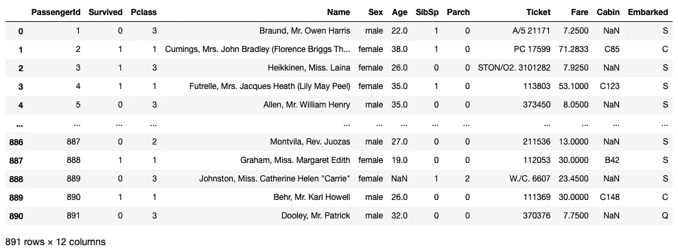

作者图片

# 使用 query()方法

让我们找到所有从南安普顿登船的乘客。使用*方括号索引*，代码如下所示:

```
df[df['Embarked'] == 'S']
```

然而，如果你使用`query()`方法，它看起来更整洁:

```
df.**query**(**'Embarked == "S"'**)
```

> 如果您想与 SQL 进行比较，`query()`方法中的表达式就像 SQL 中的 WHERE 语句。

结果是所有乘客从*南安普敦*出发的数据帧:

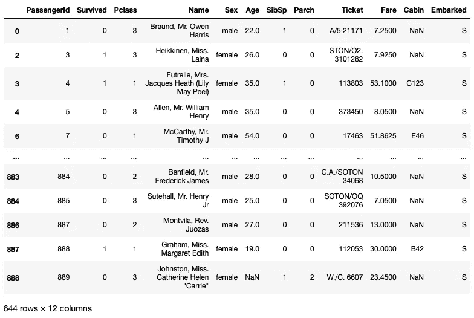

作者图片

`query()`方法接受字符串形式的查询。因此，如果您正在查询一个字符串列，您需要确保您的字符串被正确地括起来。下图说明了这一点:

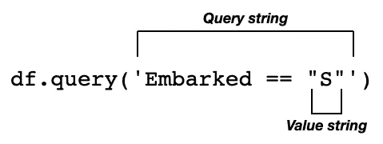

作者图片

通常，您可能希望将变量值传递到查询字符串中。您可以使用`@`字符来完成:

```
embarked = 'S'
df.query('Embarked == @embarked')
```

或者，您也可以使用 f 弦，如下所示:

```
df.query(f'Embarked == "{embarked}"')
```

> 就个人而言，我认为使用`@`字符比 f 弦方式更简单、更优雅。

如果列名中包含空格，您可以使用反斜杠(````)将列名换行:

```
df.query('**`Embarked On`** == @embarked')
```

# 就地执行查询

当您使用`query()`方法执行查询时，该方法将结果作为数据帧返回，而原始数据帧保持不变。如果您想更新数据帧，使用`inplace`参数，如下所示:

```
df.query('Embarked == "S"'**,** **inplace=True**)
```

当`inplace`设置为`True`时，`query()`方法将不返回值。相反，原始数据帧被修改。

# 指定多个条件

您可以在查询中指定多个条件。例如，说我想得到从*南安普敦* ('S ')或*瑟堡* ('C ')登船的所有乘客。使用方括号索引，这种语法很快变得非常笨拙:

```
df[(df['Embarked'] == 'S') | (df['Embarked'] == 'C')]
```

注意，在您的条件中，您需要引用您的 dataframe ( `df`)两次。使用`query()`方法，这是在公园散步:

```
df.query(**'Embarked in ("S","C")'**)
```

上述语句产生以下输出:

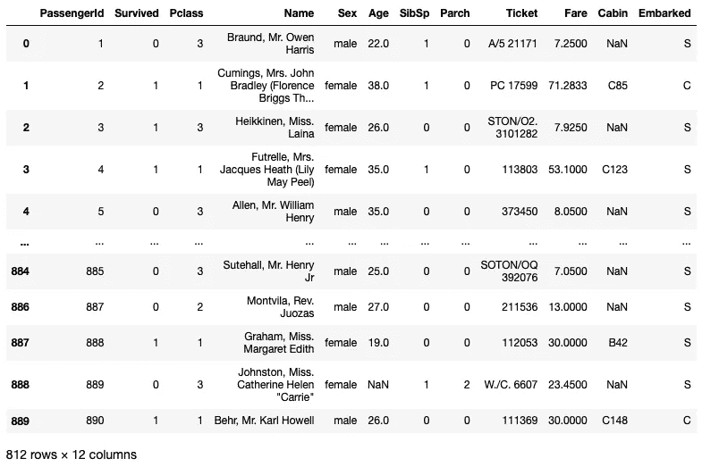

作者图片

如果您想查找所有从*南安普敦* ('S ')或*瑟堡* ('C ')出发的**而非**的乘客，您可以在 Pandas 中使用否定运算符(~):

```
df[**~(**(df['Embarked'] == 'S') | (df['Embarked'] == 'C')**)**]
```

使用`query()`方法，您只需要使用`not`操作符:

```
df.query('Embarked **not** in ("S","C")')
```

以下输出显示了从 Queenstown ('Q ')出发的乘客以及缺少值的乘客:

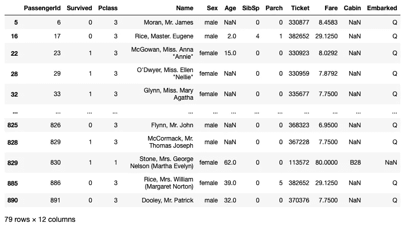

作者图片

谈到缺失值，如何查询缺失值？当应用于列名时，您可以使用`isnull()`方法查找缺失值:

```
df.query('**Embarked.isnull()**')
```

现在将显示在**开始的**列中缺少值的行:

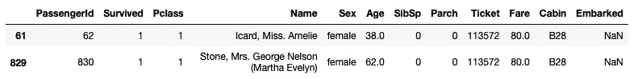

作者图片

实际上，可以直接在列名上调用各种 Series 方法。以下是一些例子:

```
**df.query('Name.str.len() < 20')**  # find passengers whose name is 
                                 # less than 20 characters**df.query(f'Ticket.str.startswith("A")')** # find all passengers whose 
                                        # ticket starts with A
```

# 比较数字列

您还可以轻松地比较数字列:

```
df.query('Fare > 50')
```

以下输出显示了票价大于 50 的所有行:

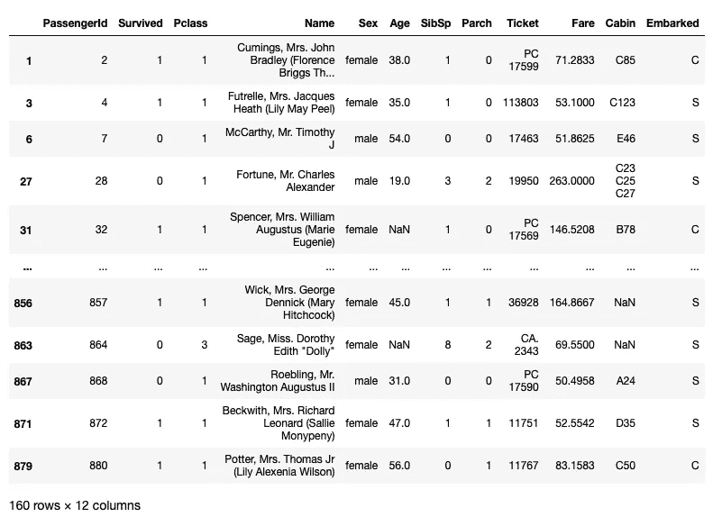

作者图片

# 比较多列

您还可以使用`and`、`or`和`not`操作符来比较多个列。以下语句检索所有费用大于 50 且年龄大于 30 的行:

```
df.query('Fare > 50 and Age > 30')
```

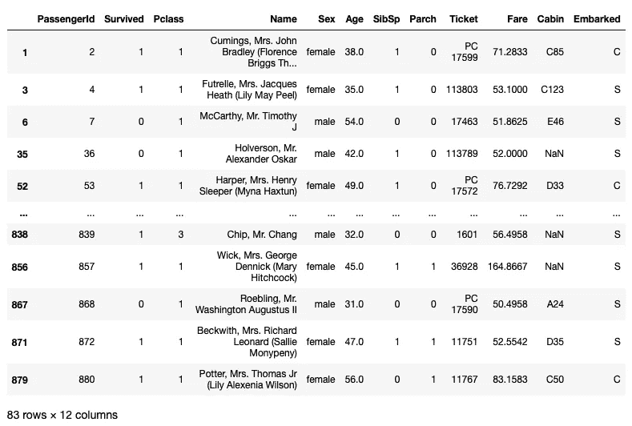

作者图片

# 查询索引

通常，当您想要基于索引值检索行时，您可以使用`loc[]`索引器，如下所示:

```
df.loc[[1],:]  # get the row whose index is 1; return as a dataframe
```

使用`query()`方法，事情更加直观:

```
df.query('index==1')
```

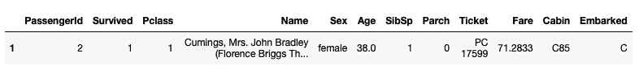

作者图片

如果希望检索索引值小于 5 的所有行:

```
df.query('index<5')
```

上面的语句显示了结果:

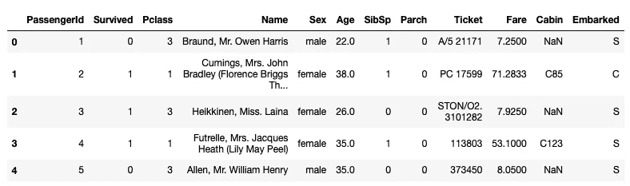

作者图片

您也可以指定索引值的范围:

```
df.query('6 <= index < 20')
```

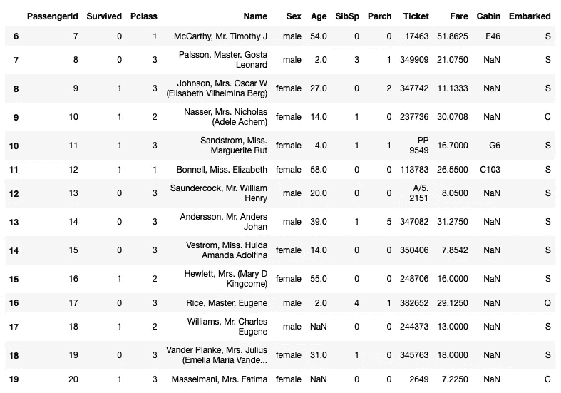

作者图片

# 比较多列

您还可以比较列之间的值。例如，以下语句检索其 **Parch** 值大于 **SibSp** 值的所有行:

```
df.query('Parch > SibSp')
```

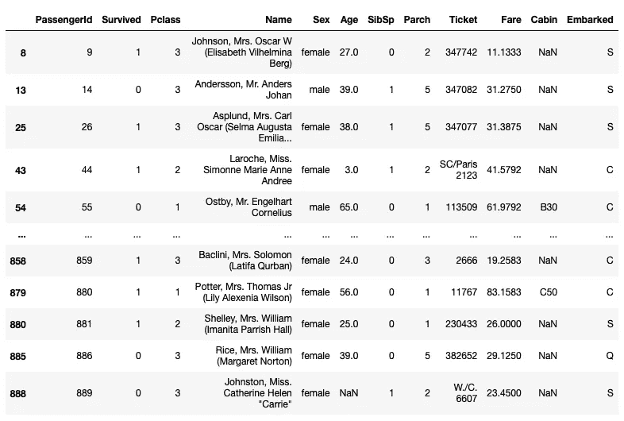

作者图片

[](https://weimenglee.medium.com/membership)  

# 相关文章

[](https://weimenglee.medium.com/performing-exploratory-data-analysis-eda-using-pivot-tables-in-pandas-3f402f95681b)  [](/working-with-multi-index-pandas-dataframes-f64d2e2c3e02)  [](/working-with-multi-index-pandas-dataframes-f64d2e2c3e02)  

# 摘要

从上面的例子可以看出，`query()`方法使得搜索行的语法更加自然，更像英语。为了确保您真正理解 query 的工作原理，这里有一些挑战(在尝试这些问题之前不要看下面的答案):

*   显示票价高于平均票价的所有行
*   查找姓名中包含称呼博士的所有乘客
*   找出所有付了最高票价的乘客
*   找到所有有机舱号的乘客
*   找到所有机票号码以 STON 开头的乘客

## 答案

```
df.query(f'Fare < {df["Fare"].mean()}')
df.query('Name.str.contains(" Dr. ")')
df.query(f'Fare == {df["Fare"].max()}')
df.query('~Cabin.isnull()')
df.query('Ticket.str.contains("^STON")')
```