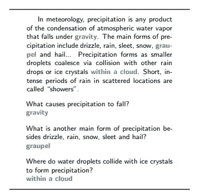
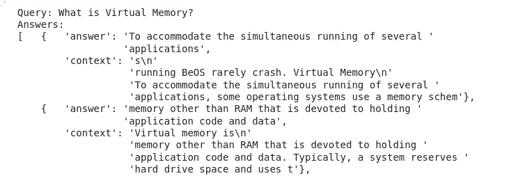

# 基于搜索和排序的教科书问答

> 原文：<https://towardsdatascience.com/question-answering-on-textbooks-by-searching-and-ranking-609f8b007aa6>

## 用数据做很酷的事情


照片由 nadi borodina 在 Unsplash 上拍摄

# 介绍

问答是自然语言处理的一个流行应用。在大数据集上训练的 Transformer 模型极大地改善了问答的最新结果。

问题回答任务可以用许多方式来表述。最常见的应用是在小范围内回答提取的问题。班数据集是一个流行的数据集，其中给定一段话和一个问题，模型选择代表答案的单词。这在下面的图 1 中示出。

然而，大多数问题回答的实际应用涉及非常长的文本，如完整的网站或数据库中的许多文档。使用 Google Home/Alexa 之类的语音助手回答问题需要在网络上搜索大量文档以获得正确答案。



小队数据集。图片来自[小队论文](https://arxiv.org/pdf/1606.05250.pdf)。

在这篇博客中，我们使用 [Haystack](https://github.com/deepset-ai/haystack) 构建了一个搜索和问答应用程序。这个应用程序搜索了几本与编程相关的 O'Reilly 开源书籍。代码在 Github [这里](https://github.com/priya-dwivedi/Deep-Learning/blob/master/Question_Answering_on_TextBooks_using_Search/Question_Answering_TextBooks.ipynb)公开。你也可以在这里使用[的 Colab 笔记本](https://colab.research.google.com/drive/1lxBoth4JPvsZewr1zpqeOhW0W9Hxms8q#scrollTo=CRFyiVsNSZYS)来测试这个模型。

这里的完整帖子也可以在我们的网站[这里](https://deeplearninganalytics.org/question-answering-on-textbooks-by-searching-and-ranking/)找到。

# 搜索和排名

那么，我们如何从庞大的数据库中检索答案呢？

我们将回答问题的过程分为两步:

1.  搜索和排序:从我们的数据库中检索可能有答案的段落
2.  阅读理解:在检索到的文章中寻找答案

搜索和排名过程通常包括将数据编入数据库，如弹性搜索数据库或 T2 FAISS 数据库。这些数据库已经实现了在数百万条记录中进行快速搜索的算法。可以使用 TFIDF 或 BM25 使用查询中的单词来完成搜索，或者可以通过嵌入文本来考虑文本的语义来完成搜索，或者也可以使用这些的组合。在我们的代码中，我们使用了来自[干草堆](https://github.com/deepset-ai/haystack)的基于 TFIDF 的检索器。整个数据库被上传到 ElasticSearch 数据库，搜索是使用 TFIDF 检索器完成的，该检索器根据分数对结果进行排序。要了解不同类型的搜索，请查看 Haystack 的博客。

来自检索器的前 k 个段落然后被发送到问题回答模型以获得可能的答案。在这篇博客中，我们尝试了两种模式——1。在班数据集和 2 上训练的 BERT 模型。在班数据集上训练的罗伯塔模型。《干草堆中的读者》帮助加载这些模型，并通过对从搜索中检索到的段落运行这些模型来获得前 K 个答案。

# 构建我们的问答应用程序

用于开发该问答模型的训练数据集是编程开源 O ' Reilly book-[Be 操作系统编程](https://www.oreilly.com/openbook/beosprog/book/)。书中的个别章节以 pdf 文件的形式从 [O'Reilly 网站](https://www.oreilly.com/openbook/)下载。这本书是在知识共享许可下提供的。我们通过合并章节创建了一个合并的 PDF，这些章节可以在 google drive [这里](https://drive.google.com/drive/u/2/folders/1-IAona91wwNKA0_Wm0ux5yCtH15m8Yv2)找到。如果使用 Colab，将此 PDF 上传到您的环境中。

我们使用 HayStack PDF 转换器将 PDF 读入一个文本文件

```
converter = PDFToTextConverter(remove_numeric_tables=True, valid_languages=["en"])doc_pdf = converter.convert(file_path="/content/converter_merged.pdf", meta=None)[0]
```

然后，我们使用 Haystack 中的预处理器类将文档分割成许多更小的文档。

```
preprocessor = PreProcessor(clean_empty_lines=True,clean_whitespace=True,clean_header_footer=False,split_by="word",split_length=100,split_respect_sentence_boundary=True)dict1 = preprocessor.process([doc_pdf])
```

每份文件约 100 字。预处理程序创建 1200 个文档。

接下来，我们将这些文档索引到一个 ElasticSearch 数据库，并初始化一个 TFIDF 检索器。

```
retriever = TfidfRetriever(document_store=document_store)document_store.write_documents(dict1)
```

检索器将对 ElasticSearch 数据库中的文档进行搜索，并对结果进行排序。

接下来，我们初始化问答管道。我们可以使用 FARM 或 Transformer 阅读器在 HuggingFace hub 上加载任何问答模型。

```
reader = TransformersReader(model_name_or_path="deepset/bert-large-uncased-whole-word-masking-squad2", tokenizer="bert-base-uncased", use_gpu=-1)
```

最后，我们将检索器和排序器合并到一个管道中，一起运行它们。

```
from haystack.pipelines import ExtractiveQAPipelinepipe = ExtractiveQAPipeline(reader, retriever)
```

仅此而已！我们现在准备测试我们的管道。

Giphy 免版税。链接:【https://giphy.com/gifs/cheer-cheering-11sBLVxNs7v6WA 

# 测试管道

为了测试管道，我们通过它运行我们的问题，为来自检索器和阅读器的 top_k 结果设置我们的首选项。

```
prediction = pipe.run(query="What is Virtual Memory?", params={"Retriever": {"top_k": 10}, "Reader": {"top_k": 3}}
```

当我们要求管道解释虚拟内存时，最重要的结果是非常相关的。



问题 1 管道测试

接下来，我们询问 OpenGL 工具包，得到的答案正确地解释了这个库允许程序员向模型添加 3D 功能。

```
prediction = pipe.run(query="What is OpenGL kit?", params={"Retriever": {"top_k": 10}, "Reader": {"top_k": 3}}
```


问题 2 管道测试

我们已经在许多问题上测试了管道，它表现得相当好。阅读源 pdf 中的新主题并提出相关问题很有趣。通常，我发现我阅读的段落在前 3 个结果中。

我的实验表明，伯特和罗伯塔的结果基本相似，罗伯塔略胜一筹。

请使用 [Colab](https://colab.research.google.com/drive/1lxBoth4JPvsZewr1zpqeOhW0W9Hxms8q?usp=sharing) 或 [Github](https://github.com/priya-dwivedi/Deep-Learning/blob/master/Question_Answering_on_TextBooks_using_Search/Question_Answering_TextBooks.ipynb) 上的代码通过模型运行您自己的科学问题。

# 结论

这个博客展示了问答如何应用于许多实际应用，包括长文本，如 pdf 格式的数据库，或者包含许多文章的网站。我们在这里使用 Haystack 构建一个相对简单的应用程序。Haystack 有许多杠杆可以调整和微调，以进一步提高性能。我希望你下载代码，运行你自己的实验。请在下面的评论中分享你的经历。

在[深度学习分析](https://deeplearninganalytics.org/)，我们非常热衷于使用机器学习来解决现实世界的问题。我们已经帮助许多企业部署了创新的基于人工智能的解决方案。如果您看到合作的机会，请通过我们的网站[这里](https://deeplearninganalytics.org/contact-us/)联系我们。

# 参考

*   [罗伯塔模型](https://ai.facebook.com/blog/roberta-an-optimized-method-for-pretraining-self-supervised-nlp-systems/)
*   [草堆文档](https://haystack.deepset.ai/overview/intro)