# 帮助您练习数据科学面试的问题

> 原文：<https://towardsdatascience.com/questions-to-help-you-practice-for-your-data-science-interview-c619ab6db70b>

## *概述数据科学面试中的问题类型，以及使用我们的平台进行实践*

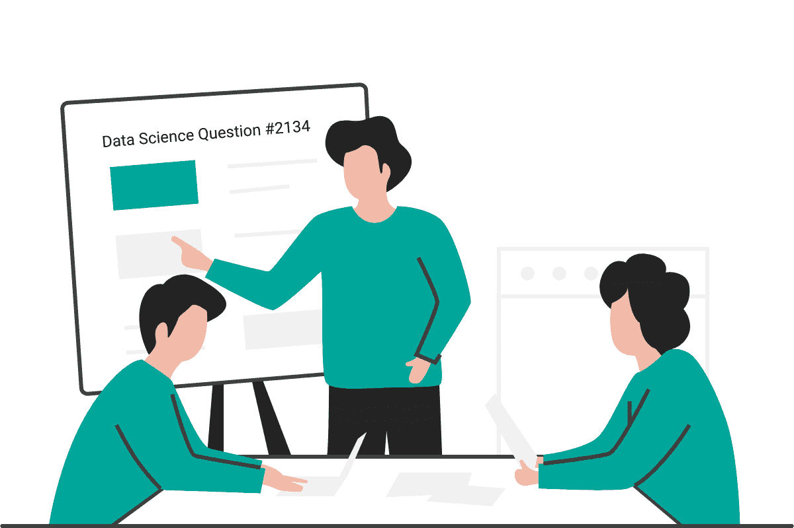

作者在 [Canva](https://canva.com/) 上创建的图片

2012 年，《哈佛商业评论》称数据科学家是 21 世纪最性感的工作，数据科学家职位空缺数量的增长趋势似乎证实了这一说法。随着数据的增长，当今大多数公司都在大量利用数据科学来做出明智的业务决策，并找出业务增长领域。数据科学家在其中发挥着关键作用。作为一名数据科学家，你需要具备很多技能；编码技能、统计分析、概率、解决问题、技术知识、商业敏锐度等。对于面试来说，可以从很多方面来评判候选人。

由于数据科学家角色的广泛性质，它对候选人来说变得相当压倒性。大多数候选人发现很难通过招聘程序。在本文中，我们将看到在数据科学面试中可以提出的问题类型。[数据科学面试问题](https://www.stratascratch.com/blog/40-data-science-interview-questions-from-top-companies/?utm_source=blog&utm_medium=click&utm_campaign=medium)可以分为两大类，也可以分为 8 个小类。

两个主要类别:

*   编码问题
*   非编码问题

非编码问题可以进一步分为不同的类别:

*   系统设计
*   可能性
*   统计数字
*   建模
*   技术的
*   产品

在继续提问之前，我们先来看看数据科学家在公司中的角色是什么:

# 数据科学家是做什么的？

数据科学家是组织中的分析专家，帮助企业做出明智的决策，并在公司中实现创新。数据科学家是公司中的关键人物，他们组织和分析大量结构化和非结构化数据，并从中获得见解。这些人是分析、机器学习、问题解决技能和解释洞察力以将其转化为可操作的商业决策的专家。他们设计数据建模流程，创建高级 ML 算法和预测模型，以提取业务所需的数据。

为了收集和分析数据，数据科学专业人员具有以下职责:

1.  从各种来源获取数据
2.  数据清理和处理
3.  根据业务需求组合相关的数据源
4.  存储数据
5.  探索性数据分析
6.  定义手头的问题并进行规划
7.  选择预测模型和算法
8.  测量和改进结果
9.  向利益相关者传达结果以采取行动
10.  重复该过程以解决另一个问题

下面是终极指南" [*数据科学家是做什么的？*](https://www.stratascratch.com/blog/what-does-a-data-scientist-do/?utm_source=blog&utm_medium=click&utm_campaign=medium) “这将引导你了解数据科学工作的各个方面。

# 编码

在分析了来自 80 家不同公司的数据科学面试问题后，编码问题似乎是最主要的问题。面试官会用这些问题来测试应聘者的编程能力。语言可以是任何东西；SQL、Python、R 或该特定工作所需的任何其他编程语言。编码是数据科学家最重要的[技能之一。](https://www.stratascratch.com/blog/what-skills-do-you-need-as-a-data-scientist/?utm_source=blog&utm_medium=click&utm_campaign=medium)

FAANG 公司非常关注编码问题。在 Glassdoor 的所有数据科学问题中，的确如此。，接近 50%的问题与编码相关。编码问题可以定义为需要编程语言或伪代码来解决特定问题的问题。编码题旨在了解考生解决问题的能力，了解其思维过程和对编程语言的熟悉程度，检查其创造力等。在[数据科学面试](https://www.stratascratch.com/blog/data-science-interview-guide-questions-from-80-different-companies/?utm_source=blog&utm_medium=click&utm_campaign=medium)中，编码问题的重要性怎么强调都不为过，因为绝大多数数据科学职位都定期涉及编码。

通常这些数据科学公司中的大多数会测试你两种主要的语言；Python 和 SQL。今天，我们将学习一些在面试中被问到的编码问题，并进行动手练习。

# 结构化查询语言


作者在 [Canva](https://canva.com/) 上创建的图像

## 数据科学面试问题#1:每月百分比差异

> 给定一个按日期排列的采购表，计算收入的逐月百分比变化。输出应该包括年月日(YYYY-MM)和百分比变化，四舍五入到小数点后第二位，从年初到年底排序。百分比变化列将从第二个月开始填充，并且可以计算为((本月收入-上月收入)/上月收入)*100。

在亚马逊的这个问题中，我们需要计算收入的月环比百分比变化。输出应包含 YYYY-MM 格式的数据，百分比变化应四舍五入到小数点后第二位，并从年初到年底排序。

提供了一个表: *sf_transactions*

**表:** sf_transactions

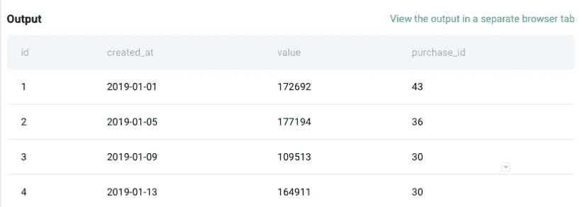

表格中有四个字段；ID、创建时间、价值和购买 ID。

**解决方法**

根据问题，第一步是计算月级别的收入，并将数据格式更改为 YYYY-MM。因此，我们将使用 DATE_FORMAT 函数来更改 created_at 字段的格式，然后使用 SUM()来计算总收入。

```
SELECT DATE_FORMAT(created_at,'%Y-%m') AS ym,
        SUM(value) AS revenue
FROM sf_transactions 
GROUP BY 1
ORDER BY 1
```

在代码的上面部分，我们对每个月的“值”求和，以计算该月的总收入，并按照问题中提到的那样更改数据格式。因为我们需要日期以升序排列，所以我们在最后使用 ORDER BY。

现在我们有了按升序排列的每个月的收入，让我们使用 LAG()函数来获得前一个月的收入，以便进行逐月计算。

```
SELECT DATE_FORMAT(created_at,'%Y-%m') AS ym,
            SUM(value) AS revenue,
            LAG(SUM(value)) OVER() AS prev_revenue
    FROM sf_transactions 
    GROUP BY 1
    ORDER BY 1
```

使用 lag 函数，您可以获得前一个月的收入。现在，要计算每月的百分比变化，我们可以使用公式:((当月收入-上月收入)/(上月收入))* 100，然后对结果使用 ROUND()函数，以获得最多 2 个小数点的百分比差异。

**最终查询**

```
SELECT DATE_FORMAT(created_at,'%Y-%m') AS ym,
       ROUND((SUM(value) - LAG(SUM(value)) OVER ())
             / LAG(SUM(value)) OVER ()
             * 100, 2) AS revenue_diff_pct
  FROM sf_transactions
 GROUP BY ym
 ORDER BY ym 
```

**输出**

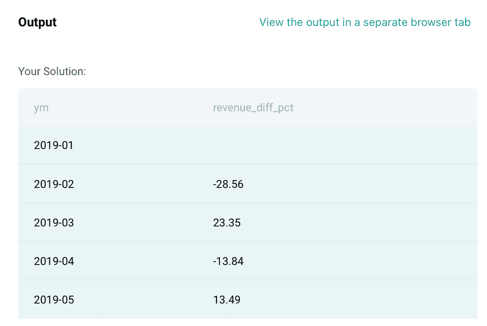

## 数据科学面试问题#2:高级与免费增值

> 按日期查找付费和非付费用户的下载总数。只包括非付费用户比付费用户下载更多的记录。输出应首先按最早日期排序，并包含 3 列日期，非付费下载，付费下载。

在这个问题中，有三个表，ms_user_dimension，ms_acc_dimension，ms_download_facts。

**表:** ms_user_dimension

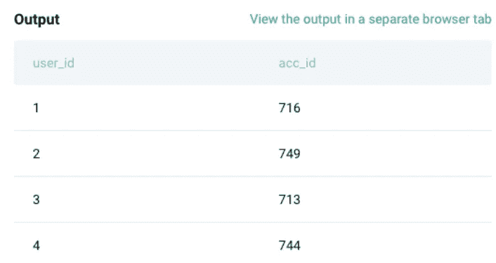

**表格:** ms_acc_dimension


**表格:**ms _ 下载 _ 事实

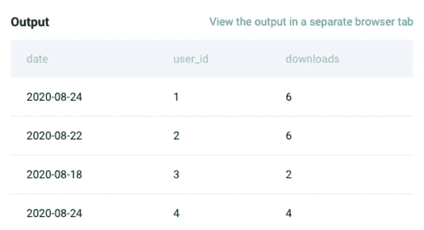

**解决方法**

我们有三张桌子。第一步是将用户维度表与帐户表连接起来，以确定哪些用户是付费客户，哪些用户是非付费客户。让我们用 CTEs 来解决这个问题。

```
WITH user_account_mapping as (SELECT u.user_id,
       u.acc_id,
       a.paying_customer
FROM ms_user_dimension u
JOIN ms_acc_dimension a
ON u.acc_id = a.acc_id)
```

在上面的步骤中，我们从用户维度中选择用户 ID 和帐户 ID，将该表与帐户 ID 上的帐户维度连接起来，并从帐户维度中提取付款客户列。该表的输出将给出映射到帐户 id 的用户 id，并带有付费/不付费标志，如下所示:

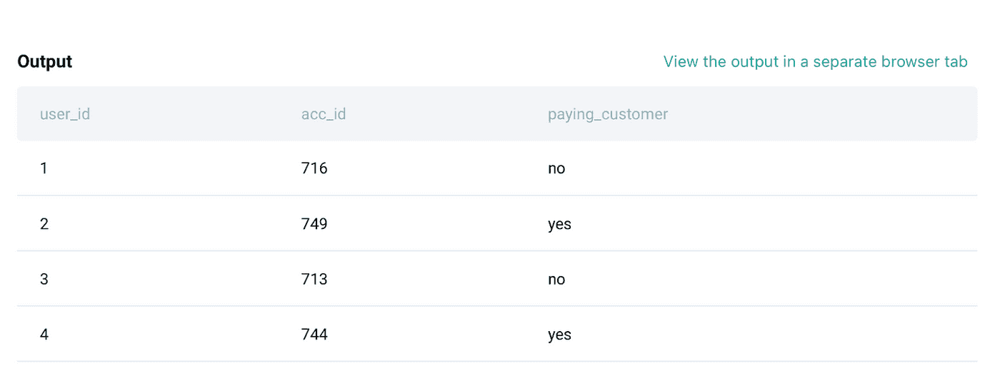

现在，下一步是将这个表与下载事实表连接起来，以获得每个用户的下载次数。让我们看看下面代码。

```
final_table as 
(
SELECT d.date,
       d.user_id,
       ua.paying_customer,
       SUM(d.downloads) AS downloads
FROM ms_download_facts d
JOIN user_account_mapping ua
ON d.user_id = ua.user_id
GROUP BY 1,2,3
)
```

现在，上表的输出将给出每个付费和非付费客户在所有日期的下载次数，如下所示。我们将上面的查询命名为 final_table，让我们用它来计算剩余部分。

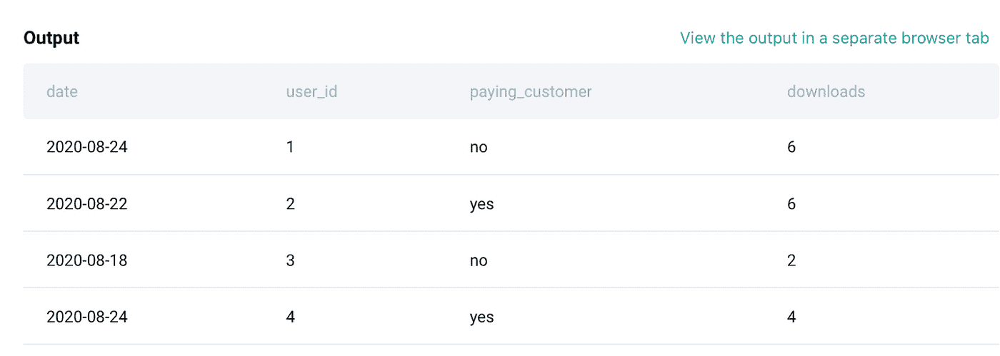

从预期的输出中，我们需要一些非付费下载和付费下载作为单独的列。因此，我们将在 SUM()中使用 CASE WHEN 来实现这一点。下面是它的代码。

```
SELECT  date,
        SUM(CASE WHEN paying_customer = 'no' THEN downloads END) non_paying,
        sum(CASE WHEN paying_customer = 'yes' THEN downloads END) paying
FROM final_table
GROUP BY 1
```

现在，上面的查询将给出日期、非付费用户的下载量和付费用户的下载量。对于预期的输出，我们需要按日期对数据进行排序，并只显示那些非付费下载量大于付费下载量的行。下面是它使用 WHERE 条件过滤数据的代码。

```
SELECT * 
FROM (
SELECT  date,
        SUM(CASE WHEN paying_customer = 'no' THEN downloads END) non_paying,
        SUM(CASE WHEN paying_customer = 'yes' THEN downloads END) paying
FROM final_table
GROUP BY 1
)b
WHERE non_paying > paying
ORDER BY date
```

**最终查询:**

```
WITH user_account_mapping as (SELECT u.user_id,
       u.acc_id,
       a.paying_customer
FROM ms_user_dimension u
JOIN ms_acc_dimension a
ON u.acc_id = a.acc_id),final_table AS (
SELECT d.date,
       d.user_id,
       ua.paying_customer,
       SUM(d.downloads) AS downloads
FROM ms_download_facts d
JOIN user_account_mapping ua
ON d.user_id = ua.user_id
GROUP BY 1,2,3
)SELECT * 
FROM (
SELECT  date,
        SUM(CASE WHEN paying_customer = 'no' THEN downloads END) non_paying,
        SUM(CASE WHEN paying_customer = 'yes' THEN downloads END) paying
FROM final_table
GROUP BY 1
)b
WHERE non_paying > paying
ORDER BY date
```

**输出**

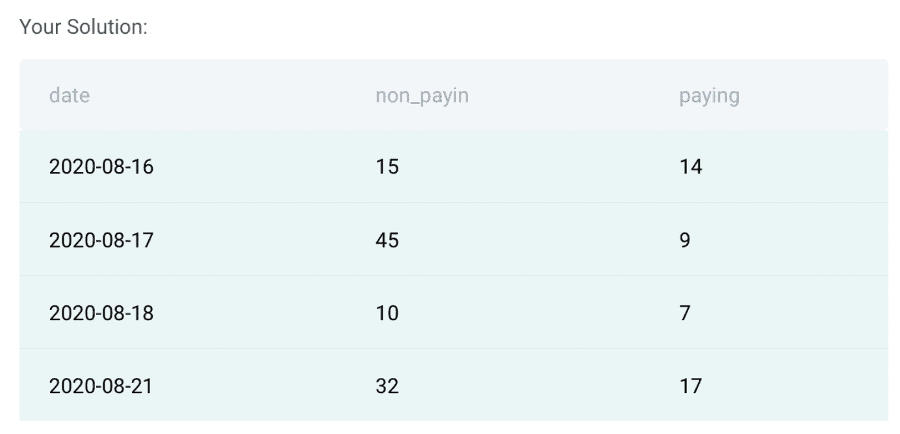

## 数据科学面试问题#3:营销活动的成功

> 你有一个用户应用内购买的表格。首次进行应用内购买的用户被置于营销活动中，他们会看到更多应用内购买的行动号召。找出由于营销活动的成功而进行额外应用内购买的用户数量。
> 营销活动在首次应用内购买后一天才开始，所以在第一天只购买一次或多次的用户不算在内，我们也不计算那些只购买第一天购买的产品的用户。

在这个问题中，提供了一个表格。这张表是关于营销活动的。一些背景，第一次购买的用户被放置在这个表中，在那里他们看到更多购买的行动要求。我们需要找到由于营销活动的成功而进行额外购买的用户数量。

**表:**营销 _ 活动

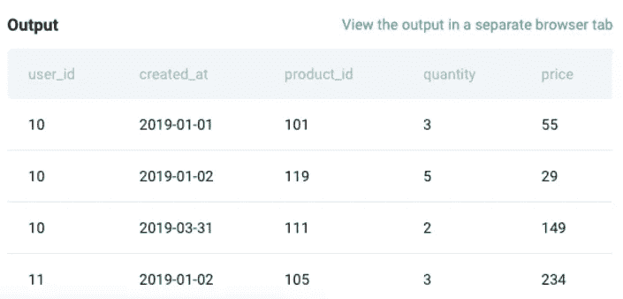

**解决方法**

第一步是找出每个用户对数据集中任何商品的第一次订购日期。为此，我们将使用 MIN()函数和 PARTITION BY()子句。找到下面代码的第一部分:

```
SELECT 
        user_id,
        -- Date when user first orders any item
        MIN(created_at) OVER(PARTITION BY user_id ) AS m1 
 FROM marketing_campaign
```

我们还需要找到每个用户对每个产品的首次订购日期。为了进行计算，我们将使用与上面类似的代码，但是使用 partition 子句中的 product ID 字段以及用户 ID。这将为我们提供每个用户的每个产品的第一个订单日期。

```
SELECT 
        user_id,
        -- Date when user first orders any item
        MIN(created_at) OVER(PARTITION BY user_id ) AS m1, 
        -- Date when each item was first ordered by user
        MIN(created_at) OVER(PARTITION BY user_id,product_id ) AS m2 
    FROM marketing_campaign
```

现在是问题的最后一部分，我们需要找到由于活动成功而进行额外购买的用户数量，这意味着我们需要计算不同用户 id 的数量，其中每个用户的第一个订单日期小于额外产品的第一个订单日期，即 m1 < m2.

**最终查询**

```
SELECT 
    COUNT(DISTINCT user_id) AS users
FROM (
    SELECT 
        user_id,
        -- Date when user first orders any item
        MIN(created_at) OVER(PARTITION BY user_id ) AS m1, 
        -- Date when each item was first ordered by user
        MIN(created_at) OVER(PARTITION BY user_id,product_id ) AS m2 
    FROM marketing_campaign
    )c WHERE m1< m2 
```

**输出**

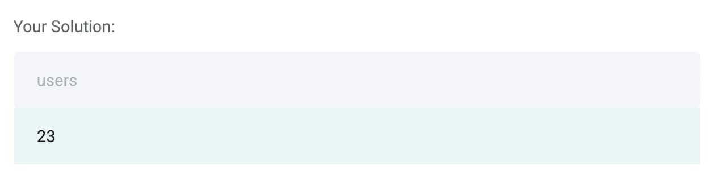

## 数据科学面试问题#4:葡萄酒总收入

> 你有一个葡萄酒的数据集。找出每个至少有 90 分的酿酒厂和品种的总收入。酒厂中的每种葡萄酒，品种对应该至少是 90 分，以便在计算中考虑该对。
> 输出酒厂和品种以及相应的总收入。酿酒厂的订单记录按升序排列，总收入按降序排列。

在问题中，我们有一张表；winemag_p1。找到下表的输出示例:

**表格:** winemag_p1

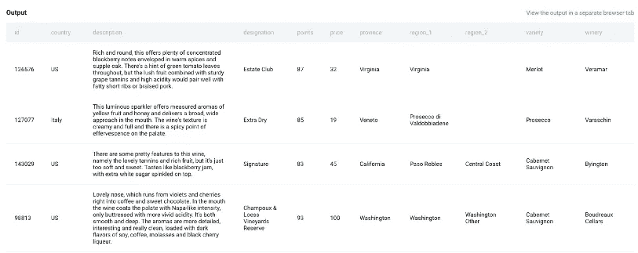

我们需要找到每个至少有 90 分的酒厂和品种的总收入。

**解决方法**

所以对于这个问题，第一步是计算每个酒厂和品种的总收入。为此，我们将做 SUM(price)来计算总收入，然后按酒厂和品种分组。下面是它的代码。

```
SELECT winery,
       variety,
       SUM(price) AS revenue
FROM winemag_p1
GROUP BY 1
```

这将计算所有葡萄酒厂的总收入，而不考虑总积分。问题还要求我们只有在积分大于 90 的情况下才计算收益。因此，为了合并这一部分，我们将在上述查询的末尾使用 HAVING()子句来解决这个问题。

**最终查询:**

```
SELECT winery,
       Variety,
       SUM(price)
FROM winemag_p1
GROUP BY 1,2
HAVING SUM(points<90) = 0
```

**输出**

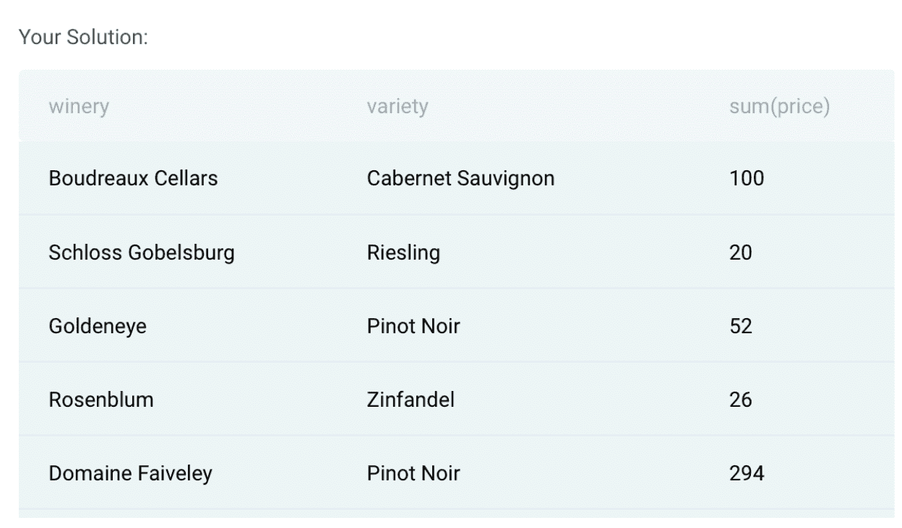

## 数据科学面试问题#5:课堂表现

> 给你一张表格，上面有一个班级学生的作业分数。编写一个查询，确定所有作业总分的最大差异。仅输出最高分学生和最低分学生之间的总分(所有 3 项作业的总和)之差。

在这个问题中，我们需要找出不同学生之间所有三个作业中的范围(最大值和最小值之间的差异)。为了解决这个问题，我们有一个表:box_scores。

**表格:**方框 _ 分数

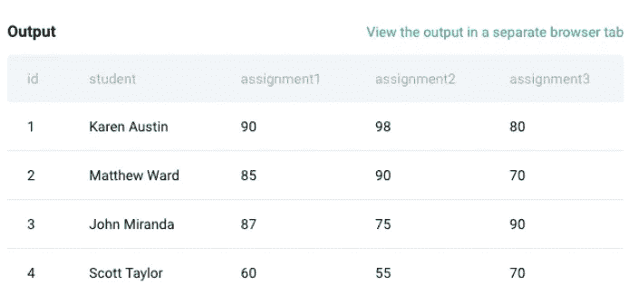

**解决方法**

第一步是计算每个学生所有三次作业的总分。让我们用 CTE 来回答这个问题，并将结果存储在 t1 中。

```
with t1 as (
SELECT DISTINCT student,
       assignment1 + assignment2 + assignment3 AS total_score
FROM box_scores
)
```

上述查询的输出如下所示，其中包含不同的学生以及所有三项作业的总分。现在我们需要找出最高分和最低分的区别。

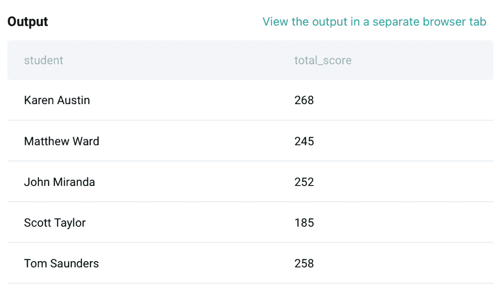

**最终查询**

```
WITH t1 as (
SELECT DISTINCT student,
       assignment1 + assignment2 + assignment3 AS total_score
FROM box_scores
)
SELECT MAX(total_score) - MIN(total_score) AS diff 
FROM t1
```

**输出**

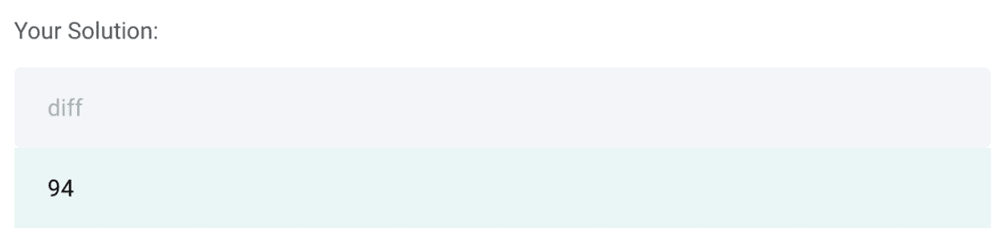

# 计算机编程语言


作者在 [Canva](https://canva.com/) 上创建的图片

## 数据科学面试问题#6:工资中位数

> 求各部门员工工资中位数。输出部门名称以及四舍五入到最接近的整数美元的相应工资。

**解决方法**

在这个问题中，我们需要找到每个部门的工资中位数。我们有一张表格，如下所示:

**表:**员工

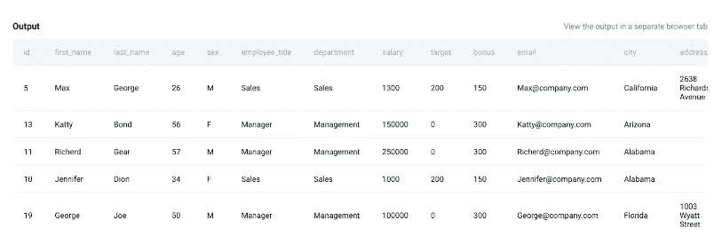

该表有许多不需要的列。因此，我们首先将这个数据帧缩减为解决这个问题所需的两列；部门和工资。

```
*# Import your libraries*
import pandas as pd*# Start writing code*
employee = employee[['department','salary']]
```

得到的 Dataframe 将只有两列；部门和工资。现在，我们可以按部门进行分组，并使用函数 group by()和 median()计算工资中位数，如下所示:

**最终查询:**

```
*# Import your libraries*
import pandas as pd*# Start writing code*
employee = employee[['department','salary']]
result = employee.groupby(['department'])['salary'].median().reset_index()
result
```

**输出**


## 数据科学面试问题#7:平均工资

> 将每个员工的工资与相应部门的平均工资进行比较。输出雇员的部门、名字和工资以及该部门的平均工资。

**解决方法:**

下面提供了一个表格来解决这个问题:

**表:**员工

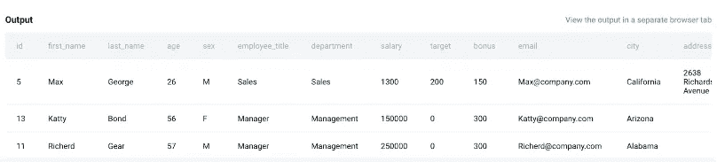

在这个问题中，我们需要计算每个部门的平均工资。因此，这可以通过在 python 中使用 groupby()函数和 average 函数来实现。因此，第一步是在单独的列中计算平均值，如下所示:

```
*# Import your libraries*
import pandas as pd*# Start writing code*
employee['avg_salary'] = employee.groupby(['department'])['salary'].transform('mean')
employee.head()
```

一旦我们计算了平均值，我们现在可以选择列；问题中提到的部门，名字，工资，平均工资。最后一个查询如下:

**最终查询:**

```
*# Import your libraries*
import pandas as pd*# Start writing code*
employee['avg_salary'] = employee.groupby(['department'])['salary'].transform('mean')result = employee[['department','first_name','salary','avg_salary']]
```

**输出**

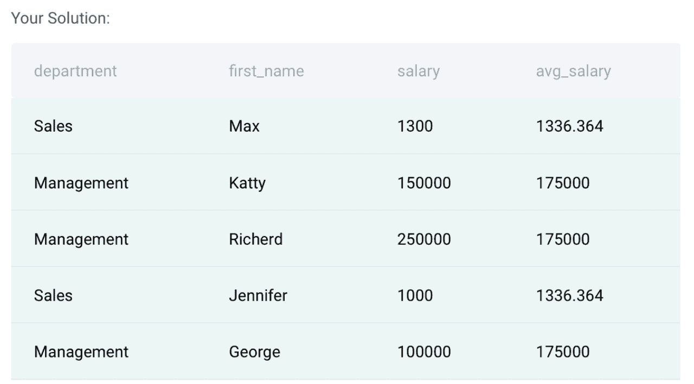

## 数据科学面试问题#8:有奖金的员工

> 查找奖金低于 150 美元的员工。输出名字和相应的奖金。

**解决方法**

在这个问题中，首先需要检查有奖金的表中有哪些行< 150\. There is one table provided to solve this question:

**表:**员工

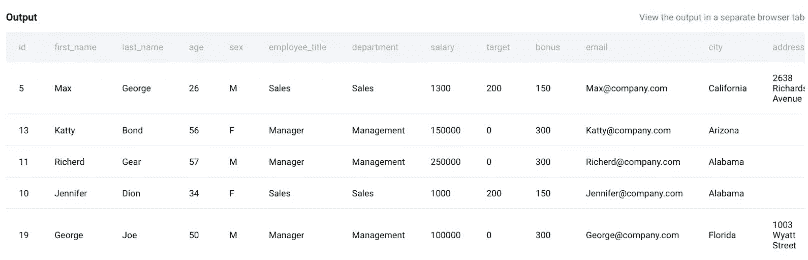

从上表中，我们可以看到解决该问题所需的“奖金”和“名字”字段。第一步是筛选奖金低于 150 的行的数据。请在下面找到它的示例代码:

```
*# Import your libraries*
import pandas as pd*# Start writing code*
employee = employee[employee['bonus']<150]
```

完成后，我们选择最终查询问题中提到的 first_name 和 bonus 字段。

**最终查询:**

```
*# Import your libraries*
import pandas as pd*# Start writing code*
employee = employee[employee['bonus']<150]employee[['first_name','bonus']]
```

**输出:**

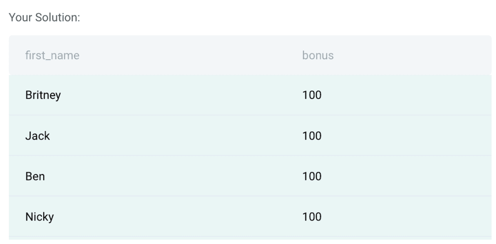

这些是 Python 中常见的编码问题。如果你想练习更多，查看数据科学的[熊猫面试问题](https://www.stratascratch.com/blog/python-pandas-interview-questions-for-data-science/?utm_source=blog&utm_medium=click&utm_campaign=medium)了解更多信息。

# 非编码

在这一部分，我们将讨论数据科学面试中可能会问到的非编码面试问题。这部分问题对于[数据科学面试准备](https://www.stratascratch.com/blog/5-tips-to-prepare-for-a-data-science-interview/?utm_source=blog&utm_medium=click&utm_campaign=medium)至关重要，因为面试通常有广泛的主题。非编码问题可以是系统设计主题、概率、商业案例研究、统计、建模、技术或产品。这些问题也可以作为您在编码过程中编写的代码的后续问题。现在，让我们看看在数据科学面试中可以提出的不同类型的非编码问题。

# 系统设计


作者在 [Canva](https://canva.com/) 上创建的图片

这类问题测试你解决设计问题和从头创建系统的能力。这些是典型的带有一些计算的理论问题。现在我们来看几个例子。

## 数据科学面试问题#9:餐厅推荐

> 你会如何在新闻提要上建立一个“你可能喜欢的餐馆”推荐系统？

这个问题要求您在新闻提要上建立一个“您可能喜欢的餐馆”推荐系统。

**解决方案:**

要解决这些问题，你需要对推荐系统的工作原理有一个基本的了解，以及对于给定的问题，我们如何最好地利用脸书的这些系统。你可以从网飞的推荐系统中得到启发。

“您可能喜欢的餐厅”推荐系统采用两种方法:

**基于内容的过滤(CBF):**

定义:它根据用户过去的行为来模拟用户的口味，但不受益于其他用户的数据。

**该方法的局限性:**

*   推荐结果的新颖性，因为它只查看用户的历史，从不跳转到用户可能喜欢但以前没有互动过的其他领域。
*   如果内容的质量不包含足够的信息来准确地辨别项目，CBF 将表现不佳。

**协同过滤(CF):**

定义:CF 查看用户/项目的交互(访问),并试图在用户或项目之间找到相似性，以完成推荐工作。

**限制:**

*   用户和项目之间的稀疏交互矩阵:许多用户很少甚至没有交互。
*   冷启动问题:寻找合适的餐厅是一个巨大的问题，尤其是对特定地区的新人。

为了解决这两种方法的局限性，可以使用一种混合方法，利用用户、项目和元数据之间的协作信息来完成推荐工作。

## 数据科学面试问题#10:存储数据的 Python 字典

> 什么时候我会使用 Python 字典来存储数据，而不是另一种数据结构？

**解决方案**

当代码可读性和获取数据的速度很重要时，我会使用 Python 字典来存储数据。当数据的顺序不重要时，我也会使用它。

Python 中的字典是用于保存键值对的结构。

它应该在以下情况下使用:

*   我们希望快速访问一些数据点(值)，假设我们可以唯一地将该数据与一些标识符(键)相关联；
*   数据点的顺序并不重要。

这个键应该是 *hashable* ，也就是说，它可以被传递给一个哈希函数。哈希函数接受任意大小的输入，并将其映射到相对较小的固定大小的输出(哈希值)，该输出可用于表查找和比较。

对字典值的类型没有限制。这是 Python 中字典相对于集合的一个重要优势，因为集合要求所有值都是可散列的。

## 数据科学面试问题#11:建立推荐系统

> 你能告诉我们你将如何建立一个推荐系统吗？

**解决方案:**

应该建立的推荐系统(RS)的类型取决于应用程序的当前用户(和产品/项目)基数的大小。

RSs 有一个“冷启动”的问题，也就是说，如果我们的数据量很少，那么它们根本没有效率。但是，一旦我们收集了足够的数据点，我们就可以利用它们向我们的用户提供建议。

因此，为了解决冷启动问题，我建议使用基于**流行度的**算法。基于流行度的算法通过某种度量(例如，购买计数、查看次数等)对所有项目进行排序。)并推荐排名靠前的项目。很明显，这种方法过度适合最受欢迎的商品，并且总是推荐它们，但是当我们的商品数量很少时，这是有意义的。

一旦用户群增长，并且我们已经收集了一些数据，我们就可以应用更高级的算法来推荐商品。两种最流行的方法是:

1.  **基于商品的过滤**:我们向每个用户推荐与其购买历史最相似的商品
2.  **基于用户的过滤**:我们向每个用户推荐与他们最相似的用户最常购买的商品

在这两种情况下，相似性的度量需要被定义并且是特定于应用的。在实践中，这两种方法经常结合起来提供一个混合的 RS。

构建 RS 的另一种方法是通过**分类模型**。分类模型将输入用户和商品相关的特征，并输出每个商品的概率/标签，该概率/标签将表示用户购买该商品的可能性。模型可以是*任何*分类模型:逻辑回归、KNN、神经网络等。我认为这是大公司(如亚马逊、谷歌、网飞)提供个性化推荐的方法。

# 可能性


作者在 [Canva](https://canva.com/) 上创建的图像

## 数据科学面试问题#12:电梯里的四个人

> 电梯里有四个人，他们将在大楼的四个不同楼层停留四次。每个人在不同楼层下车的概率是多少？

**解决方案:**

4 个人分配 4 个楼层的总可能性:

4 * 4 * 4 * 4 = 256

因为有 4 个人，并且每个人可以在 4 个楼层中的任何一个楼层下车，所以从 4 个人分配 4 个楼层的总可能性没有重复:

4 * 3 * 2 * 1 = 4!= 24 种可能性

这意味着第一个人选择楼层有 4 个选项，第二个人有 3 个选项，第三个人有 2 个选项，最后一个人只有 1 个选项。

因此，每个人在不同楼层下车的概率将是:

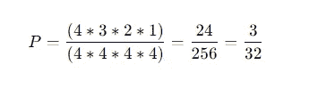

## 数据科学面试问题#13:选择两个女王

> 从一副牌中选出 2 张皇后的概率？

**解决方案:**

由于一副牌中总共有 52 张牌和 4 张皇后，那么我们在第一次尝试中得到一张皇后的概率是:

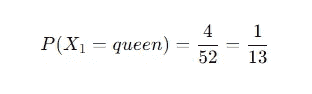

如果我们在第一次试验中得到一个皇后，那么在 51 张牌中还有 3 个皇后，因此我们在第二次试验中得到一个皇后的概率是:

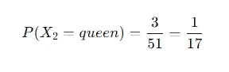

我们得到 2 个皇后的概率是在第一轮和第二轮中得到一个皇后，或者:

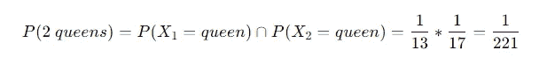

# 统计数字


作者在 [Canva](https://canva.com/) 上创建的图像

## 数据科学面试问题#14:中心极限定理

> 解释中心极限定理。

**解决方案:**

**中心极限定理**可以分多个部分解释:

*   无论样本大小或总体分布如何，样本均值等于总体均值
*   样本均值的标准差等于总体的标准差除以样本大小的平方根
*   如果总体呈正态分布，则无论样本大小如何，样本均值的抽样分布都将呈正态分布
*   如果人口分布不是正态的，那么 30 或更多的样本量通常被认为足以满足 CLT

## 数据科学面试问题#15:评估多重共线性

> 评估多重共线性的不同技术有哪些？

**解决方案:**

要处理多重共线性，有以下几种常见的方法:

1.相关矩阵

相关矩阵显示两个独立变量之间的皮尔逊相关性。如果两个自变量之间的相关系数大于 0.75，那么我们认为这些变量具有高度的共线性。

2.差异通货膨胀系数(VIF)

VIF 测量模型中只有相应自变量的给定系数的方差与模型中所有自变量的给定系数的方差之比。

第 I 个自变量的 VIF 定义为:

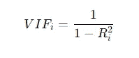

其中 R(i)是当只有第 *i* 个变量起作用时的方差的量度，相对于当所有变量都包括在内时的方差。VIF 值越接近 1，变量与所有其他预测值的相关性越小。因此，要评估数据集中的多重共线性，我们可以计算所有预测变量的 VIF，并将临界值(通常在 5 到 10 之间)指定为阈值。

## 数据科学面试问题#16:精确度和召回率

> 提供精确和召回的公式。

**解决方案:**

精确度和召回率都是分类任务中常用的评估指标。

**精度**

Precision 试图回答以下用例:

从我们的 ML 模型中得到的正面预测有多大比例是正确的？

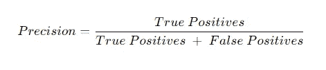

**回忆**

回忆试图回答以下使用案例:

我们的模型正确预测的实际阳性比例有多大？

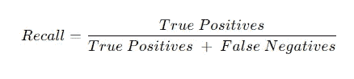

# 建模


作者在 [Canva](https://canva.com/) 上创建的图像

## 数据科学面试问题#17:标记的实例很少

> 使用大数据集(其中只有一小部分实例被标记)可以使用什么技术来训练分类器？

**解决方案:**

因此，问题是“使用大数据集(其中只有一小部分实例被标记)可以使用什么技术来训练分类器？”

如果我们有一个大数据集，其中只有一小部分实例被标记，那么我们可以使用半监督机器学习技术。

在实践中，半监督机器学习算法包括监督算法和非监督算法的组合。例如，将 k-均值聚类和诸如神经网络、SVM、随机森林等分类算法之一相结合的算法。

举个例子，假设我们想对大量的 0-9 之间的手写数字进行分类。标记所有的手写数字既费时又费钱。我们能做的是:

*   首先，使用 K-means 聚类对所有手写数字进行聚类，假设我们初始化了 100 个聚类。
*   接下来，我们在每个聚类中选取最接近每个聚类质心的数据点，这意味着我们有 100 个手写数字，而不是整个数据集。
*   接下来，我们可以标记这 100 个手写数字中的每一个，并使用它们作为我们分类算法的输入，以获得数据的最终预测。

## 数据科学面试问题#18:功能相关性

> 如果两个特征在线性回归中相关，会发生什么？

**解决方案:**

如果两个要素相互关联，那么它们将引入所谓的多重共线性问题。

**什么是多重共线性？**

当两个或多个独立变量(要素)相互关联时，线性回归中会出现多重共线性。这不应该发生在线性回归中，因为顾名思义，一个独立变量应该独立于其他独立变量。

**多重共线性有什么问题？**

简单的线性回归模型具有以下等式:

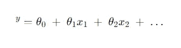

其中:

y^:预测值

*θ(0):截距*

*θ(1):第一个特征的权重*

*x(1):第一个特征的值*

*当我们的线性回归模型存在多重共线性问题时，那么:*

*   *每个特征的权重将对模型中的微小变化高度敏感。例如，如果我们从模型中添加或删除一个特征，每个特征的权重将大幅波动。结果，解释一个特征对我们的线性回归模型的性能的影响变得困难。*
*   *多重共线性会增大每个要素权重的误差和标准差。这就成了一个问题，因为当我们想要进行特征选择(向模型添加或移除特征)时，我们不能相信从每个特征的模型得出的统计结果(p 值)*

*如果您想更深入地了解多重共线性以及我们如何解决这个问题，请查看此资源。*

# 技术的


作者在 [Canva](https://canva.com/) 上创建的图像

## 数据科学面试问题#19:数据库规范化

> 列出并简要解释数据库规范化过程的步骤。

**解决方案:**

数据库规范化是将复杂的用户视图和数据存储转换为一组更小的稳定数据结构。除了更简单和更稳定之外，规范化数据结构比其他数据结构更容易维护。

**步骤**

1.  第一范式(1 NF):该过程的第一阶段包括移除所有重复组并识别主键。为此，需要将关系分解为两个或更多的关系。在这一点上，关系可能已经是第三范式，但是很可能需要更多的步骤来将关系转换成第三范式。
2.  第二范式(2 NF):第二步确保所有非键属性完全依赖于主键。所有部分从属关系都被移除并放置在另一个关系中。
3.  第三范式(3 NF):第三步移除任何传递依赖。传递依赖是指非键属性依赖于其他非键属性。

在 3NF 之后，其余的规范化是可选的，设计选择取决于数据集的性质。

4.Boyce-Codd 范式(BCNF):它是 3NF 的更高版本。这个表单处理 3NF 不能处理的某种异常。没有多个重叠候选关键字的 3NF 表被称为在 BCNF。对于 BCNF 中的表，该表必须是第三范式，并且对于每个函数依赖(X -> y)，X 应该是一个超级键。

5.第四范式(4NF):对于满足第四范式的表，它应该是 Boyce-Codd 范式，并且该表不应该有任何多值依赖。

## 数据科学面试问题#20: N-Gram

> 什么是 n-gram？

**解决方案:**

N-gram 是 N 个单词或字母的序列，通常用于自然语言处理领域以实现各种事情:例如，作为模型训练的输入以执行句子自动完成任务、拼写检查任务或语法检查任务。

*   1-gram 表示一个序列只有一个词，如 ***【星期六】【是】【我的】【最爱】【日】***
*   2-gram 表示有两个记录的序列，如 ***“星期六是”、“是我的”、“我最喜欢的”、“最喜欢的一天”***

以此类推，3、4、5 克。正如你注意到的，N-gram 序列越大，它提供的上下文就越多。

# 产品


作者在 [Canva](https://canva.com/) 上创建的图像

## 数据科学面试问题#21:客户参与和脱离

> 您如何衡量客户参与度和脱离度？

**解决方案:**

客户参与是指用户在整个用户旅程中反复遇到你的产品或品牌。

有四种方法来衡量客户参与度:

1.  **按月、周或日:**找出每天、每周或每月有多少忠实用户使用你的产品。这完全取决于你期望你的用户如何使用这个应用。这里一个重要的 KPI 就是粘性:日活跃用户和月活跃用户的比例。
2.  **按渠道:**找到带来最赚钱客户的获取渠道。
3.  **通过功能使用:**为你的用户识别无价的功能。
4.  **根据客户健康评分:**根据参与度预测从客户处获得选定结果的可能性。

## 数据科学面试问题#22:点击搜索结果

> 您注意到点击脸书活动搜索结果的用户数量每周增加 10%。你会采取什么步骤来调查变化背后的原因？你如何决定变革对企业的影响是好是坏？

**解决方案:**

为了回答这个问题，下面有一个非常详细的解决方案:

**你会采取什么措施来调查变化背后的原因**

1.澄清指标

*   搜索结果的过程是怎样的
*   facebook 事件到底是什么

2.暂时的

*   增长变化有多快
*   这是一个月之后的一个渐进的变化吗
*   一周内是否有异常值导致 10%的变化
*   查看历史周环比百分比，确定它是否是正常变化

**如果这些情况都不存在，则继续**

3.内部产品变更

*   是产品的某种变化导致了这种度量的变化吗
*   前任。改变搜索结果的顺序(事件弹出更多)，改变产品以增加搜索量，导致更多点击

4.外部变化

*   突然出现的引起更多点击的重大事件
*   增加事件数量

5.度量分解

*   “周复一周”指标包括整体搜索还是仅包括事件的点击量
*   检查为什么总搜索量可能会增加

**您如何决定变革对业务的影响是好是坏**

1.阐明企业的目标是什么

*   meta 通过事件的更多点击获得了什么
*   这些活动页面有人们可以看到的广告吗
*   meta 会从活动页面的更多点击中获得收入吗
*   或者产品的目标仅仅是与 facebook 平台更多的互动？

2.一旦定义了产品的目标，我们就可以巩固指标

*   我们还可以看哪些其他指标
*   页面上的广告点击率是多少
*   收入增加了多少
*   点击率增加会导致 facebook 会话时间变长吗

3.用所有的信息做一个推荐

*   前任。如果增加导致会话时间变短，那么我们可能希望诊断问题并恢复所做的任何更改

# 结论

在准备数据科学工作面试时，你应该准备好各种各样的问题。编码和非编码数据科学面试问题是两大类。

即使编码相关的问题是最常见的，你仍然需要掌握其他技能。因此，非编码问题是必不可少的。它们是展示你的技术熟练程度以及产品、建模和系统设计知识的一种方式。

本指南描述了您在知名公司的数据科学面试中会遇到的问题。在这些公司找工作并不简单。浏览每个问题只是一个开始。剩下的编码和非编码面试问题现在轮到你来考察了。