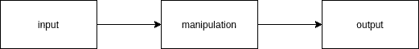
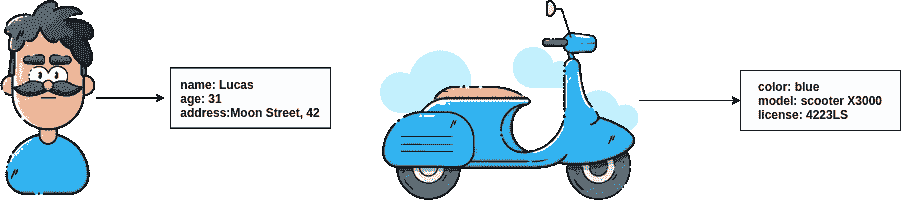
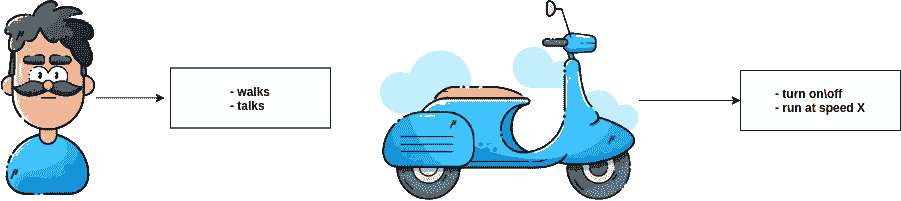
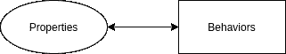
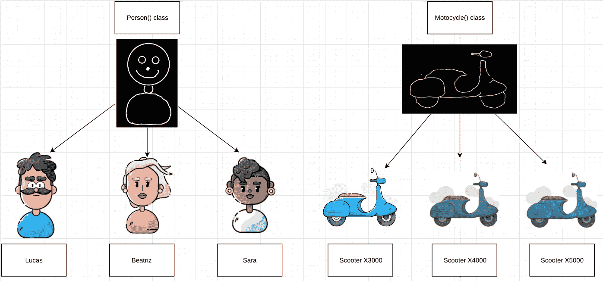

# Python 面向对象编程的快速简单介绍

> 原文：<https://towardsdatascience.com/quick-and-easy-introduction-to-object-oriented-programming-with-python-8d6167c4c8eb>


妮可·沃尔夫在 [Unsplash](https://unsplash.com?utm_source=medium&utm_medium=referral) 上的照片

## 使用 Python 从对象到面向对象的行为

如何管理一堆数据要操作，一堆事情要做的复杂程序？



作者图片

对于如何构建一个程序，有很多可能性，如果我们将这些可能性结合在一组结构化的规则和属性中，我们就得到所谓的编程范例。

面向对象编程(OOP)只不过是一种通用的编程范式，也就是说，一种设计软件的方法。它被认为有助于大型软件项目的设计，在学术界和工业界得到了广泛的应用。

***在这篇文章中，我想用 Python 来讨论 OOP 的基础知识。***

# 从复杂的组件到直观的对象

OOP 应该是一种让软件开发过程感觉更直观的编程范式。为什么？因为我们可以从对象及其关系的角度来思考复杂的组件。

一个物体是一个实体，或者“东西”，通常是一个名词，比如一个人或者一辆摩托车。

每个对象都有属性，比如一个人有名字、年龄和(可能是地址)，一辆摩托车有颜色、型号和牌照。



图片由作者提供，改编自 [Lukaz Adam 的免费插图](https://lukaszadam.com/illustrations)

除了属性，单个对象也有行为，比如一个人走路和说话，而一辆摩托车，可以启动和关闭，以给定的速度运行，等等。



图片由作者提供，改编自 [Lukaz Adam 的免费插图](https://lukaszadam.com/illustrations)

还有其他的复杂性我们在这里没有提到，比如，成为一个对象需要什么？这似乎有点主观，对吗？还有，一旦某物是对象，那么某物成为属性或行为的规则是什么？

我们将跳过那些没有明确答案的问题，坚持把事物看作具有属性和行为的对象。



作者图片

# Python 类

为了进入对象、属性和行为的主题，让我们使用 [Python 类](https://www.w3schools.com/python/python_classes.asp)作为我们的指南。在讨论 Python 类时，有一些事情需要考虑:

*   *类是我们在 Python 中用来创建对象的东西*
*   我们可以从一个类中创建尽可能多的独特对象
*   *类在 Python* 中定义了一个叫做 `*type*` *的东西*
*   *实例化是从 Python 中的类创建对象的过程的名称*

让我们用一个简单的例子来解开所有这些断言:

```
name = 'Lucas'
```

在这里，我简单地创建了一个名为`name`的变量，其值为`Lucas`，这个变量是一个对象的引用，在这里，对象的`type`是一个`str`，因为为了创建它，我们实例化了 Python 内置的`str`类。

现在，让我们创建一个名为`Person()`的类，和另一个名为`Motorcyle()`的类，它们将分别具有属性(attribute):`name`和`model`。

```
class Person:
    def __init__(self, name):
        self.name = name

class Motorcycle:
    def __init__(self, model):
        self.model = model

p = Person("Lucas")
print(p.name)

m = Motorcycle("Scooter X3000")
print(m.model)Lucas
X3000
```

在本例中，我们创建了`Person()`和`Motorcycle()`类，它们分别有自己的名称和模型属性，然后我们实例化了它们，这意味着我们从这些类(或类型)中创建了唯一的对象，在本例中名称为`"Lucas"`，模型为`"Scooter X3000"`。

我们使用了被称为构造函数的方法:`__init__`，Python 中用来初始化数据的方法，这些是我们实例化类时调用的方法。

在 Python 类的上下文中，`self.name = name`行是 Python 中的*实例属性*的一个例子，它指的是该类的唯一实例化的特定属性。

我们可以创建尽可能多的这些类的实例:

```
# instantiate 3 people and 3 motorcycles

p1 = Person("Lucas")
p2 = Person("Beatriz")
p3 = Person("Sara")

m1 = Motorcycle("Scooter X3000")
m2 = Motorcycle("Scooter X4000")
m3 = Motorcycle("Scooter X5000")

# and so on and so forth
```

考虑这个问题的一种方法是，类就是模板，每个实例化都是模板的一个真实应用实例。



图片由作者提供，改编自 [Lukaz Adam 的免费插画](https://lukaszadam.com/illustrations)

考虑到这种类比可能会与抽象和一种特定类型的 Python 类(称为抽象类)相混淆，所以要有所保留。

## 行为呢？

我们可以通过添加允许它们做事情的方法来为我们的 Python 类添加功能，例如，我们的`Person()`类可以有一个`walk()`方法，我们的`Motorcyle()`类可以有一个`turn_on()`方法。

```
class Person:
    def __init__(self, name):
        self.name = name

    def walk(self):
        print(f"{self.name} is walking")

class Motorcycle:
    def __init__(self, model):
        self.model = model

    def turn_on(self):
        print("Motor is on")

p = Person("Lucas")
p.walk()

m = Motorcycle("Scooter X3000")
m.turn_on()Lucas is walking
Motor is on
```

但是，班级之间如何交流呢？

比方说，我想让我的`Person()`类能够以某种方式与`Motorcycle()`类相关联，我们从`Motorcycle()`类写一个对`turn_on()`方法的修改怎么样，其中需要创建一个`Person()`类的实例？

```
class Person:
    def __init__(self, name):
        self.name = name

    def walk(self):
        print(f"{self.name} is walking")

class Motorcycle:
    def __init__(self, model):
        self.model = model

    def turn_on(self, owner):
        p = Person(owner)
        print(f"{p.name} turned the motor on")

mt = Motorcycle("Scooter X3000")

mt.turn_on("Lucas")Lucas turned the motor on
```

现在，我们开始看到属性、行为与类交互结合在一起。这是 OOP 世界的开始，因为对象开始相互交互来创建复杂的动态。


图片由作者提供，改编自 [Lukaz Adam 的免费插画](https://lukaszadam.com/illustrations)

# 面向对象编程是一种技能

OOP 是一个迷人的主题。我们如何将对象聚集在一起以创建有趣的软件动态？鉴于问题的复杂性，答案可能不是很清楚。

但是，当我们作为 Python 开发人员发展时，考虑它是有意义的。将软件组件视为我们可以创建并组合在一起以生成丰富的交互并最终产生有趣功能的对象，这是一项终生的技能，在学术界和工业界编写良好的软件中深受赞赏。

如果你喜欢这个帖子，[加入 Medium](https://lucas-soares.medium.com/membership) ，[关注](https://lucas-soares.medium.com/)，[订阅我的简讯](https://lucas-soares.medium.com/subscribe)。还有，订阅我的 [Youtube 频道](https://www.youtube.com/channel/UCu8WF59Scx9f3H1N_FgZUwQ)在 [Tiktok](https://www.tiktok.com/@enkrateialucca?lang=en) 、[推特](https://twitter.com/LucasEnkrateia)、 [LinkedIn](https://www.linkedin.com/in/lucas-soares-969044167/) 、 [Instagram](https://www.instagram.com/theaugmentedself/) 上和我联系！谢谢，下次再见！:)

如果你想进入面向对象编程领域，可以看看这本书:

*   [编程 Python:强大的面向对象编程](https://amzn.to/3EAJhfr)

> 这是一个附属链接，如果你购买的产品，我得到一小笔佣金，干杯！:)

# 参考

*   [https://real python . com/lessons/what-object-oriented-programming-OOP/](https://realpython.com/lessons/what-object-oriented-programming-oop/)
*   [https://www.w3schools.com/python/python_classes.asp](https://www.w3schools.com/python/python_classes.asp)