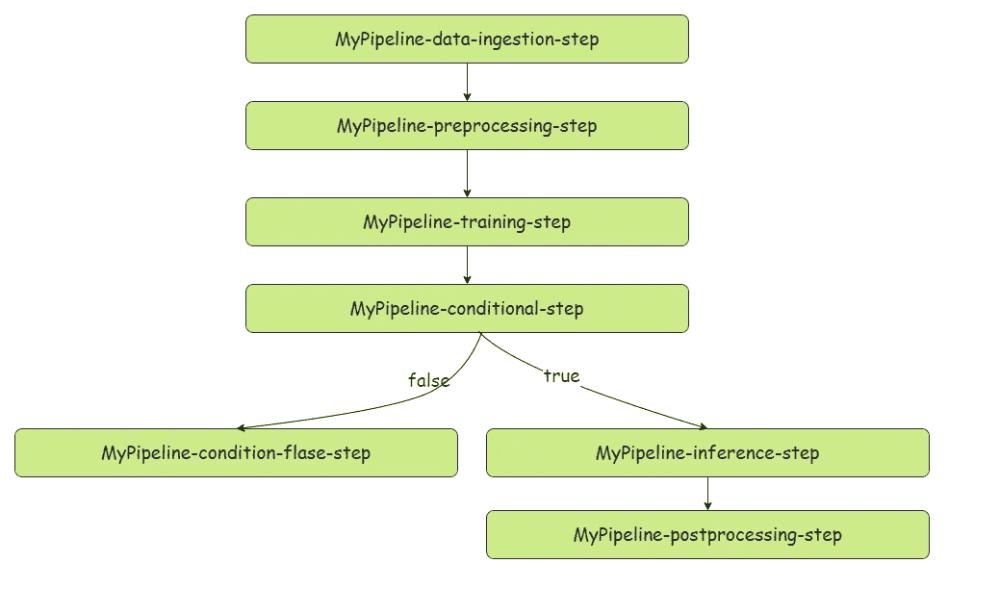
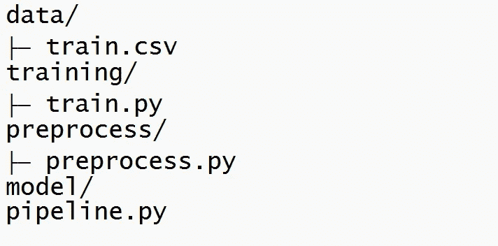

# 调试 SageMaker 管道的快速简便方法

> 原文：<https://towardsdatascience.com/quick-and-easy-way-to-debug-sagemaker-pipelines-473b9c56f015>

## AWS SageMaker 本地模式简介

照片由[EJ·斯特拉特](https://unsplash.com/@xoforoct?utm_source=medium&utm_medium=referral)在 [Unsplash](https://unsplash.com?utm_source=medium&utm_medium=referral) 上拍摄

## 介绍

您可能已经体验过，在云环境中调试管道非常耗时。因为我们的程序与云托管的服务交互，所以与本地环境相比，我们有许多需要考虑的地方。例如，假设您的管道由于管道最后一步的版本问题而失败。可能它已经运行了 2 个小时才出现故障。在这种情况下，你在特定云资源上的钱就浪费了。这就是数据科学家/ML 工程师应该知道的调试和测试管道的经济有效的方法。在本文中，我将指导您如何使用本地模式特性调试 AWS SageMaker 管道。

本文涵盖的主题。

*   什么是 SageMaker 管道
*   什么是 SageMaker 本地模式
*   使用 SageMaker 本地模式的好处
*   如何使用 SageMaker 本地模式进行测试和调试？

我们开始吧。

## 什么是 Sagamaker 管道？

示例管道-插图-作者提供的图片

简而言之，SageMaker 管道是一个有向无环图(DAG ),它让我们能够根据自己的需求定义指令集。DAG 中的每个气泡对应于用户指定的指令。由于这些气泡是相互关联的，我们可以映射它们之间的依赖关系，这有助于我们将复杂的指令分成单个部分。此外，它为这些管道提供了更多的可维护性。

  

## 什么是 SageMaker 本地模式，我们为什么要关心它

在解释本地模式之前，我们应该知道 SageMaker 管道是如何工作的。

> ***当我们执行 SageMaker 管道时会发生什么？***

为了解释这一点，让我以下面的步骤为例。

*   数据摄取
*   预处理
*   模型结构
*   推理
*   后加工

当我们执行上述管道时，SageMaker 将自动为每个步骤旋转一个 EC2 实例，并运行用户定义的脚本。事先，整个管道将使用 5 个 EC2 实例。记住，云中的所有资源都是有成本的。那就是成本因素了。时间因素怎么样？更惨。除了脚本执行时间，我们必须等待几分钟来旋转 EC2 实例。假设您正在构建一个管道或调试一个管道，这意味着您不得不在 EC2 实例上浪费不必要的金钱和时间。如果我们可以避免旋转 EC2 实例，并在本地运行整个管道作为试运行，会怎么样？这就是 SageMaker 本地模式派上用场的地方。

> 启用 SageMaker 本地模式后，我们可以在本地机器上尝试我们的管道。这意味着当我们调试或测试管道时，不会在 EC2 实例上浪费更多的时间和金钱。

让我们用预处理和训练步骤构建一个简单的管道。这里我将使用一个自定义容器。但是本地模式既适用于内置容器，也适用于自定义容器。你可以在下面看到我的文件夹结构。

我的文件夹结构—按作者分类的图像

## 构建预处理步骤

在这一步中，我将使用数据目录中的训练数据集，并将它们上传到预处理容器中。然后执行位于预处理目录中的 python 脚本。处理作业完成后，预处理文件应保存到配置的 S3 位置。

首先，我们需要设置下面的会话配置。只有当您与本地文件系统而不是 S3 进行交互时，才有必要这样做。

现在是定义处理步骤的时候了。

## 建立培训步骤

此步骤将执行以下操作。

*   获取预处理步骤输出，并用它们训练模型。
*   将模型工件保存到名为`model`的本地目录中

所以问题是如何将估算器`output_path`设置为本地目录。我们可以通过给本地路径添加一个`file://`前缀来设置本地路径。

## 建造管道

让我们测试我们的管道。

当您成功执行管道时，您会注意到在模型目录中创建的 model.tar.gz 文件。您可以使用它进行推理和模型诊断等。

## 最后的话

如果使用 SageMaker 进行开发，可能会遇到不同的 bug 和错误。这就是 SageMaker 本地模式可以成为你的救命稻草的地方。这会让你把更多的时间集中在你的问题上。在本地成功运行之后，您可以将模型管道投入生产。将本地模式转换为 AWS 托管管道时，必须用 SageMaker 会话替换本地会话，并使用具有必要权限的 SageMaker IAM 角色。

完整的代码可以在我的 [GitHub repo](https://github.com/Ransaka/Sagemaker-Local-Mode-Example) 中找到。

快乐学习！！

> *参考文献:*

*   AWS 回购样本—[https://github.com/aws-samples/amazon-sagemaker-local-mode](https://github.com/aws-samples/amazon-sagemaker-local-mode)
*   Sagemaker 文档—【https://sagemaker.readthedocs.io/en/stable/overview.html? highlight = local % 20mode #本地模式