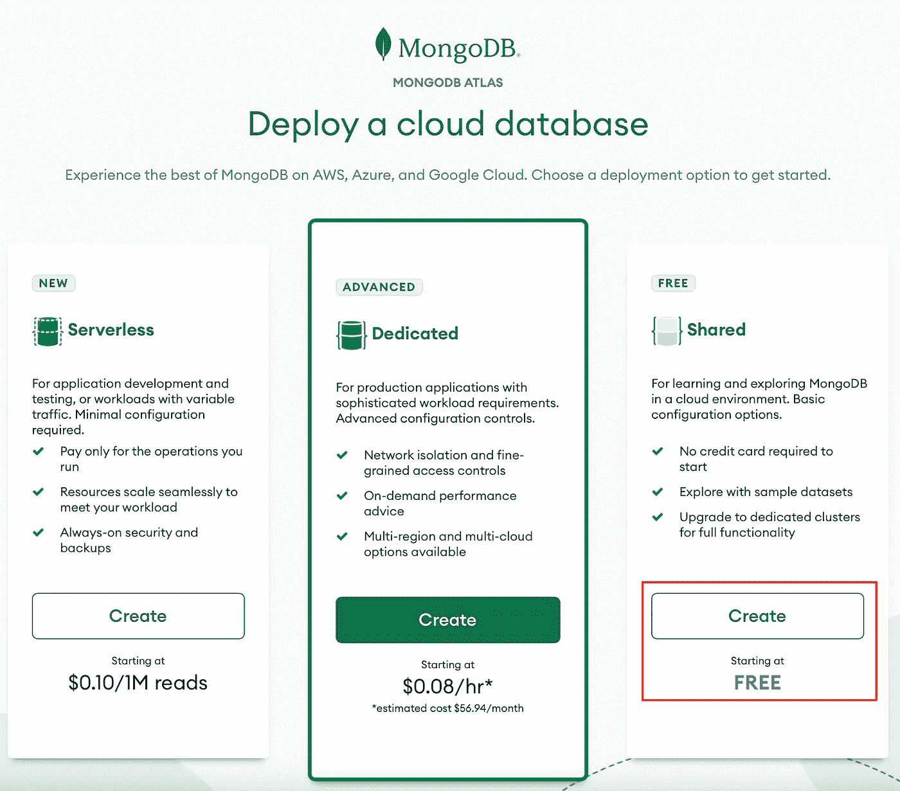
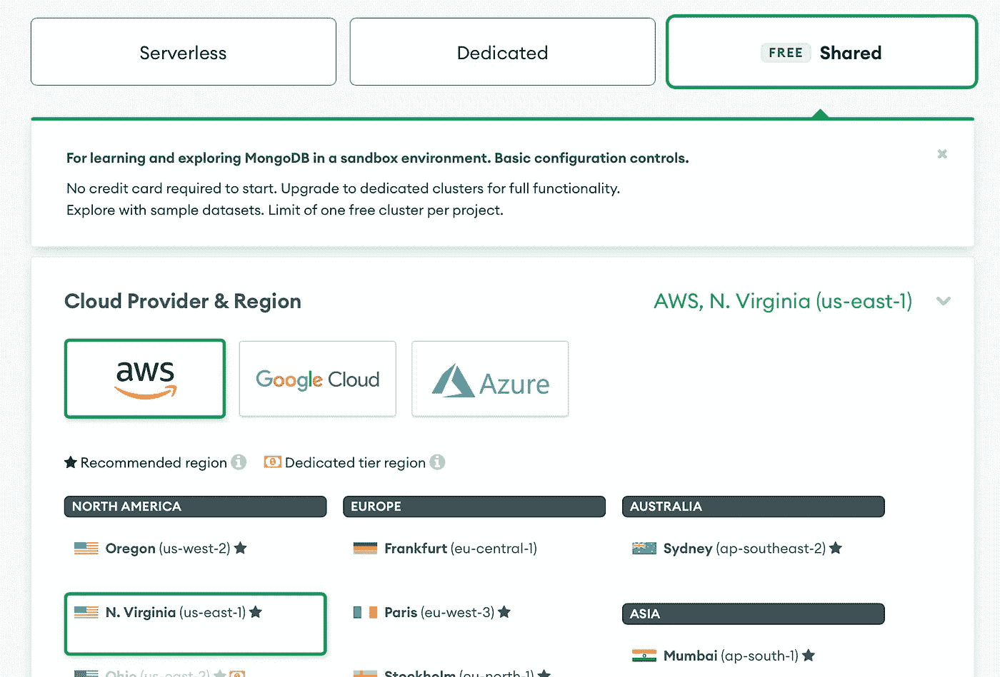
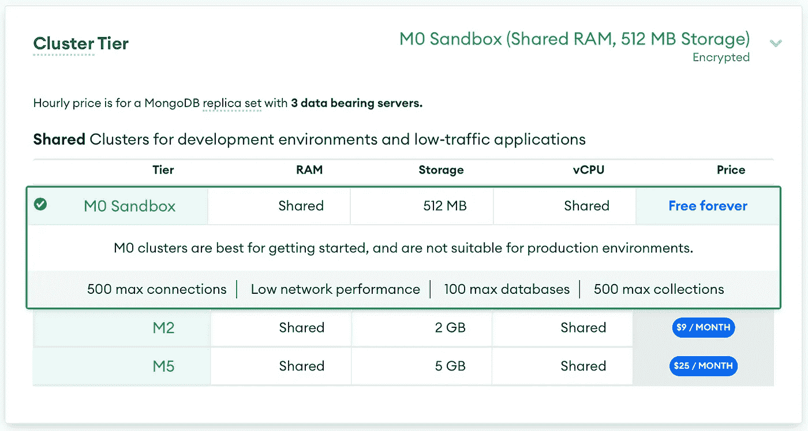
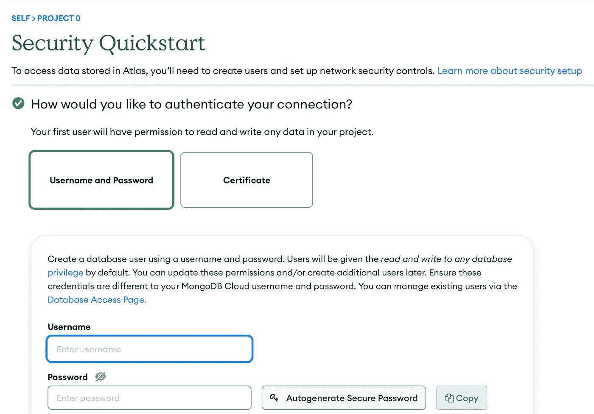
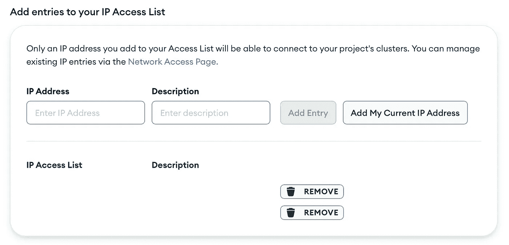
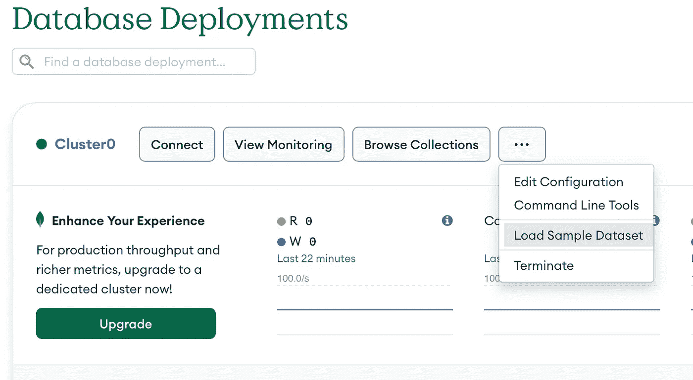
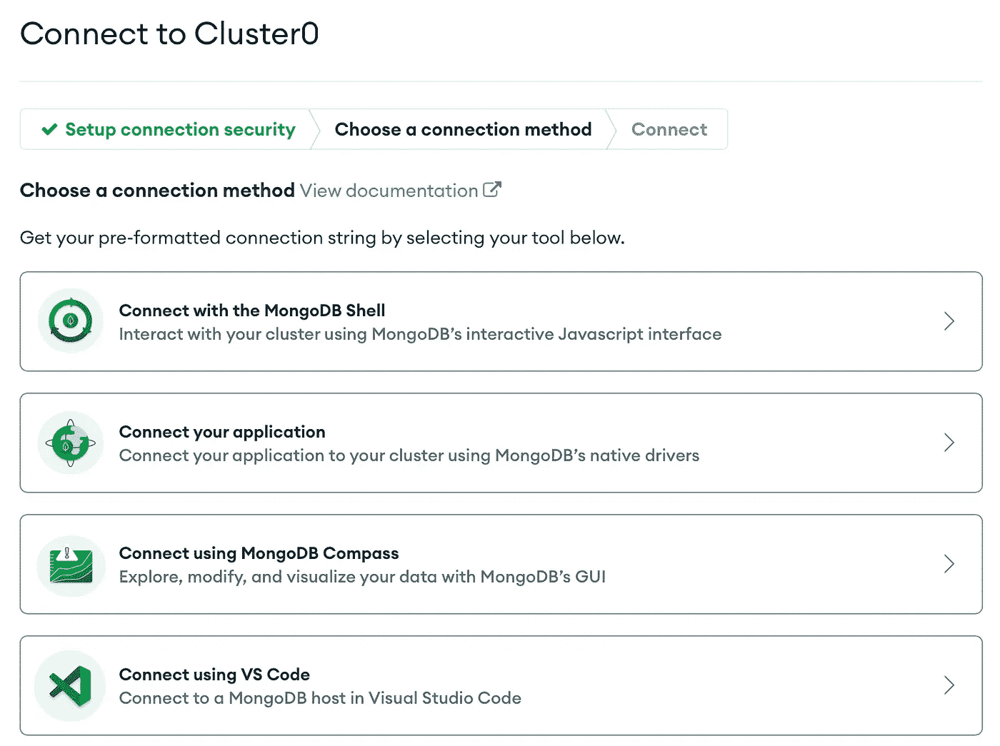

# 将 MongoDB 集合引入 Pandas 数据框架的快速入门

> 原文：<https://towardsdatascience.com/quick-start-from-mongodb-to-pandas-3f777dcbfb6e>

## 通过将 MongoDB 数据导入 Pandas，让您快速进行数据分析和模型构建


在 [Unsplash](https://unsplash.com?utm_source=medium&utm_medium=referral) 上 [Vince Gx](https://unsplash.com/@vincegx?utm_source=medium&utm_medium=referral) 拍摄的照片

**MongoDB** 属于一类被称为 [**NoSQL**](https://en.wikipedia.org/wiki/NoSQL) 数据库的数据库。NoSQL 数据库设计用于存储和检索数据，而不需要预定义的模式，这与关系数据库相反，关系数据库需要在存储数据之前定义一个模式。MongoDB 是一个 [**文档存储库**](https://en.wikipedia.org/wiki/Document-oriented_database) ，这意味着它在**类 JSON 文档**中存储数据。

我最近遇到了一个项目，我需要连接到 MongoDB 并执行数据分析。一种选择是请熟悉数据库的人将数据提取为 CSV 之类的格式，这种格式很容易放入 Python。然而，这不是获得最新数据的有效方法。我也知道 MongoDB 的持久性是类似 JSON 的格式，作为一名数据科学家，我更喜欢一个 **Pandas DataFrame** 。正如大多数数据科学从业者所知，一旦我们的数据处于数据帧中，我们就可以对该数据执行任何标准操作，从 [EDA](/exploratory-data-analysis-with-python-1b8ae98a61c5) ，到[特征工程](/6-tips-to-power-feature-engineering-in-your-next-machine-learning-project-d61530eee11b)，到[模型选择](/demystify-machine-learning-model-selection-e3f913bab7e7)和[评估](/evaluating-ml-models-with-a-confusion-matrix-3fd9c3ab07dd)。

**注意:**更好的方法是通过像 [Fivetran](https://www.fivetran.com/connectors/mongodb) 这样的工具将数据提取到像[雪花](https://www.snowflake.com/en/)这样的数据仓库中。然而，这在项目的这一点上是不实际的；这是下一个最好的选择！

# 创建您的免费 Mongo 数据库帐户

例如，我们将使用一个免费的 MongoDB Atlas 帐户。Atlas 是 MongoDB 的云托管版本，它包括一个免费层，这使得它非常适合在开始一个更大的项目之前进行学习，或者给你一个实验的平台。让我们来完成创建免费帐户的步骤。

从 [MongoDB 主页](https://www.mongodb.com/)，点击**免费试用**按钮，注册一个新账号。选择免费的**共享的**选项，这会让您从一个基本的托管数据库开始。



作者图片

接下来，继续使用**共享**选项，并选择您所在的地区和云托管提供商。我通常使用 AWS，但是对于这个例子，任何提供者都可以。



作者图片

最后，使用**集群层**设置，选择 **M0 沙箱**选项；免费选项将为您提供一个具有 512MB 存储空间的单节点数据库，对于我们的示例来说已经足够了。



作者图片

接下来，我们将进行配置。

# 配置访问

接下来，我们需要基本的配置细节，如用户、密码和 IP 地址信息。让我们从**用户名和密码**选项开始。创建一个用户，让 Mongo 为您指定 PW。它将使用一个不需要 URL 编码的(如果您愿意，我们将稍后处理)。



作者图片

接下来，我们应该只允许通过我们信任的 IP 地址连接到此。你可以通过网址 [WhatsMyIPAddress](https://whatismyipaddress.com) 找到你的 IP 地址。理想情况下，你应该有一个静态的 IP 地址，但首先，当你访问这个网站时，使用列出的 IP4 地址。如果你愿意，你可以随时添加更多的 IP 地址，甚至向全世界开放(不要这样做)。



作者图片

我们准备好获取一些样本数据了！

# 安装示例数据

MongoDB 提供了一种非常简单的方法来获取样本数据，允许我们探索数据库并学习如何与它交互。点击`...`按钮，选择**加载样本数据集**。



作者图片

你可以通过**连接**按钮了解更多关于连接 Mongo 的信息；但是，接下来我将带您浏览一下。一个很酷的探索是用于浏览服务器的 **VS Code** 扩展。写完这篇文章后，看看吧。



作者图片

# 安装 MongoDB Python 客户端

要使用 MongoDB Atlas，您需要使用`dnspython` python 安装 Python 驱动程序，您可以使用以下命令安装驱动程序:

```
python -m pip install 'pymongo[srv]'
```

**注意:**如果你之前已经安装了`pymongo`，试着先卸载它，然后运行上面的命令。

# Python 导入

像往常一样，让我们导入所有需要的库。我们有自己的标准`numpy`和`pandas`以及`os`来获取环境变量。我们还从`urllib`导入了`quote_plus`，这将有助于用户名和密码的编码。最后，我们有`pymongo`，MongoDB Python 驱动。

```
import pandas as pd
import numpy as np
from pymongo import MongoClient
import os
import pandas as pd
from urllib.parse import quote_plus
from pprint import pprint
```

# 连接到您的集群

我们首先要为我们的`host`、`username`和`password`将环境变量加载到内存中。处理敏感信息时，利用环境变量是最佳实践。搜索关于如何在您的操作系统中保存和持久化它们的教程。Mac、Linux 和 Windows 有不同的方法。但是，下面的代码可以让您轻松地将它们加载到内存中。

```
host = os.environ.get("MONGO_TEST_HOST")
username = os.environ.get("MONGO_TEST_USER")
password = os.environ.get("MONGO_TEST_PW")
```

接下来，根据 MongoDB 文档，我们需要确保连接字符串中的任何信息都经过正确的 [URL 编码](https://www.mongodb.com/docs/atlas/troubleshoot-connection/#special-characters-in-connection-string-password)，比如用户名和密码，这可以通过`urllib`中的`quote_plus`函数轻松实现。让我们快速看一下一个示例密码以及它是如何编码的。

```
fake_pw = "p@ssw0rd'9'!"
print(quote_plus(fake_pw))
```

```
p%40ssw0rd%279%27%21
```

接下来，我们用下面的格式构造我们的**连接字符串**，并创建一个名为`client`的新的`MongoClient`对象。

```
uri = "mongodb+srv://%s:%s@%s" % (
    quote_plus(username), quote_plus(password), host)
client = MongoClient(uri)
```

就是这样！让我们探索一下我们服务器上的**数据库**！

# 获取数据库列表

假设我们没有访问 MongoDB 控制台的权限(如果这不是我们的示例数据，我们可能没有)，我们可以用下面的代码查询可用数据库列表:

```
client.list_database_names()
```

```
['sample_airbnb',
 'sample_analytics',
 'sample_geospatial',
 'sample_guides',
 'sample_mflix',
 'sample_restaurants',
 'sample_supplies',
 'sample_training',
 'sample_weatherdata',
 'admin',
 'local']
```

我们可以看到我们添加的所有不同的示例数据库。我们将在文章的其余部分使用`sample_analytics`。

# 获取数据库中的收藏列表

首先，我们需要如上所述指定我们想要连接的数据库或`sample_analytics`，然后我们利用之前创建的`client`对象连接到特定的`db`。我们可以通过简单打印`list_collection_names()`方法来查看数据库中的所有集合。

```
db = "sample_analytics"
mydb = client[db]
pprint(mydb.list_collection_names())
```

```
['accounts', 'transactions', 'customers']
```

如果我们希望看到集合中的单个记录，我们可以使用下面的代码来实现:

```
pprint(mycol.find_one())
```

```
{'_id': ObjectId('5ca4bbc7a2dd94ee5816238c'),
 'account_id': 371138,
 'limit': 9000,
 'products': ['Derivatives', 'InvestmentStock']}
```

就是这样！我们现在连接到我们的 MongoDB Atlas 服务器，并可以开始查询数据。

# 将收藏保存到熊猫数据框

现在，到了你们期待已久的时候了，把你们的收藏放进**熊猫数据框**！很容易。我们将使用`.find`方法查询集合，使用`pd.DataFrame`方法将其转换为 DataFrame。

```
mycol = mydb["accounts"]
df_accounts = pd.DataFrame(list(mycol.find()))
```

现在我们有了一个数据框架，让我们取一个行的样本，看看它返回什么，以及一些基本的探索性的数据。

```
df_accounts.sample(5)
```

```
_id  account_id  limit  \
672   5ca4bbc7a2dd94ee5816262f      120270  10000   
1371  5ca4bbc7a2dd94ee581628ea      680724  10000   
1087  5ca4bbc7a2dd94ee581627ce      639934  10000   
1360  5ca4bbc7a2dd94ee581628df      486521  10000   
1217  5ca4bbc7a2dd94ee58162850      212579  10000   

                                               products  
672      [InvestmentFund, Derivatives, InvestmentStock]  
1371                       [Brokerage, InvestmentStock]  
1087  [CurrencyService, Derivatives, Commodity, Inve...  
1360      [InvestmentStock, Commodity, CurrencyService]  
1217  [InvestmentStock, CurrencyService, InvestmentF...
```

```
df_accounts.shape
```

```
(1746, 4)
```

```
df_accounts.limit.describe()
```

```
count     1746.000000
mean      9955.899198
std        354.750195
min       3000.000000
25%      10000.000000
50%      10000.000000
75%      10000.000000
max      10000.000000
Name: limit, dtype: float64
```

就是这样！现在我们有了一个数据框架，我们可以用数据做的事情是无限的。

和往常一样，本文中使用的代码可以在 [GitHub](https://github.com/broepke/MongoDB) 上获得。

# 结论

就是这样！我们创建了我们的免费层 MongoDB Atlas 集群，并将其配置为可以访问我们的环境。然后，我们向您展示了如何对您的服务器进行身份验证，以及如何查询服务器上的数据库。最后，我们向您展示了如何将收藏保存到熊猫数据帧中。通过这些基本步骤，您可以利用 Pandas 和 Python 的能力来分析数据，甚至构建任意数量的机器学习模型。虽然我们只是触及了 MongoDB 的皮毛，但是通过这些简单的步骤，您可以使用 MongoDB Atlas 快速启动您的数据科学项目。

如果你喜欢阅读这样的故事，并想支持我成为一名作家，考虑注册成为一名媒体成员。一个月 5 美元，让你可以无限制地访问成千上万篇文章。如果你使用 [*我的链接*](https://medium.com/@broepke/membership) *注册，我会在没有额外费用的情况下赚取一小笔佣金。*