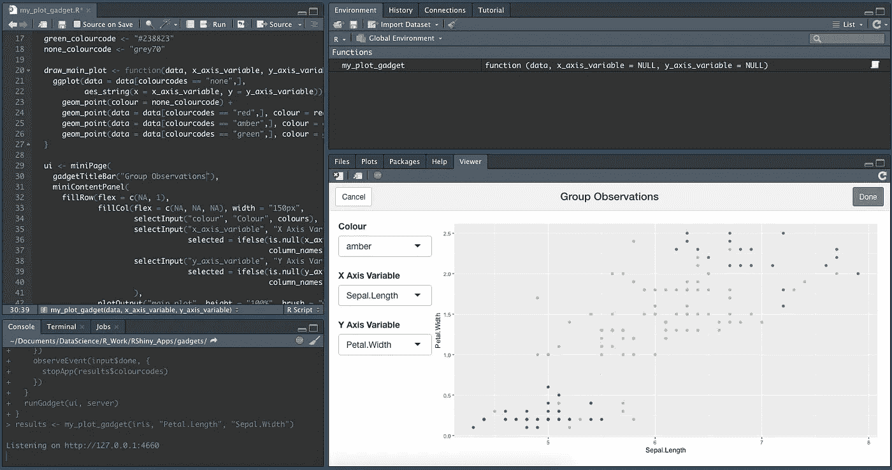

# r 闪亮的小玩意

> 原文：<https://towardsdatascience.com/r-shiny-gadgets-f9094ce21a47>

## 如何帮助您的 RStudio 使用交互式应用



作者图片

[Shiny](https://shiny.rstudio.com/) 是一个非常著名且广泛使用的 R 包，它让你可以用 R 开发交互式 web 应用，而不需要 HTML、CSS 或 JavaScript 编码。我最近自己发现，Shiny 有一个鲜为人知的功能，即所谓的闪亮小工具。这些小工具基本上是迷你应用程序，你可以直接从 RStudio 运行，例如在你的查看器面板中。

有趣的是，小玩意似乎在很大程度上被遗忘了。它们是在 5 年多前问世的，正如我们所知，这在数据科学领域是一个很大的进步。有一些 2016 年和 2017 年的教程，几个关于堆栈溢出的问题，就这些。

反正我开始在日常工作中使用一个闪亮的小玩意，我觉得值得分享。在这篇文章中，我们将学习什么是闪亮的小工具，然后仔细看看我创造的一个。如果你只是需要代码，你可以在[我的 GitHub](https://github.com/MatePocs/rshiny_apps/blob/main/gadgets/my_plot_gadget.R) 上找到。我假设读者通常熟悉闪亮的应用程序，如果你不熟悉，有大量的好教程，我不久前也写了一个一般的[闪亮教程](/how-to-build-a-data-analysis-app-in-r-shiny-143bee9338f7)。

# 什么是闪亮的小玩意？

闪亮的小工具是包装在一个函数中的迷你闪亮应用程序，可能有返回值。一旦 gadget 功能在您的环境中，您就可以像运行任何其他功能一样运行它。应用程序会弹出，你与它交互，当你关闭它时，你会得到返回值，你可以在你常规的 R 工作中使用。

小工具的构建与常规应用非常相似:它们有主要的`ui`和`server`功能，并使用相同的反应逻辑在前端和后端之间进行通信。

## 闪亮应用和小工具的区别

*   从技术上讲，小工具是一种特殊的应用程序；每个小工具都是应用，但不是每个应用都是小工具。也就是说，本文中的“应用”仅指非小工具应用。
*   小工具是编程过程的一部分，由 R 用户运行。另一方面，应用程序的主要目的是将结果或想法传达给更广泛的受众，他们不需要任何编程经验来与应用程序交互。
*   gadget 在本地 R 会话中运行，从函数调用，而应用程序部署在 web 服务器上或嵌入 R Markdown 文档中。

## 小玩意的潜在用途

你可能会说，这很好，但是实际上在哪里可以使用这样的工具呢？毕竟，如果我们内联运行它，使用代码肯定会更快？一般来说，我会说是的，在绝大多数情况下，使用代码比在 UI 中点击更快，这可能是这个工具没有更受欢迎的主要原因之一。

> 然而，有一个我认为小工具真正闪耀的利基领域(双关语):利用图来过滤你的数据。

我不认为这是巧合，[小工具教程网站](https://shiny.rstudio.com/articles/gadgets.html)上的主要例子展示了这样一个应用程序。

为了完整起见，我还发现了其他一些可能有效的潜在用途:一个用于可视化的交互式颜色选择器，一个密码处理器(你输入你的密码，这样你就不必在代码中硬编码/从文件中导入)，以及一个正则表达式测试器。也有一堆其他小工具的想法被抛出，如交互式模型生成器，但我个人并不认为这是一个非常有吸引力的解决方案。

# 我的小工具

现在让我们来看看我创建的小工具，实际上我发现它很有用。我的起点是[官方文档](https://shiny.rstudio.com/articles/gadgets.html)，它显示了一个小工具，让你从一个矩形的图表中选择点，并返回你选择的点的列表。我采纳了这个想法，并根据需要添加了一些额外的功能。

## 描述

小工具功能:

*   将一个`data.frame`作为输入
*   创建散点图
*   用户可以选择 X 和 Y 变量，图形会动态更新
*   当用户选择绘图中的一个区域时(用闪亮的术语来说:刷它)，区域中的点根据当前从下拉列表中选择的内容改变颜色，并且可以多次重复这个选择
*   一旦用户关闭应用程序，返回值是一个带有颜色代码的向量

## 我认为这个小工具有用的地方

*   标记异常值
*   将数据分成最多三组
*   检查数据点如何随着图上 X 和 Y 变量的变化而移动

## 限制

*   这个小工具只适用于足够小的数据，可以在散点图上可视化，最多几百行

# 代码

我的 [GitHub](https://github.com/MatePocs/rshiny_apps/blob/main/gadgets/my_plot_gadget.R) 上也有这个小工具，下面是全部内容:

# 如何运行小工具

要在 RStudio 中运行小工具:

*   在您的环境中导入函数
*   像这样运行函数:
    `results <- my_plot_gadget(iris, “Petal.Length”, “Sepal.Width”)`
*   在查看器面板中与应用程序互动
*   点击完成按钮
*   `results`矢量将包含你分配给不同点的颜色

# 守则的注释

以下是我在使用这个小工具时发现的一些有趣的事情。

## miniUI

正如你可能注意到的，我们装载了`miniUI`包，还有`shiny`。这个包帮助你创建一个在小屏幕空间工作的用户界面，例如，在 RStudio 的查看器面板中。详见 [UI 设计指南](https://shiny.rstudio.com/articles/gadget-ui.html)。

有趣的是，你可以在常规应用中使用`miniUI`元素，在小工具中使用常规闪亮的 UI 元素(如`fluidPage`、`sidebarLayout`等)。请注意，从查看器面板运行小工具并不是唯一的选择，您还可以做一个弹出窗口，在这里使用常规 UI 元素是完全可行的。

## 菲尔罗和菲尔科尔

除了使用像`miniContentPanel`这样的`miniUI`元素，设计指南还推荐使用大而闪亮的封装中的两个函数:`[fillRow](https://shiny.rstudio.com/reference/shiny/0.14/fillRow.html)`和`[fillCol](https://shiny.rstudio.com/reference/shiny/0.14/fillRow.html)`。做了相当多的实验才把这些做对。

以下代码:

```
fillRow(flex = c(NA, 1),…
```

意味着第一列将使用它所需要的空间，第二列将获得行中剩余的可用空间。但是，我还必须单独将第一列的宽度定义为 150 像素。您可能会认为，如果您手动定义宽度，您可以省略 flex 部分，但这不起作用。

更奇怪的是，我发现为了让右边的按钮对齐，我不得不插入以下内容:

```
fillCol(flex = c(NA, NA, NA),…
```

所以有 3 个元素，它们都应该使用尽可能多的空间。这不是默认设置，如果省略 flex 部分，按钮将分布在整个列中。

也有一些违反直觉的缺省值(至少对我来说是违反直觉的)，比如必须为绘图定义高度= 100%。

## stopApp

这个函数停止应用程序的运行，它的参数定义了整个 gadget 函数的返回值。在 RStudio 中包含关闭小工具并返回到日常工作的路线非常重要。

从技术上来说，你也可以把这个放在一个普通的闪亮的应用程序中。然而，我们倾向于将闪亮的应用程序视为网页，我们不期望它们有一个关闭一切的按钮。`[gadgetTitleBar](https://rdrr.io/cran/miniUI/man/miniTitleBar.html)`函数为你创建了两个默认按钮，`cancel`和`done`，在`observeEvent`中编辑它们的行为很重要。如果你不把这个位放在代码里:

```
observeEvent(input$cancel, {
  stopApp(NULL)
})
```

每次你点击`cancel`，你都会得到一个错误信息，这很快就变得很烦人。

## 电抗值与电抗

当我第一次使用 Shiny 时，我犯了一个错误，认为`[reactiveValues](https://shiny.rstudio.com/reference/shiny/0.11/reactiveValues.html)`只是一个`reactive`对象的列表，使用`reactiveValues`来跟踪一个对象是没有意义的。事实并非如此！

关键的区别在于您可以从多个来源改变`reactiveValues`中的对象。如果您有一个反应性元素，其行为就像一个跟踪某个状态的变量，那么使用`reactiveValues`可能是有意义的。更多详情参见本[论坛交流](https://stackoverflow.com/questions/39436713/r-shiny-reactivevalues-vs-reactive)和本[关于反应性的文档](https://shiny.rstudio.com/articles/reactivity-overview.html)。

在我的小工具中，我定义了一个跟踪颜色状态的向量，它被初始化为:

```
results <- reactiveValues(
  colourcodes = rep(“none”, nrow(data))
)
```

稍后，当`main_plot_brush`事件发生时(因此用户改变了绘图上的矩形选择)，它会相应地更新。我可以简单地在一个`observeEvent`中给`results$colourcodes`赋值。如果我定义了一个`reactive`对象并试图在其他地方更新它，同样的情况不会发生:

```
results_colourcodes <- reactive(rep(“none”, nrow(data)))
```

自然，使用一个常规的、非反应性的变量也不行，因为这样它就不能在`observeEvent`中更新。

## 清理刷子

一个有趣的用户体验决定。我最初把`resetBrush`函数放在`observeEvent`中，它监视画笔的更新。当画笔事件发生时，我更新了`results$colourcodes`状态向量，然后清除了画笔。然而，因为这都是在一个`observeEvent`中完成的，所以绘图更新直到完成后才开始，这导致了用户体验的轻微偏离:用户选择了矩形，它立即消失，然后在一个小但明显的延迟之后，绘图中的点得到了它们的颜色。

我最终创建了一个独立的`observeEvent`来监控`main_plot`的更新。这让流动感觉更加自然。

## 最后一个值

如果您忘记将函数结果分配给一个对象，您的结果将简单地打印在控制台上，就像其他函数一样。请记住，您可以使用`.Last.Value`来访问您在 R 中运行的最后一行的结果，并将其保存在一个对象中。在使用小工具的时候，我确实经历了很多。

[](https://matepocs.medium.com/membership) [## 加入我的推荐链接-伴侣概念

### 作为一个媒体会员，你的会员费的一部分会给你阅读的作家，你可以完全接触到每一个故事…

matepocs.medium.com](https://matepocs.medium.com/membership) 

# 来源

[](https://shiny.rstudio.com/articles/gadgets.html) [## 闪亮的小玩意

### Shiny 最初被认为是一种交互交流想法和结果的媒介。作为一个闪亮的作者…

shiny.rstudio.com](https://shiny.rstudio.com/articles/gadgets.html) [](https://www.rstudio.com/resources/webinars/introducing-shiny-gadgets-interactive-tools/) [## 介绍闪亮的小工具:交互式工具

### 一个闪亮的小工具是一个交互工具，可以增强你的 R 编程体验。

www.rstudio.com](https://www.rstudio.com/resources/webinars/introducing-shiny-gadgets-interactive-tools/)  [## 选择数据行

### 鼠标交互的一个常见用途是从输入数据框中选择数据行。虽然你可以写代码…

shiny.rstudio.com](https://shiny.rstudio.com/articles/selecting-rows-of-data.html)