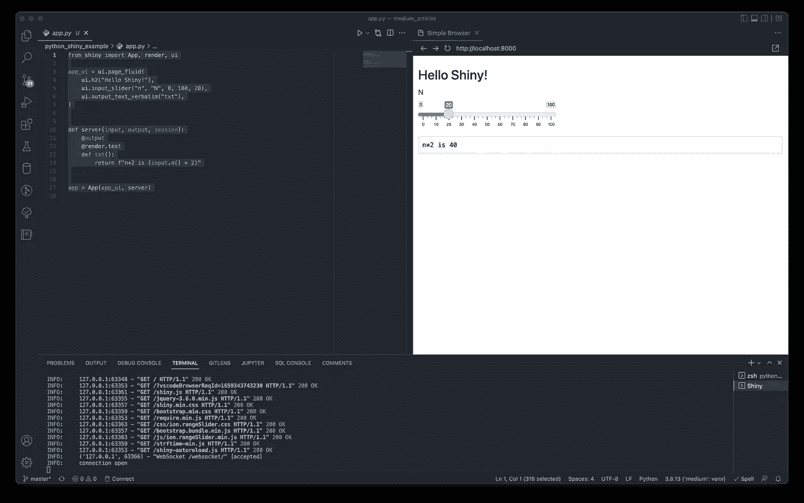
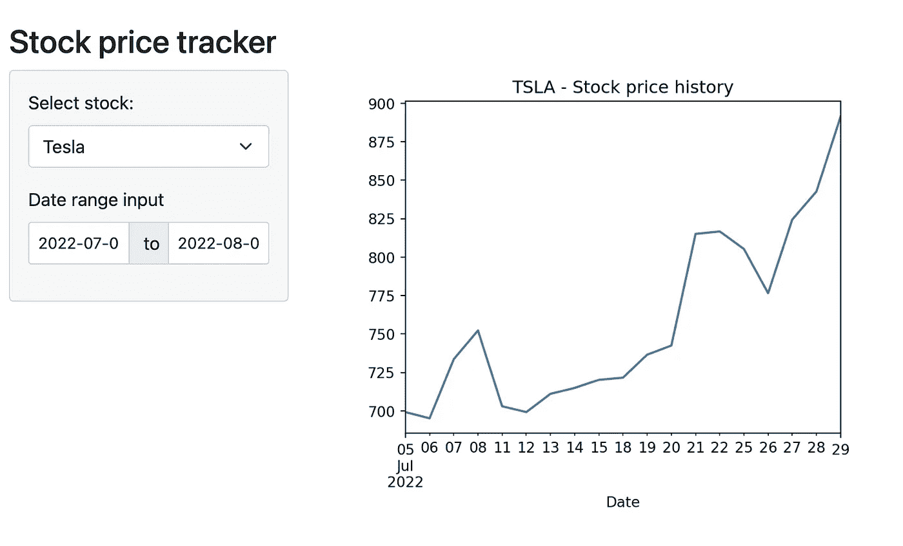

# R Shiny 要来 Python 了

> 原文：<https://towardsdatascience.com/r-shiny-is-coming-to-python-1653bbe231ac>


斯蒂芬·道森在 Unsplash[拍摄的照片](https://unsplash.com/s/photos/dashboard?utm_source=unsplash&utm_medium=referral&utm_content=creditCopyText)

## Shiny 正在加入 Streamlit 和 Dash 等网络应用工具的行列

最近，RStudio 宣布该公司将更名为 Posit(意思是:提出一个想法或理论)，以反映该公司将重点扩展到 r 以外的计划。他们的努力现在也将涵盖 Python 用户和与 Visual Studio 代码的集成。然而，R 用户放心了，公司不会从 R 转向 Python，RStudio IDE 也不会被重命名。该公司正在扩大其数据科学生态系统。

与此同时，Posit 宣布发布 Shiny for Python。我很确定 R Shiny 不需要介绍。但是万一它真的出现了，它是一个包/框架，允许数据科学家直接从 R 开始构建交互式 web 应用，而不需要任何 web 开发知识。

自 10 年前推出以来，R Shiny 在社区中被广泛采用。现在，我们也可以使用 Python 中的框架。Python 的[*Shiny*](https://shiny.rstudio.com/py/)目前处于 alpha 阶段，未来几个月可能会有很多变化。但是我们已经可以试一试，看看它是如何工作的。

在本文中，我们将看到如何用 Python 创建简单闪亮的应用程序。我们不会详细讨论 Shiny 实际上是如何工作的，因为在 Medium 上已经有很多关于这个主题的优秀教程了。让我们开始吧！

# 蟒蛇皮闪亮

和往常一样，我们需要从安装库开始。我们可以使用 pip 来实现:

```
pip install shiny
```

然后，我们需要创建一个目录，例如:

```
mkdir python_shiny_example
cd python_shiny_example
```

当我们在目录中时，我们运行以下命令:

```
shiny create .
```

它生成一个包含简单演示应用程序的样本文件`app.py`。以下代码片段包含该应用程序的代码:

要运行该应用程序，我们可以在终端中使用以下命令:

```
shiny run --reload app.py
```

幸运的是，Posit 通过提供一个 [VS 代码扩展](https://marketplace.visualstudio.com/items?itemName=rstudio.pyshiny)，使得开发闪亮的应用程序变得更加简单。通过扩展，我们可以专注于开发应用程序，而无需离开 IDE。安装后，我们可以使用*播放*(或运行)按钮在 VS 代码中运行应用程序。下图展示了在 VS 代码中执行演示应用程序时的样子。



# 创建简单的应用程序

我们已经看到了演示应用程序，现在是时候建立自己的东西。我们将构建一个非常简单的股票价格跟踪器。我选择使用股票价格作为输入数据，因为我们可以很容易地即时下载数据(你可以在这里[了解更多信息](/a-comprehensive-guide-to-downloading-stock-prices-in-python-2cd93ff821d4))。在这样做的同时，我们可以展示我们的应用程序的不同类型的输入。

以下代码片段包含我们的应用程序代码:

简单评论一下与演示应用相比，实际上发生了哪些变化。首先，我们报道美国的变化。对于这个应用程序，我们使用一个页面布局——一个带有侧边栏的面板。在侧边栏中，我们要求用户输入两条信息:

*   感兴趣的股票的股票代号—我们使用一个下拉菜单，其中有两个可能的值，
*   我们要下载价格的日期范围。

在主面板中，我们创建了一个简单的收盘价随时间变化的图表。在这一部分，我们还可以打印下载的带有原始价格数据的数据帧等。

在服务器函数中，我们定义了一个助手函数，使用侧边栏中的输入下载所需的股票价格。然后，该函数使用`pandas`数据帧的`plot`方法创建一个简单的时间序列图。

结果如下所示:



自然，我们可以用 Shiny 构建无限复杂的应用程序。然而，通过这个例子，我想展示在几分钟内从头开始构建东西是多么简单。

# 思想

我真的很想看看 Shiny for Python 的下一步发展以及它的采用。目前，Python 最流行的 web 应用框架是 Streamlit 和 Dash。Shiny 能抓住部分用户群吗？时间会证明一切。

Posit 还提供了与他们的 Connect 平台的平滑集成，这使得部署闪亮的应用程序变得容易。这可能是一个很大的好处，将天平向用户广泛采用倾斜。

就我个人而言，我对它充满热情，因为我已经花了相当多的时间在 R 中构建闪亮的应用程序。我也看到 R Shiny 被推到了极限，以构建一个成熟的数据门户，用于非技术利益相关者的各种数据相关任务。构建这样一个工具需要相当多的定制，我不认为在 Streamlit 中构建如此复杂的东西是简单/可能的。

**趣闻**:在 *Shiny for Python* 的网站的[示例部分，我们可以找到一款流行浏览器游戏 Wordle 的克隆版。推荐你](https://shinylive.io/py/examples/)[去看看](https://shinylive.io/py/examples/#wordle)，就为了看看 Shiny 能有多百搭。

# 外卖食品

*   Posit(前 RStudio)最近发布了其闪亮包的 Python 版本，
*   使用 *Shiny for Python* ，数据从业者可以在没有 web 开发知识的情况下创建复杂的交互式 web 应用，
*   我们还可以使用 Shiny 的[在线环境](https://shinylive.io/py/examples/)来尝试构建简单的应用程序，而无需在本地安装任何东西，
*   这个库目前处于 alpha 阶段，所以在我们可以用它来构建生产就绪的应用程序之前，还需要一段时间。

您可以在我的 [GitHub](https://github.com/erykml/medium_articles/tree/master/python_shiny_example) 上找到本文使用的代码。很好奇听听大家对 Python 用户扩展 Shiny 有什么想法！请在评论中或者在 [Twitter](https://twitter.com/erykml1?source=post_page---------------------------) 上让我知道。

*喜欢这篇文章？成为一个媒介成员，通过无限制的阅读继续学习。如果您使用* [*这个链接*](https://eryk-lewinson.medium.com/membership) *成为会员，您将支持我，无需您额外付费。提前感谢，再见！*

您可能还会对以下内容感兴趣:

[](/pyscript-unleash-the-power-of-python-in-your-browser-6e0123c6dc3f)  [](/three-approaches-to-feature-engineering-for-time-series-2123069567be)  [](https://medium.com/geekculture/investigating-the-effects-of-resampling-imbalanced-datasets-with-data-validation-techniques-f4ca3c8b2b94)  

# 参考

*   [https://shiny.rstudio.com/py/](https://shiny.rstudio.com/py/)
*   [https://shinylive.io/py/examples/](https://shinylive.io/py/examples/)
*   【https://github.com/rstudio/py-shiny】

所有图片，除非特别注明，均为作者所有。