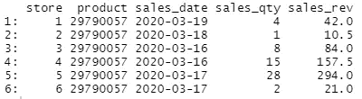
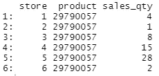
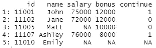

# 最常用的熊猫函数的 r 版本

> 原文：<https://towardsdatascience.com/r-versions-of-the-most-frequently-used-pandas-functions-f658cbcabaf7>

## 实用指南


[张杰](https://unsplash.com/@jay_zhang?utm_source=unsplash&utm_medium=referral&utm_content=creditCopyText)在 [Unsplash](https://unsplash.com/s/photos/computer-keyboard?utm_source=unsplash&utm_medium=referral&utm_content=creditCopyText) 上的照片

我使用熊猫已经 3 年了，最近我发表了一篇关于我使用最多的 [8 熊猫功能](https://medium.com/p/4e54f4db5656)的文章。我也经常使用 R，它是数据科学生态系统中的另一个关键角色。

r 是数据科学的主要语言之一，在数据分析、操作和建模方面非常高效。因此，我决定编写我最常用的熊猫函数的 R 版本。在某些情况下，就单个功能而言，不存在精确的匹配。

我们开始吧。

我准备了一个销售数据集样本，你可以从我的 GitHub 页面下载。我们将使用名为“sample-sales-data.csv”的文件。

## 1.从文件中读

fread 函数用于读取 csv 文件。就好比熊猫的 read_csv 功能。

```
library(data.table)sales <- fread("sample-sales-data.csv")head(sales)
```



销售(作者图片)

head 函数显示前 6 行。

就像 read_csv 函数一样，fread 函数有几个参数，我们可以使用这些参数使它更有用、功能更强。

例如，我们可以使用 select 参数选择只读取 csv 文件中的某些列。

```
sales <- fread("sample-sales-data.csv", 
                select = c("store","product","sales_qty"))head(sales)
```



销售(作者图片)

nrows 参数用于读取文件的前 n 行。熊猫的 read_csv 函数有一模一样的参数。

```
sales <- fread("sample-sales-data.csv", nrows=500)
dim(sales)**# output**
500 5--------------------------------------------------sales <- fread("sample-sales-data.csv")
dim(sales)**# output**
224229 5
```

dim 函数可用于检查表格的大小。它返回行数和列数。

## 2.普通

Pandas 具有 value_counts 函数，该函数返回一列中的唯一值以及它们出现的次数。数据表库没有针对此任务的特定功能，但是执行起来非常简单。

N 用于计数。我们可以使用它来复制 value_counts 函数，如下所示:

```
sales[, .N, store]**# output**
   store     N
1:     1 53971
2:     2 47918
3:     3 39156
4:     4 28091
5:     5 39898
6:     6 15195
```

我们所做的是按存储列对行进行分组，并计算每个不同存储值的行数，这基本上就是 value_counts 函数所做的事情。

## 3.更改数据类型

Pandas 的 astype 函数用于改变列的数据类型。我们给它一个字符串形式的新数据类型，然后它进行转换。

数据表库允许对不同的数据类型分别进行这种转换。例如，我们可以将 sales_date 列的数据类型转换为 date，如下所示:

```
sales[, sales_date := as.Date(sales_date)]
```

我们可以使用“as.double”函数将整数列转换为小数类型。

```
sales[, sales_qty := as.double(sales_qty)]
```

## 4.查找缺失值

缺失值现在是，将来也永远是数据科学家需要处理的问题的一部分。这是一个分两步走的任务。第一个是找到丢失的值，第二个是删除或替换它们。

isna 函数用于检测缺失值。这个函数的名字在熊猫中是一样的，但是我们使用它的方式是不同的。

我创建了一个非常简单的带有一些缺失值的雇员数据集。

```
employee <- fread("employee.csv")
```



客户(图片由作者提供)

它只有 5 行，因此我们可以直观地检查用“NA”表示的缺失值。然而，当我们处理大型数据集时，这种控制是不可能可视化的。我们需要一个更实际的方法。

我们能做的是计算每一列或每一行中缺失值的数量。根据缺失值的数量和数据集的特征，我们可以决定如何处理缺失值。

在用 isna 函数检测到丢失的值之后，colSums 和 rowSums 函数帮助我们对它们进行计数。

```
colSums(is.na(employee)) # number of missing values in each column**# output**
id     name   salary    bonus continue 
 0        0        2        1        1----------------------------------------------rowSums(is.na(employee)) # number of missing values in each row**# output**
[1] 0 0 1 0 3
```

## 5.删除丢失的值

一旦我们找到丢失的值，我们需要决定如何处理它们。一种方法是丢弃丢失的值。

在数据表中,“complete.cases”函数允许删除缺少值的行。

```
employee[complete.cases(employee)]**# output**
      id   name salary bonus continue
1: 11001   John  75000 12000        1
2: 11102   Jane  72000 12000        0
3: 11107 Ashley  76000  8000        1
```

如果我们想要删除在特定列或一组列中缺少值的行，我们只需要指定列名。例如，我们可以删除 bonus 列中缺少值的行，如下所示:

```
employee[complete.cases(employee[, c("bonus")])]**# output**
      id   name salary bonus continue
1: 11001   John  75000 12000        1
2: 11102   Jane  72000 12000        0
3: 11005   Matt     NA 10000        0
4: 11107 Ashley  76000  8000        1
```

我们还可以为缺失值的数量设置一个阈值。例如，我们可能希望删除至少有 3 个缺失值的行。

```
employee[!rowSums(is.na(employee))>=3]**# output**
      id   name salary bonus continue
1: 11001   John  75000 12000        1
2: 11102   Jane  72000 12000        0
3: 11005   Matt     NA 10000        0
4: 11107 Ashley  76000  8000        1
```

“rowSums(is.na(employee))”部分计算每行中缺失值的数量。“！”符号意味着我们希望保留不满足给定条件的行。因此，我们不会保留(即删除)有 3 个或更多缺失值的行。

## 6.替换丢失的值

删除并不总是处理缺失值的最佳选择。考虑这样一种情况，我们有几列，其中只有一列缺少一些值。在这种情况下，我们不是删除一行，而是用适当的值替换缺失的值。

假设我们想用 5000 替换 bonus 列中缺少的值。我们是这样做的:

```
employee[is.na(bonus), bonus := 5000]
```

逗号之前的部分过滤 bonus 列中缺少值的行。逗号后面的部分将该值更新为 5000。

在某些情况下，最好的方法是用上一个或下一个值替换丢失的值。当我们有顺序数据时，它特别有用。我们可以通过使用 nafill 函数来实现。

下面的代码片段显示了如何用上一个和下一个值填充 salary 列中缺少的值。

```
# fill with previous value
employee[, salary := nafill(salary, "locf")]--------------------------------------------
# fill with next value
employee[, salary := nafill(salary, "nocb")]
```

## 7.分组依据

Pandas 中的 groupby 函数对于数据分析来说非常方便。它允许根据列中的不同值对行进行分组。然后，我们可以为每个组计算一个大范围的聚合。

数据表库没有 groupby 这样的特定功能，但它为执行此类任务提供了简单而直观的语法。

例如，在我们的销售数据集中，我们可以计算每个商店的总销售量，如下所示:

```
sales[, .(total_sales = sum(sales_qty)), by=store]**# output**
   store total_sales
1:     1      140436
2:     2       89710
3:     3       71309
4:     4       45068
5:     5       69614
6:     6       23598
```

by 参数用于选择用于分组的列。数据表库可以用逗号分隔不同类型的操作。例如，如果我们需要传递一个条件来过滤行，我们把它放在方括号内的第一个逗号之前。

我们还可以在一个操作中执行多个聚合:

```
sales[, .(total_sales = sum(sales_qty),
          avg_revenue = mean(sales_rev)),
      by=store]**# output**
   store total_sales avg_revenue
1:     1      140436    60.46818
2:     2       89710    34.31836
3:     3       71309    35.00804
4:     4       45068    26.56241
5:     5       69614    31.97003
6:     6       23598    27.22416
```

## 8.独一无二的

这两个功能非常相似，所以我想一起解释一下。

*   unique 返回不同的值
*   uniqueN 返回不同值的数量

```
unique(sales$store)**# output**
[1] 1 2 3 4 5 6-------------------
uniqueN(sales$store)**# output**
6
```

就像熊猫一样，数据表库有更多的功能来简化和加快数据科学家和分析师的工作。在本文中，我们已经介绍了最常用的 Pandas 函数的数据表版本。

*你可以成为* [*媒介会员*](https://sonery.medium.com/membership) *解锁我的全部写作权限，外加其余媒介。如果你已经是了，别忘了订阅**如果你想在我发表新文章时收到电子邮件。***

*[](https://sonery.medium.com/membership) [## 通过我的推荐链接加入 Medium-Soner yl DRM

### 作为一个媒体会员，你的会员费的一部分会给你阅读的作家，你可以完全接触到每一个故事…

sonery.medium.com](https://sonery.medium.com/membership) 

感谢您的阅读。如果您有任何反馈，请告诉我。*