# 彩虹 DQN——最好的强化学习能提供什么？

> 原文：<https://towardsdatascience.com/rainbow-dqn-the-best-reinforcement-learning-has-to-offer-166cb8ed2f86>

## 如果深度 Q 学习中最成功的技术被组合到一个算法中，会发生什么？

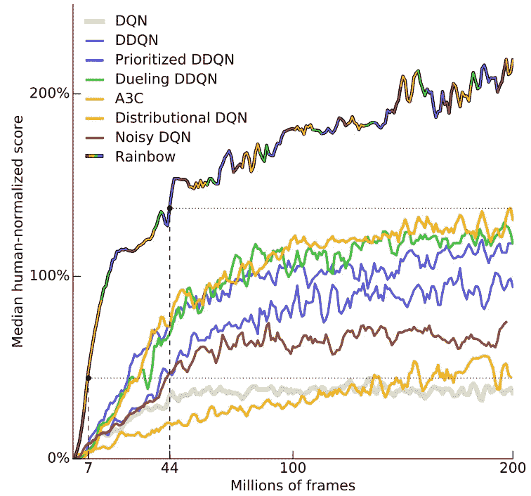

彩虹 DQN 性能与其他 DQN 技术相比。这些结果好到不真实吗？【来源: [DeepMind 论文](https://arxiv.org/pdf/1710.02298.pdf)

自经典的[表格 Q 学习](https://medium.com/towards-data-science/walking-off-the-cliff-with-off-policy-reinforcement-learning-7fdbcdfe31ff)时代以来，强化学习已经走过了漫长的道路。**深度 Q 学习网络(DQN)** 推动了该领域的一场革命，实现了对状态的强大概括。

通过用强大的神经网络(理论上能够将任何输入状态转换为每个动作的输出值)取代 Q 表(存储所有状态-动作对的值)，我们可以**处理大规模状态空间的问题**，这标志着该领域的突破。

然而，使用神经网络也带来了无数的问题。作为回应，大量的技术被用来提高 DQN 算法的性能。常见的技术包括[重放缓冲区、目标网络和熵奖励](/how-to-model-experience-replay-batch-learning-and-target-networks-c1350db93172)。通常，结合这些技术可以确保显著的性能改进。

> 如果一种技术可以如此显著地提高性能，为什么不使用所有的技术呢？

这正是 DeepMind 团队(他们 2017 年的论文有 10 位作者，所以我就称之为“团队”)肯定想知道的。如果你将所有这些单独的技术结合成一个单一的算法，你会得到一个梦之队还是科学怪人？

# 彩虹 DQN 中使用的技术

我们将暂时搁置性能问题，首先深入研究在彩虹 DQN 中部署和组合的六种技术。

[Harry Quan](https://unsplash.com/@mango_quan?utm_source=medium&utm_medium=referral) 在 [Unsplash](https://unsplash.com?utm_source=medium&utm_medium=referral) 上的照片

## 一.双 Q 学习

Q-learning 以最大化状态-动作对的方式选择动作。然而，这带来了一个根本性的缺陷。因为 Q 值仅仅是近似值，所以该算法倾向于 Q 值被夸大的动作。这意味着我们系统地高估了 Q 值！自然，当试图找到最佳决策政策时，这种偏见没有帮助。更糟糕的是，Q-learning 是一种自举方法，即使在多次迭代后，高估效应可能仍然存在。

双 Q-learning 通过部署一个网络来选择动作，另一个网络来更新值，从而克服了这一缺陷。因此，即使我们使用一个膨胀的 Q 值来选择动作，我们也用一个(可能)不膨胀的 Q 值来更新。每次，我们随机选择一个网络进行操作选择，另一个网络进行更新。因此，我们将选择机制与评估机制分离开来。网络 A 的更新过程如下所示(显然，网络 B 的部署正好相反):

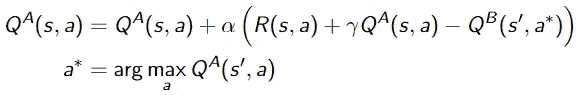

深度 Q 学习的更新机制。用一个网络选择最佳已知动作，用另一个网络确定其 Q 值。

从经验上看，双 Q 架构成功地减少了偏差，并导致更好的决策政策。

## 二。优先体验重放

收集观察数据通常成本很高。q-learning——作为一种非策略方法——允许将观察结果存储在重放缓冲区中，随后我们可以从该缓冲区中**采样经验来更新我们的策略**。此外，它打破了状态之间的相关性——由于后续状态通常表现出很强的相关性，神经网络往往会局部过度拟合。

然而，并不是每一次过去的经历都同样值得重温。为了最大化学习，我们可能希望对过去产生**高(绝对)值函数误差**的元组进行采样，我们希望再次评估这些经验并减少误差。

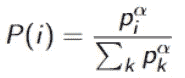

优先级采样方案，其中 p_i 表示体验的优先级(例如，其等级或绝对 TD 误差+一些噪声),指数α确定优先化的强度。

简单地选择误差最大的经验会引入抽样偏差。为了补救这一点，使用一种形式的**加权重要性采样**来执行权重更新:

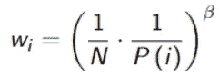

加权重要性抽样方案，其中 N 是批量，β是比例参数。

优先体验重放被证明始终优于统一重放抽样。

## 三。决斗网络

深度 Q 网络通常返回 Q 值 *Q(s，a)* ，作为对应于给定状态-动作对 *(s，a)* 的值函数的近似。在最初的贝尔曼方程中，这非常有意义，因为计算最优价值函数会产生最优策略。在 Q-learning 中，状态值和动作值的**串联可能是有问题的**，因为可能很难区分一个值是主要源于状态、动作还是两者。

Q 值可以分解如下: *Q(s，a)=V(s)+A(s，a)* 。假设我们在最佳已知策略下操作(即，该策略根据其估计返回最佳行动)，则**预期优势为 0** ，Q 值等于状态值。

特别是，对于一些州来说，动作选择并不那么重要，例如，考虑一辆无人驾驶汽车处于无障碍状态，优势值可以忽略不计。或者，再举一个例子，一个**状态可能是差的，不管我们在其中采取什么动作**。对于这样的状态，我们不希望通过探索所有的动作来浪费计算的努力。

决斗架构允许更**快速地确定好的动作**，因为差的动作可以更容易地被丢弃，可比较的动作可以更快地被识别。通过将优势价值从状态价值中分离出来，我们获得了关于行动价值的更细粒度的视角。

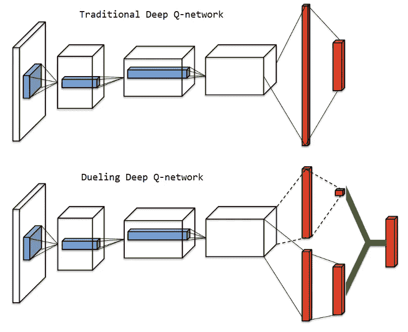

传统深度 Q 网络(上)和决斗深度 Q 网络(下)架构之间的比较。后者有单独的流来输出状态值和优势值，相加后返回 Q 值。[图改编自[王等，2016](https://arxiv.org/pdf/1511.06581v3.pdf) ]

该网络具有由 *θ* 参数化的层的联合集合、由 *α* 参数化的流以确定优势函数，以及由 *β* 参数化的流以确定价值函数。**两个流相加，返回 Q 值**。

为了确保价值函数和优势函数确实依赖于**单独参数化的流**，从所选动作的优势中减去所有动作的平均优势:

在决斗网络中，一个流(由β参数化)返回状态相关值函数，另一个流(由α参数化)返回优势函数。

实验结果表明，所提出的体系结构可以快速识别好的动作，因为识别动作值已经成为学习问题的显式部分。

## 四。多步学习

一项行动的影响并不总是直接可见的。许多个人行为甚至可能不会立即产生回报。例如，赛车比赛中的一个糟糕的转弯可能会导致稍后失去杆位。典型的 Q-learning 更新——或者更一般地说，TD(0)更新——只考虑直接跟随行动的回报，引导决策的下游值。

另一方面，蒙特卡罗/ TD(1)学习在更新 Q 值之前首先观察所有回报，但这通常导致高方差和慢收敛。多步学习—也称为*n*—Q 学习— **在偏差和方差**之间取得平衡，在执行更新之前观察多个时间步。例如，如果 *n=3* ，更新将是三个观察到的奖励和剩余时间范围的自举价值函数的组合。

在一般形式下，多步奖励可计算如下:

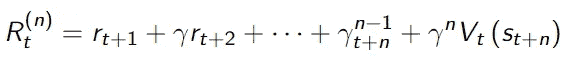

在多步学习中，我们跟踪 n 个时间步的回报，并使用一个 Q 值来估计之后的效果。这种方法经常在时间差异和蒙特卡罗学习之间找到平衡。

相应的更新方案定义如下:

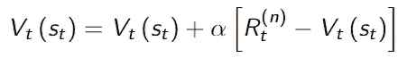

多步 Q 学习的权重更新方案。

对于许多问题设置，多步学习比 TD(0)和 TD(1)学习产生了实质性的改进，**减轻了偏差和方差影响，并承认了决策的延迟影响**。主要的挑战是针对手头的问题适当地调整 *n* 。

## 动词 （verb 的缩写）分布式强化学习

大多数强化学习算法使用预期的返回值。相反，我们可以尝试学习收益的**分布**(Q 值代表期望值)。虽然传统上主要用于获得洞察力(例如，回报的风险)，但这种学习方式似乎实际上也能提高绩效。

学习*分布*而不是*期望值*的主要用例是在随机环境中的应用。即使奖励是嘈杂的，并不直接有助于收敛期望值，我们仍然可以利用它们来更好地把握**潜在的奖励产生分布**。

鉴于典型的 Q 值由 *Q(s，a)=r(s，a)+γQ(s’，a’)*定义，分布变量定义如下:

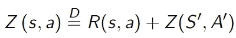

奖励分配的定义，取代 Q 值。在分布 RL 中，我们的目标是学习整个分布，其期望值等于 Q 值。

这里， *Z* 表示收益的分布，而不是预期(Q-)值。另外， *R* 、*S’*和*A’*都是随机变量。

我们的目标不是减少 TD 误差，而是**最小化目标分布的采样** [**Kullback-Leibner 散度**](https://medium.com/towards-data-science/natural-policy-gradients-in-reinforcement-learning-explained-2265864cf43c) 。我们最大限度减少的损失如下:

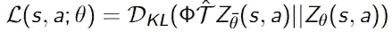

分布 RL 的损失函数。我们构建了一个样本奖励分布，我们用它来更新预测的奖励分布。

这里，𝒯是收缩映射，*φ*是分布投影， *bar θ* 是表示目标网络的冻结参数副本。恐怕你真的需要整篇论文才能理解它。

也许更直观的是:网络输出一个离散化的概率质量函数，其中**每个输出(‘atom’)代表一个小回报区间**的概率。随着每次更新，我们试图使预测的奖励分布更接近观察到的。

分布式 RL 产生了很好的结果，尤其是在奖励稀少且嘈杂的问题环境中。

## 不及物动词嘈杂的勘探层

传统的 q 学习使用ε-贪婪学习，随机选择具有概率ϵ(通常为 0.05 或 0.10)的动作，而不是具有预期最大值的动作。这种机制允许通过确保探索来避免局部最优。熵奖励是另一种奖励偏离行为的常用技术。

在嘈杂的环境中，我们可能需要更多的探索。我们可以通过向我们的神经网络添加噪声探索层来实现这一点。我们用由确定性流和噪声流组成的**层替换标准线性层——以规范形式定义为 *y=Wx* ，其中 *x* 是输入， *W* 是权重集，而 *y* 是输出:**

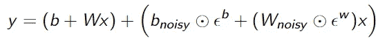

神经网络中的噪声线性层。输出 y 取决于确定性流和噪声流。对应于两个流的权重随时间更新。

正如您所想象的，图层变换产生的噪声会影响最终的 Q 值，网络产生的最高 Q 值可能会有所不同，从而推动探索行为。随着时间的推移，算法可以**学会忽略噪声流**，因为*b _ noise*和*W _ noise*是可学习的参数。然而，信号和噪声之间的比率可以根据状态而变化，从而鼓励在必要时进行探索，并在适当时收敛到确定性动作。

噪声神经网络似乎是比例如ε贪婪或熵奖励更健壮的探索机制。与这里提到的其他技术一样，经验表明它可以提高许多基准问题的性能。

# 那么…有用吗？

DeepMind 团队将他们的彩虹算法(结合了上述六种技术)与 DQN 算法进行了测试，每次只使用一种技术。下图代表了 57 款 Atari 游戏的平均性能，100%表示人类水平的性能。

经验表现，平均超过 57 雅达利游戏。彩虹 DQN 在学习速度和最终表现方面都远远超过了单个 DQN 技术[来源: [DeepMind 论文](https://arxiv.org/pdf/1710.02298.pdf)

如图所示， **Rainbow DQN 明显优于所有使用单一组件 DQN 的基准测试**。同样有趣的是，它获得良好的性能比其他的要快得多。在大约 15m 帧后，它可以媲美类似人类的性能；有四个基准根本没有达到那个点。在 44/200 米帧之后，彩虹 DQN 已经处于持续超越所有竞争对手的水平，无论运行时间如何。在 2 亿帧之后，它是这场拍卖中无可争议的赢家。

DeepMind 团队还通过省略彩虹中的个别技术，检查了所有组件是否都是必要的。**有些技术比其他技术贡献更大**，但是——稍微简化一下论文的结论——每种技术都在性能方面给算法增加了一些东西。见下面的对比。

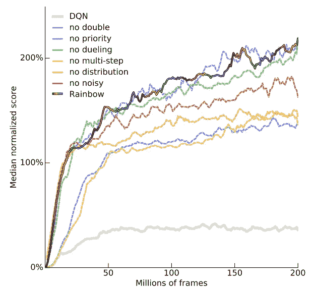

虽然不是每种技术都对彩虹 DQN 的性能有同等的贡献，但实验结果表明，每种技术都增加了价值【来源: [DeepMind 论文](https://arxiv.org/pdf/1710.02298.pdf)

总的来说，实验结果看起来绝对令人震惊，那么我们为什么不一直使用彩虹 DQN 呢？

# 弊端？

首先，由于部署了如此多的精细技术，**彩虹 DQN 速度很慢**。每种技术都需要一系列额外的计算，这些自然会累积起来。对于每一帧，该算法可以学习很多，但是处理一帧的时间要长得多。因此，与其他算法进行基于时间的比较不太有利。

彩虹 DQN 的第二个缺点是大量的调谐。多步骤过程中要采取的步骤数量、噪声层中的噪声量、目标网络的更新频率——一切都必须进行适当的调整。知道网格搜索爆炸的速度有多快，**在这样一个高度参数化的算法**中进行调整并不容易，尤其是考虑到算法的低速度。

最后，部分由于前面的几点，彩虹 DQN 可能不稳定并且**难以调试**。一项技术中的一个编码错误就可能毁掉整个算法——祝你好运找到错误。行为不符合预期？它可以是任何东西，甚至是各种技术之间的某种特殊的相互作用。

考虑到算法的困难，彩虹 DQN 目前**还没有包含在流行的 RL 库中**，因此不能轻易的使用。从某种意义上说，彩虹确实是 RL 技术的梦之队，但似乎胜利并不是一切。

# 结束语

正如我们所见， **Rainbow DQN 公司报告了其基准测试的令人印象深刻的结果**。然而，应该注意的是，原始论文仅将其与其他 DQN 技术进行比较。特别是，整个基于政策的[类](https://medium.com/towards-data-science/the-four-policy-classes-of-reinforcement-learning-38185daa6c8a)方法——包括流行的算法如 [TRPO](https://medium.com/towards-data-science/trust-region-policy-optimization-trpo-explained-4b56bd206fc2) 和[PPO](/proximal-policy-optimization-ppo-explained-abed1952457b)——都被排除在比较之外。

在 OpenAI 的一项研究中(虽然不是针对相同的问题)，性能与 PPO 进行了比较，PPO 是当前连续控制中的 go-to 算法。通过标准实现，彩虹 DQN 轻而易举地击败了 PPO。然而，当部署联合训练机制时——本质上是转移学习，同时保持算法本身相同——**联合 PPO 以微弱优势击败联合彩虹 DQN** 。鉴于 PPO 比彩虹 DQN 更简单快捷，它更受欢迎也就不足为奇了。

最终，性能非常重要，但它不是 RL 算法的唯一相关方面。我们应该能够使用它，修改它，调试它，最重要的是，理解它。彩虹 DQN 证明了该领域的进步可以相互加强，该算法产生了**最先进的结果**，但最终没有说服人类用户全心全意地接受它。

照片由 [Paola Franco](https://unsplash.com/@peeeola?utm_source=medium&utm_medium=referral) 在 [Unsplash](https://unsplash.com?utm_source=medium&utm_medium=referral) 上拍摄

想更多地了解 DQN 吗？查看以下文章:

</deep-q-learning-for-the-cliff-walking-problem-b54835409046>  </how-to-model-experience-replay-batch-learning-and-target-networks-c1350db93172>  </a-minimal-working-example-for-deep-q-learning-in-tensorflow-2-0-e0ca8a944d5e>  

# 参考

## 彩虹 DQN

**彩虹 DQN 论文:** Hessel，m .，Modayil，j .，Van Hasselt，h .，Schaul，t .，Ostrovski，g .，Dabney，w .，… & Silver，D. (2018，4 月)。[彩虹:结合深度强化学习的改进。](https://arxiv.org/pdf/1710.02298.pdf)在*第三十二届 AAAI 人工智能大会*。

**比较彩虹 DQN 和 PPO:** 尼科尔，a .，普法乌，v .，黑塞，c .，克里莫夫，o .，&舒尔曼，J. (2018)。[快速学习:学习力泛化的新基准。](https://s3-us-west-2.amazonaws.com/openai-assets/research-covers/retro-contest/gotta_learn_fast_report.pdf) *arXiv 预印本 arXiv:1804.03720* 。

## DQN 技术

**一、双 Q 学习:** Hasselt，H. (2010)。[双 Q-学习。](https://proceedings.neurips.cc/paper/2010/file/091d584fced301b442654dd8c23b3fc9-Paper.pdf) *神经信息处理系统的进展*、 *23* 。

**二。优先经验回放:** Schaul，t .、Quan，j .、Antonoglou，I .、& Silver，D. (2015)。[优先体验回放。](https://arxiv.org/pdf/1511.05952v4.pdf)arXiv 预印本 arXiv:1511.05952 。

**三。决斗网络:**王，z .，绍尔，t .，赫塞尔，m .，哈瑟尔特，h .，兰托特，m .，&弗雷塔斯，N. (2016，6 月)。[深度强化学习的决斗网络架构](https://arxiv.org/pdf/1511.06581v3.pdf)。在*机器学习国际会议*(第 1995–2003 页)。PMLR。

**四。多步学习:**萨顿，R. S .，&巴尔托，A. G. (2018)。 [*强化学习:入门*](http://www.incompleteideas.net/book/RLbook2020.pdf)*(7.1 节，n 步 TD 预测)*。麻省理工出版社。

**五、分布式学习:**贝勒马尔，M. G .，达布尼，w .，&穆诺斯，R. (2017，7 月)。[强化学习的分布式视角。](https://arxiv.org/pdf/1710.02298.pdf)在*机器学习国际会议上*(第 449–458 页)。PMLR。

六。嘈杂网络: Fortunato，m .，Azar，M. G .，Piot，b .，Menick，j .，Osband，I .，Graves，a .，… & Legg，S. (2017)。[探索嘈杂的网络。](https://arxiv.org/pdf/1706.10295.pdf?source=post_page---------------------------) *arXiv 预印本 arXiv:1706.10295* 。