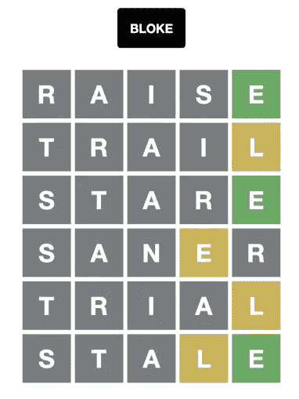
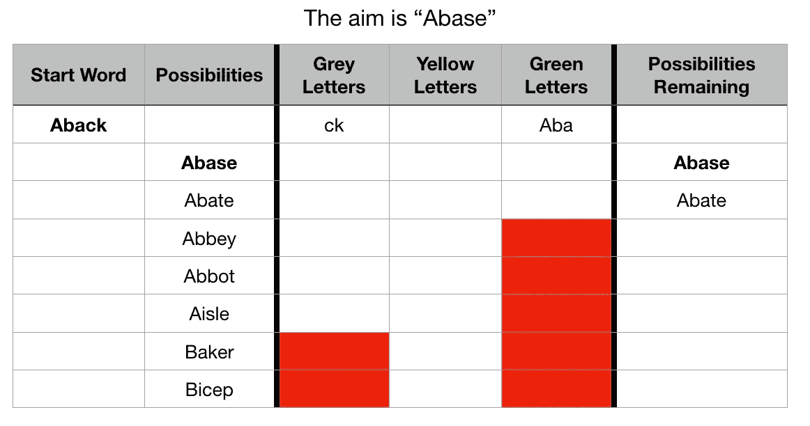
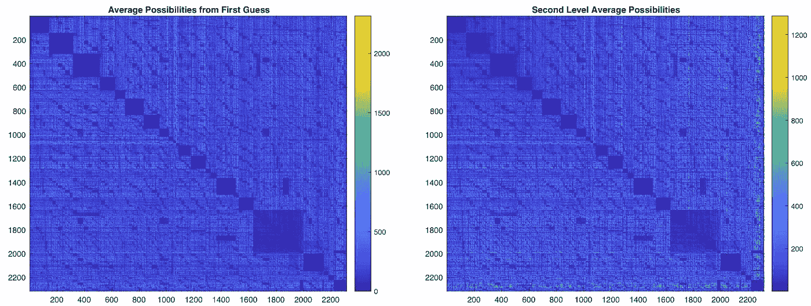
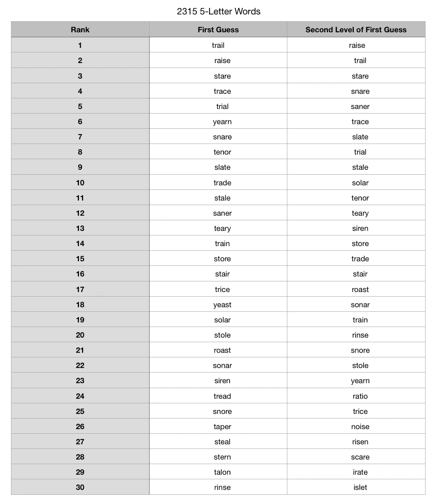
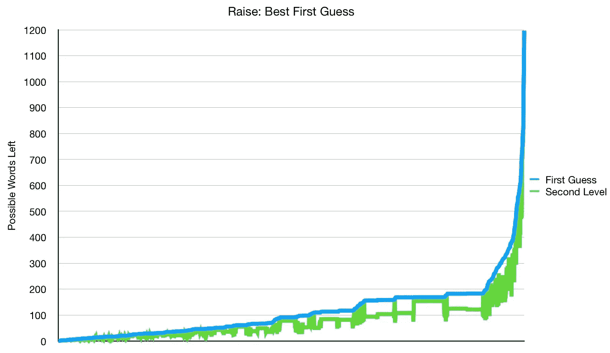
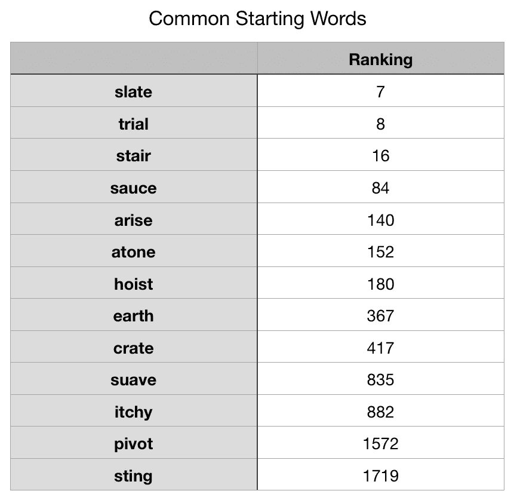

# “提高”是沃尔多最好的开始词

> 原文：<https://towardsdatascience.com/raise-is-the-best-starting-word-for-wordle-e8f24c786427>

## 单词数据科学

## 基于解决方案的最短路径

我不经常玩 Wordle，但我对获得正确答案的科学背后很感兴趣。猜六次，看起来你应该能到达那里，但是要多快呢？我见过一些人根据单词和其他单词有多少相同的字母来分析单词，以找到最好的一个。我认为这些方法没有理解游戏规则。

所以我看着这个词，尽量减少使用规则找到答案的路径。

所有图片由作者提供

# 沃尔多规则

1.  这个单词必须是五个字母，并且来自一个列表。这个列表大约有 2315 个单词。
2.  你的猜测必须来自那个列表，所以你不能随意猜测。
3.  你有六次猜测的机会。

每次猜中后，字母都用**颜色编码**:

1.  **灰色**:不在答案里
2.  **黄色**:在回答但不正确的位置
3.  **绿色**:正确的位置和字母

每个猜测消除单词:

1.  灰色:任何包含灰色字母的单词都被剔除
2.  **黄色**:没有黄色字母的单词不存在
3.  **绿色**:任何没有那个位置包含那个字母的单词都不存在

# 算法

我列出了每个单词，并假设它是所有其他单词的第一个猜测。然后我问“你的第二次猜测还剩下多少个单词的可能性？”

作为一个例子，我看了一个更短的列表，开始的单词是“back”这种情况下的答案是“abase”，使用三个标准，我可以出于各种原因抛出单词来减少列表。事实上，从 back 开始，整个列表只剩下两个选择来降低或减弱。

然后我做了同样的过程，将每个单词作为起始单词，与每个单词作为答案进行比较。因此，对于 2315 个起始单词，我重复了这个过程，每个单词有 2315 个解(2315 x 2315)。

一次迭代后，我到了第二关。假设你用了这个词，然后用了下一个词可能性，有多少种可能的第三种猜测？这两者都为下面表示的所有起始单词产生了所有的可能性。深蓝色意味着较少可能的第二个答案，而亮色意味着较多可能的第二个答案。

我对各列进行了求和，以便能够按照导致最少可能的第二次和第三次猜测的单词对单词进行排序。

第一猜和第二关之间没什么太大动静，就没再深究。单词“加注”是最好的第一个猜测，因为平均来说，第二个和第三个猜测的可能性最小。

我们甚至可以查看所有答案的可能性数量，大多数情况下，从“提高”开始会将搜索空间缩小到原始列表的 10%(小于 200 个可能的答案)。

我看了几个对其他人来说很常见的起始词，看看他们是如何基于最小化通往答案的路径这一目标进行排名的。有几个词不在这个单词列表中，比如 cones 和 adieu，但以下是这些词的排名:

我想知道人们什么时候会开始结合使用单词列表和以前使用的单词答案的查找。我也想知道一个单词格式的基于句子或短语的游戏会有多有趣。我猜沃尔多是五个字母的幸运之轮。

如果你愿意，可以在推特、 [YouTube](https://m.youtube.com/channel/UClgcmAtBMTmVVGANjtntXTw?source=post_page---------------------------) 和 [Instagram](https://www.instagram.com/espressofun/) 上关注我，我会在那里发布不同机器上的浓缩咖啡照片和浓缩咖啡相关的视频。你也可以在 [LinkedIn](https://www.linkedin.com/in/dr-robert-mckeon-aloe-01581595) 上找到我。也可以关注我在[中](https://towardsdatascience.com/@rmckeon/follow)和[订阅](https://rmckeon.medium.com/subscribe)。

# [我的进一步阅读](https://rmckeon.medium.com/story-collection-splash-page-e15025710347):

[浓缩咖啡系列文章](https://rmckeon.medium.com/a-collection-of-espresso-articles-de8a3abf9917?postPublishedType=repub)

[工作和学校故事集](https://rmckeon.medium.com/a-collection-of-work-and-school-stories-6b7ca5a58318?source=your_stories_page-------------------------------------)

[个人故事和关注点](https://rmckeon.medium.com/personal-stories-and-concerns-51bd8b3e63e6?source=your_stories_page-------------------------------------)