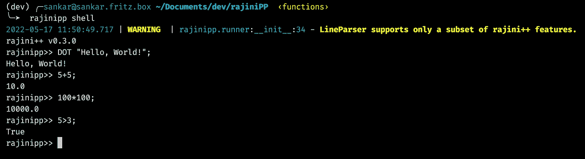

# rajini++超级编程语言

> 原文：<https://towardsdatascience.com/rajini-the-superstar-programming-language-db5187f2cc71>


介绍超级编程语言 rajini++！([来源](https://github.com/aadhithya/rajiniPP))

介绍 rajini++这是一种深奥的编程语言，基于超级巨星拉吉尼坎塔的对话。rajini++中使用的语法和关键字是基于超级巨星拉吉尼坎塔的对话。

rajini++中的 hello world 程序

# 谁是拉吉尼坎塔？

在我们开始之前，你可能想知道谁是超级巨星拉吉尼坎塔。嗯，首先，他是印度最大和最受欢迎的演员之一，在电影界已经超过 45 年了！要了解有关图例的更多信息，请点击以下链接:

*   [拉吉尼坎塔](https://www.youtube.com/watch?v=YDUQZwMHMoo)是谁？
*   [https://en.wikipedia.org/wiki/Rajinikanth](https://en.wikipedia.org/wiki/Rajinikanth)

# rajini++的起源

嗯，rajini++的起源要追溯到大约 6 年前，当时我第一次遇到这个叫做 ArnoldC 的 [esolang](https://en.wikipedia.org/wiki/Esoteric_programming_language) 。从那一刻起，我就想为这位超级巨星创造一个这样的 esolang。经过 6 年的学习，我们终于有了一个可用的 rajini++语言版本。

# 获取 rajini++文件

`rajinipp`包解释并执行 rajini++程序。它完全是用 python 编写的，可以使用 pip 和以下命令轻松安装:

*   `pip install rajinipp`

**注意:**rajinipp 解释器要求 python ≥ 3.8。你可以在这里获得 python [。安装 rajinipp 包也需要 pip。你可以在这里得到 pip](https://www.python.org/downloads/)。

*   测试 rajinipp 安装:`rajinipp version`

# rajini++语言

rajini++基于拉吉尼坎塔最经典的对话。rajini++中使用的语法和关键字是基于超级巨星拉吉尼坎塔的对话。

rajini++的特性相当丰富，支持以下特性:

*   数学运算(SUM，SUB，MUL，DIV，MOD)
*   一元运算(SUM，SUB)
*   印刷
*   变量声明
*   可变访问
*   变量操作和赋值
*   数据类型(布尔值、字符串、数字)
*   逻辑运算(≥，>，≤,
*   If statement
*   If-Else statement
*   For loop
*   While loop
*   Functions
*   Functions with return

# Example Programs

1.  **If-Else 程序**

示例 1: If-Else 程序

输出:

```
Example: If-Else Statement
x ( 5.0 ) is less than 10!
```

**2。FizzBuzz 程序**

示例 2: FizzBuzz 程序

输出:

```
1.0
2.0
Fizz
4.0
Buzz
Fizz
7.0
8.0
Fizz
Buzz
11.0
Fizz
13.0
14.0
FizzBuzz
```

**3。返回的函数**

示例 3:带有 return 语句的函数。

输出:

```
Hi from main!
Hello from myfunc_one!
returning ix = 100.0 to main
Value returned from myfunc_one: 100.0
```

# 运行 rajini++程序

rajini++程序存储在`.rpp`文件中。要运行 rajini++程序，只需运行以下命令:

`rajinipp run path/to/my_program.rpp`

**注意:**注意在 windows 中路径使用反斜杠！

# `rajinipp`互动外壳

除了能够运行 rajinip ++程序，rajinipp python 包还提供了一个交互式 shell( *experimental* )来测试 rajini++命令。可以使用以下命令进入 rajinipp shell:

`rajinipp shell`



拉吉尼普贝壳。

使用`ctrl+D`退出外壳。

**注意:**目前阶段的 rajinipp shell 仅支持 rajini++语言的有限功能子集。不支持控制语句(循环，if-else)和函数。

# **在 python 脚本中嵌入 rajini++代码**

因为 rajinipp 解释器完全是用 python 写的，所以可以在 python 脚本内部运行 rajini++代码(*实验*)！

示例 4:在 python 脚本中运行 rajini++代码！

输出:

```
Hello, World from python!
Hello world from rajini++!
Executing 5+5 in rajini++
5 + 5 = 10.0
```

**注意:**`rajinipp.runner.RppRunner.eval()`方法在当前阶段只支持 rajini++语言的有限的一部分特性。不支持控制语句(循环，if-else)和函数。

# 了解更多关于 rajini++的信息

*   **学习 rajini++语言:**带有语法和示例的 rajini++语言文档可以在 [rajiniPP Wiki](https://github.com/aadhithya/rajiniPP/wiki/) 找到。
*   **示例程序**可以在这里找到:[示例程序](https://github.com/aadhithya/rajiniPP/tree/master/examples)。
*   **rajini ++语言规范:**rajini ++命令及其在 python3 中的等价物可以在这里找到[。语言规范还没有完成，是一项正在进行的工作。](https://github.com/aadhithya/rajiniPP/wiki/1.-rajiniPP:-Language-Specification)
*   **rajinipp 解释器文档:**rajinipp 解释器的文档可以在[这里](https://github.com/aadhithya/rajiniPP/wiki/2.-rajinipp:-The-interpreter)找到。

**注意:**随着新特性不断添加到 rajinipp 存储库中，语言语法和文档也会发生变化。请参考[官方维基](https://github.com/aadhithya/rajiniPP/wiki/)了解最新变化。

# 审核代码，贡献给 rajini++吧

如果该项目引起了您的兴趣，并且如果您想对 github repo 的项目负责人进行审计或做出贡献，请:

[](https://github.com/aadhithya/rajiniPP) [## GitHub - aadhithya/rajiniPP:基于拉吉尼坎塔标志性对话的编程语言。🤘🏽

### rajinip ++是一种向独一无二的超级巨星致敬的编程语言，基于标志性的…

github.com](https://github.com/aadhithya/rajiniPP) 

# PyPI 上的 rajinipp

rajinipp 在 PyPI 上，可以在这里找到:

[](https://pypi.org/project/rajinipp/) [## 拉吉尼普

### rajinip ++是一种向独一无二的超级巨星致敬的编程语言，基于标志性的…

pypi.org](https://pypi.org/project/rajinipp/) 

请继续关注下一篇文章，我会写关于如何在几分钟内完成 [rajiniPP 回购](https://github.com/aadhithya/rajiniPP)并创建你自己的 esolang！

# 一些标志性的拉吉尼坎塔对话

一些标志性的 rajinikanth 对话！

保持清醒！凯瑟姆凯瑟姆。