# 从零开始的随机森林和决策树—无需编码

> 原文：<https://towardsdatascience.com/random-forest-and-decision-trees-by-hand-no-coding-a209f2bbb1c9>

一棵粉红色的樱花树

# 介绍

在本文中，我们将讨论决策树和随机森林，这是机器学习中用于分类和回归任务的两种算法。

我将展示如何使用纸笔从头开始构建决策树，以及如何对其进行归纳并构建一个随机森林模型。

## 资料组

让我们用一个简单数据集来看看这在实践中是如何工作的。

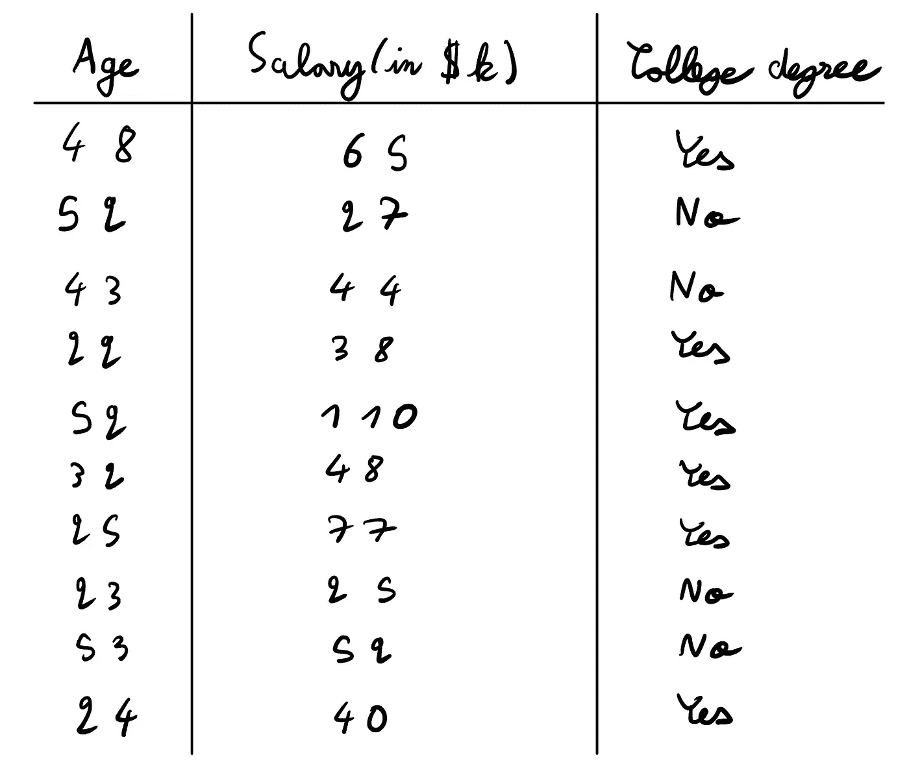

数据集(作者提供的图片)

在这里，我们试图预测一个人是否有大学学位。我们有两个数字变量，那个人的年龄和工资(以千美元计)。

## 关于数据集的初始假设

当你查看一个新的数据集时，我总是建议你想出关于它的**假设**，看看它们是否是真的。

我个人在这里有两个假设:

*   **高薪人士更有可能拥有大学文凭。我这么说是基于这样一个事实:很多高薪职业(医学、法律、科技、咨询、金融等)都需要大学学位。**
*   年轻人比他们的长辈更有可能上大学。我是基于皮尤研究中心的研究和个人经验(我经常听我周围的老年人说，他们觉得我这一代人比他们过去上大学多得多——现在，我知道这是真的)。

我快速计算了一些平均值，发现数据集中上过大学的人的平均年龄是 34 岁，而没有上过大学的人是 43 岁。关于工资，上过大学的人平均工资为 63K，相比之下，没上过大学的人平均工资为 37K。因此，我们的两个假设都是正确的。

这样做不是强制性的，但总是有用的，可以让您更好地理解您正在处理的数据集。

# 决策图表

现在，让我们看看如何在这个数据集上训练决策树并进行预测。

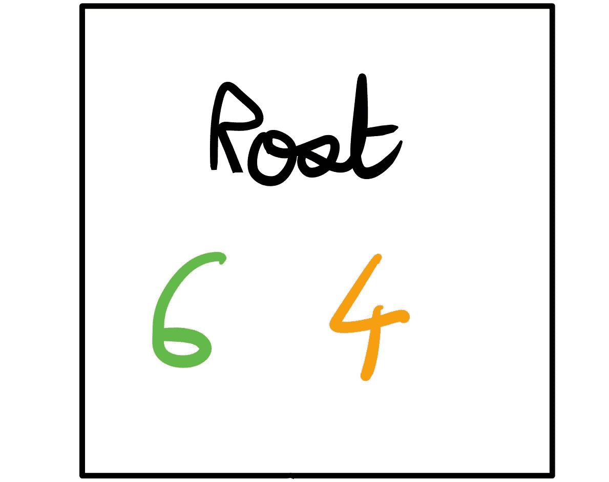

根节点(作者图片)

一开始，我们有 **6 是**和 **4 否**。这将成为我们的根节点。

在任何时候，我们**总是**能够访问真正的标签(也就是说，我们总是知道整个决策树中的一个例子是“是”还是“否”)。记住这一点，这对接下来的事情很重要。

在决策树的每个节点，我们可以预测其中一个类别。这里，我们既可以预测**是**也可以预测**否**。

*   如果我们预测**是**，我们将正确分类 10 个数据点中的 6 个数据点，错误分类 4 个数据点。因此，我们将有 4/10 = **0.4 的错误率**。
*   如果我们预测**没有**，我们将正确分类 10 个数据点中的 4 个数据点，错误分类 6 个数据点。因此，我们将有 6/10 = **0.6 的错误率**。

因此在这里，我们应该预测**是**以获得最低的错误率。

现在，让我们看看如何改进这一点。请记住，我们在这里仍然没有使用任何功能，只有数据集的真实标签。

## 分裂

现在的问题是，我们如何利用我们的特征来改善我们的预测，并做得比 0.4 的错误率更好。我们将为此使用一个阈值:如果某人的工资高于 X，那么我们预测是。如果他们的工资低于 X，我们预测是否定的。让我们看一个例子:

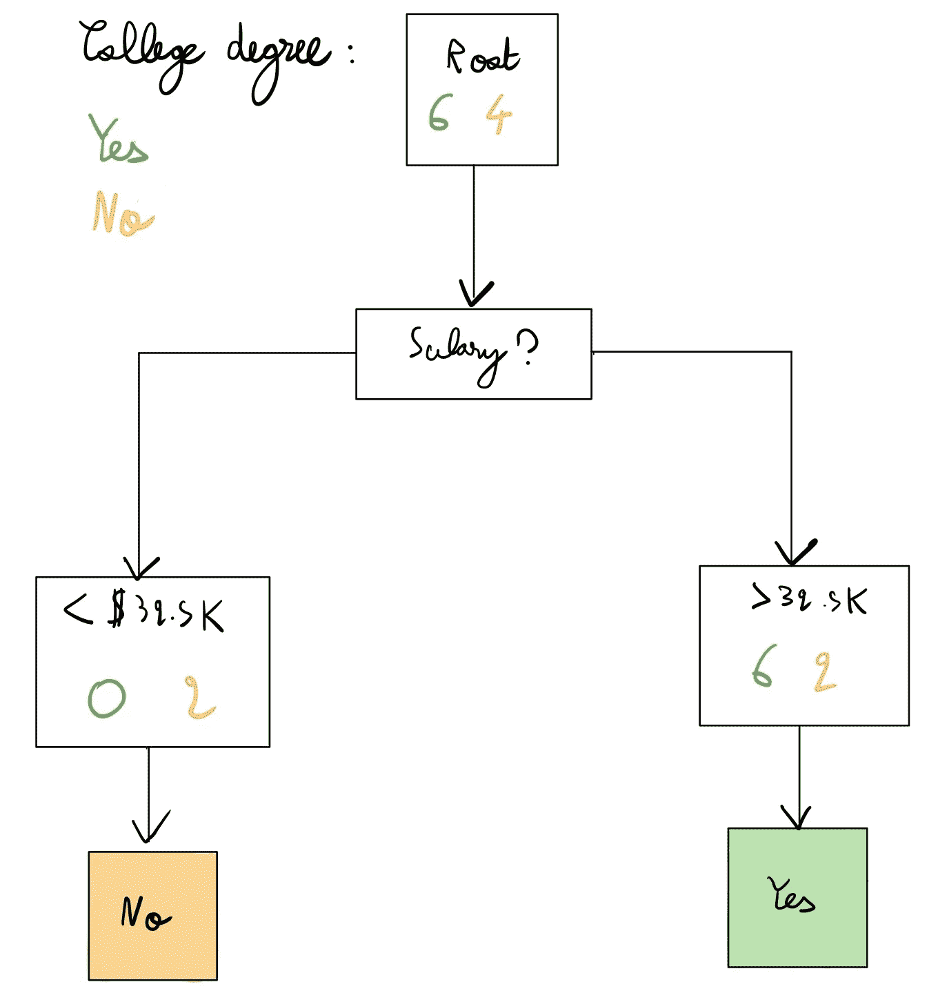

工资分割(图片由作者提供)

在这里，我们仍然有我们的根节点，但我们没有直接预测，而是首先以 32.5K 的拆分值拆分薪水(剧透:这是这里的最佳拆分)，然后进行预测—同样，我们有真正的标签。我们的错误率现在是 0.2(我们只对右边方框中的两个黄色点进行了错误分类，它显示为 6 | 2 -我们预测这些点是，而我们应该预测不是)。

所以，有两个问题:为什么我们决定先按**薪水**分(而不是按**年龄**或其他特征，如果我们有更多的话)以及为什么我们按 **32.5K** 分而不是按另一个值分？

## 如何找到最佳阈值？

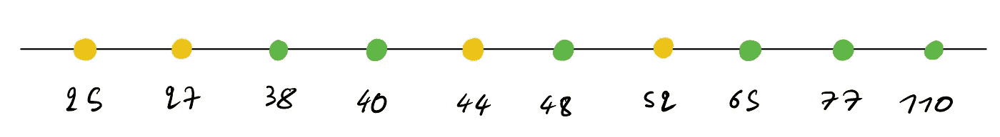

薪水从最小到最大排序，绿色表示是，黄色表示否(图片由作者提供)

在这里，我将工资从最小到最大排序。寻找给定特征的最佳阈值的想法如下:

*   对特性的值进行排序(如上)
*   取两点之间的中间值
*   像前面一样，将此作为阈值，并计算损耗
*   对所有中间值(即所有分割)进行此操作
*   为给定特征选择最佳分割

让我们看一个例子。

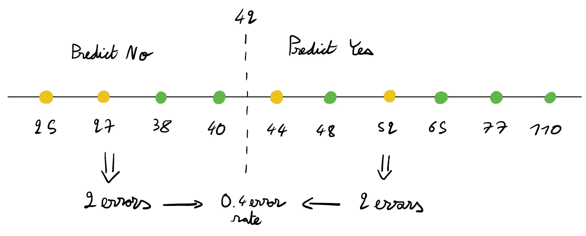

以 4.2 万英镑的薪水分割(图片由作者提供)

这里我们取 42 作为阈值，是 40 到 44 之间的中间值。这将我们的数字列表一分为二。

对于每一部分，我们可以预测是或不是。

*   如果我们在左边预测是，在右边预测不是(与我们在图片上所做的相反)，我们将有 6 个错误= 0.6 错误率。
*   如果我们反过来做，如图所示，我们会得到 4 个错误= 0.4 个错误率。

所以我们这里能达到的最低错误率是 0.4(图片上是什么)。

现在的想法是计算所有可能的分割值的损失。让我们看看这是什么样子。

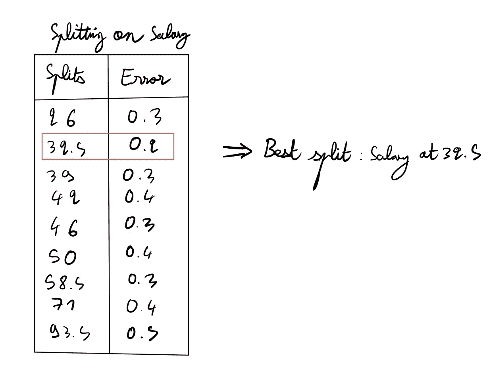

工资的所有可能分割(图片由作者提供)

在这里，我们有各种可能的方法来平分薪水。我们看到 32.5K 是分割的最佳值，因为它的错误率最低。

请记住，你是在 42 还是 42.005 上拆分并不重要，只要你在两个值之间选择一个阈值。我的意思是:

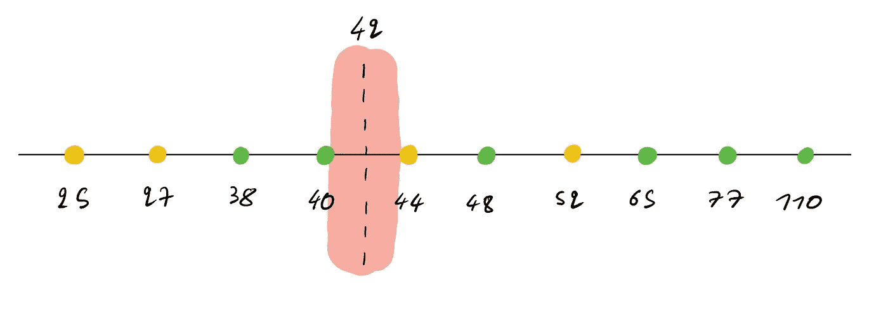

分割区域(作者图片)

在这里，您可以在红色区域中选取任何值，只要它大于 40 并且小于 44(因此 40.1 有效，43.9 也有效)。原因是这些值仍然会导致相同的错误率。因此，你选择哪一个并不重要。我们只是选择中点作为惯例。

## 决定分割哪个变量

现在，我们知道，在我们可以分割薪水的所有方式中，32.5K 的门槛是最好的分割方式。

现在，我们如何决定我们是应该在年龄和薪水上平分呢？简单。计算年龄的误差率，就像我们计算工资的误差率一样，从两者中选择最低的误差率，并将其作为我们的分割值。就这么办吧。

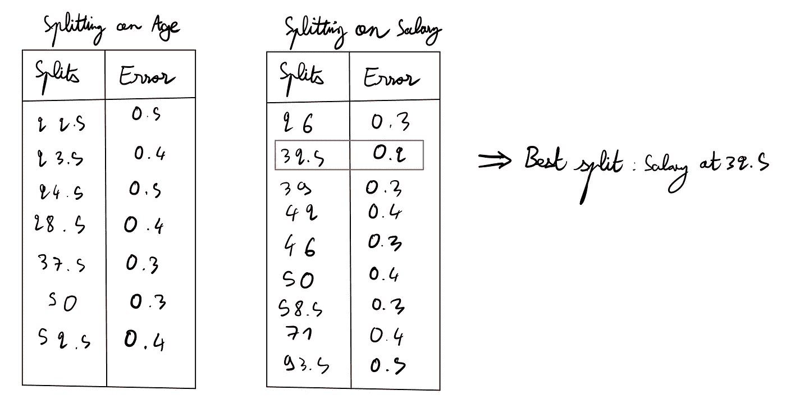

所有可能的根分裂的总结(图片由作者提供)

我们用**年龄**能达到的最低错误率是 **0.3** ，而用**工资**能达到的最低错误率是 **0.2** 。因此，我们在 **32.5K** 上对**工资**进行分割，并选择此作为我们的第一次分割。

现在，我们递归:只要我们在一个给定的节点中没有 0 错误或者没有特征，我们就继续分裂。这是我们的树目前的样子:

当前树(作者图片)

*   在**左侧**，您可以看到我们无法做得更好(我们已经将这 2 点完美分类)。因此，我们不需要进一步分裂。
*   在**右侧**，我们仍然可以在年龄上分裂，并有可能做得更好。

让我们计算一下年龄的所有可能的分裂。这里，我们有 8 个数据点，而不是 10 个，因为我们只处理树右侧的数据点。

我们像前面一样，首先对数据点进行排序。

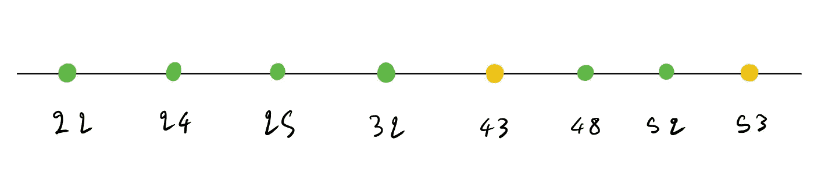

对剩下的 8 个数据点进行排序(图片由作者提供)

现在，我们得到下面的分裂列表。

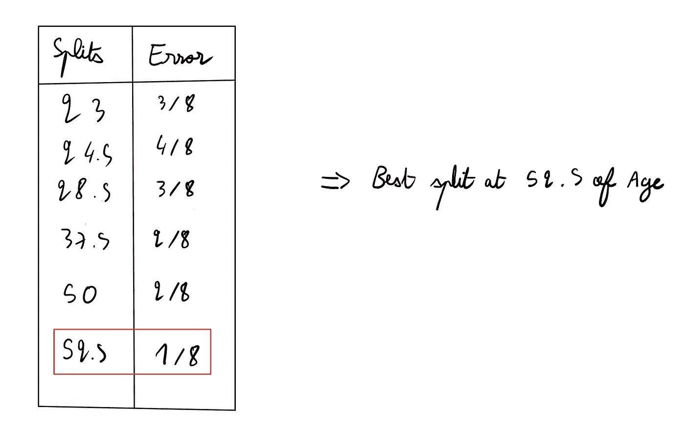

年龄差异(作者图片)

因此，我们在 **52.5** 的**年龄**上分开，如果年龄低于 52.5 则预测是，如果高于 52.5 则预测否。这给了我们下面的树:

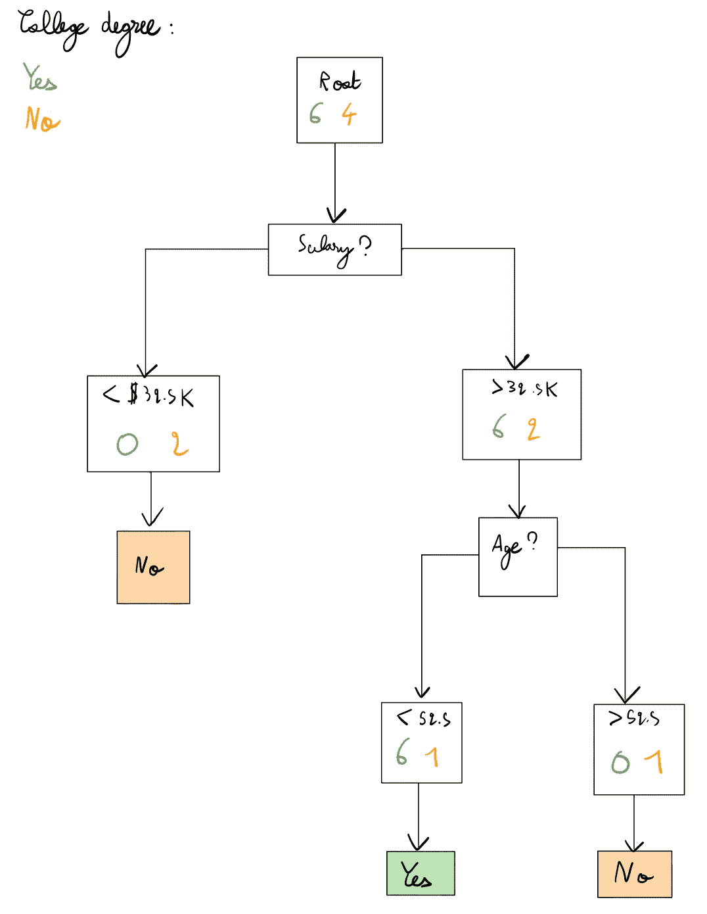

该数据集的最终树(图片由作者提供)

我们得到最终树的错误率为 0.1，因为它只将 1 个点错误分类为是而不是否。我们不能进一步分割，因为我们没有可分割的特征。

## 分类特征

如果你有**分类**而不是**数值**特征，过程同上。您只需对现有的值进行拆分。

例如，如果你有一个**分类特征**来表示某人是住在农村还是住在城市，你就可以分开来看它的表现如何。然后，您将与其他功能进行比较。基本相同的过程。这就是为什么我首先讨论了数字特征，因为分类特征基本上是相同的，但是你已经有了分裂。

# 什么时候停止种树？

早些时候，我们没有其他可以拆分的功能(我们有两个功能，年龄和工资，并且拆分了两次)。因此，这个问题没有提出来。

**在实践中**，你会有更多的功能，你将能够分裂更多，让你的树长得更大，

正如我在以前的[文章](/lasso-and-ridge-regression-an-intuitive-comparison-3ee415487d18)中提到的，这里你将有一个**偏差-方差**的权衡。树越深，它就越适合数据集，但是过度适合的风险就越高。你的树将开始捕捉数据的噪音。因此，何时停止生长一棵树的问题出现了。

有两个主要的技巧:提前停止和修剪。

在**提前停止**，中，你基于给定的条件停止在树的给定节点上的分裂。以下是早期拆分条件的示例:

*   设置叶节点所需的最小样本数
*   设置树的最大深度

在**修剪**中，你只需像我们之前做的那样构建树，然后构建一个比你之前停止时更复杂的树。然后，根据给定的条件删除一些节点。

两者各有利弊，都在实践中使用。为此，我建议查看一下 [Scikit-learn](https://scikit-learn.org/stable/modules/tree.html) 文档。我所涉及的参数称为*修剪*、*最大深度*和*最小样本叶。*还有很多，我建议尽可能多地研究这些文档。

# 随机森林

现在，如何构建一个随机森林分类器？简单。

首先，创建一定数量的决策树。然后，从数据集中统一采样(**替换**)，采样次数与数据集中的样本数相同。因此，如果您的数据集中有 100 个示例，您将从中抽取 100 个点作为样本。替换意味着一旦你采样了一个给定点，你就不能把它从数据集中去掉(**你基本上可以对同一个点采样两次**)。

这为我们提供了构建随机森林分类器的以下过程:

*   数据集中替换的样本
*   在这个子数据集上训练一个决策树
*   重复所需的树数

一旦你有了自己的决策树，你只需要进行多数投票。在我们之前的例子中，假设您已经训练了 100 棵决策树。对于一个给定的例子，如果 64 棵树预测是，36 棵树预测否，那么你会预测是。

# 更进一步

在这篇文章中，我停留在相对较高的层次，没有涉及一些事情，比如可以用于分割的不同度量，以及树如何解决回归问题。在 Scikit-learn 文档中还可以找到更多的参数。

然而，对于以前没有使用过这种算法的人来说，这应该是一个坚实的基础。我建议在一张纸上重新计算，看看你是否得到同样的结果。这确实有助于理解算法。

我最近写了一篇关于 [Ridge 和 Lasso](/lasso-and-ridge-regression-an-intuitive-comparison-3ee415487d18) 的文章，这是回归问题的两种正则化算法。虽然它们不能用于分类，但本文将帮助您理解偏差-方差权衡。这在决策树的上下文中很有用，可以理解为什么你应该在训练你的树或者修剪它们的时候早点停止。

*我希望你喜欢这个教程！让我知道你对它的看法。*

*随时连接上*[*LinkedIn*](https://www.linkedin.com/in/thomas-le-menestrel/)*和*[*GitHub*](https://github.com/tlemenestrel)*谈论更多关于数据科学和机器学习的话题并关注我上* [*中*](https://tlemenestrel.medium.com/) *！*