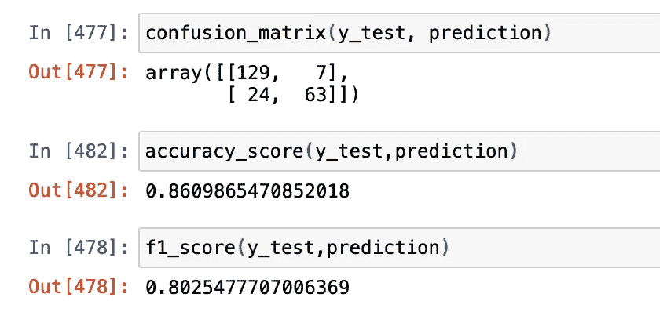

# 随机森林分类

> 原文：<https://towardsdatascience.com/random-forest-classification-678e551462f5>

## 7 分钟的背景信息和示例使用案例


图片由来自 Unsplash 的 David Kovalenko 提供

机器学习模型通常分为监督和非监督学习算法。当我们定义(标记)参数时，监督模型被创建，包括相关和独立参数。相反，当我们没有已定义(未标记)的参数时，使用无监督方法。在这篇文章中，我们将关注一个特定的监督模型，称为随机森林，并将展示一个关于泰坦尼克号幸存者数据的基本用例。

在进入随机森林模型的细节之前，重要的是定义决策树、集合模型和引导，它们对于理解随机森林模型是必不可少的。

**决策树**用于回归和分类问题。它们在视觉上像树一样流动，因此而得名，在分类的情况下，它们从树根开始，然后根据可变的结果进行二进制分割，直到到达一个叶节点，并给出最终的二进制结果。下面是决策树的一个示例:


作者图片

在这里，我们看到决策树从变量 1 开始，并根据特定标准进行拆分。当“是”时，决策树分类为真(真-假可以被视为任何二进制值，如 1-0，是-否)。当“否”时，决策树向下到下一个节点，并且重复该过程，直到决策树到达叶节点，并且决定结果。

**集成学习**是使用多个模型的过程，对相同的数据进行训练，平均每个模型的结果，最终找到更强大的预测/分类结果。

**Bootstrapping** 是在给定迭代次数和给定变量数的情况下随机采样数据集子集的过程。然后将这些结果平均在一起，以获得更有效的结果。自举是应用集合模型的一个例子。

bootstrapping**Random Forest**算法将集成学习方法与决策树框架相结合，从数据中创建多个随机绘制的决策树，对结果进行平均以输出一个结果，该结果通常会导致强预测/分类。

在这篇文章中，我将展示一个随机森林模型，它是由 Syed Hamza Ali 发布到 Kaggle 上的泰坦尼克号幸存者数据创建的，位于[这里](https://www.kaggle.com/hesh97/titanicdataset-traincsv)，这些数据是 CC0 许可的——公共领域。该数据集提供了乘客的信息，如年龄、机票等级、性别，以及乘客是否幸存的二元变量。这些数据也可以用于 Kaggle Titanic ML 竞赛，因此本着保持竞赛公平的精神，我不会展示我进行 EDA &数据争论的所有步骤，也不会直接发布代码。相反，我将提到一些一般的概念和技巧，然后重点介绍随机森林模型。

**EDA &数据争论:** 进行 EDA 面临的挑战之一是数据缺失。当我们处理缺失数据值时，我们有几个选项，我们可以用固定值填充缺失值，如平均值、最小值、最大值。我们可以使用样本平均值、标准偏差和分布类型来生成值，以提供每个缺失值的估计值。第三种选择是删除丢失数据的行(我一般不推荐这种方法)。下面是其中一些选项的示例:

```
import pandas as pd
# fill with mean
df.fillna(np.mean('column_name')# create normal distribution
np.random.normal(mean, standard_deviation, size= size_of_sample)
```

此外，即使数据类型是整数，也要如此对待分类变量，这一点很重要。这样做的一种常见方法是一键编码，下面是它的一个例子。

```
import pandas as pd
pd.get_dummies(df, columns=['list_of_column_names'])
```

最后，重要的是要考虑到一些变量在模型中可能没有用。决定这些变量可以通过一些方法来完成，比如通过你的经验和直觉进行规范化或判断。出于直觉删除变量时要小心，因为您可能会错误地删除对模型实际上很重要的变量。

**Train/Test Split:** 我们将使用 sklearn 模块进行大量分析，具体来说，在此阶段，我们将使用此包的 train_test_split 函数来创建单独的数据训练和测试集。对于一个完整的数据科学项目，我们还会执行交叉验证，并选择具有最佳结果的选项。然而，为了简单起见，我没有在本文中讨论交叉验证，将在后面的文章中讨论交叉验证和网格搜索。运行 train_test_split 的代码如下:

```
x_train, x_test, y_train, y_test = train_test_split(X, y, test_size = .25, random_state = 18)
```

传递给我们的 train_test_split 函数的参数是“X ”,它包含我们的数据集变量，而不是我们的结果变量,“y”是 X 中每个观察值的数组或结果变量。test_size 参数决定测试数据集将保存的数据部分。在这种情况下，我选择了 0.25 或 25%。random_state 参数只是确定数据的具体分割，以便您稍后可以复制您的结果。使用这个函数后，我们现在有了训练和测试数据集，可以用于模型训练和测试。

**随机森林模型:** 我们将继续使用 sklearn 模块来训练我们的随机森林模型，特别是 RandomForestClassifier 函数。RandomForestClassifier 文档显示了我们可以为模型选择的许多不同的参数。下面重点介绍了一些重要参数:

*   n_estimators —您将在模型中运行的决策树的数量
*   max _ depth 设置每棵树的最大可能深度
*   max _ features 确定分割时模型将考虑的最大特征数
*   bootstrapping —默认值为 True，这意味着模型遵循 bootstrapping 原则(前面已定义)。
*   max _ samples 此参数假设 bootstrapping 设置为 True，否则，此参数不适用。在 True 的情况下，该值设置每棵树的每个样本的最大大小。
*   其他重要的参数是 criterion、min_samples_split、min_samples_leaf、class_weights、n_jobs 和其他可以在 sklearn 的 RandomForestClassifier 文档中读取的参数[这里](https://scikit-learn.org/stable/modules/generated/sklearn.ensemble.RandomForestClassifier.html)。

出于本文的目的，我将选择这些参数的基本值，而不进行任何重大的微调，以观察该算法的总体性能。使用的培训代码如下:

```
clf = RandomForestClassifier(n_estimators = 500, max_depth = 4, max_features = 3, bootstrap = True, random_state = 18).fit(x_train, y_train)
```

我选择的参数值是 n_estimators = 500，意味着为这个模型运行 500 棵树；max_depth = 4，因此每棵树的最大可能深度被设置为 4；max_features = 3，因此每棵树最多只能选择 3 个特征；bootstrap = True 同样，这是默认设置，但我想包含它来重申 bootstrap 如何应用于随机森林模型；最后，随机状态= 18。

我想再次强调，这些值是经过最小的微调和优化而选择的。本文的目标是演示随机森林分类模型，而不是获得最佳结果(尽管该模型的性能相对较好，我们很快就会看到)。在以后的文章中，我将深入研究优化方法，并通过网格搜索找到一个更优的解决方案。

为了测试训练好的模型，我们可以使用内部的。predict '函数，将我们的测试数据集作为参数传递。我们也可以使用下面的度量来看看我们的测试效果如何。

```
# Create our predictions
prediction = clf.predict(x_test) # Create confusion matrix
from sklearn.metrics import confusion_matrix, f1_score, accuracy_scoreconfusion_matrix(y_test, prediction)# Display accuracy score
accuracy_score(y_test, prediction)# Display F1 score
f1_score(y_test,prediction)
```



作者图片

我们的模型提供了 86.1%的精确度和 80.25%的 F1 分数。

准确度是以(TP + TN)/(所有情况)的总数来衡量的，而 F1 分数是以 2*(精度*召回)/(精度+召回)来计算的，精度= TP/(TP+FP)，召回= TP/(TP+FN)。

通常，准确性不是我们用来判断分类模型性能的指标，原因是数据中可能存在的不平衡会导致高准确性，因为对一个类别的预测不平衡。然而，为了简单起见，我把它包括在上面。我还加入了 F1 分数，它衡量了精确度和召回率之间的调和平均值。F1 得分度量能够惩罚精度之间的巨大差异。一般来说，我们更喜欢通过分类的精确度、召回率或 F1 分数来确定分类的性能。

**结论:** 本文的目的是介绍随机森林模型，描述 sklearn 的一些文档，并提供一个关于实际数据的模型示例。使用随机森林分类，我们得到了 86.1%的准确率和 80.25%的 F1 值。这些测试是使用正常的训练/测试分割进行的，没有太多的参数调整。在以后的测试中，我们将在训练阶段考虑交叉验证和网格搜索，以找到一个性能更好的模型。

感谢您花时间阅读这篇文章！我希望你喜欢阅读，并了解了更多关于随机森林分类的知识。如前所述，我将继续撰写文章更新这里部署的方法，以及其他方法和数据科学相关的主题。