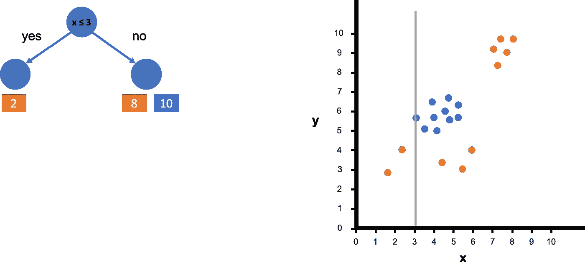
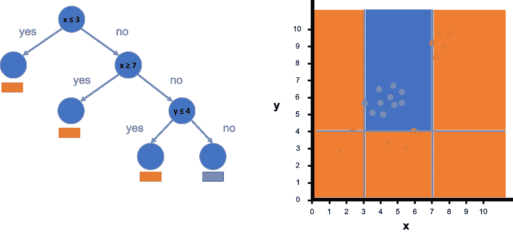
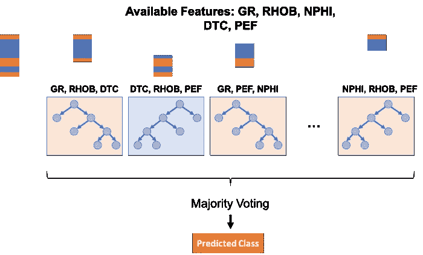
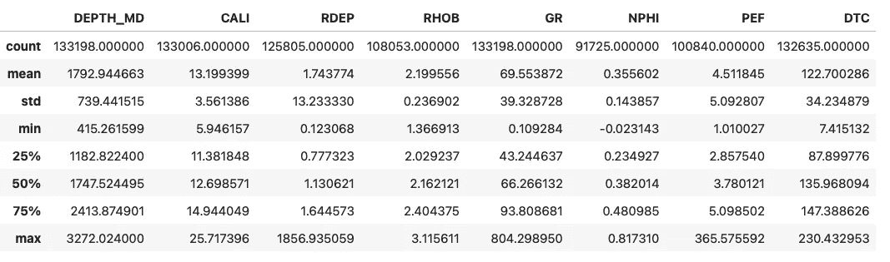
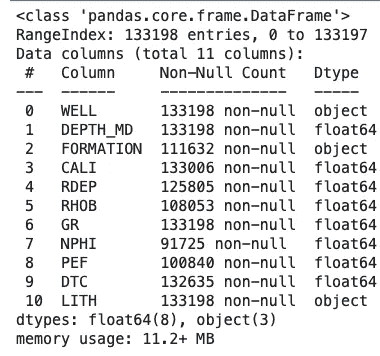
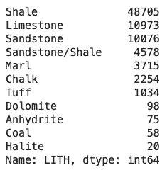
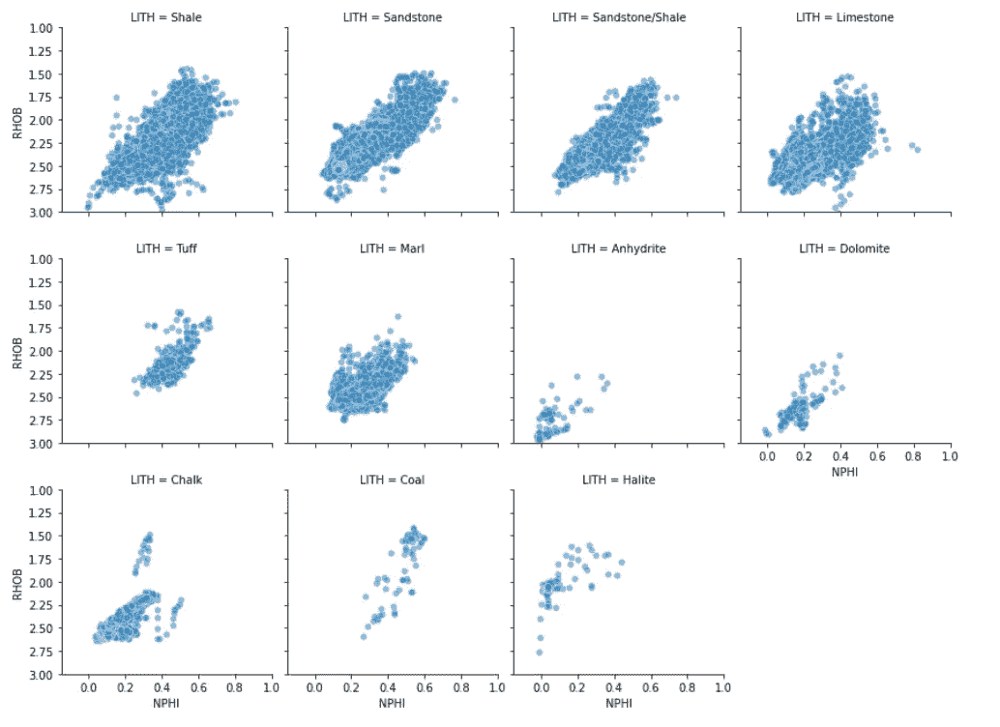
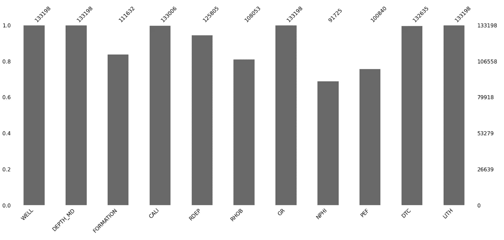
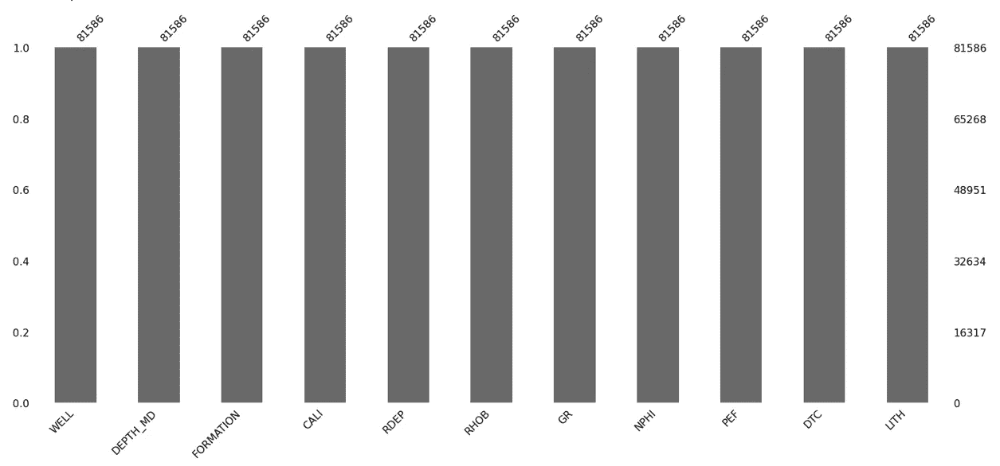
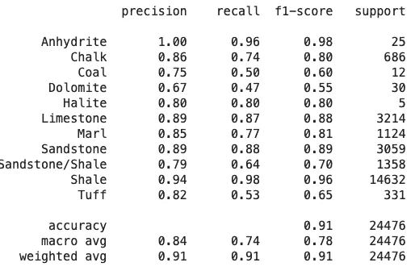

# 用于测井数据岩性分类的随机森林

> 原文：<https://towardsdatascience.com/random-forest-for-lithology-classification-from-well-log-data-4a1380ef025b>

## 机器学习|岩石物理学

## 用机器学习对地下进行分类


奈杰科希尔的照片:[https://www.pexels.com/photo/green-leafed-tree-338936/](https://www.pexels.com/photo/green-leafed-tree-338936/)

随机森林是一种非常流行的机器学习算法，可用于分类(我们试图预测类别或类)和回归(我们试图预测连续变量)。

在岩石物理学和地球科学中，我们可以使用这种算法根据测井测量预测岩性，或者根据岩心测量预测连续测井曲线，例如连续渗透率。

在本文中，我们将重点关注随机森林在测井测量岩性预测中的应用。但首先，让我们看看随机森林是如何工作的。

# 随机森林分类简介

在很高的层次上，随机森林本质上是决策树的集合。这些都是非常简单和直观的理解，我们经常在日常生活中使用它们，即使我们可能没有意识到。

在这个简单的例子中，我们在散点图上有一系列双色(红色和橙色)的数据点。每个彩色系列代表一个不同的类别。


一个简单的数据集被分成两类:橙色和蓝色。图片由作者提供。

我们首先决定如何最好地分割我们的数据，并尝试分离类。这里我们选择 x ≤ 3 的值。



我们决策树中的第一个决策。散点图上的灰线代表我们的决策值 3。然后，我们对此应用一个条件，并检查点数是否小于或等于 3。图片由作者提供。

我们可以看到，当我们这样做了，我们结束了两个橙色的点在左边，蓝色和橙色的混合点在右边。

我们可以根据许多其他条件继续分割数据，直到我们成功地分离出不同的类。



经过多次决策，我们终于有了一个完整的决策树，可以用来进行预测。图片由作者提供。

如上所示，橙色点已经成功地从蓝色点中分离出来，我们有了最终的决策树。这现在形成了新数据的蓝图，新数据将遵循正确的路径，直到到达最终节点。

现在，这个例子非常简单，我们只使用了二维空间，我们可以很容易地分离出类。然而，真实世界的数据可能是杂乱的，我们可能不会以纯粹的叶节点结束。我们可能有包含这两个类的节点，为了确定该节点的最终结果，我们可以使用多数投票的过程。这将在以后的文章中讨论。

我们所做的是创建一个决策树。为了建立我们的森林，我们需要组合多个决策树。顾名思义，我们需要随机化它的一些部分。

我们首先获取数据，并对其进行随机采样，这为我们提供了完整训练数据集的子集。这被称为**引导**我们的数据。

我们还可以为每棵树随机选择不同的输入特征。

这样会形成不同形状的树。



将多个决策树聚合在一起，以进行更可靠的预测。图片由作者提供。

然后，我们可以将新数据传递给这些树，这些数据将经过每个决策，并在最终节点结束，然后给出一个结果。

我们可能不会从所有的树中得到相同的结果，所以我们可以采取多数投票，换句话说，什么类被预测得最多，然后使用它作为我们的最终预测。

组合多棵树的结果是一种强大的技术，可以为我们提供比单棵树更好的答案。这个过程被称为**装袋**。

既然我们对随机森林的作用有了基本的直觉，现在我们可以看看如何将它应用于一些测井数据进行岩性预测。

# 本教程中使用的数据

我们在本教程中使用的数据集是一个训练数据集的子集，该数据集用作 Xeek 和 FORCE 2020 *(Bormann et al .，2020)* 举办的机器学习竞赛的一部分。它是在挪威政府的 NOLD 2.0 许可下发布的，详细信息可以在这里找到:[挪威开放政府数据许可(NLOD) 2.0](https://data.norge.no/nlod/en/2.0/) 。

完整的数据集可通过以下链接获得:[https://doi.org/10.5281/zenodo.4351155](https://doi.org/10.5281/zenodo.4351155)。

竞赛的目的是利用测井测量从现有的标记数据预测岩性。完整的数据集包括来自挪威海的 118 口井。

# 本教程的视频版本

我还在我的 YouTube 频道上发布了这个教程的视频版本，它用另一个数据例子进行了更详细的描述。

# 导入库和数据

我们项目的第一步是导入我们将要使用的库。在本例中，我们将结合使用 [pandas](http://pandas.pydata.org) 来加载和存储我们的数据，结合使用 [matplotlib](https://matplotlib.org) 和 [seaborn](https://seaborn.pydata.org) 来可视化我们的数据，并结合使用 [missingno](https://github.com/ResidentMario/missingno) 来分析哪里可能有缺失值。

```
import pandas as pd
import matplotlib.pyplot as plt
import seaborn as sns
import missingno as mno
```

接下来，我们将使用`pd.read_csv()`从 CSV 文件导入数据。

```
df = pd.read_csv('Data/Xeek_train_subset_clean.csv')
```

一旦数据被加载，我们可以检查我们的数据，看看我们有什么功能。

使用`describe()`方法将允许我们查看数据集中数字特征的统计数据。我们很快会谈到分类特征。

```
df.describe()
```



Xeek 测井子集的内容。图片由作者提供。

我们得到的摘要为我们提供了数据的一般统计信息，包括最小值、最大值、百分位数等等。

我们还可以使用`.info()`方法来检查数据集中有多少非空值。

```
df.info()
```



对测井数据集使用 df.info()的结果。图片由作者提供。

## 快速查看岩性变量

在本教程中，我们将使用名为`LITH`的特征，这是我们的地质岩性，用于训练和预测。

让我们首先检查一下在`LITH`列中有多少唯一值。

```
df['LITH'].nunique()
```

它返回:

```
11
```

接下来，我们将检查每个唯一值是什么:

```
df['LITH'].unique()
```

它返回以下岩性列表:

```
array(['Shale', 'Sandstone', 'Sandstone/Shale', 'Limestone', 'Tuff',
       'Marl', 'Anhydrite', 'Dolomite', 'Chalk', 'Coal', 'Halite'],
      dtype=object)
```

最后，我们可以使用`value_counts()`方法收集每个岩性的数量。

```
df['LITH'].value_counts()
```



数据中的岩性计数。图片由作者提供。

我们可以看到，我们的数据集是不平衡的，在页岩、石灰岩和砂岩岩性中有更多的点。这是在进行预测时需要考虑的事情，但不在本文讨论范围之内。

## 可视化按岩性划分的数据

由于我们的数据集中只有少量岩性，我们可以使用 Seaborn 的 FacetGrid 图来可视化两个变量的值分布:`NPHI`和`RHOB`。这两个特性通常用于岩石物理学，但所有其他列都可以替代使用。

```
g = sns.FacetGrid(df, col='LITH', col_wrap=4)
g.map(sns.scatterplot, 'NPHI', 'RHOB', alpha=0.5)
g.set(xlim=(-0.15, 1))
g.set(ylim=(3, 1))
```



FacetGrid 显示了密度(RHOB) —中子孔隙度(NPHI)数据中的岩性分布。

从上面可以看出，一些岩性具有较大的分布，如页岩数据，而硬石膏和石盐具有更明显的分布。

# 处理缺失值

在探索了我们的数据之后，下一步是处理我们缺失的值。可视化我们丢失的值的一个很好的方法是使用 [missingno](https://github.com/ResidentMario/missingno) 库。

在本教程中，我们将只使用条形图，但理想情况下，您应该查看所有图表，尝试并了解哪里以及为什么会有缺失值。

我们可以像这样调用条形图。

```
mno.bar(df)
```

这将返回下面的图表。我们可以看到，与其他列(例如 NPHI)相比，一些列的值的数量(嗯，DEPTH_MD)更大。



缺失没有显示数据集中缺失值总数的条形图。图片由作者提供。

为了简单起见，我们将简单地使用列表删除来删除任何列中缺少值的行。还有更高级的方法，但是这个适合这个例子。

我们可以使用`df.dropna()`删除包含缺失值的行，如果我们设置参数`inplace`等于`True`，那么我们将删除原始数据帧中的行。

```
df.dropna(inplace=True)
mno.bar(df)
```



缺失使用 pandas 的 dropna()方法删除缺失值后没有条形图。图片由作者提供。

如上所示，我们已经将总价值计数从 133，196 减少到 81，586，这是一个显著的减少。

# 构建随机森林模型

既然我们已经研究了数据并移除了缺失值，现在我们可以继续构建我们的随机森林分类模型。为此，我们需要从 [Scikit-learn](https://scikit-learn.org/stable/) 库中导入一些模块。

```
from sklearn.model_selection import train_test_split
from sklearn import metrics
from sklearn.metrics import classification_report, confusion_matrix
from sklearn.ensemble import RandomForestClassifier
```

接下来，我们需要将我们的数据分成哪些变量将用于训练模型(X)和我们的目标变量`LITH` (y)。

```
X = df[['RDEP', 'RHOB', 'GR', 'NPHI', 'PEF', 'DTC']]
y = df['LITH']
```

与任何机器学习模型一样，我们需要一个用来训练模型的数据集和一个用来测试和验证我们的模型是否有效的数据集。这可以通过使用`train_test_split()`功能轻松实现。

我们传入 X 和 y 变量，以及表示我们想要多大的测试数据集的参数。这是作为十进制值输入的，范围在 0 和 1 之间。在这种情况下，我们使用 0.3，这意味着我们的测试数据集将是原始数据的 30%，我们的训练数据集将是原始数据的 70%。

```
X_train, X_test, y_train, y_test = train_test_split(X, y, test_size=0.3)
```

设置我们的分类器非常简单，我们创建一个名为`clf`的变量，并将其赋给`RandomForestClassifier`。我们也可以为我们的分类器传入参数，但是在这个例子中，我们将保持简单并使用默认值。

你可以在这里找到更多相关信息。

```
clf=RandomForestClassifier()
```

一旦模型被初始化，我们就可以通过调用`fit`方法并传入`X_train`和`y_train`将它应用于我们的训练数据。

```
clf.fit(X_train,y_train)
```

# 利用随机森林分类器预测岩性

在模型建立之后，我们可以对我们的测试数据进行预测，并评估它的表现如何。这是通过调用`predict`方法并传入我们的测试数据集特性`X_test`来完成的。

```
y_pred=clf.predict(X_test)
```

一旦模型被用于预测，我们就可以开始查看一些关键指标。第一个是准确性，即每类的正确预测数除以预测总数。

```
accuracy=metrics.accuracy_score(y_test, y_pred)
accuracy
```

它返回:

```
0.91203628043798
```

这是一个很好的值，但是，它不应该完全单独使用，因为它可能会对模型的实际性能产生错误的感觉。

为了获得更好的见解，我们可以生成一个分类报告，如下所示。

```
clf_rpt = classification_report(y_test, y_pred)
print(clf_rpt)
```



scikit-learn 的分类报告。图片由作者提供。

**precision:** 提供了该类中有多少值被正确预测的指示。值介于 0.0 和 1.0 之间，1 表示最好，0 表示最差。

**recall:** 提供了分类器能够找到该类的所有阳性案例的程度的度量。

**f1-score:** 精度和召回率的加权调和平均值，生成 1.0(好)和 0.0(差)之间的值。

**support:** 这是数据集中该类的实例总数。

## 混淆矩阵

另一种观察我们的模型表现如何的方法是使用混淆矩阵。这用于根据提供的标签的实际值绘制每个特征的预测结果(`LITH`)。

```
cf_matrix = confusion_matrix(y_test, y_pred)
cf_matrix
```


scikit-learn 生成的混淆矩阵的原始示例。图片由作者提供。

我们可以使用 seaborn 和热图绘制一个漂亮且易于理解的图表，而不是使用数字来可视化我们的混淆矩阵。首先，我们必须设置希望出现在 x 轴和 y 轴上的标签。

```
labels = ['Shale', 'Sandstone', 'Sandstone/Shale', 'Limestone', 'Tuff',
       'Marl', 'Anhydrite', 'Dolomite', 'Chalk', 'Coal', 'Halite']
labels.sort()
```

然后我们可以创建我们的图形，并添加一些标题和轴标签。

```
fig = plt.figure(figsize=(10,10))
ax = sns.heatmap(cf_matrix, annot=True, cmap='Reds', fmt='.0f',
                xticklabels=labels, 
                yticklabels = labels)ax.set_title('Seaborn Confusion Matrix with labels\n\n');
ax.set_xlabel('\nPredicted Values')
ax.set_ylabel('Actual Values ');
```


我们的分类结果的混淆矩阵是使用 Seaborn 热图生成的。图片由作者提供。

使用我们混乱矩阵的可视化比看简单的数字要好得多。我们可以看到，数值越高，红色越深。因此，我们可以立即看到，我们的大多数数据点都属于页岩类别，这也表明这些值预测正确。

# 摘要

随机森林是一种功能强大、易于理解、易于实现的机器学习方法。如上所述，它在岩性预测的第一次通过中提供了非常好的结果，但是，我们仍然需要在看不见的数据上验证我们的模型并调整参数。

*感谢阅读。在你走之前，你一定要订阅我的内容，把我的文章放到你的收件箱里。* [***你可以在这里做！***](https://andymcdonaldgeo.medium.com/subscribe)**或者，您也可以* [***注册我的简讯***](https://fabulous-founder-2965.ck.page/2ca286e572) *免费将更多内容直接发送到您的收件箱。**

*其次，通过注册会员，你可以获得完整的媒介体验，并支持我和其他成千上万的作家。它每个月只花你 5 美元，你可以完全接触到所有令人惊叹的媒体文章，也有机会用你的写作赚钱。如果你用 [***我的链接***](https://andymcdonaldgeo.medium.com/membership)**报名，你直接用你的一部分费用支持我，不会多花你多少钱。如果你这样做了，非常感谢你的支持！***

# **参考**

**博尔曼，彼得，奥桑德，彼得，迪里布，法哈德，曼拉尔，投降，&迪辛顿，彼得。(2020).机器学习竞赛 FORCE 2020 井测井和岩相数据集[数据集]。芝诺多。[http://doi.org/10.5281/zenodo.4351156](http://doi.org/10.5281/zenodo.4351156)**