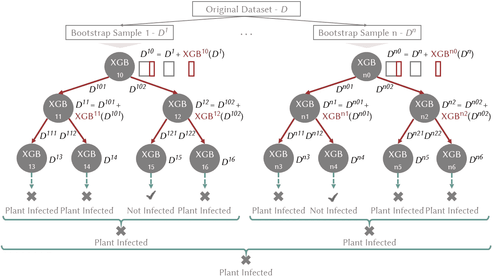

# 随机森林还是 XGBoost？是时候探索 LCE 了

> 原文：<https://towardsdatascience.com/random-forest-or-xgboost-it-is-time-to-explore-lce-2fed913eafb8>

## LCE:本地级联合奏


在 [Unsplash](https://unsplash.com/) 上由 [David Bruyndonckx](https://unsplash.com/@david_bxl?utm_source=unsplash&utm_medium=referral&utm_content=creditCopyText) 拍摄的照片。

【O】在过去的几年里，Random Forest [Breiman，2001]和 XGBoost [Chen and Guestrin，2016]已经成为在解决分类和回归的许多挑战方面表现最好的机器学习方法。从业者面临着一个反复出现的问题:对于给定的数据集，我们应该选择哪一个？**局部级联集成(LCE)**【Fauvel et al .，2022】是一种新的机器学习方法，它提出来回答这个问题。它结合了两者的优势，采用互补的多样化方法来获得更好的泛化预测器。因此， **LCE 进一步增强了**随机森林**和 **XGBoost 的预测性能。****

本文介绍了 LCE 和相应的 [Python 包](https://pypi.org/project/lcensemble/)，并附有一些代码示例。LCE 包**与 scikit 兼容-学习**；它通过[检查估计器](https://scikit-learn.org/stable/modules/generated/sklearn.utils.estimator_checks.check_estimator.html#sklearn.utils.estimator_checks.check_estimator)。因此，它可以与 scikit-learn 管道和模型选择工具进行交互。

# LCE 演示

集合方法的构建包括将准确和多样的单个预测因子结合起来。有两种互补的方式来生成不同的预测器: *(i)* 通过改变训练数据分布，以及 *(ii)* 通过学习训练数据的不同部分。

我们在发展 LCE 时采用了这两种多样化的方法。首先， *(i)* LCE 结合了两种众所周知的方法，这两种方法通过对偏差-方差权衡的互补效应来修改原始训练数据的分布:bagging [Breiman，1996](方差减少)和 boosting [Schapire，1990](偏差减少)。然后， *(ii)* LCE 学习训练数据的不同部分，以捕捉基于分治策略(决策树)无法在全局发现的新关系。在详细介绍 LCE 如何结合这些方法之前，我们先介绍一下在解释 LCE 时用到的关键概念。

偏差-方差权衡定义了学习算法在训练集之外进行概括的能力。*偏差*是由学习算法的系统误差产生的预测误差的分量。高偏差意味着学习算法不能捕获训练集的底层结构(欠拟合)。*方差*衡量学习算法对训练集变化的敏感度。高方差意味着算法对训练集的学习过于紧密(过度拟合)。目标是最小化偏差和方差。*套袋*对方差减少有主效应；这是一种生成预测值的多个版本(引导复制)并使用这些版本获得聚合预测值的方法。目前最先进的采用装袋的方法是随机森林。而*升压*对偏置降低有主要影响；it 是一种迭代学习弱预测器并将它们相加以创建最终强预测器的方法。在添加弱学习者之后，数据权重被重新调整，允许未来的弱学习者更多地关注先前弱学习者预测错误的例子。目前最先进的使用 boosting 的方法是 XGBoost。图 1 说明了装袋和增压方法之间的区别。


图一。植物病害数据集上的套袋与加强。n——估计量的数量。图片由作者提供。

因此，我们的新集成方法 LCE 结合了 boosting-bagging 方法来处理机器学习模型面临的偏差-方差权衡；此外，它采用分而治之的方法来个性化训练数据不同部分的预测器误差。LCE 如图 2 所示。



图二。植物病害数据集上的局部级联系综，参考图 1，以军校生蓝装袋，以红色增强。n —树的数量，XGB — XGBoost。图片由作者提供。

具体来说，LCE 基于级联概化:它按顺序使用一组预测器，并在每个阶段向输入数据集添加新属性。新属性是从被称为基础学习器的预测器给出的输出(例如，分类器的类概率)中导出的。LCE 遵循分而治之的策略(决策树)在局部应用级联泛化，并通过使用基于提升的预测器作为基础学习器来减少决策树中的偏差。采用当前性能最好的最新 boosting 算法作为基本学习器(XGBoost，例如，图 2 中的 XGB ⁰、XGB)。当生长树时，通过将每个决策节点处的基础学习器的输出作为新属性添加到数据集，增强沿着树向下传播(例如，图 2 中的 XGB ⁰( *D* )。预测输出表明基础学习者正确预测样本的能力。在下一个树级别，基础学习者利用添加到数据集的输出作为加权方案，以更多地关注先前预测错误的样本。然后，通过使用装袋来减轻由增强决策树产生的过拟合。Bagging 通过用原始数据集的替换从随机抽样中创建多个预测值来提供方差减少(例如，图 2 中的 *D* 、 *D* )。最后，通过简单多数投票来聚合树。为了被用作预测器，LCE 在每个节点中存储由基础学习器生成的模型。

## 缺失数据

我们选择**本地处理丢失的数据。**与 XGBoost 类似，LCE 排除了分割的缺失值，并使用块传播。在节点分割期间，块传播将所有丢失数据的样本发送到错误较少的决策节点端。

## 超参数

LCE 的超参数是基于树的学习中的经典参数(例如，`max_depth`、`max_features`、`n_estimators`)。此外，LCE 在树的每个节点学习特定的 XGBoost 模型，并且它只需要指定 XGBoost 超参数的范围。然后，每个 XGBoost 模型的**超参数由 Hyperopt** [Bergstra 等人，2011]自动设置，Hyperopt 是一种使用 Parzen 估计器算法树的基于序列模型的优化。Hyperopt 从先前的选择和基于树的优化算法中选择下一个超参数。Parzen 树估计器满足或超过超参数设置的网格搜索和随机搜索性能。LCE 超参数的完整列表可在其[文档](https://lce.readthedocs.io/en/latest/api.html)中找到。

## 公布的结果

我们最初在[Fauvel 等人，2019]中为特定应用设计了 LCE，然后在[Fauvel 等人，2022]中的公共 UCI 数据集[Dua 和 Graff，2017]上对其进行了评估。结果表明，LCE 平均获得了比包括随机森林和 XGBoost 在内的最新分类器更好的预测性能。

# Python 包和代码示例


图片由作者提供。

## 装置

LCE 有一个 [Python 包](https://pypi.org/project/lcensemble/) (Python ≥ 3.7)。可以使用`pip`进行安装:

```
pip install lcensemble
```

或者`conda`:

```
conda install -c conda-forge lcensemble
```

## 代码示例

LCE 包**兼容 scikit-learn**；它通过[检查估计器](https://scikit-learn.org/stable/modules/generated/sklearn.utils.estimator_checks.check_estimator.html#sklearn.utils.estimator_checks.check_estimator)。因此，它可以与 scikit-learn 管道和模型选择工具进行交互。以下示例说明了 LCE 在公共数据集上用于分类和回归任务的情况。还显示了包含缺失值的数据集上的 LCE 的示例。

*   在[虹膜数据集](https://scikit-learn.org/stable/auto_examples/datasets/plot_iris_dataset.html)上使用 LCE 进行分类

Iris 数据集上的这个示例说明了如何训练 LCE 模型并将其用作预测器。它还通过使用`cross_val_score`演示了 LCE 与 scikit-learn 模型选择工具的兼容性。

*   缺失值虹膜数据集上的 LCE 分类

这个例子说明了 LCE 对缺失值的稳健性。Iris 训练集被修改为每个变量有 20%的缺失值。

*   对[糖尿病数据集](https://scikit-learn.org/stable/modules/generated/sklearn.datasets.load_diabetes.html)进行 LCE 回归

最后，这个例子展示了如何在回归任务中使用 LCE。

# 结论

本文介绍了 LCE，一种用于一般分类和回归任务的新集成方法，以及相应的 Python 包。有关 LCE 的更多信息，请参考发表在*数据挖掘和知识发现*杂志上的相关[论文](https://hal.inria.fr/hal-03599214/document)。

# 参考

J.伯格斯特拉、巴登内、本吉奥和凯格尔。超参数优化算法。2011 年第 24 届国际神经信息处理系统会议论文集。

长度布莱曼。打包预测值。机器学习，24(2):123–140，1996 年。

长度布莱曼。随机森林。机器学习，45(1):5–32，2001。

T.陈和 C. Guestrin。XGBoost:一个可扩展的树提升系统。2016 年第 22 届 ACM SIGKDD 知识发现和数据挖掘国际会议论文集。

D.杜瓦和 c .格拉夫。UCI 机器学习知识库，2017 年。

K.Fauvel，V. Masson，E. Fromont，P. Faverdin 和 A. Termier。走向可持续的奶牛管理——发情检测的机器学习增强方法。2019 年第 25 届 ACM SIGKDD 知识发现和数据挖掘国际会议论文集。

K.Fauvel、E. Fromont、V. Masson、P. Faverdin 和 A. Termier。XEM:一种用于多元时间序列分类的可解释的设计集成方法。数据挖掘和知识发现，36(3):917–957，2022。

R.沙皮雷。弱可学性的力量。机器学习，5(2):197–227，1990 年。