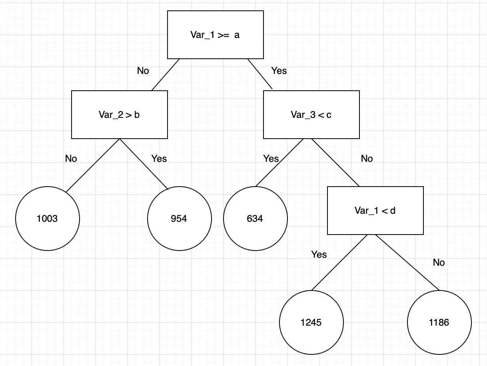
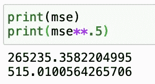
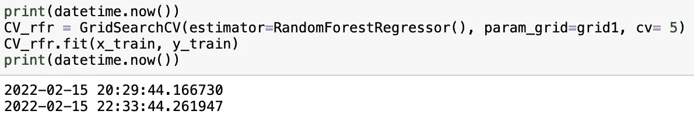
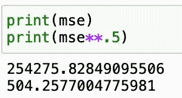

# 随机森林回归

> 原文：<https://towardsdatascience.com/random-forest-regression-5f605132d19d>

## 7 分钟的基本解释和使用案例


塞斯·芬克在 [Unsplash](https://unsplash.com/s/photos/random-forest?utm_source=unsplash&utm_medium=referral&utm_content=creditCopyText) 上的照片

几周前，我写了一篇文章演示了[随机森林分类模型](/random-forest-classification-678e551462f5)。在本文中，我们将使用 sklearn 的 RandomForrestRegressor()模型演示随机森林的回归情况。

与我的上一篇文章类似，我将通过强调一些与随机森林机器学习相关的定义和术语来开始这篇文章。本文的目标是描述随机森林模型，并演示如何使用 sklearn 包来应用它。我们的目标不是解决最佳解决方案，因为这只是一个基本指南。

**定义:
决策树**用于回归和分类问题。它们在视觉上像树一样流动，因此而得名，在回归的情况下，它们从树根开始，并根据可变结果进行分割，直到到达一个叶节点并给出结果。下面是决策树的一个示例:



作者图片

这里我们可以看到一个基本的决策树图，它从 Var_1 开始，根据特定的标准进行拆分。当“是”时，决策树沿着表示的路径前进，当“否”时，决策树沿着另一条路径前进。这个过程重复进行，直到决策树到达叶节点，并决定结果。对于上面的例子，a、b、c 或 d 的值可以代表任何数值或分类值。

**集成学习**是使用多个模型的过程，对相同的数据进行训练，平均每个模型的结果，最终找到更强大的预测/分类结果。我们对集成学习的希望和要求是，每个模型(在这种情况下是决策树)的误差是独立的，并且在不同的树之间是不同的。

**Bootstrapping** 是在给定迭代次数和给定变量数的情况下随机采样数据集子集的过程。然后将这些结果平均在一起，以获得更有效的结果。自举是应用集合模型的一个例子。

bootstrapping**Random Forest**算法将集成学习方法与决策树框架相结合，从数据中创建多个随机绘制的决策树，对结果进行平均以输出新的结果，这通常会导致强预测/分类。

在这篇文章中，我将展示一个随机的森林模型，这个模型是由 Austin Reese 发布到 Kaggle 上的美国住房数据创建的，这个数据被授权为 CC0——公共领域。该数据集提供了有关待售房屋的信息和详细信息。该数据集由大约 380，000 个观察值和 20 多个变量组成。我进行了大量的 ed a，但为了让本文更多地介绍实际的随机森林模型，我不会包括所有的步骤。

**随机森林回归模型:** 我们将使用 sklearn 模块来训练我们的随机森林回归模型，特别是 RandomForestRegressor 函数。RandomForestRegressor 文档显示了我们可以为模型选择的许多不同的参数。下面重点介绍了一些重要参数:

*   **n_estimators** —您将在模型中运行的决策树的数量
*   **标准** —该变量允许您选择用于确定模型结果的标准(损失函数)。我们可以从均方误差(MSE)和平均绝对误差(MAE)等损失函数中进行选择。默认值为 MSE。
*   **max_depth** —设置每棵树的最大可能深度
*   **max _ features**-确定分割时模型将考虑的最大特征数
*   **bootstrap** —默认值为 True，这意味着模型遵循 bootstrap 原则(前面已定义)
*   **max_samples** —该参数假设 bootstrapping 设置为 True，否则该参数不适用。在 True 的情况下，该值设置每棵树的每个样本的最大大小。
*   其他重要参数有 **min_samples_split、min_samples_leaf、n_jobs** 以及其他可以在 sklearn 的 RandomForestRegressor 文档[中读取的参数，此处](https://scikit-learn.org/stable/modules/generated/sklearn.ensemble.RandomForestRegressor.html)。

出于本文的目的，我们将首先展示输入到随机森林回归模型中的一些基本值，然后我们将使用网格搜索和交叉验证来找到一组更优的参数。

```
rf = RandomForestRegressor(n_estimators = 300, max_features = 'sqrt', max_depth = 5, random_state = 18).fit(x_train, y_train)
```

看看上面的基本模型，我们使用了 300 棵树；max_features per tree 等于训练数据集中参数数量的平方根。每棵树的最大深度设置为 5。最后，random_state 被设置为 18 只是为了保持一切标准。

正如我在以前的随机森林分类文章中所讨论的，当我们解决分类问题时，我们可以使用准确性、精确度、召回率等指标来查看我们的性能。当查看回归模型的性能指标时，我们可以使用诸如均方误差、均方根误差、R、调整后的 R 等因素。在这篇文章中，我将重点介绍均方误差和均方根误差。

简单来说，均方误差(MSE)是实际输出值和预测输出值之间的平方差总和的平均值。我们的目标是尽可能降低 MSE。例如，如果我们有一个(3，5，7，9)的实际输出数组和一个(4，5，7，7)的预测输出数组，那么我们可以将均方误差计算为:
((3-4)+(5–5)+(7–7)+(9–7))/4 =(1+0+0+4)/4 = 5/4 = 1.25

均方根误差(RMSE)就是 MSE 的平方根，因此本例中 RMSE = 1.25^.5 = 1.12。

使用这些性能指标，我们可以运行以下代码来计算模型的 MSE 和 RMSE:

```
prediction = rf.predict(x_test)mse = mean_squared_error(y_test, prediction)
rmse = mse**.5print(mse)
print(rmse)
```



作者图片

我们从这个基本的随机森林模型中得到的结果总体上并不是很好。鉴于我们数据集的大多数值都在 1000–2000 之间，RMSE 值 515 相当高。展望未来，我们将看到调整是否有助于创建一个性能更好的模型。

在大型数据集上运行随机森林模型时，需要考虑的一个问题是潜在的长训练时间。例如，运行第一个基本模型所需的时间大约是 30 秒，这还不算太糟，但是正如我稍后将演示的，这个时间需求可能会迅速增加。

既然我们已经完成了基本的随机森林回归，我们将寻找一个性能更好的参数选择，并将利用 GridSearchCV sklearn 方法来实现这一点。

```
## Define Grid 
grid = { 
    'n_estimators': [200,300,400,500],
    'max_features': ['sqrt','log2'],
    'max_depth' : [3,4,5,6,7],
    'random_state' : [18]
}## show start time
print(datetime.now())## Grid Search function
CV_rfr = GridSearchCV(estimator=RandomForestRegressor(), param_grid=grid1, cv= 5)
CV_frf.fit(x_train, y_train)## show end time
print(datetime.now())
```



作者图片

正如您可能已经注意到的，在上面的代码中，我包含了两个显示当前日期时间的打印语句，这样我们就可以跟踪函数的开始和结束时间来测量运行时间。正如我们在上面的图像中看到的，这个函数花了 2 个多小时来训练/调整，这是一个不小的时间量，也是一个明显更大规模的版本，我们在早期的基本模型中看到了 30 秒。

为了进一步扩展，我们的数据集有大约 380，000 个观察值，这仍然相对较小，特别是与那些用于专业应用或学术研究的观察值相比，这些观察值可能有数百万或数十亿个。在考虑使用哪种模型以及权衡性能与时间时，需要考虑这些时间限制。

通过网格搜索找到的最佳参数在下面的代码部分。使用这些参数，并对相同的数据进行测试，我们发现了以下结果。

```
{'max_depth': 7,
 'max_features': 'sqrt',
 'n_estimators': 300,
 'random_state': 18}# Create and train model
rf = RandomForestRegressor(n_estimators = 300, max_features = 'sqrt', max_depth = 7, random_state = 18)
rf.fit(x_train, y_train)# Predict on test data
prediction = rf.predict(x_test)# Compute mean squared error
mse = mean_squared_error(y_test, prediction)# Print results
print(mse)
print(mse^.5)
```



作者图片

这个均方误差结果低于我们的基本模型，这很好，但总的来说，我仍然认为这种性能是不够的。均方根误差为 504 意味着每次估算的平均误差比实际租赁价格低 504 美元。这种糟糕的性能可能有几个原因:

*   不使用某些变量和/或使用不必要的变量
*   糟糕的 EDA 和数据争论
*   未能正确说明分类变量或文本变量

在我看来，结果不佳的主要原因可以归结为上面提到的第一点。也就是说，本文的目标不是产生最佳结果，而是演示如何使用 sklearn 将随机森林回归模型和一些背景信息应用到随机森林模型的操作中。就本文的目的而言，我认为我们能够实现我们的目标。

**结论:**
在本文中，我们展示了随机森林模型背后的一些基础知识，更具体地说，是如何应用 sklearn 的随机森林回归算法。我们指出了随机森林模型的一些好处，以及一些潜在的缺点。

感谢您花时间阅读这篇文章！我希望您喜欢阅读，并了解了更多关于随机森林回归的知识。我将继续撰写文章，更新这里部署的方法，以及其他方法和数据科学相关的主题。