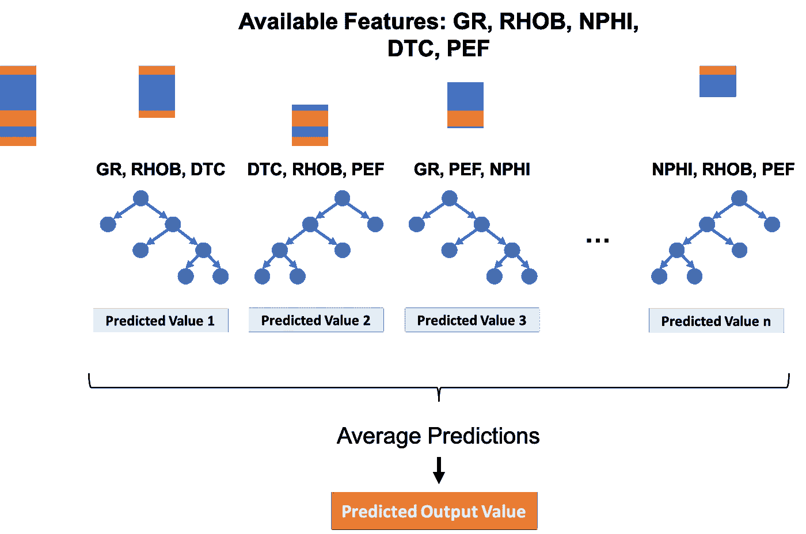
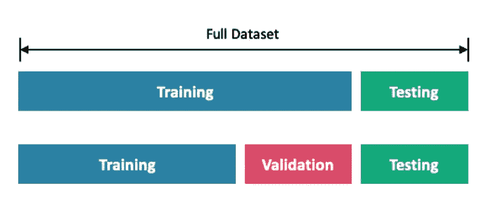
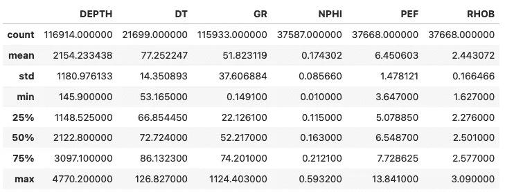
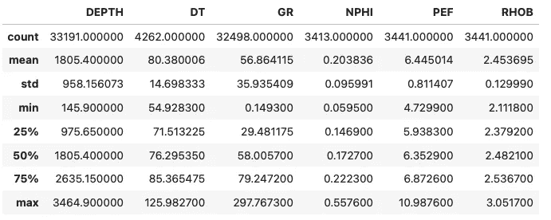
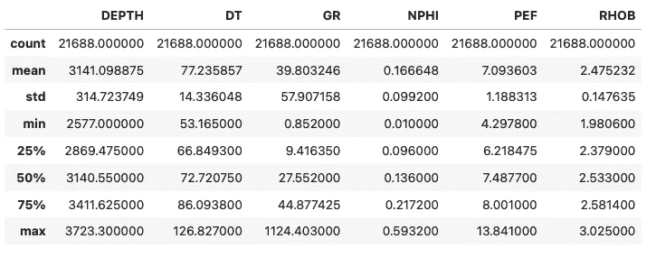
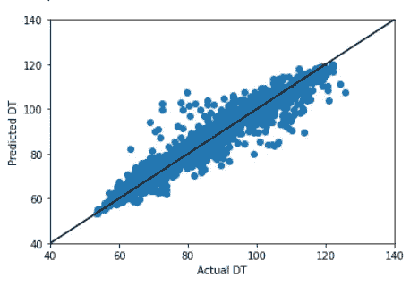

# 连续测井预测的随机森林回归

> 原文：<https://towardsdatascience.com/random-forest-regression-for-continuous-well-log-prediction-61d3ec1c683a>

## 机器学习|岩石物理学

## 应用于岩石物理学的流行机器学习算法综述


HoliHo 的照片:[https://www . pexels . com/photo/pathway-in-trees-between-daytime-1112186/](https://www.pexels.com/photo/pathway-in-between-trees-at-daytime-1112186/)

随机森林是一种非常流行，也相对容易理解的机器学习算法。[在我之前关于随机森林的文章中，我们试图从一系列测井测量中预测分类数据(岩性)。](https://medium.com/p/4a1380ef025b)在本文中，我们将重点关注连续测量的预测。

# 回归随机森林简介

在很高的层次上，随机森林本质上是决策树的集合(系综)。决策树理解起来非常简单和直观。我们经常在日常生活中使用它们来做决定，尽管我们可能没有意识到。

如果你想知道随机森林是如何应用于分类问题的，可以看看下面的文章。

</random-forest-for-lithology-classification-from-well-log-data-4a1380ef025b>  

在分类的情况下，我们试图使用决策将我们的数据分开，并将它们放入类中。当它们应用于回归时，我们试图做类似的事情，但我们预测的不是一个类，而是一个值。

在树的顶端(根节点),我们首先做出一个决定，拆分我们的数据。这一过程沿树向下继续，直到不能再进行分割，这通常定义为每个末端节点(叶节点)的最小样本数或树的最大深度。


随机森林中的单个决策树示例。图片由作者提供。

随机森林算法由以随机方式构造的多个决策树形成。这包括随机抽样我们的数据，并从我们的数据集中为每棵树随机选择变量/特征。



使用测井/岩石物理数据的随机森林回归示例。图片由作者提供。

一旦森林建成，我们将所有预测的平均值作为最终的输出值。与单个决策树相比，这种平均允许我们提高预测的准确性，并且还减少了过度拟合的机会。

现在，我们已经对随机森林回归有了很高的理解，我们可以继续我们的 Python 示例，看看如何实现从测井测量预测声波压缩慢度。

即使您不熟悉测井测量或岩石物理学，所使用的大部分代码也可以应用于任何数据集。

# 本教程中使用的数据

本教程中使用的数据是 Equinor 在 2018 年发布的 Volve 数据集的子集。数据集的全部细节，包括许可证可以在下面的链接中找到。

<https://www.equinor.com/energy/volve-data-sharing>  

Volve 数据许可证基于 CC BY 4.0 许可证。许可协议的全部细节可以在这里找到:

[https://cdn . sanity . io/files/h 61 q 9 gi 9/global/de 6532 f 6134 b 9 a 953 f 6 c 41 BAC 47 a 0 c 055 a 3712d 3 . pdf？equinor-hrs-条款和条件-许可-数据-volve.pdf](https://cdn.sanity.io/files/h61q9gi9/global/de6532f6134b9a953f6c41bac47a0c055a3712d3.pdf?equinor-hrs-terms-and-conditions-for-licence-to-data-volve.pdf)

# 导入库和数据

本教程的第一步是导入我们将要使用的库。在这个例子中，我们将结合使用 [pandas](http://pandas.pydata.org/) 来加载和存储我们的数据，以及 [matplotlib](https://matplotlib.org/) 来可视化我们的数据。

```
import pandas as pd
import matplotlib.pyplot as plt
```

接下来，我们将使用`pd.read_csv()`从 csv 文件导入数据。在这个函数中，我们将传入我们的文件路径以及我们将使用的列。只要 csv 文件包含每一列的标题，我们就可以使用`usecols`参数。

```
df = pd.read_csv('Data/Volve/volve_wells.csv', usecols=['WELL', 'DEPTH', 'RHOB', 'GR', 'NPHI', 'PEF', 'DT'])
```

# 检查我们有哪些井

数据成功加载后，我们可以检查一下，看看我们有哪些井。最简单的方法是在包含井名(数据源)的井列上调用`.unique()`。

```
df['WELL'].unique()
```

它返回:

```
array(['15/9-F-11 B', '15/9-F-11 A', '15/9-F-1 B', '15/9-F-1 A'],
      dtype=object)
```

我们可以看到 Volve 油田有四口井。

# 创建培训、测试和验证数据集

由于我们使用多口井的测量数据，将我们的数据分成有效子集进行训练、验证和测试的一种方法是留出一口井(盲测试井),用于观察我们的模型在未知数据上的表现，然后使用剩余的井进行训练。

需要注意的一点是，测试和验证数据集的术语可能因文章、网站和视频而异。这里使用的定义说明如下:



将数据分为训练、验证和测试的示例。图片由作者提供，来自麦当劳，2021。

**训练数据集:**用于训练模型的数据

**验证数据集:**用于验证模型和调整参数的数据。

**测试数据集:**留出的数据，用于在看不见的数据上测试最终模型。

```
# Training Wells
training_wells = ['15/9-F-11 B', '15/9-F-11 A', '15/9-F-1 A']# Test Well
test_well = ['15/9-F-1 B']train_val_df = df[df['WELL'].isin(training_wells)].copy()
test_df = df[df['WELL'].isin(test_well)].copy()train_val_df.describe()
```

这将返回我们的训练数据集:



我们的训练数据集的数据帧统计。图片由作者提供。

我们还可以对测试数据集进行同样的操作，以确认数据帧已经创建。

```
test_df.describe()
```

这将返回下面的数据帧，其中包含我们的测试数据集所需的曲线。



我们的测试数据集的数据帧统计。图片由作者提供。

# 从数据帧中删除缺失值

我们可以从前面的图像中看到，每列的计数行中有不同的数字。这表明我们缺少值。

从数据帧中移除缺失值是处理它们的一种方法，但是，这样做会减少可用的训练数据量。

**从数据集中移除值时应小心谨慎，应进行完整的 EDA 以了解值缺失的原因。可以使用其他更复杂的方法来填充具有更可能和更合理的值的 nan。**

```
train_val_df.dropna(inplace=True)
test_df.dropna(inplace=True)
train_val_df.describe()
```



# 实现随机森林回归模型

既然我们已经准备好了数据并移除了缺失值，现在我们可以继续构建随机森林回归模型了。为此，我们需要从 [Scikit-learn](https://scikit-learn.org/stable/) 库中导入一些模块。

```
from sklearn.model_selection import train_test_split
from sklearn import metrics
from sklearn.ensemble import RandomForestRegressor
```

接下来，我们需要将我们的数据分成哪些变量将用于训练模型(X)和我们的目标变量，`DT` (y)。

```
X = train_val_df[['RHOB', 'GR', 'NPHI', 'PEF']]
y = train_val_df['DT']
```

我们接下来调用`train_test_split()`函数将我们的数据分成训练和验证数据集。

我们传入 X 和 y 变量，以及表示我们想要多大的测试数据集的参数。这是作为十进制值输入的，范围在 0 和 1 之间。在这种情况下，我们使用 0.2，这意味着我们的测试数据集将是原始数据的 20%，我们的训练数据集将是原始数据的 80%。

```
X_train, X_val, y_train, y_val = train_test_split(X, y, test_size=0.2)
```

## 构建随机森林回归模型

为了建立我们的回归模型，我们首先需要创建一个名为`regr`的变量。这可以是你想要的任何东西，只要有意义。

一旦我们初始化了模型，我们就可以根据数据进行拟合。这本质上是训练过程。如果需要，我们可以更改许多参数，但在本例中，我们将保留默认值。

```
regr = RandomForestRegressor()
regr.fit(X_train, y_train)
```

在模型被训练之后，我们可以通过调用`.predict()`对我们的验证数据进行预测。

```
y_pred = regr.predict(X_val)
```

## 检查预测结果

现在，我们的模型已经被训练并应用于验证数据，我们需要检查我们的模型表现如何。

我们将用到的第一个指标是平均绝对误差，计算方法如下:


平均绝对误差公式。图片由作者提供。

```
metrics.mean_absolute_error(y_val, y_pred)
```

这将返回值 1.6841。这将告知我们实际测量值(`y_val`)和预测测量值(`y_pred`)之间的平均绝对误差，其测量单位与目标特征相同。在这种情况下，美国/英尺。

我们可以利用的另一个指标是均方根误差(RMSE)。这可以通过以下方式计算:


均方根误差(RMSE)公式。图片由作者提供。

要使用 scikit-learn 计算 RMSE，我们首先需要计算均方误差，然后求它的平方根，这可以通过将 MSE 提高到 0.5 的幂来实现。

```
mse = metrics.mean_squared_error(y_val, y_pred)
rmse = mse**0.5
```

这将返回值 3.0664。RMSE 方程为我们提供了预测误差大小的概念。

## 超越度量标准

像上面这样的简单指标是查看模型表现的好方法，但是您应该总是检查实际数据。

一种方法是使用散点图，x 轴表示验证数据，y 轴表示预测数据。为了帮助观想，我们可以添加一条一对一的关系线。

完成这项工作的代码如下。

```
plt.scatter(y_val, y_pred)
plt.xlim(40, 140)
plt.ylim(40, 140)
plt.ylabel('Predicted DT')
plt.xlabel('Actual DT')
plt.plot([40,140], [40,140], 'black') #1 to 1 line
```



实际测量值与预测测量值的散点图。图片由作者提供。

我们得到的是上面的图，这表明我们有一个相当好的预测。有几个点在 60 到 80 us/ft 之间，预测值高于实际值。

理想情况下，我们应该回到我们的数据或模型，看看我们是否可以改善这种预测。这可能涉及改变输入、检查异常值、处理异常值以及收集更多数据。

## 测试数据预测(盲测试井)

一旦我们最终确定了我们的模型，我们就可以用我们为盲测留出的数据来测试它了。

首先，我们将创建用于应用模型的特征。

```
test_well_x = test_df[['RHOB', 'GR', 'NPHI', 'PEF']]
```

接下来，我们将为预测数据的数据框架分配一个新列。

```
test_df['TEST_DT'] = regr.predict(test_well_x)
```

预测完成后，我们可以查看与上面相同的散点图。

```
plt.scatter(test_df['DT'], test_df['TEST_DT'])
plt.xlim(40, 140)
plt.ylim(40, 140)
plt.ylabel('Predicted DT')
plt.xlabel('Actual DT')
plt.plot([40,140], [40,140], 'black') #1 to 1 line
```


实际测量值与预测测量值的散点图。图片由作者提供。

为了更好地了解预测相对于实际测量的效果，我们可以查看一个简单的数据对深度的线图。

```
plt.figure(figsize=(15, 5))
plt.plot(test_df['DEPTH'], test_df['DT'], label='Actual DT')
plt.plot(test_df['DEPTH'], test_df['TEST_DT'], label='Predicted DT')
plt.xlabel('Depth (m)')
plt.ylabel('DT')
plt.ylim(40, 140)
plt.legend()
plt.grid()
```


预测测量值与实际测量值的线图(对数图)。图片由作者提供。

如上所述，这个简单的模型表现得相当好。然而，有几个地区的结果预测不足(在 3170 米和 3200 米之间)，也有一些地区我们预测过高(在 3370 米和 3450 米之间)。

# 摘要

随机森林是一种强大的机器学习算法，可以同样应用于基于分类和回归的问题。不需要对模型进行重大调整，我们就可以得到一个好的结果，尤其是在盲测数据上。随着模型的进一步调整和新数据训练的引入，我们可能能够提高模型的泛化能力。但是，请记住，随着数据集变得越来越大，训练时间也会增加。

在达到最终模型之前，比较几个机器学习模型的结果也是值得的。

*感谢阅读。在你走之前，你一定要订阅我的内容，把我的文章放到你的收件箱里。* [***你可以在这里做！***](https://andymcdonaldgeo.medium.com/subscribe)**或者，您也可以* [***注册我的简讯***](https://fabulous-founder-2965.ck.page/2ca286e572) *免费将更多内容直接发送到您的收件箱。**

*其次，通过注册会员，你可以获得完整的媒介体验，并支持我和其他成千上万的作家。它每个月只花你 5 美元，你可以完全接触到所有令人惊叹的媒体文章，也有机会用你的写作赚钱。如果你用 [***我的链接***](https://andymcdonaldgeo.medium.com/membership)**报名，你直接用你的一部分费用支持我，不会多花你多少钱。如果你这样做了，非常感谢你的支持！***