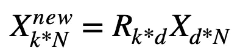
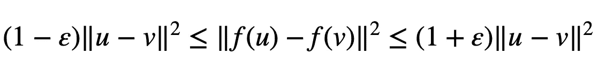
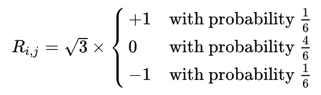

# Python 中的随机投影

> 原文：<https://towardsdatascience.com/random-projection-in-python-705883a19e48>

## 降维

# Python 中的随机投影

## 在这篇文章中，我简要介绍了降维工具——随机投影的概念，以及它在 Python 中的实现。


Gabriella Clare Marino 在 [Unsplash](https://unsplash.com?utm_source=medium&utm_medium=referral) 上拍摄的照片

D 维度缩减通常是处理大数据时必须做的预处理。最广泛使用的方法之一是**主成分分析** ( ***PCA*** )，但是 PCA 的主要缺点是对于高维数据来说计算量非常大。一种替代方法是**随机投影**，这是一种计算成本较低的降维工具。

在这篇文章中，我将简要描述一下*随机投影*的思想及其在 Python 中的实现。

## TLDR

> 1.随机投影适用于高维数据处理。
> 
> 2.随机投影的核心思想在 Johnson-Lindenstrauss 引理中给出。它基本上说明了高维空间中的数据可以被投影到低得多的维空间中，而几乎没有距离失真。
> 
> 3.随机投影中的投影矩阵可以使用高斯分布生成，这被称为高斯随机投影；或者稀疏矩阵，称为稀疏随机投影。
> 
> 4.随机预测可用作管道中的早期步骤之一，以更好地理解数据。
> 
> 5.X_new = `sklearn.random_projection`。GaussianRandomProjection(n _ components = ' auto '，eps = 0.05)。拟合 _ 转换(X)

## 随机投影的概念

随机投影是一种降维工具。“*投影*表示该技术将数据从高维空间投影到低维空间，“*随机*表示投影矩阵是随机生成的。直截了当，对吧？

那么，投影是怎么做的？通过投影矩阵的线性变换。

具体来说，假设我们有一个带有 *d* 行(特征)和 *N* 列(样本)的原始数据集 *X* ，我们希望将特征维数从 *d* 减少到*k*(*d>>k*)。*随机投影*使用随机生成的具有 *k* 行和 *d* 列的投影矩阵 *R* 来获得变换后的新数据集 *X_new* 。



从 k 维到 d 维的投影(图片由作者提供)

随机投影不会改变样本之间的成对相似性(或距离)，这得到了**约翰逊-林登斯特劳斯引理**的支持。它基本上说明了高维空间中的数据可以被投影到低得多的维空间中，而几乎没有距离失真。

如果我们用数学语言来描述这个引理，它是这样的，

给定 *0 < ε < 1* ，一个特征中 *d* 维的数据集 *X* 和 *N* 个数据点*k*>*8ln*(*N*)/*ε*，从 *d* 有一个线性映射(投影) *f*



约翰逊-林登施特劳斯引理方程(图片由作者提供)

其中 *u* 和 *v* 均来自原始特征空间， *f(u)* 和 *f(v)* 来自变换后的特征空间。

基于上面的描述，我们可以看到两件重要的事情。首先，投影并没有完全保持从尺寸 *d* 到尺寸 *k* 的成对距离，而是带有一个误差参数 *ε* 。第二，对于任何固定的 *ε* 和样本大小 *N* ，对于成对距离失真的“可接受”水平，存在最小的最终变换尺寸 *k* 。如果我们仍然想更努力地减少尺寸 *k* ，我们可能需要通过接受更大的 *ε* 来失去失真的容差。

因此，在样本大小固定的情况下，在成对距离的失真 *ε* 和最终特征空间的最小维度 *k* 之间存在权衡。

## 生成投影矩阵的两种方法

生成投影矩阵 *R* 的一种方法是让 *{r_ij}* 遵循正态分布。而另一种方式是使用稀疏随机矩阵作为 *R* 。“稀疏”是指 *{r_ij}* 的大部分为零。典型使用的分布是



稀疏投影矩阵的分布。

稀疏随机投影比高斯随机投影的计算量小，主要是因为两个原因。第一，上面的公式只涉及整数运算；第二，稀疏投影矩阵几乎没有非零值(更稀疏)。

## 实现随机投影的 Python 代码

随机投影作为一种降维工具，可以作为数据分析的前期步骤之一。基于*约翰逊-林登斯特劳斯引理*，我们可以研究数据集的结构，并在一个低得多的维度上可视化数据。

下面是 **Python** 中实现*高斯*和*稀疏随机投影*的代码，

```
# Gaussian Random Projection
**from** **sklearn.random_projection** **import** GaussianRandomProjection

projector = GaussianRandomProjection(n_components='auto',eps=0.05)
X_new = projector.fit_transform(X) 
```

其中 *X* 是我的原始数据， *n_components* 是目标空间的维数( *auto* 表示根据参数自动调整， *ε* )， *eps* 是 *Johnson-Lindenstrauss 引理*中的 *ε* ，*X _ 1*

稀疏随机投影也是如此，

```
# Sparse Random Projection
**from** **sklearn.random_projection** **import** SparseRandomProjection

projector = SparseRandomProjection(n_components='auto',density = 'auto', eps=0.05)
X_new = projector.fit_transform(X)
```

其中*密度*是随机投影矩阵中的非零分量密度。

就是这样！希望文章有帮助。

如果你喜欢读这篇文章，这里有一些其他的片段，

[https://towards data science . com/Gaussian-mixture-models-with-python-36 dabed 6212 a](/gaussian-mixture-models-with-python-36dabed6212a)

[https://towards data science . com/fuzzy-c-means-clustering-with-python-f 4908 c 714081](/fuzzy-c-means-clustering-with-python-f4908c714081)

[https://towards data science . com/regression-splines-in-r-and-python-cfba 3 e 628 BCD](/regression-splines-in-r-and-python-cfba3e628bcd)

## 参考资料:

[](https://en.wikipedia.org/wiki/Random_projection)    [](https://scikit-learn.org/stable/modules/generated/sklearn.random_projection.GaussianRandomProjection.html)  [](https://scikit-learn.org/stable/modules/generated/sklearn.random_projection.SparseRandomProjection.html#sklearn.random_projection.SparseRandomProjection) 