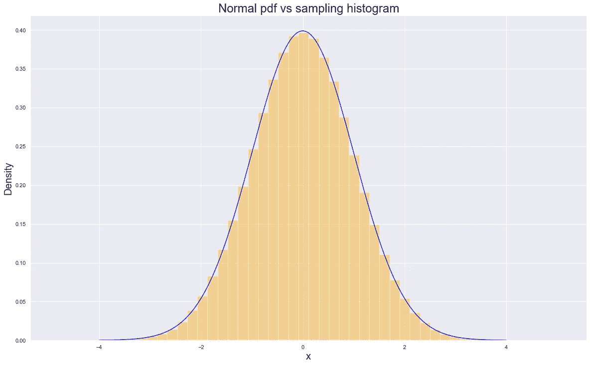
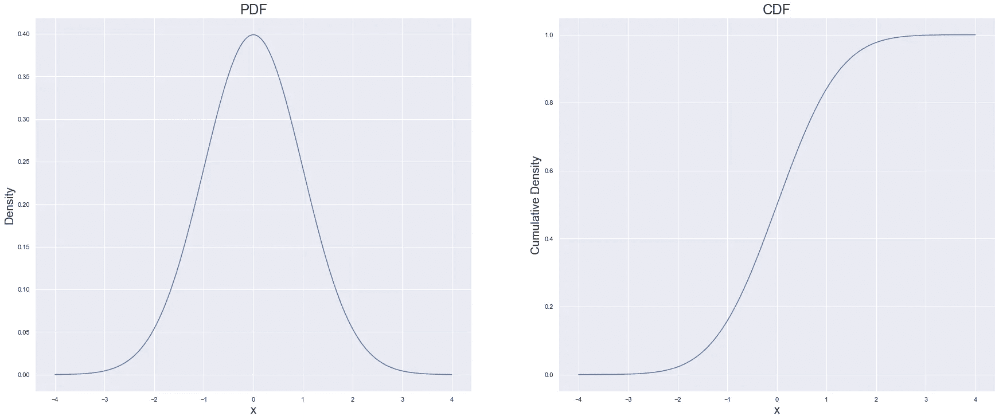
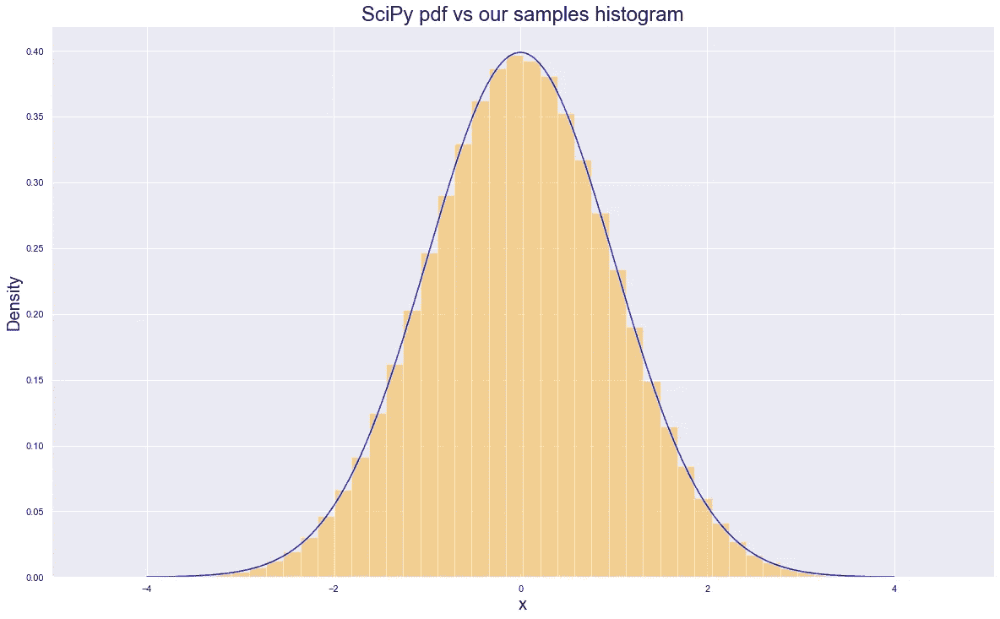

# 用 SciPy 和 NumPy 进行随机抽样:第一部分

> 原文：<https://towardsdatascience.com/random-sampling-using-scipy-and-numpy-part-i-f3ce8c78812e>


由 [Unsplash](https://unsplash.com/s/photos/statistics?utm_source=unsplash&utm_medium=referral&utm_content=creditCopyText) 上的 [Edge2Edge 媒体](https://unsplash.com/@edge2edgemedia?utm_source=unsplash&utm_medium=referral&utm_content=creditCopyText)拍摄

## 介绍采样、编写我们自己的程序、速度测试

能够从你选择的分布中随机抽取样本是非常有用的。它是任何一种随机过程模拟的基础，无论是粒子扩散、股票价格运动，还是模拟任何显示某种时间随机性的现象。

因此，获得准确高效的采样过程非常重要。一旦我们接触到像正态分布这样到处都在使用的分布，这种重要性只会增加。

下面是对 SciPy 和 NumPy 如何为我们打包以使大规模采样非常快速和易于使用的“深入探究”。任何有一点使用 SciPy 历史的人都会告诉你原因如下:

*   它是由一些非常聪明的人写的
*   这是非常优化的代码
*   它使用 C 语言编写的底层数值例程

这都是真的。这里的目的是更深入地了解这是如何发生的，以及为什么聪明人可以用一些聪明的算法让事情变得更快。

## 我为什么要关心“引擎盖下”发生了什么？

因为 SciPy 只能让我们到此为止，尽管[它提供的发行范围相当令人难以置信](https://docs.scipy.org/doc/scipy/reference/stats.html)。当我们想从“自定义分布”中取样时，问题就出现了。如果不是从给定的参数化正态或指数分布中采样，而是从我们自己的分布中开始采样，会怎么样？也许是因为这种分布更好地代表了我们试图拟合的数据，我们希望利用蒙特卡罗过程进行一些测试？

在这些情况下，正如我们将在下面看到的，理解它的工作原理是有好处的，因为:

*   编写自己天真的采样机制可能会慢得令人难以置信
*   理解它的工作原理可以让我们在 SciPy 框架中编写自己的定制发行版

## 采样是如何工作的？

换句话说:给定一个密度函数(pdf)，我如何使用它来绘制随机样本，如果我绘制它们，它们将形成与 pdf 相同形状的直方图？为了给这个陈述增加一点视觉效果，让我们用一个正态分布的例子。使用 SciPy，让我们绘制 pdf，然后生成一系列随机样本，然后再深入了解:

*   它是如何产生这些样本的
*   它怎么做得这么快



作者图片

因此，蓝色线显示我们绘制的 pdf，橙色直方图显示我们从同一分布中提取的`1,000,000`样本的直方图。**这是采样——给定一条指定的蓝线(无论它可能采取什么形状)，我们如何定义一个过程(最好是快速准确的)，可以生成形成与蓝线一致的直方图的数字。**

要回答最初的问题*我们如何*做到这一点，答案是:视情况而定。有许多方法可以做到这一点，每种方法都有优点和缺点。我们会发现其中一些方法比其他方法快得多。首先，我们将关注一种特定的方法，这种方法是通用的，我们将使用它作为比较 SciPy 速度的基线。如果我们没有可以与之比较的东西，我们就不能称之为 SciPy fast。

## 逆变换采样(ITS)

这里有一些想法，在编写一些基本代码来说明和形成我们的速度基准之前，我们将尝试将其浓缩成几个简短的段落。首先，我们将解决以下问题— **生成随机数需要某种随机数生成器**。

不管我们想从哪个分布中得到它们，我们都需要某种潜在的随机过程。在计算机的情况下，这个过程不可能是真正随机的，因为它需要能够被编程到机器中，但是它们可以是“伪”随机的。

换句话说，如果我们不知道生成这些数字的基本过程，那么它们对我们来说可能是随机的，即使它们对生成过程来说不是随机的。借用纳西姆·塔勒布的话，圣诞节那天对火鸡随机的东西对农民来说并不随机——这完全取决于你的信息集。这种过程被称为伪随机数发生器(PRNG ),有许多竞争对手提供。

让我们想当然地认为，我们有这样一个 PRNG，它产生这些随机数，这些随机数来自均匀分布。如果你对这些数字究竟是如何产生的感到好奇，那么我已经在这里写了一个解释器，但是对于这篇文章来说，说这样一个过程存在就足够了。

[](/where-does-python-get-its-random-numbers-from-81dece23b712) [## python 的随机数是从哪里来的？

towardsdatascience.com](/where-does-python-get-its-random-numbers-from-81dece23b712) 

一旦我们有了这些均匀分布的数字，我们就需要一种方法来*将*转换成符合我们指定的 pdf 的数字(上面的蓝线)。为此，我们可以利用[以下定理](https://en.wikipedia.org/wiki/Probability_integral_transform)。事实证明，如果我们:

*   从连续的概率分布中抽取一批数字
*   获取所有这些样本的 cdf 值

**…这些 cdf 值的分布将是均匀分布的。**这里有一个很棒的 gif [图](https://gfycat.com/unfitflatflounder)展示了标准正态分布的过程。但是对我们来说更有用的是反过来——或者说*反*。如果我们从一堆均匀分布的随机数开始(我们的 PRNG 会给我们)，那么我们可以在“逆”cdf 上发射它们，并获得一堆遵循我们想要的分布的数。这就是逆变换采样。

来自[https://gfycat.com/unfitflatflounder](https://gfycat.com/unfitflatflounder)的 GIF

## 我们能把这个编码吗？

绝对的。写下来并创建我们自己的正态分布随机抽样器有两个目的:

*   提供一个模拟上述理论解释的代码
*   为 SciPy 实现创建一个纯 python 比较来检查速度

首先让我们定义我们的 pdf。我们不会给 SciPy 太多的优势，所以为了保持合理的速度，我们将:

*   利用 NumPy 进行矢量化计算
*   将`sqrt(2 * pi)`编码为浮点数，以保存乘法和 sqrt 操作

```
# define std normal pdf
def norm_p(x):
    return np.exp(-0.5 * x**2) / 2.5066282746310002
```

接下来，我们需要创建 cdf，这样我们就可以反转它。为此，我们将:

*   定义一个数值范围，并计算每个数值的 pdf
*   归一化 pdf 值，这样我们就有了一个密度函数，即 pdf 下的面积为`1`
*   使用“累积分布函数”中的“累积”来创建 cdf:我们只需对这些 pdf 值应用累积和来创建我们的 cdf

下面的代码实现了这一点，为了更好地衡量，我们将绘制创建的 pdf 和 cdf 以供检查。



作者图片

所以看起来在意料之中。现在我们需要获取生成的 CDF——此时它只是一组 x 值的累积概率值，并将其转换为一个函数。特别是我们想把它变成反函数。幸运的是，我们可以依靠 SciPy 并使用插值函数`interp1d`:

```
# generate the inverse cdf
func_ppf = interp1d(my_cdf, xs, fill_value='extrapolate')
```

我们称之为“PPF”——百分点函数，因为这与 SciPy 术语一致，但这正是我们想要实现的——反向 cdf 函数。现在我们有了这个函数，我们可以用它来:

*   首先:向它发射均匀分布的随机数，从标准正态分布中产生样本
*   第二:比较它与内置的 SciPy 采样相比有多快

## 分配检查

首先，让我们仔细检查一下，以确保我们是根据正确的分布来生成数字的——换句话说，我没有将一个错误集中到上面几行代码中。如前所述，现在我们有了反向 cdf，我们只需要向它发射随机均匀分布的数。我们如何获得那些均匀分布的随机数？

让我们利用 NumPy 中的随机数生成器:



作者图片

因此，我们可以确信我们创建的函数确实从标准正态分布中抽取了随机样本——我们的橙色直方图与 SciPy 生成的代表 pdf 的蓝色线条对齐。

## 速度

现在进入主要问题——我们生成的函数与 SciPy 相比如何？

```
%timeit func_ppf(np.random.uniform(size=n))2.32 s ± 264 ms per loop (mean ± std. dev. of 7 runs, 1 loop each)%timeit snorm.rvs(size=n)56.3 ms ± 1.08 ms per loop (mean ± std. dev. of 7 runs, 10 loops each)
```

因此，即使我们尽了最大努力来创建一个正态分布采样器的有效实现，我们仍然比做同样事情的 SciPy 慢。这就引出了下一个问题:为什么？

## 概述

在深入研究 SciPy 和 NumPy 代码库以弄清楚为什么我们在速度方面仍然落后之前，让我们简单回顾一下我们已经建立的东西:

*   抽样是抽取随机数的过程，这些随机数作为一个集合遵守给定的 pdf
*   有许多方法可以实现这种采样，其中一种方法称为逆变换采样
*   它依赖于在插入均匀分布的随机数之前对给定分布的 cdf 求逆
*   即使有相当有效的自我实现，我们也比 SciPy 慢大约`40x`

记住这一点，[让我们继续第二部分](/random-sampling-with-scipy-and-numpy-part-ii-234c2385828a)，开始挖掘 SciPy 和 NumPy 代码库。

[](/random-sampling-with-scipy-and-numpy-part-ii-234c2385828a) [## 用 SciPy 和 NumPy 随机抽样第二部分

towardsdatascience.com](/random-sampling-with-scipy-and-numpy-part-ii-234c2385828a)