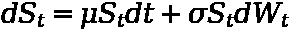
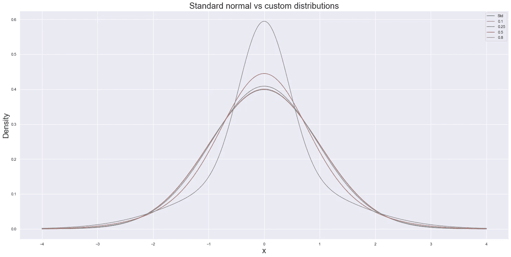
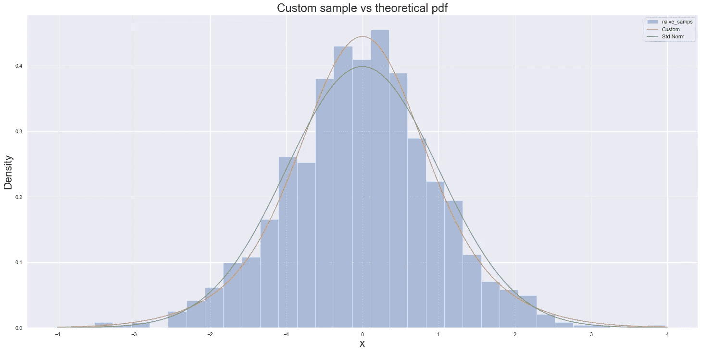
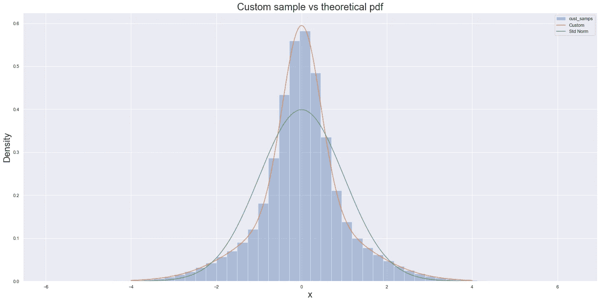

# 使用 SciPy 和 NumPy 的随机抽样:第三部分

> 原文：<https://towardsdatascience.com/random-sampling-with-scipy-and-numpy-part-iii-8daa212ce554>


由[米克·豪普特](https://unsplash.com/@rocinante_11?utm_source=unsplash&utm_medium=referral&utm_content=creditCopyText)在 [Unsplash](https://unsplash.com/s/photos/numbers?utm_source=unsplash&utm_medium=referral&utm_content=creditCopyText) 上拍摄

## 在 SciPy 中实现自定义分布采样

在前两部分([第一部分](/random-sampling-using-scipy-and-numpy-part-i-f3ce8c78812e)、[第二部分](/random-sampling-with-scipy-and-numpy-part-ii-234c2385828a))中，我们快速介绍了采样需要什么，然后深入研究了 NumPy 和 SciPy 的源代码，以准确理解这在现代 python 库中是如何实现的。

当我们通常不关心底层过程时，所有这些看起来都是多余的——我们很高兴智能体操由巧妙构建的导入库来处理，并让我们专注于利用输出来完成更有洞察力的任务(如蒙特卡洛模拟)。

然而，有时我们会遇到标准库不太适合的用例。下面是一个这样的例子，提供了一个理解这两者的例子:

*   采样(尤其是逆变换采样)背后的理论思想
*   这种采样过程的程序实现

可以在一个不可行的缓慢实现和一个几乎可以与 NumPy 和 SciPy 背后的聪明人的优化工作相媲美的实现之间做出区别。

## 为什么我需要从自定义分布中取样？

在很多场合。而在正常情况下(请原谅这个双关语),默认的做法是:

*   收集数据并绘制直方图
*   得出数据大致正常的结论(即呈钟形)
*   拟合一个合适的正态分布并完成它

在有些情况下，这并不能完全解决问题。下面是我的特例，但可以推广到任何一个预先打包的发行版，不管参数化得多好，都不够好。

## “保方差尾肥”

这听起来比实际上要美好得多。[几何布朗运动(GBM)](https://en.wikipedia.org/wiki/Geometric_Brownian_motion) 由以下方程定义:



作者图片

简而言之，在某个时间增量`dt`内，我们的过程值`S`的变化由两部分组成:

*   一些常数确定性漂移项
*   一些随机项

重要的是，GBM 的特点是随机元素呈正态分布——`dW`元素被称为[维纳过程](https://en.wikipedia.org/wiki/Wiener_process)或更常见的“随机游走”。我的问题如下——我想模拟这些“随机路径”的负载，但我不想从正态分布中取样我的随机变化。

相反，我想创建自己的“定制”分布——特别是我想要一个方差保持变换(即方差仍然是标准正态的`1`),但该分布有着丰富的尾部(过度峰度)。那么问题就变成了:

## 我如何在 SciPy/NumPy 框架中做到这一点？

在开始之前，让我们先快速了解一下以下 pdf 之间的区别:

*   标准正态分布
*   我希望从中取样的分布

为了创建我想要的厚尾分布，我将利用[詹森不等式](https://en.wikipedia.org/wiki/Jensen's_inequality)。具体来说，我将利用这样一个事实，即如果我们取两个平均方差为`1`的正态分布的平均密度，那么我们将得到一个“身材更高”和“尾部更胖”的分布，即峰度更大，但仍保持像标准正态分布一样的方差`1`。

更清楚地说，我们的厚尾分布将是通过平均得到的 pdf:

*   有方差的正态分布`1 + e`
*   方差为正态分布`1 - e`

其中`e`被限制在`[0,1]`之间。让我们画出这个图，这样我们就可以看到当我们改变`e`与标准正态分布相比时，这些分布是什么样子。



作者图片

如上所述，我们的平均分布显示了更高的身体和更胖的尾巴。特别是，我们看到所有的定制分布在几乎相同的点上与标准正态分布交叉——肩部大约为+/-0.66，尾部大约为+/-2.13。事实上，我们可以用这个特性来定义当我们谈论“尾部”时，我们实际上指的是概率分布的哪一部分，而不仅仅是一个抽象的概念。

更专业地说，尾部是由凸方差概率分布的密度定义的。简单来说，一旦我们改变方差(而不是一个常数`1`)，在上面的分布中+/-2.13 之外的密度增加了。

这与通常流传的关于厚尾分布如何与峰度相关的观点非常吻合——因为峰度只是四阶矩，或者换句话说，是方差的方差。改变方差(通过我们上面的分布平均),我们开始得到厚尾的 pdf。

现在我们知道了我们要实现的发行版，让我们来实现它。

## 尝试 1:简单，幼稚但缓慢(真的很慢)

尽管这种方法太慢了，根本不能成为真正的解决方案，但 SciPy 内置了所有这些功能，这还是很了不起的。方法是这样的:

*   创建一个从`rv_continuous` SciPy 类继承的定制分发类
*   只需定义反映我们所追求的定制发行版 pdf 的`_pdf`方法
*   SciPy 做了所有其他事情来允许我们从这个定制发行版中进行采样

要快速回顾一下什么是`rv_continuous`类或者 SciPy 的分布结构，那么最好[跳回第二部分](/random-sampling-with-scipy-and-numpy-part-ii-234c2385828a)快速回顾一下`rv_continuous`是如何继承`rv_generic`的。否则，让我们继续写我们天真的实现，`naive_cust_dist`:

现在我们已经定义了它，让我们做两件事:

*   从中抽取样本，检查我们从这些样本中生成的直方图是否与我们定义的 pdf 一致
*   快速测试我们抽取这些样本并与 SciPy 的嵌入式正态分布采样进行比较需要多长时间



作者图片

上面显示了从我们的自定义类`naive_cust_dist`中采样`1,000`数字得到的直方图，该自定义类实现了我们想要从中采样的 pdf。正如我们所见，直方图很大程度上与理论 pdf(绿线)一致，这与标绘的标准正态 pdf 明显不同。

所以理论上就是这样。我们已经实现了自定义采样，只定义了`_pdf`方法，其余的由 SciPy 完成。

## “其余的”是什么？

正如在第一部分中提到的，有许多不同的方法从一个分布中抽取样本。然而，它们都没有单独将 pdf 作为输入，并使用它来生成随机数，如果我们将它们绘制成直方图(如上)，我们将恢复相同的 pdf。相反，我们需要:

*   巧妙的算法(例如，像金字形神算法这样的拒绝采样算法)
*   利用逆变换采样的逆累积分布函数(cdf)

算法可以是特定于发行版的，当实现定制发行版时，SciPy 使用逆变换采样，这需要后者:逆 cdf。因此，“其余”包括:

*   根据给定的`_pdf`计算`_cdf`
*   从 cdf 计算【SciPy 给逆向 cdf 起的名字——“百分点函数”)
*   使用该`_ppf`函数通过使用 PRNG 生成均匀分布的随机数并使用逆变换采样来产生样本

问题如下:

## 做“其余的”是极其缓慢的

下面显示了速度有多慢——从我们的定制发行版中计算一个仅仅是`1,000`的样本就需要花费超过`30s`的时间。

```
%timeit naive_dist.rvs(size=n)32.6 s ± 4.57 s per loop (mean ± std. dev. of 7 runs, 1 loop each)
```

我们可以将其与使用 SciPy 从正态分布中采样的`1,000`数字进行比较。

```
%timeit stats.norm.rvs(size=n)168 µs ± 29.1 µs per loop (mean ± std. dev. of 7 runs, 10,000 loops each)
```

所以要明确的是，我们几乎比内置的 SciPy 采样方法慢`200,000x`。然而，有问题的不仅仅是速度有多慢的相对性质——从绝对意义上来说，仅用`30s`来采样`1,000`数字是不可行的，特别是如果我们想要做一些类似于采样`10,000`路径的事情，其中每条路径都由`1,000`步骤组成。我们不能每次想运行模拟都等`3.5`天。

## 为什么这么慢？

在使用我们从第一部分和第二部分中学到的知识来创建一个更好的解决方案之前，让我们快速找出为什么内置的 SciPy 功能如此之慢。要回答这个问题，我们需要深入研究 SciPy 源代码，找到`_ppf`方法——特别是它调用的`_ppf_single`方法(像 NumPy 这样命名 SciPy 是为了便于快速计算数字集合)。下面是代码片段，但是如果你喜欢自己阅读 Github 源代码，你可以点击这里:

换句话说，以上是逆变换采样的实现，其利用求根算法( [Brent 的方法](https://en.wikipedia.org/wiki/Brent's_method))来将给定随机数`q`从均匀分布转换成来自我们选择的定制分布的数。即使不深入算法的本质，这个过程也需要:

*   两个`while`循环
*   数值积分函数

应该表明这种功能的速度可能不足。相反，我们想避开这个过程，实现我们自己的`_ppf`。换句话说，让我们把在第一部分中创建的逆向 cdf 放到 SciPy 发行框架中。

## 尝试 2:可行的解决方案

所以我们将返回到创建我们自己的分发类，它继承了 SciPy 中的通用`rv_continuous`类。然而，除了定义一个`_pdf`方法，我们还要定义一个`_ppf`方法。

怎么会？我们将实现第一部分中的反变换采样方法。这意味着当我们实例化我们的类时，我们需要做更多的工作。更具体地说，我们需要通过以下方式创建`ppf`:

*   首先通过对`pdf`进行累积求和来创建`cdf`
*   使用 SciPy 的内置`interp1d`函数来反转它，最后得到我们的反转`cdf`

一旦我们有了它，我们就可以将它设置为我们的`_ppf`方法，以防止 SciPy 从方法 1 开始进行数学体操，这使得它慢得不可行。

现在我们已经定义了它，让我们试一试。就像之前一样，让我们检查它是否生成了与我们定义的`pdf`一致的样本，然后我们可以检查我们是否得到了速度方面的可行解决方案。



作者图片

因此，我们似乎又一次实现了期望的采样分布。现在让我们来看看额外的代码和复杂性在加速方面是否值得。

```
%timeit my_dist.rvs(size=1000)1.84 ms ± 512 µs per loop (mean ± std. dev. of 7 runs, 100 loops each)%timeit stats.norm.rvs(size=1000)116 µs ± 5.21 µs per loop (mean ± std. dev. of 7 runs, 10,000 loops each)%timeit my_dist.rvs(size=10000000)12.8 s ± 1.62 s per loop (mean ± std. dev. of 7 runs, 1 loop each)
```

因此，我们仍然比 SciPy 慢得多(大约在`15x`)，但这比我们以前的`200,00x`方法有了巨大的改进。我们现在有了一个解决方案，可以在`15s`多一点的时间内产生`10,000,000`个随机数——与我们之前实现的`3.5`天相比，这个时间要合理得多。

## 结论

SciPy 提供了广泛的打包发行版，可以快速采样。这种采样是特定于发行版的，是为了利用 C 语言的速度、优化的 python 代码和最有效的采样过程而编写的。虽然这是一个无价的资源，在大多数情况下将提供一个充分的解决方案，但确实有需要定制分布采样的时候。

更深入地了解 SciPy 的分发体系结构，特别是它如何依赖于 NumPy，如上所示，可以决定一个精确但不可行的缓慢解决方案和一个与 SciPy 的超高速实现相差不远的解决方案。