# 随机种子和再现性

> 原文：<https://towardsdatascience.com/random-seeds-and-reproducibility-933da79446e3>

## 在 Python、Numpy 和 PyTorch 中设置您的实验

克里斯蒂安·朱德雷在 [Unsplash](https://unsplash.com?utm_source=medium&utm_medium=referral) 上拍摄的照片

# 动机

> “程序员最可怕的噩梦是什么？”

就我而言，我可以有把握地说，作为一名程序员，我最糟糕的噩梦是一段**代码，它的行为就好像是随机的**，每次运行它都会产生**不同的结果，即使我给它**完全相同的输入**！**

实际上有一个著名的关于精神错乱的定义:

> **“疯狂就是一遍又一遍地做同样的事情，却期待不同的结果。”**

尽管人们通常认为这是阿尔伯特·爱因斯坦的功劳，但研究表明事实并非如此。但是，撇开引用的作者不谈，事实仍然是:一遍又一遍地给一段代码输入相同的输入，每次都得到不同的结果，会让你发疯的:-)

> 本帖包含部分转载自我的书内容:**[**深度学习用 PyTorch 循序渐进:初学者指南**](https://pytorchstepbystep.com) **。****

# **(伪)随机数**

> **"一个人怎么可能调试和修复这样的东西？"**

**幸运的是，对于我们程序员来说，我们不必处理真正的随机性，而是处理伪随机性。**

> **“什么意思？”**

**嗯，你知道，随机数并不完全是随机的……它们实际上是伪随机的，也就是说，一个数字生成器抛出一系列数字，看起来像是随机的。但是是**不是**，真的。**

**这种行为的好处是我们可以**告诉生成器启动一个特定的伪随机数序列**。在某种程度上，它的工作原理就好像我们告诉生成器:“*请生成序列#42，*”，它就会溢出一个数字序列。**

**这个数字 42 的作用类似于序列的**索引，被称为**种子**。每次我们给它**相同的种子**，它都会生成**相同的数字**。****

> **"同样的老种子，同样的老号码。"**

**这意味着我们有两个世界最好的**:一方面，我们做**产生**一个数字序列，对于所有意图和目的来说，**被认为是随机的**；另一方面，我们有能力复制任何给定的序列。我确信您能够理解这对于调试目的和避免精神错乱是多么方便:-)。****

****此外，你可以保证其他人能够复制你的结果。想象一下，运行从博客帖子或书籍中获得的代码，每次都得到不同的输出，不得不怀疑它是否有问题，这是多么令人讨厌的事情。****

****在学习一个新主题时，您最不需要的就是失去平衡，因为每次运行一些代码时，您都会得到不同的结果(除了有一个种子集之外，代码很可能完全正确)。但是，通过正确设置随机种子，您和我，以及运行代码的每个人，都可以获得完全相同的输出，即使这涉及到生成随机数据！****

# ****生成随机数****

****虽然种子叫做*随机*，但是它的*选择*肯定不是！通常，你会看到选择的随机种子是 [42](https://bit.ly/2XZXjnk) ，这是一个人可能选择的所有随机种子中[(第二个)最不随机的](https://bit.ly/3fjCSHR)。****

****因此，我们也在本帖中向将种子设定为 42 的悠久传统致敬。在纯 Python 中，您使用`[**random.seed()**](https://docs.python.org/3/library/random.html#random.seed)`来设置种子，然后您可以使用`[**random.randint()**](https://docs.python.org/3/library/random.html#random.randint)`来绘制一个随机整数，例如:****

****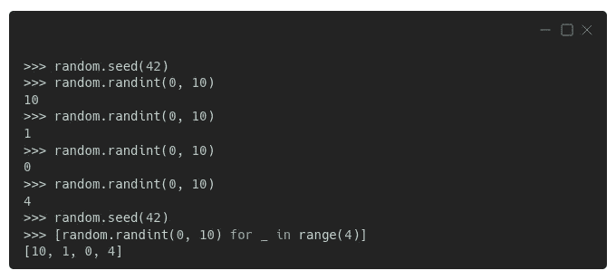****

****设定种子后抽取四个随机整数。图片作者。****

****看到了吗？*完全决定论*！一旦你将随机种子设置为 42(显然！)，生成的前四个整数依次是 10、1、0 和 4，无论您是一个接一个地生成它们，还是在一个列表中理解它们。****

> ****如果你对生成本身感到好奇，Python 的 random 模块使用了 **Mersenne Twister 随机数生成器**，这是一个**完全确定性算法**。这意味着该算法对于解决再现性问题来说很棒，但是完全不适合用于加密目的。****

****数字**发生器**有一个**内部状态**，它跟踪从特定序列中提取的最后一个元素(每个序列由其对应的种子标识)，因此它知道从哪里挑选下一个元素。****

****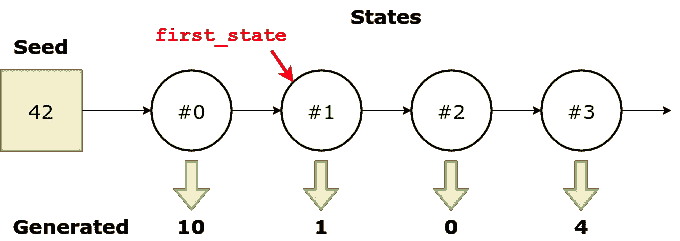****

****种子#42 的状态序列和相应的生成号。图片作者。****

****如果您愿意，可以使用`[**random.getstate()**](https://docs.python.org/3/library/random.html#random.getstate)`和`[**random.setstate()**](https://docs.python.org/3/library/random.html#random.setstate)`来检索(和设置)该状态:****

****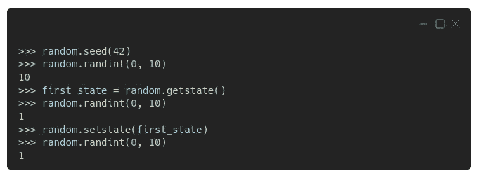****

****让生成器“忘记”抽取了一个数字！图片作者。****

****不出所料，第一个数字还是 10(因为我们使用了同一个种子)。此时，发生器的内部状态记录了从序列中只抽取了一个数字。我们将这个州命名为`**first_state**`。****

****所以我们又画了一个，我们得到了，不出所料，数字 1。内部状态会相应地更新，但我们会将其设置回绘制第二个数字之前的状态。****

****现在，如果我们绘制另一个数字，我们将再次得到数字 1，因为我们通过更新它的内部状态，迫使生成器“*忘记*”最后绘制的数字。****

****这些数字看起来不再是随机的了，嗯？****

> ****"是的，但是我必须问…那个州有什么？"****

****很高兴你问了。它只是一个元组！第一个元素是 version (3)，第二个元素是 625 个整数的长列表(内部状态)，最后一个元素通常是`**None**`(你可以暂时放心地忽略它)。****

****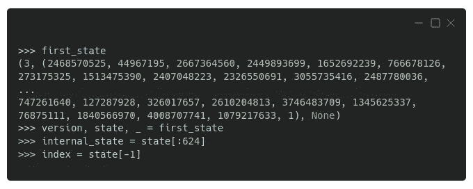****

****生成器的内部状态(仅显示第一行和最后一行)。图片作者。****

****看到最后那个“1”了吗？那是列表的第*625 个元素，它作为其他元素*的索引*—**实际内部状态由前 624 个元素**表示。记住这一点，我们将很快回到它！*****

> ****"好吧，那么我们很好，现在一切都完全可以复制了？"****

****我们还没有到那一步…如果你查看 Python 的“ [*关于再现性的注释*](https://docs.python.org/3/library/random.html#notes-on-reproducibility) ”，你会看到:****

> ****“通过重用种子值，只要多个线程没有运行，相同的序列就应该可以在不同的运行**之间重现。”******

****所以，如果你是多线程的，再现性就拜拜了！从好的一面来看，Python 的(伪)随机数生成器(从现在开始姑且称之为 RNG)有两个保证(从“*注释*”转录而来):****

*   ****如果添加了新的播种方法，那么将提供向后兼容的播种机。****
*   ****当兼容的播种机被给予相同的种子时，生成器的`random()`方法将继续产生相同的序列。****

> ****“好了，现在我们好了吗？”****

****抱歉，但是不行！Python 自己的 RNG 是**而不是唯一一个**你可能需要设置种子的。****

## ****Numpy****

****如果你也使用 Numpy，你需要为它自己的 RNG 设置一个种子。为此，您可以使用`[**np.random.seed()**](https://numpy.org/doc/stable/reference/random/generated/numpy.random.seed.html)`:****

****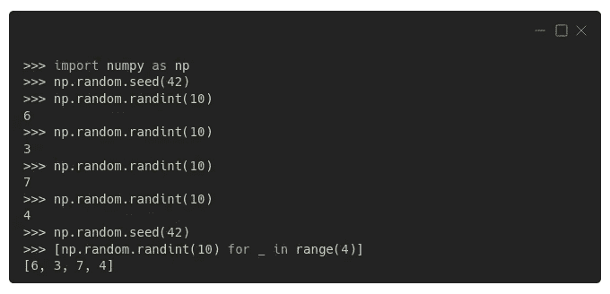****

****Numpy 中的随机数(传统)。图片作者。****

****从上面的例子可以看出，Numpy 的 RNG 的行为方式与 Python 的 RNG 相同:一旦设置了种子，生成器就输出完全相同的数字序列，6、3、7 和 4。****

****虽然上面的代码是最常见的“T7”，而且许多人一直这样使用它(包括我自己，被指控有罪)，但它已经被认为是**遗留的**代码。****

****从 1.17 开始，更近的 Numpy 版本使用不同的方式生成(伪)随机数:**首先创建一个生成器**，然后**从中抽取数字**。用户可以使用`[**np.random.default_rng()**](https://numpy.org/doc/stable/reference/random/generator.html#numpy.random.default_rng)`创建默认生成器:****

****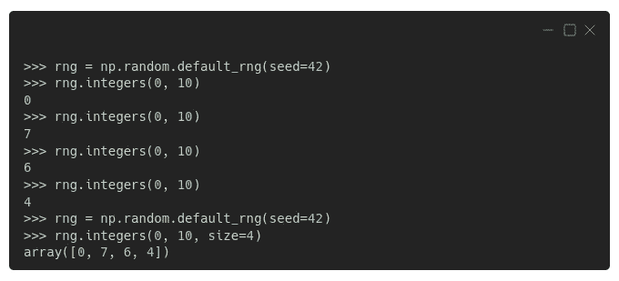****

****Numpy 中的随机数(最新)。图片作者。****

> ****“等等，现在数字不一样了吗？”****

****是的，它们**不同**，尽管我们使用的是**相同的种子**，42。****

> ****“那是为什么？”****

****数字不同是因为**发生器与**不同，也就是说，它使用了**不同的算法**。Numpy 的遗留代码使用 *Mersenne Twister (MT)* 算法，就像 Python 的 random 模块一样，而 **Numpy 的新默认生成器**使用 *Permute 同余生成器(PCG)* 算法。****

****但是，事实证明，即使 Numpy 的遗留代码和 Python 的随机模块使用相同的算法，并且我们在它们两者中使用相同的种子，生成的数字仍然*不同*！****

> ****“你一定是在和我开玩笑！为什么？!"****

****我理解你可能会感到沮丧，这种差异归结为*Python 的随机模块和 Numpy 处理生成器内部状态*中讨厌的“索引”的方式。如果你对这方面的更多细节感兴趣，请查看下面的旁白——否则，请随意跳过它。****

## ****匹配内部状态****

****如果我们使用相同的 624 个数字的列表来更新两个生成器的状态，同时将“索引”设置为 624(就像 Numpy 默认设置的那样)，这就是我们得到的结果:匹配序列！****

****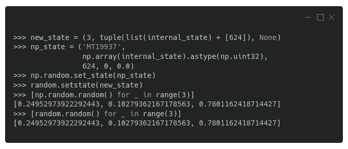****

****匹配 Python 的 random 和 Numpy 的内部状态。图片作者。****

*****正如您在上面的代码中看到的，还可以分别使用* `[***set_state()***](https://numpy.org/doc/stable/reference/random/generated/numpy.random.set_state.html)` *和* `[***get_state()***](https://numpy.org/doc/stable/reference/random/generated/numpy.random.get_state.html)` *来检索或设置 Numpy 的生成器的内部状态，并且状态本身在其元组中有更多的元素(‘mt 19937’代表 Mersenne Twister (MT)及其范围(顺便说一下，2 ⁹⁹ ⁷-1))，但是我们不会对此进行任何深入的研究。毕竟，在 Numpy 中，您不太可能需要修改生成器的内部状态…*****

****还有一点需要指出，转自 Numpy 的`[**Generator**](https://numpy.org/doc/stable/reference/random/generator.html#numpy.random.Generator)`文档，一个标题为“ ***无兼容性保证*** ”的章节:****

> ****`Generator`不提供版本兼容性保证。特别是，随着更好的算法的发展，比特流可能会改变。****

****谁说确保再现性很容易？不是我！****

> ****请记住:为了真正的再现性，您需要使用相同的随机种子、相同的模块/包和相同的版本！****

****是时候换一个不同的包了！****

## ****PyTorch****

****就像 Numpy 一样，PyTorch 也有自己设置种子的方法，`[**torch.manual_seed()**](https://bit.ly/3hOwklL)`，为所有设备(CPU 和 GPU/CUDA)设置一个种子:****

****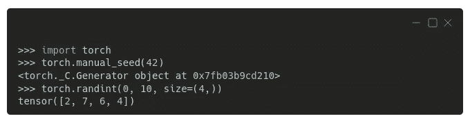****

****PyTorch 中的随机数(CPU)。图片作者。****

****正如您可能已经预料到的，生成的序列又是不同的。**新包装，新顺序**。****

****但还有更多！如果你在一个**不同的设备**中生成一个序列，比如你的 GPU ( `**'cuda'**`)，你会得到**又一个序列**！****

****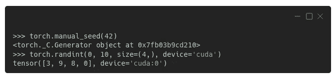****

****PyTorch 中的随机数(CUDA/GPU)。图片作者。****

****在这一点上，这不应该是一个惊喜，对不对？此外，PyTorch 关于[再现性](https://pytorch.org/docs/stable/notes/randomness.html)的文档非常简单明了:****

> ****“不能保证 PyTorch 版本、单个提交或不同平台的结果完全可重复。此外，即使使用相同的种子，CPU 和 GPU 执行之间的结果也可能不可重复。”****

****因此，我相应地更新了上一节的建议:****

> ****请记住:为了真正的再现性，您需要使用相同的随机种子、相同的模块/包、相同的版本、相同的平台、相同的设备，甚至可能是相同的驱动程序(例如，您的 GPU 的 CUDA 版本)！****

****也许你注意到了上面输出中的一个`**Generator**` …不出所料，PyTorch 也使用生成器，就像 Numpy 一样，并且那个生成器是 **PyTorch 的默认生成器**。我们可以使用`[**torch.default_generator**](https://pytorch.org/docs/stable/torch.html#torch.torch.default_generator)`检索它，并使用`[**manual_seed()**](https://pytorch.org/docs/stable/generated/torch.Generator.html#torch.Generator.manual_seed)`方法设置它的种子:****

****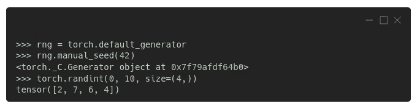****

****PyTorch 的默认生成器。图片作者。****

****您也可以创建另一个生成器，并将其用作其他函数或对象的参数:****

****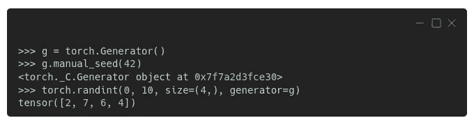****

****在 PyTorch 中创建和使用生成器。图片作者。****

****有一种情况下使用自己的生成器特别有用:数据加载器中的采样。****

## ****数据加载器****

****在为训练集创建数据加载器时，我们通常将其参数`**shuffle**`设置为`**True**`(因为在大多数情况下，混合数据点可以提高梯度下降的性能)。这是一种非常方便的**混洗数据**的方式，它是使用引擎盖下的`[**RandomSampler**](https://pytorch.org/docs/stable/data.html#torch.utils.data.RandomSampler)`实现的。每次请求一个新的小批量时，它会随机采样一些索引，并返回对应于这些索引的数据点。****

****即使不涉及混洗，也要使用`[**SequentialSampler**](https://pytorch.org/docs/stable/data.html#torch.utils.data.SequentialSampler)`，这在用于验证集的数据加载器中是很典型的。在这种情况下，每当请求新的小批量时，该采样器简单地按顺序返回一系列索引，并且返回对应于那些索引的数据点。****

****从 PyTorch 1.7 开始，为了保证再现性，**我们需要给** `[**DataLoader**](https://pytorch.org/docs/stable/data.html#torch.utils.data.DataLoader)`分配一个生成器，所以在相应的采样器中使用它(当然前提是它使用生成器)。****

****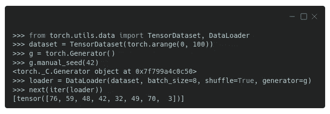****

****将生成器分配给数据加载器。图片作者。****

****实际上，我们可以从加载器中检索采样器，检查其初始种子，并根据需要手动设置不同的种子:****

****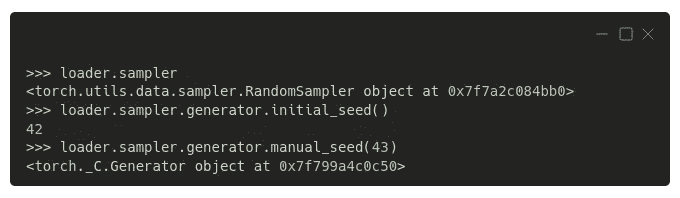****

****手动设置装载机发电机的种子。图片作者。****

****我们将在几个部分中这样做，同时编写一个函数来使用"*一个种子来统治所有的* " :-)****

****为数据加载器分配一个生成器将会覆盖您，但是只有当您在主进程 ( `**num_workers=0**`，默认)中加载数据时**。如果您想要使用**多重处理来加载数据**，也就是说，指定更大数量的工人，您还需要**为您的数据加载器**分配一个** `**worker_init_fn()**` **，以避免您的所有工人绘制完全相同的数字序列。让我们看看为什么会出现这种情况！******

**PyTorch 实际上可以在上面的情况下照顾自己——[它用不同的编号](https://pytorch.org/docs/stable/data.html#randomness-in-multi-process-data-loading)播种每个 worker，也就是`**base_seed + worker_id**`，但是它不能照顾其他的包(比如 Numpy 或者 Python 的 random 模块)。**

**我们可以使用作为参数传递给数据加载器的`**seed_worker()**`函数中的一些打印语句来看看发生了什么:**

**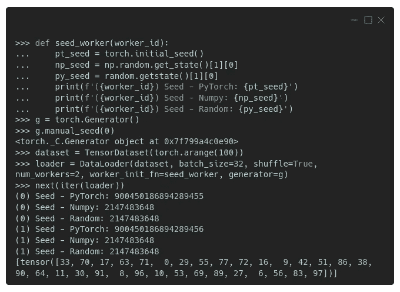**

**看一眼每个工人使用的种子。图片作者。**

**有两个工人，(0)和(1)，每次调用一个工人执行任务时，`**seed_worker()**`函数打印 PyTorch、Numpy 和 Python 的 random 模块使用的种子。**

**你可以看到 PyTorch 使用的种子刚刚好——第一个工人使用一个以 55 结尾的数字；第二个工人的，一个以 56 结尾的号码，不出所料。**

> **但是 Numpy 和 Python 的 random 模块使用的**种子**是跨 worker 的**相同，这也是我们要**避免**的。不过，不同模块之间的种子可以相同。****

**幸运的是，有一个简单的解决方法:我们**在** `**seed_worker()**` **函数**中包含一些种子设置语句，使用 PyTorch 的初始种子(并将其调整为 32 位整数)，而不是打印语句:**

**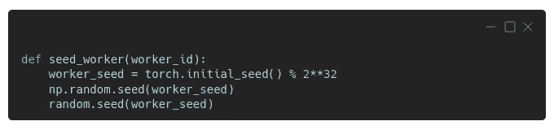**

**适当地播种工人。图片作者。**

**现在每个工人将为 PyTorch、Numpy 和 Python 的 random 模块使用不同的种子。**

> **“好的，我明白，但是如果我只使用 PyTorch，为什么我需要播种其他的包呢？”**

## **播种 PyTorch 是不够的！**

**您可能认为，如果您没有在代码中显式使用 Numpy 或 Python 的 random 模块，您就不需要关心为它们设置种子，对吗？**

**也许你没有，但是最好**稳妥一点，为一切设置种子:PyTorch，Numpy，甚至 Python 的 random 模块**，这就是我们在上一节中所做的。**

> **“那是为什么？”**

**原来，PyTorch *可能*用的是不属于自己的发电机！老实说，当我发现这件事的时候，我也很惊讶！听起来可能很奇怪，在 0.8 之前的 **Torchvision 版本中，仍然有一些**代码依赖于 Python 的随机模块，而不是 PyTorch 自己的随机生成器**。当使用一些用于数据扩充的随机转换时，问题就出现了，比如`**RandomRotation()**`、`**RandomAffine()**`等等。****

## **库达**

**手动设置 PyTorch 的种子对 CPU 和 CUDA/GPU 都有效，正如我们在前面几节中看到的那样。但是由 **CUDA 卷积运算**使用的 cuDNN 库仍然可能是**非确定性**行为的来源。**

**事实证明，根据所提供的参数以及底层硬件和环境，库试图使用最快的算法。但是我们可以通过禁用这个所谓的基准特性，将`**torch.backends.cudnn.benchmark**` 设置为`**False**.`，来强制**确定性地选择一个算法****

**虽然使用上述配置可以使算法的 ***选择*具有确定性**，但是**算法本身*可能不是*的**！**

> **“哦，来吧！”**

**我听到了。为了解决这个问题，我们还需要做另一个配置:将`**torch.backends.cudnn.deterministic**` 设置为`**True**.`**

****

**使 CUDA 卷积运算具有确定性。图片作者。**

> **使用 CUDA 的可再现性还有其他含义:由于 CUDA 版本 10.2 中引入的变化，RNN 和 LSTM 层也可能表现出不确定性行为(详细信息参见[文档](https://docs.nvidia.com/deeplearning/cudnn/release-notes/rel_8.html#rel-840__section_nbs_qgh_fsb))。**
> 
> **PyTorch 的文档建议将环境变量`**CUBLAS_WORKSPACE_CONFIG**` 设置为`**:16:8**` 或`**:4096:2**`来实施确定性行为。**

# **合唱:老麦克托奇有一个模型**

> **“老麦克托奇有一个模型，咿呀咿呀**
> 
> **在它的模型上，有一些种子，咿呀咿呀**
> 
> **这里有一粒种子，那里有一粒种子**
> 
> **这里一粒种子，那里一粒种子，到处都是一粒种子**
> 
> **老麦克托奇有一个模型，咿呀咿呀哟"**

**你觉得上面这首歌怎么样，来自“*程序员童谣*”？对了，我开玩笑，*那不是真书*，我编的！也许我应该写这样一本书…但是我跑题了！**

**回到我们的主要话题，可能感觉和那首歌一模一样——种子和更多的种子——到处都是种子！**

**要是有就好了…**

> **“一粒种子统治他们所有人！”**

**没有这种事，但是我们可以试试退而求其次:**我们自己的函数设置尽可能多的种子**！下面的代码为 PyTorch、Numpy、Python 的 random 模块、采样器的生成器设置种子；除了配置 PyTorch 的后端使 CUDA 卷积操作具有确定性之外。**

**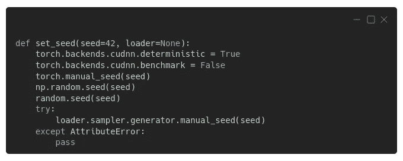**

**一粒种子统治所有人。图片作者。**

> **“这样够吗？”**

**不一定，不。一些操作*可能*仍然具有不确定性，从而使您的结果不完全可再现。虽然有可能**强制 PyTorch 只使用确定性算法**设置`[**torch.use_deterministic_algorithms(True)**](https://pytorch.org/docs/stable/generated/torch.use_deterministic_algorithms.html#torch.use_deterministic_algorithms)`，但是有一个问题…**

> **“我就知道！”**

**可能你正在执行的一些操作只有**非确定性**算法可用，然后你的代码在被调用时会抛出一个`**RuntimeError**`。出于这个原因，我没有将它包含在上面的 set_seed 函数中——我们没有破坏代码，以确保它的可再现性。**

> **此外，如果您使用的是 CUDA(10.2 或更高版本)，除了设置`**torch.use_deterministic_algorithms(True)**`，您还需要设置环境变量`**CUBLAS_WORKSPACE_CONFIG**`，如前一节所述。**

**那些**非确定性算法**可能来自**最意想不到的地方**。例如，在 PyTorch 的文档中，有一条关于在图像中使用**填充**时可能出现再现性问题的警告:**

> **“使用 CUDA 后端时，此操作可能会在其反向传递中引发不确定性行为，这种行为不容易被关闭。请参阅关于再现性的注释以了解背景信息。”**

**让我觉得有点奇怪的是，这么简单的操作会危及可重复性。真不敢相信**

# **随机种子调谐**

> **"(正确的)随机种子是你所需要的！"**

**看起来像个笑话，但是随机种子的选择可能会对模型训练产生影响。一些种子比其他种子“更幸运”，因为它们允许模型训练得更快，或者实现更低的损失。当然，没有办法事先说清楚，也没有，42 不是“*什么是正确的随机种子*”问题的答案:-)**

**如果你对这个话题很好奇，可以查看大卫·皮卡德的论文:“ [*Torch.manual_seed(3407)是你所需要的全部:论深度学习架构中随机种子对计算机视觉*](https://arxiv.org/abs/2109.08203) 的影响”。摘要如下:**

> **“在本文中，我研究了在将流行的深度学习架构用于计算机视觉时，随机种子选择对准确性的影响。我在 CIFAR 10 上扫描了大量种子(多达 104 个),在 Imagenet 上也扫描了较少的种子，使用预先训练的模型来调查大规模数据集。结论是，即使方差不是很大，也很容易找到表现比平均值好得多或差得多的异常值。”**

# **最后的想法**

****再现性很难！****

**我们甚至没有谈论更基本的问题，例如确保你正确使用数据，以避免多年后当别人试图复制你发表的结果时的尴尬(见[莱因哈特和罗格夫的 Excel 大错](https://www.businessinsider.com/reinhart-and-rogoff-admit-excel-blunder-2013-4)，也被称为“[如何不擅长经济学](https://theconversation.com/the-reinhart-rogoff-error-or-how-not-to-excel-at-economics-13646)”)！**

**我们只关注(伪)随机数生成器，即使如此，我们也需要考虑 ***许多不同来源的(伪)随机性*** 以确保可再现性。那是大量的工作，但是它值得麻烦。**

> ****确保总是在代码的最开始初始化你的随机种子，以确保(或者尝试！)您的结果的可重复性。****

> **愿你未来的实验完全可复制！**

***如果您有任何想法、意见或问题，请在下方留下评论或通过我的* [*简历链接*](https://bio.link/dvgodoy) *页面联系。***

***如果你喜欢我的帖子，请考虑使用我的推荐页面通过* [*注册一个中级会员*](https://dvgodoy.medium.com/membership) *来直接支持我的工作。对于每一个新用户，我从中获得一小笔佣金:-)***