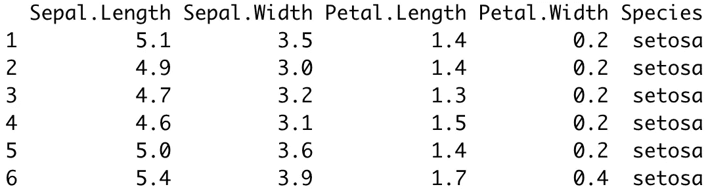
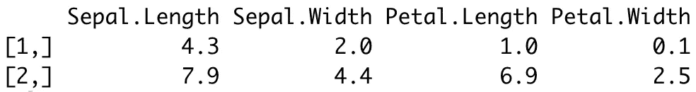

# R 中的范围:如何使用 Range 函数找到最小值和最大值

> 原文：<https://towardsdatascience.com/range-in-r-how-to-find-min-and-max-values-using-the-range-function-5c3a1f5dffad>

## 通过这 6 个实际例子掌握 R 中的范围函数


照片由 [Vipul Jha](https://unsplash.com/@lordarcadius?utm_source=medium&utm_medium=referral) 在 [Unsplash](https://unsplash.com?utm_source=medium&utm_medium=referral) 上拍摄

R 中的 Range 返回一个向量，该向量包含给定参数的最小值和最大值—在统计学中称为 *range* 。您可以将范围视为向量中最低值和最高值之间的间隔。向量可以是任何东西，从数字列表到数据帧列——R 真的不在乎。

实际上，范围是向量中最大值和最小值之间的差，但是计算 R 中的范围只报告区间极值。你可以用一个减去另一个来得到实际的范围。

今天，您将通过大量实际例子了解 R 中的`range()`函数是如何工作的。您将使用常规和字符向量、数据帧和数据帧列，还将看到如何处理缺失值和无穷大值。

# R 中的范围—定义和用法

你想学习如何在 R 中找到一个范围内的值？你来对地方了。在这一节中，我们将检查语法和返回值，它们将作为以后动手操作示例的基础。

## 句法

```
range(x, na.rm = FALSE)
```

其中:

*   `x` -一个字符或一个数字向量。
*   `na.rm` -可选参数，指定在计算范围前是否应移除 NA 值。

## 返回值

R 中的`range()`函数返回一个双精度值或一个字符，这取决于作为参数传递的是数字向量还是字符向量。

# R 范围—示例

本节我们将讨论六个例子，涵盖从基本数字向量到整个数据帧的用法。

## 如何用 R 中的值域求最小值和最大值

下面的代码显示了如何计算数值向量的范围:

```
arr <- c(-10, -15, 5, 19, 27, 0)
range(arr)
```

输出:

```
-15 27
```

有意义，因为 27 是最大值，而-15 是最小值。

## 在字符向量上使用范围函数

你不会总是和数字数据打交道。您可以计算字符串的范围，该函数将返回按字母顺序排序的第一个和最后一个值:

```
arr_char <- c("Bob", "Mike", "Kelly", "Sue")
range(arr_char)
```

输出:

```
"Bob" "Sue"
```

## 求缺失值向量的值域

真实世界的数据通常是混乱的，充满了缺失值。如果处理不当，它们会打乱你的计算。这里有一个例子:

```
arr <- c(-10, -15, NA, 19, 27, 0)
range(arr)
```

输出:

```
NA NA
```

指定`na.rm = TRUE`以避免此问题:

```
range(arr, na.rm = TRUE)
```

输出:

```
-15  27
```

## 求一个无穷(Inf)值向量的范围

计算错误有时会产生正值或负值的`Inf`值。它们打乱了范围计算，因为它们要么是向量的最小值，要么是向量的最大值:

```
arr <- c(-10, -15, Inf, 19, 27, 0)
range(arr)
```

输出:

```
-15 Inf
```

指定`finite = TRUE`从范围计算中排除`Inf`:

```
range(arr, finite = TRUE)
```

输出:

```
-15  27
```

## 在 DataFrame 列上使用 Range 函数

让我们将虹膜数据集存储到变量`df`中:

```
df <- iris head(iris)
```



图片 1 —虹膜数据集的头部(图片由作者提供)

您可以通过以下方式计算特定 dataframe 列的范围:

```
range(df$Sepal.Length)
```

输出:

```
4.3 7.9
```

## 在整个数据帧上使用范围函数

但是如果您需要整个数据集的范围呢？你只能对这个数据集中的数字列进行计算:

```
df_numeric <- df[c('Sepal.Length', 'Sepal.Width', 'Petal.Length', 'Petal.Width')]
range(df_numeric)
```

输出:

```
0.1 7.9
```

这并不能告诉您太多—您不知道最小值和最大值在哪些列中。使用`sapply()`函数获取各个列的范围:

```
sapply(df_numeric, function(df_numeric) range(df_numeric))
```



图片 2-计算整个数据集的范围(图片由作者提供)

# 结论

今天，您已经通过大量的实际例子了解了 R 中的值域是如何工作的。这是一个简单的功能理解，但绝对需要有你的工具带。您现在已经准备好在您的数据分析项目中使用它，因为没有您不能处理的数据类型或用例。

请继续关注后续文章，因为我们将探索其他有用的内置 R 函数。

## 保持联系

*   雇用我作为一个技术作家
*   订阅 [YouTube](https://www.youtube.com/c/BetterDataScience)
*   在 LinkedIn 上连接

*喜欢这篇文章吗？成为* [*中等会员*](https://medium.com/@radecicdario/membership) *继续无限制学习。如果你使用下面的链接，我会收到你的一部分会员费，不需要你额外付费。*

[](https://medium.com/@radecicdario/membership)  

*原载于 2022 年 2 月 9 日 https://betterdatascience.com**的* [*。*](https://betterdatascience.com/range-in-r/)