# rbokeh:如何在 R 中创建交互式情节

> 原文：<https://towardsdatascience.com/rbokeh-how-to-create-interactive-plots-in-r-cf8fd528b3d5>


由[布拉姆·瑙斯](https://unsplash.com/@bramnaus?utm_source=unsplash&utm_medium=referral&utm_content=creditCopyText)在 [Unsplash](https://unsplash.com/?utm_source=unsplash&utm_medium=referral&utm_content=creditCopyText) 上拍摄的照片

# **简介**

数据可视化是人工智能的一个重要方面。数据可视化使您能够从数据中获得洞察力，并使您能够与他人就数据进行交流。我们可以使用许多软件包来可视化数据并构建有意义的仪表板。在用 Python 做可视化的时候，我们有不同的库，比如 Matplotlib，Seaborn，Altair 等等。，和 ggplot2，使用 r 时晶格。

数据可视化中的交互性使它们更上一层楼。当用户可以使用不同的操作与图表进行交互时，如缩放、悬停和使用选择的变量过滤绘图，这为图表增加了很大的灵活性。这种交互性允许用户更深入地挖掘可视化以在数据集中找到附加信息。使用不同的工具在仪表板中提供交互式可视化是当今的常见做法。

Python 和 R 都有构建交互情节的包。Bokeh 是一个流行的交互式可视化 python 包。散景库允许我们用很少的代码行创建不同的图，为高级定制增加了灵活性。Bokeh 现在有一个 R 接口以及 Python、Scala 和 Julia 的现有接口。

**rbo keh 是什么？**

rbokeh 是一个开源的 R 包，它利用了 bokeh 可视化工具。它提供了一个声明性的界面，对于基于 web 的动态可视化是灵活的。Ryan Hafen 创建并维护 rbokeh 包。你可以在这里找到更多关于 rbokeh 包[的细节。在安装 rbokeh 之前，你必须安装 R and R 工作室。还可以用 Kaggle 或 Google Colab 构建 rbokeh 可视化。](https://hafen.github.io/rbokeh/articles/rbokeh.html)

**安装**

首先，我们将使用 R 函数 install。packages()'从 CRAN 获取 rbokeh 包。

```
install.packages(“rbokeh”)
```

我们将使用以下命令来导入 rbokeh 包:

```
library(“rbokeh”)
```

对于 rbokeh 包，我们还将导入其他 R 库

```
library(“tidyverse”)
library(MASS)
```

# **使用 rbokeh 的可视化**

在进行图形可视化之前，需要注意的是 rbokeh 图是通过调用`figure()`函数生成的。

这个函数相当于一个可以设置的空白画布，然后可以使用管道操作符添加层。这里 x、y 和 ly_geom()是指定所用 geom 类型的数据输入，如 ly_points、ly_lines、ly_hist、ly_boxplot 等。

对于本教程，我们将从 r 的质量包中加载内置的 [**cars93** 数据集](https://doi.org/10.1080/10691898.1993.11910459)


照片由[克雷格·冯尼克](https://unsplash.com/@hificlinic?utm_source=unsplash&utm_medium=referral&utm_content=creditCopyText)在 [Unsplash](https://unsplash.com/?utm_source=unsplash&utm_medium=referral&utm_content=creditCopyText) 上拍摄

Cars93 是一个 93 行 27 列的数据集。关于封装和[文档](https://cran.r-project.org/web/packages/MASS/MASS.pdf)的更多细节可以在[这里](https://cran.r-project.org/web/packages/MASS/index.html)找到。数据集中的汽车是从发表在《消费者报告》和《PACE 购买指南》上的 1993 款乘用车模型中随机选择的。

使用以下命令，我们可以打印“Cars93”数据集的前几行:

```
head(Cars93)
```

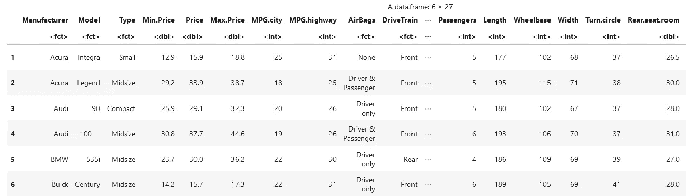

**散点图**

我们将首先构建一个简单的散点图。在这里，我们将看到不同汽车的马力和价格之间的关系。散点图有助于可视化两个变量之间的关系，因此，是可视化所有数据点的好选择。首先，我们将创建一个“figure()”函数。然后，我们将创建一个名为“ly_points”的图层，并将以下参数传递给数据参数:-x 轴上的马力-y 轴上的价格-以及数据集，即 Cars93。请注意，我们可以将生成的图形分配给“散点图”，然后通过写“散点图”来显示它。我们需要使用`hover`命令来查看添加的工具提示。平移和缩放也可以作为交互式元素访问。

```
#Simple Scatter Plotscatter_plot <- figure(title ="Scatter Plot") %>%
  ly_points(x = Horsepower, y = Price, data = Cars93, hover = c(Horsepower, Price))
scatter_plot
```

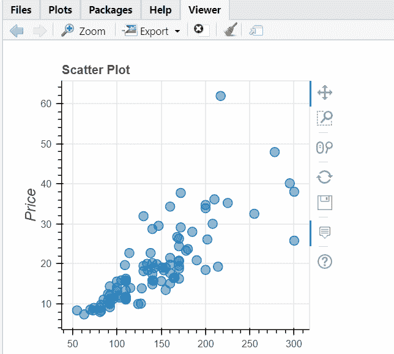

图片来源:作者

为了构建一个散点图，除了显示与马力和价格的关系之外，还显示每个原点的一个点，我们将按颜色对其进行分组，如下所示。

```
#Scatter Plot with groupingscatter_plot1 <- figure(title ="Scatter Plot") %>%
  ly_points(x = Horsepower, y = Price, color = Origin, data = Cars93, hover = c(Origin, Horsepower, Price))
scatter_plot1
```

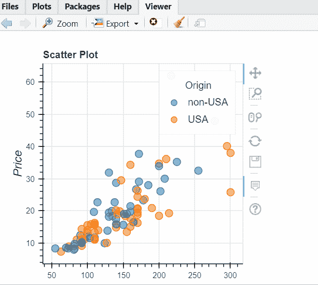

图片来源:作者

**折线图**

接下来，我们将使用 Cars93 数据集绘制一个基本的折线图。假设我们想要查看小型和紧凑型汽车价格的变化，我们将首先使用类型变量过滤数据。

```
#Filteringdf <- Cars93 %>%
filter(Type %in% c(“Small”, “Compact”))
```

然后对于线图，我们将使用价格变量，并用“ly_lines”层中的数据参数指定它，如下所示:

```
#Line Plotline_plot <- figure(title =”Line Plot”) %>%
ly_lines(Price,color=Type,data = df)
line_plot
```

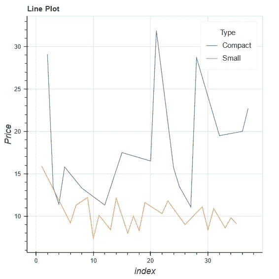

图片来源:作者

我们可以改变线条的粗细和颜色。根据默认主题为所有这些地块选择颜色。我们可以用颜色向量或预定义的调色板调用`set_palette()`函数来获得我们想要的颜色。这里我们将使用 discrete color 属性，因为我们正在处理分类值，为了获得更粗的线条，我们正在更改 width 参数的设置，如下面的代码所示。我们也可以使用十六进制代码的颜色或任何我们在这里选择的 CSS 颜色。

```
#Changing the color and width of linesline_plot2 <- figure(title =”Line Plot”) %>%
ly_lines(Price, color = Type, width = 2, data = df)%>%
set_palette(discrete_color = pal_color(c(“#6200b3”, “#ff0831”,”#226f54")))
line_plot2
```

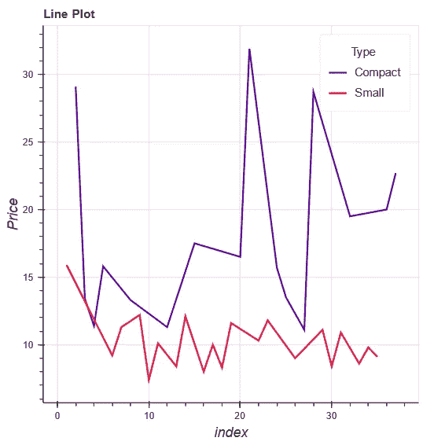

图片来源:作者

现在，我们将探讨如何通过在一个图形中组合点图层和线图层来可视化多层绘图。对于多层绘图，我们将使用`ly_lines()` 绘制线条，并使用`ly_points()`添加标记。注意，在这两层中,“类型”都被映射到颜色。可以为图形使用不同的字形。我们可以使用下面的命令来探索字形可用的可能值。

```
point_types()
```

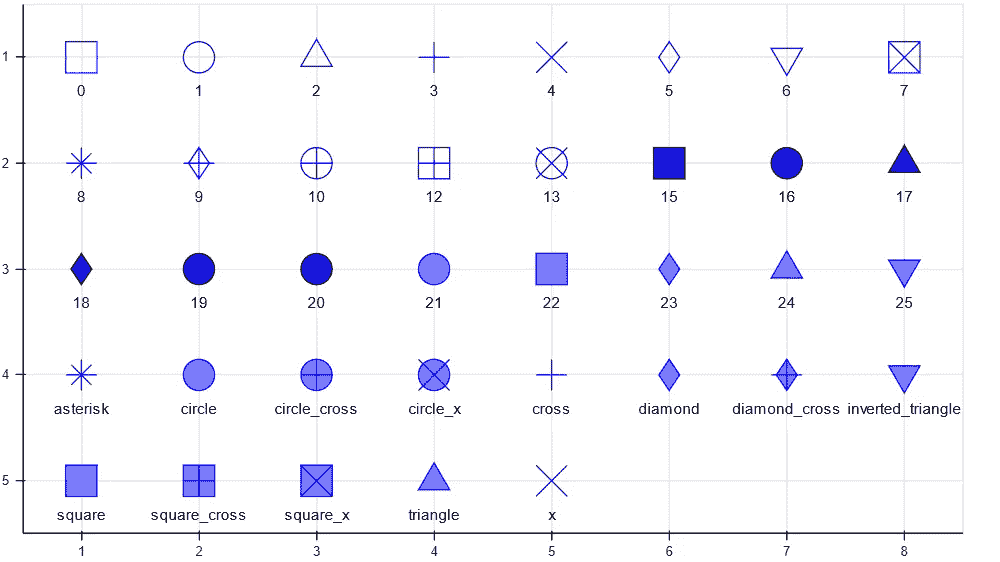

图片来源:作者

当在代码中指定一个带编号的标志符号时，fill 和 line 属性将得到有效的管理，以获得所需的结果。

```
#Multi-layer plot with glyphmulti_layer <- figure(df, legend_location =”top_right”, title =”Multi-layer Plot”) %>%ly_points(Price, color = Type, hover = c(Price,Type),glyph=16) %>%ly_lines(Price, color = Type, width = 1.5, data = df) %>%set_palette(discrete_color = pal_color(c(“#6200b3”, “#ff0831”,”#226f54")))multi_layer
```

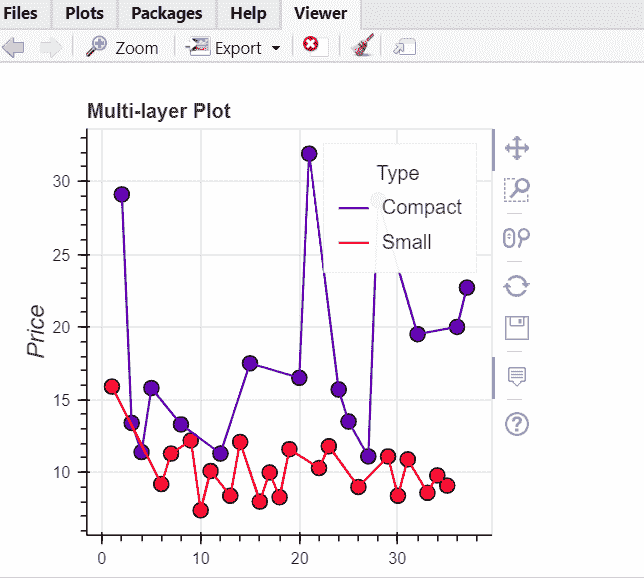

图片来源:作者

**直方图**

接下来，我们将绘制一个直方图来查看 Cars93 数据集中的 RPM 频率。

```
#Simple Histogramhistogram <- figure(width = 700, height = 400, title =”Histogram”) %>%
ly_hist(RPM, data = Cars93, breaks = 5, freq = TRUE,color=”green”)
histogram
```


图片来源:作者

**方框图**

现在，我们将使用以下代码创建一个方框图来显示马力和气缸之间的关系。我们还可以通过箱线图发现数据集中的一些异常值。

```
#Box-Plotbox_plot <- figure(width = 600, title =”Box Plot”) %>%
ly_boxplot(Cylinders, Horsepower, data = Cars93)
box_plot
```

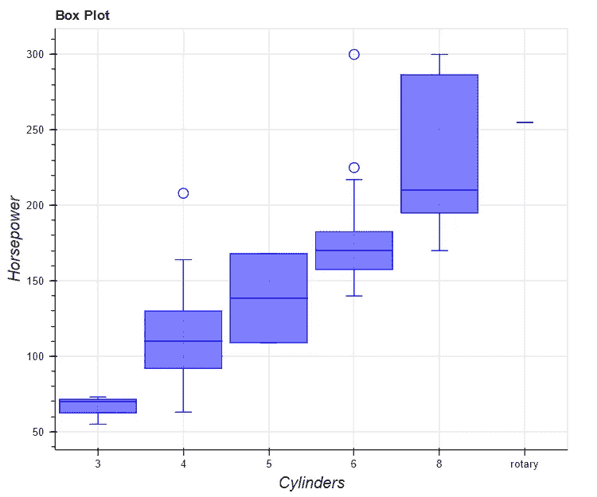

图片来源:作者

**条形图**

我们将在下一个柱状图中绘制各种类型的汽车，即分类数据。

```
#Bar Chartbar_chart <- figure(title =”Bar Chart”) %>%
ly_bar(Type, data = Cars93) %>% theme_axis(“x”, major_label_orientation = 90)
bar_chart
```

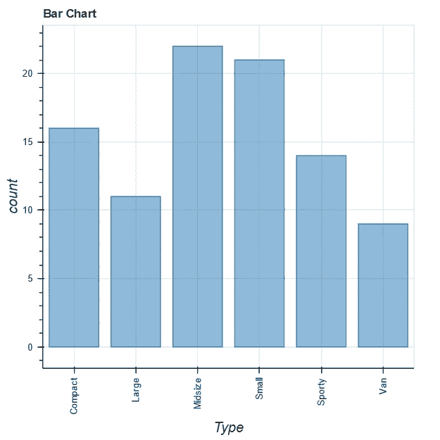

图片来源:作者

**网格图**

我们可以使用网格图在一个布局中显示不同的图形。我们可以将不同类别的数字组合起来，如条形图、折线图、散点图等。在网格布局中。

```
#Grid Plottools <- c(“wheel_zoom”, “box_zoom”, “box_select”)
p1 <- figure(tools = tools, width = 500, height = 500) %>%ly_points(Horsepower, RPM, data = df, color = Type,hover=c(Horsepower, RPM,Type))p2 <- figure(tools = tools, width = 500, height = 500) %>%ly_points(Length, Wheelbase, data = df, color = Type,hover=c(Length, Wheelbase,Type))grid_plot(list(p1, p2), link_data = TRUE)
```

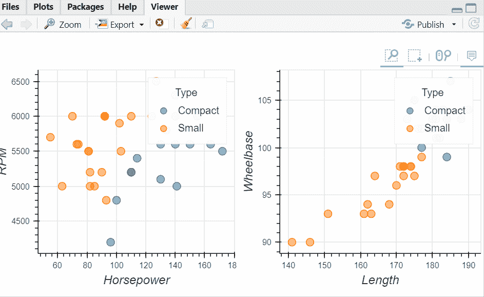

图片来源:作者

**Hexbin 图**

最后，我们绘制了一个赫克斯宾图，这是一个 2D 密度图，以可视化两个数字变量之间的关系，即价格和发动机大小。当数据包含大量点时，Hexbin 图通常用于可视化。绘图窗口用几个十六进制箱分割，以避免重叠。

```
hexbin <- figure() %>% ly_hexbin(x = EngineSize, y = Price, data = Cars93)
hexbin
```

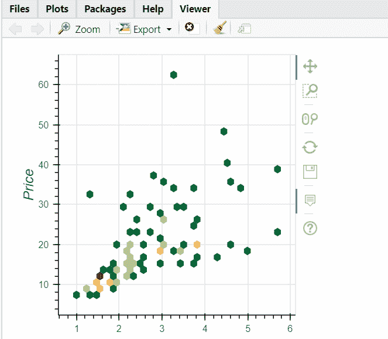

图片来源:作者

就是这样！我们从头开始在 rbokeh 中创建和定制了各种图表。

# **结论**

在这个简短的教程中，我们探索了如何在 rbokeh 中绘制一些交互式的、令人愉快的图表。这个 rbokeh 教程的完整代码可以在我的 [GitHub](https://github.com/Devashree21/rbokeh) 资源库中找到。如果您喜欢使用 ggplot，那么您可能以前使用过 plotly 或 ggiraph 来使您的 ggplot 图表具有交互性。对于您的下一个可视化项目，rbokeh 包可能是一个不错的选择。

**参考文献:**

罗宾·h·洛克(1993) 1993 年新车数据，统计教育杂志，1:1，DOI:[10.1080/10691898 . 1993 . 11910459](https://doi.org/10.1080/10691898.1993.11910459)