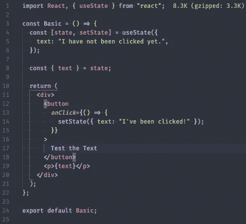
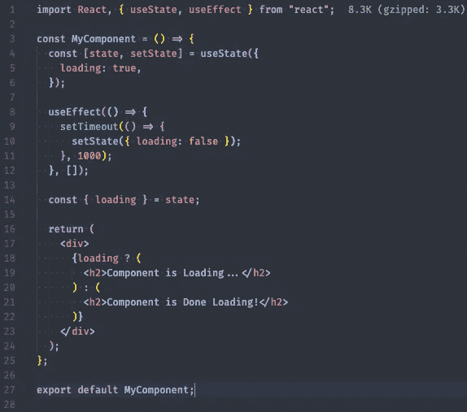
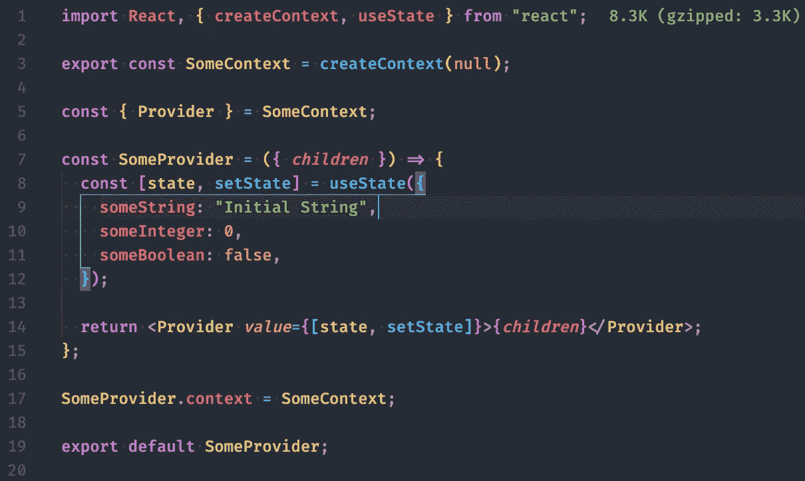
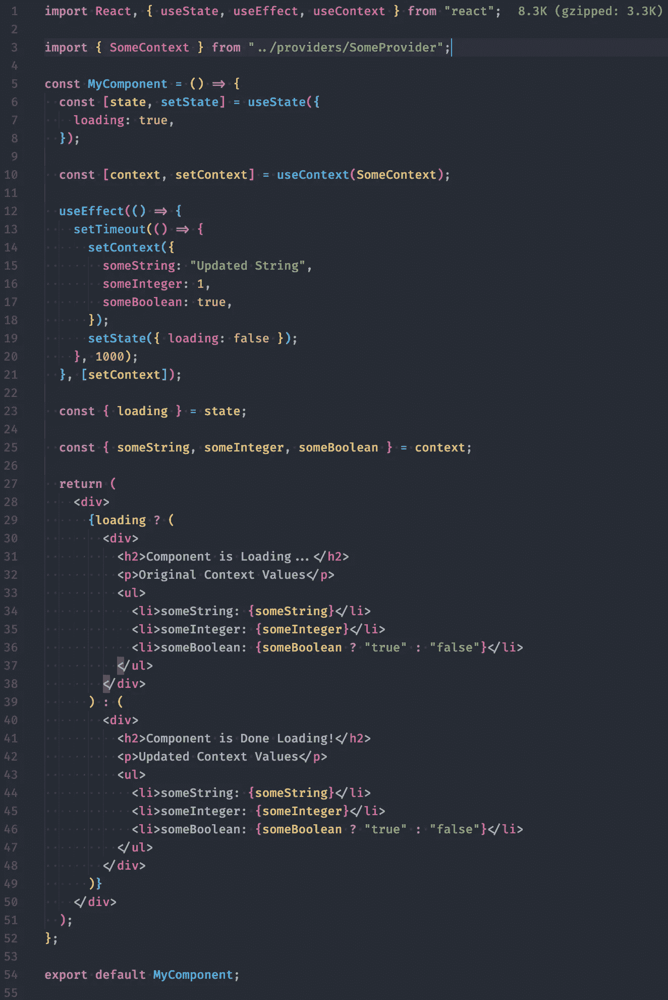

# React.js —基本挂钩(使用状态、使用效果和使用上下文)

> 原文：<https://towardsdatascience.com/react-js-basic-hooks-usestate-useeffect-usecontext-1ed82a799db2>

## 对 React.js 三个基本的、也是最重要的钩子的简单介绍


埃菲社在 [Unsplash](https://unsplash.com/@efekurnaz?utm_source=unsplash&utm_medium=referral&utm_content=creditCopyText) 上拍摄的照片

*前言——从本文的标题可以推断出，这并不是一个全面的指南，介绍 React.js 新版本中可以使用的所有* *钩子，而是对大多数使用 React.js 的人最有可能遇到的* ***基本*** *钩子的概述。如果您对可以“挂钩”到 React.js 组件中的所有挂钩的完整列表感兴趣(截至本文发布时的版本 16.13.1)，请参考 React.js 文档*<https://reactjs.org/docs/hooks-reference.html>**。此外，如果你不熟悉 React.js，我可以建议你看看 YouTube 上的*[*Ben Awad*](https://medium.com/u/36ed94674ddf)*的* [*实用 React*](https://www.youtube.com/watch?v=p6c7QA9ofvI&list=PLN3n1USn4xlntqksY83W3997mmQPrUmqM) *系列，作为你的教育努力的入门，因为本文假设你事先了解 React.js。话不多说，我希望你喜欢它！**

# *React.js 钩子是什么？*

*要直接引用 React.js 文档，*

> **钩子是 React 16.8 中的新增功能。它们让你不用写类就可以使用状态和其他 React 特性…钩子是一个特殊的函数，它让你“挂钩”React 特性。**
> 
> *[*React.js 文档*](https://reactjs.org/docs/hooks-intro.html)*

*传统上，在 React.js 中，由于 React.js 作为 UI 库与 JavaScript 交互的性质，需要基于类的组件来利用生命周期方法和状态。不过在 React.js 的新版本中，使用 React.js 在前端工作的程序员现在可以创建带有钩子的[功能组件](https://www.robinwieruch.de/react-function-component) *，*，它们与基于类的组件相似，但是:*

*   ***更容易测试** —尽管测试在个人项目中的影响不如在高度可用、公开部署的应用程序中的影响大，但它是任何组织的软件开发生命周期的重要部分。无论这是以持续集成/持续开发服务的形式出现，如 [CircleCI](https://circleci.com/) 或 [TravisCI](https://travis-ci.org/) ，还是直接通过库测试个性化功能，如 [Jest](https://jestjs.io/en/) 或 [Selenium](https://www.selenium.dev/) ，钩子使得测试 React.js 组件比测试基于类的组件容易得多。*
*   ***更容易阅读**——这对有许多团队成员的项目特别有帮助。尽管人们可能会假设团队在如何构建 UI 方面可以遵循特定的设计语言、方法和样式指南，但是去除基于类的组件架构的脂肪允许工程师重新编写位于 JavaScript 语言核心的程序，而不是抽象出不必要的东西。*
*   ***更接近传统 JavaScript**——如上所述，编写功能组件减少了用 JavaScript 编写“特殊函数”(类)的工作量。这并不是说用 JavaScript 编写基于类的组件是一件坏事，因为 JavaScript 由于其[多范例](https://en.wikipedia.org/wiki/Programming_paradigm)方法在技术上可以用作面向对象的语言，但这是因为 JavaScript *如何处理*类以及从这种类声明中实例化的对象。这就是 JavaScript 的基本模式和原则发挥作用的地方，比如原型链和继承，虽然不在本文的讨论范围之内，但它们是 JavaScript 非常重要的特性。另一件事是，如果您使用基于类的组件，您总是必须从内置的 React.js 类扩展，而功能组件是纯 JavaScript 函数，其中 JSX 和钩子由 React.js 通过导入来识别。*
*   ***最佳实践** —软件工程师必须接受的一个事实是，他们今天在自己运营和/或工作的公司中利用的技术，在不远的将来很可能会变得自满，这是好事，还是坏事，取决于你的个人哲学。当然，也有例外:20 世纪 70 年代的 SQL，80 年代的 C++和 Python，但是随着技术的进步和抽象层覆盖在我们今天使用的工具上，更新的 API 出现了，为了构建一个产品，必须在思想上消化并在物质上实现这些 API。没有一个单独的实体掌握着未来技术是什么的答案，但是你可以通过观察谁在构建未来来获得一个很好的想法，比如 React.js 的脸书*
*   ***代码密集程度较低**——这也可以归入“更容易阅读”的范畴，但我的直觉告诉我，基于我之前提到的软件工程中的一个范例，将它划分为自己的要点；抽象。虽然你通常必须用一些性能来换取抽象的实现，但它通常是产品发展的氧气。在我们的案例代码中，将曾经复杂、功能稀疏、在许多实例中重复的东西转化为更容易实现的解决方案，提供整体更好的工程体验，并产生与以前的迭代相同(如果不是更好的话)的方法，这是任何产品生命周期背后的主题。React.js 也不例外。*

*随着本文的进展，我将讨论三个“基本的”React.js 挂钩，作为构建 UI 的工程师，您很可能会遇到这三个挂钩。它们是:*

*   ***使用状态()***

> **它声明了一个“状态变量…这是一种在函数调用之间“保留”一些值的方法——*`useState`*是一种新的方法，可以使用* `*this.state*` *在类中提供的完全相同的功能。通常，当函数退出时，变量“消失”,但是状态变量被 React 保留。**
> 
> *[*React.js Docs*](https://reactjs.org/docs/hooks-state.html)*

*   ***useEffect()***

> **如果你熟悉 React 类的生命周期方法，你可以把* `*useEffect*` *钩子想象成*`*componentDidMount*`*`*componentDidUpdate*`*，以及* `*componentWillUnmount*` *的组合。***
> 
> **[*React.js Docs*](https://reactjs.org/docs/hooks-effect.html)**

*   ****使用上下文()****

> ***在典型的 React 应用程序中，数据是通过 props 自顶向下(从父到子)传递的，但是对于应用程序中许多组件需要的某些类型的 props(例如，区域设置首选项、UI 主题)来说，这种用法可能很麻烦。上下文提供了一种在组件之间共享这些值的方法，而不必显式地在树的每一层传递一个属性。***
> 
> **[*React.js 文档*](https://reactjs.org/docs/context.html)**

# **入门指南**

****使用状态****

**useState()，如上所述，将状态挂钩到组件中。很容易整合到功能组件中:**

****

**useState()的示例**

**在上面的截图中，我们可以注意到一些事情。useState()有两个常量，您应该在调用 useState()钩子时认识到:**

*   ***状态*数据结构/类型本身(例如— `state`)将保存该状态实例的初始值。您只能向 useState()传递一个参数，但是您可以多次调用 useState()，您将在阅读材料中看到进一步的概述。**
*   **在组件生命周期的特定点执行的 setter 函数(例如— `setState`),用于更新状态数据结构/类型的值。**

**在 React.js 文档中，关于上面例子中看到的数组析构，还有一点需要注意:**

> ***当我们用* `*useState*` *声明一个状态变量时，它会返回一个 pair——一个包含两项的数组。第一项是当前值，第二项是让我们更新它的函数。使用* `*[0]*` *和* `*[1]*` *来访问它们有点令人困惑，因为它们有特定的含义。这就是我们使用数组析构的原因。***
> 
> **[*React.js 文档*](https://reactjs.org/docs/hooks-state.html#tip-what-do-square-brackets-mean)**

**需要注意的一点是，你可以随意调用这两个变量，`[state, setState]`。您会遇到两种常见的命名约定，大多数工程师都会使用:**

*   **将所有内容封装在一个 JavaScript 对象中，并将所有状态属性分配给各自的默认值。如果你以前使用过基于类的 React.js 组件，你会非常熟悉。这两个常量被命名为`state`和`setState`是很常见的，但是同样，您可以随意命名它们。在管理状态时，我给这种方法起了一个绰号，我将在本文的其余部分提到它，它就是“垂直缩放的组件状态”。示例:**

```
**const [state, setState] = useState({
  loading: true,
  error: '',
  signUpFormFields: {
    username: '',
    password: ''
  },
  scoreCount: 0
});**
```

*   **将析构数组中的第一个常量命名为组件状态中需要跟踪和更新的部分的大小写形式(例如，——`loading, error, isAuthenticated, signupFormFields, etc.`)。然后，将第二个常量命名为与第一个相同的名称，但是在命名约定前加上 **set-** ，并适当调整大小写以遵循骆驼大小写的惯例。在管理状态时，我给这种方法起了一个绰号，我将在本文的其余部分引用它，它就是“水平缩放的组件状态”。示例:**

```
**const [loading, setLoading] = useState(true); // boolean
const [error, setError] = useState(''); // string
const [signUpFormFields, setSignUpFormFields] = useState({
  username: '',
  password: '' ,
}); // object
const [value, setValue] = useState(0); // int**
```

**两者做的事情完全一样(大部分情况下)，尽管它们都有各自的优缺点:**

*   **当谈到水平缩放状态时，一个负面的影响是您会发现自己必须运行更多的 setter 函数调用(例如— `setState()`)才能将组件的状态更新到期望的结果。确实存在减轻这种情况发生的解决方案，比如使用 useReducer()钩子，但是这超出了本文的范围。如果你正在寻找实现这个解决方案的教程，我强烈推荐 YouTube 上的 Harry Wolff 的视频，他在深入使用 useReducer()钩子方面做了令人难以置信的工作。当您使用异步调用、处理承诺或者使用像 [fetch](https://developer.mozilla.org/en-US/docs/Web/API/Fetch_API) 或 [axios](https://github.com/axios/axios) 这样的库对可能直接影响组件状态的 API 执行 CRUD 操作时，水平缩放组件状态的一个好处是。这样做的原因与您将从这些服务中检索多少数据有关，重写或复制整个垂直缩放的状态对象的成本将远远高于只对应用程序逻辑的这一部分进行一次互斥的 useState()调用的成本。**
*   **垂直缩放状态的好处是，无论何时想要更新 JavaScript 对象，只需调用一个 setter 函数。但是，有些缺点是，除非您更新 JavaScript 对象中的每个属性，否则您将不得不利用 [JavaScript 的扩展语法](https://developer.mozilla.org/en-US/docs/Web/JavaScript/Reference/Operators/Spread_syntax)，以便不会将更改的状态值重置回它们在 useState()钩子中定义的原始声明。这个问题也存在于水平缩放的组件状态中，但是扩展操作的成本通常要低得多，因为您通常只处理非常小的更改。如果这听起来有点混乱，如果我拿上面的垂直缩放的例子并想更新`loading: false`的话，下面是你必须做的事情:**

```
**const [state, setState] = useState({
  loading: true,
  error: '',
  signUpFormFields: {
    username: '',
    password: ''
  },
  scoreCount: 0
});setState({ error: 'A new error entry!' });/*
   If you wanted 'error' to persist its newly set state value ('A new error entry!'), you will have to use the spread operator the next time you updated your state (as I do below).Something to take note of: We don't have to use the spread operator in the first setState() invocation update above because there haven't been any previous changes to the initial state values.
*/setState({ ...state, loading: false });/*
   Your updated state object would now look like this:{
     loading: false,
     error: 'A new error entry!',
     signUpFormFields: {
       username: '',
       password: ''
     },
     scoreCount: 0
   }*/**
```

**如果您正在寻找一个关于应该水平还是垂直缩放状态的最佳实践，React.js 文档建议使用多个状态调用来代替单个状态(即，使用水平缩放的组件状态):**

> ***然而，* ***我们建议将状态拆分成多个状态变量，基于这些变量的值往往会一起变化。*****
> 
> **[*React.js 文档*](https://reactjs.org/docs/hooks-faq.html#should-i-use-one-or-many-state-variables)**

**这背后的原因主要与 React.js 组件的[记忆](https://en.wikipedia.org/wiki/Memoization)和它们处理的状态有关。这基本上是一种奇特的说法，即您应该通过缓存一次初始调用来优化高成本函数调用的速度，然后只从缓存中提取已更改的数据。这种方法意味着您很可能不得不加入更复杂的 React.js 挂钩，比如 [useMemo()](https://reactjs.org/docs/hooks-reference.html#usememo) 和/或 [useCallback()](https://reactjs.org/docs/hooks-reference.html#usecallback) ，这超出了本文的范围。如果你正在寻找学习如何利用这些更复杂的 React.js 钩子的资源，我会推荐 YouTube 上的 [Ben Awad](https://medium.com/u/36ed94674ddf) 的 [useMemo](https://www.youtube.com/watch?v=-Ls48dd-vJE&list=PLN3n1USn4xlmyw3ebYuZmGp60mcENitdM&index=5) 和 [useCallback](https://www.youtube.com/watch?v=-Ls48dd-vJE&list=PLN3n1USn4xlmyw3ebYuZmGp60mcENitdM&index=5) 教程。**

****使用效果****

**如前所述，useEffect()通过一次函数调用将主要概念`componentDidMount()`、`componentDidUpdate()`和`componentWillUnmount()`挂钩到一个组件中。很容易整合到功能组件中:**

****

**useEffect()挂钩**

**在上面的截图中，我们可以注意到一些事情。有两个参数传递给 useEffect():**

*   **一个匿名的回调函数，存放你的 useEffect 逻辑。这个逻辑的执行基于如何设置 useEffect()来运行(我们将在下面进一步讨论)。**
*   **第二个是一个数组，接受逗号分隔的变量，称为依赖列表。这就是改变 useEffect()操作方式的方法。**

***重要提示:如果不传递 useEffect()钩子中的第二个参数(即依赖列表)，那么钩子将在每个渲染上运行——如果/当你将这个钩子与 useState()之类的东西结合使用时，这可能会有问题，因为你的组件可能会陷入一个重新渲染循环，其中；首先，组件在初始渲染时运行 useEffect()钩子。然后，useState()中的一些数据通过上面在 useEffect()钩子中描述的 setter 函数进行更新。更新后，组件会因为状态更新而重新呈现，并再次执行相同的 useEffect()钩子。我将在下面讨论如何使用 useEffect()来防止这种情况。***

**尽管 useEffect()确实利用了`componentDidMount()`、`componentDidUpdate()`和`componentWillUnmount()`的各个方面，但是最好不要把 useEffect()看作是一个钩子，它复制了从这三个生命周期方法中的每一个获得的功能，并将它们压缩成一个可以跨组件内的许多实例调用的函数。**

**相反，可以将 useEffect()看作是一个函数，它在渲染之前(通常称为“清理”)、渲染之后以及组件卸载之前为组件执行特定的任务。**

**由于 useEffect()可以以多种不同的方式使用，其中大部分我不会在本文的范围内讨论(不必担心，我将在下面提供更多关于钩子的边缘情况的参考资料)，如果我对这个特定的 React.js 特性使用 Pareto 原则，我将只讨论 useEffect()实现 80%时间的 20%的方式。**

**下面是实现 useEffect()挂钩的更常见的方法:**

*   **要使 useEffect()调用仅在每次装载和卸载时运行，请按以下方式使用 useEffect()挂钩:**

```
**useEffect(() => {
   // some component logic to execute...
}, []);/*
  Notice the empty array as the second argument above. We don't pass anything to the array as we don't was useEffect() to depend on anything - thus the purpose of having the dependency list in the first place.
*/**
```

*   **为了使 useEffect()调用运行得更少或更多，通常基于该 useEffect()调用依赖于*什么(即，传递给依赖列表的内容)，以下列方式使用 useEffect()挂钩:***

```
**const [value, setValue] = useState(0);useEffect(() => {
  // some component logic to execute...
}, [value, setValue]);/*
  Notice the dependency array as the second argument above. We pass 'value' to the array as an example to showcase how this hook can work. This useEffect() invocation will execute every single time 'value' is updated.Another thing to mention is that arguments in the dependency list don't have to come from other hooks like they do in this example - they can be other forms of data that are assigned to a particular variable where the underlying assigned values can be/are mutated.
*/**
```

**就像 useState()一样，您可以根据组件的需要使用任意多个 useEffect()实例。**

> *****钩子让我们根据代码正在做什么来分割代码*** *而不是一个生命周期方法名。React 将按照指定的顺序应用组件使用的每个效果。***
> 
> **[*React.js 文档*](https://reactjs.org/docs/hooks-effect.html#tip-use-multiple-effects-to-separate-concerns)**

**如果您需要对上面提供的两个示例中没有涉及的 DOM 进行定制修改，我建议您查阅 React.js 文档，主要关注部分是[“效果的定时”](https://reactjs.org/docs/hooks-reference.html#timing-of-effects)。**

**如果你正在寻找一个关于 useEffect()钩子的全封装资源，可以解决你在这个钩子上遇到的所有问题，那么有一篇文章我会推荐你去读，就像读 React.js 福音一样:[use effect](https://overreacted.io/a-complete-guide-to-useeffect/)完全指南。由 Redux、Create React 应用程序的合著者[丹·阿布拉莫夫](https://medium.com/u/a3a8af6addc1)撰写，他是一位全能的不可思议的工程师，作者深入研究了这种特殊挂钩必须提供的细微差别和功能，同时提供了易于遵循的示例。我无法推荐比这篇文章更好的关于这个钩子的资源和人了。**

****使用上下文****

***前言—在发表本文时，还有另一个针对全局状态管理的 React.js 解决方案，目前正处于开发的试验阶段。这个包被称为* [***反冲***](https://recoiljs.org/) *似乎是 React.js 上下文 API 之类的东西和*[*Redux*](https://redux.js.org/)*或*[*MobX*](https://mobx.js.org/README.html)*之类的不可知全局状态管理工具之间的交叉，同时为如何管理前端的全局状态带来了新的设计模式。我不会在本文的范围内讨论这个库，但是我觉得有必要提一下，因为该产品将来可能会发展到成为实现 React.js 前端全局状态管理解决方案的最佳实践。***

**React Context API 可能是 16.8 更新中我最喜欢的新增功能之一，它是一套 API 特性，提供了一个可变的全局状态数据结构，可以在整个组件树中的任何点上挂钩到组件，从而避免了 React.js 反模式(称为 prop drilling)。**

**以下面的 React.js 组件树架构为例:**

****

**React.js 组件树示例**

**假设您在 Authenticated 文件夹(components/Authenticated)中的`index.jsx`文件中有一些状态逻辑，并且您想将这些数据传递给 Section3 组件(components/Authenticated/Dashboard/Body/section 3)。在 React Context API 之前，您必须用 props“钻取”每个中介组件，即使您在到达理想的祖先组件之前不打算在该组件中使用该 prop 数据。这可能不是沿组件树向下传递数据的最合适的解决方案，原因有几个，Kent C. Dodds 关于这个主题的博客文章完美地总结了所有这些原因:**

> **It [prop drilling]不可避免地会给你的应用程序带来一个非常混乱的数据模型。任何人都很难找到数据在哪里被初始化，在哪里被更新，在哪里被使用。**
> 
> *****回答“我可以在不破坏任何东西的情况下修改/删除这段代码吗？”在那样的世界里是很难回答的。这是你在编码时应该优化的问题。*****
> 
> ***但是随着应用程序的增长，您可能会发现自己要钻透许多层的组件。当你最初写出来的时候，这通常没什么大不了的，但是在代码已经工作了几个星期之后，对于一些用例来说，事情开始变得难以处理:***
> 
> ***-重构一些数据的形状(即:*`*{user: {name: 'Joe West'}}*`*->*`*{user: {firstName: 'Joe', lastName: 'West'}}*`*)***
> 
> ***-由于(重新)移动了一个需要一些道具但不再需要的组件，导致过度转发道具(传递了多余的道具)。***
> 
> ***-欠转道具+滥用* `*defaultProps*` *这样你就不会意识到道具丢失了(也是因为(重新)移动了一个组件)。***
> 
> ***——中途重命名道具(即* `*<Toggle on={on} />*` *渲染* `*<Switch toggleIsOn={on} />*` *)让你的大脑很难记住这些。***
> 
> ***还有各种各样的其他情况，特别是在重构过程中，道具演练会带来一些真正的痛苦。***
> 
> **[*肯特·c·多兹的博客*](https://kentcdodds.com/blog/prop-drilling)**

**这就是 React 的上下文 API 试图缓解出现的任何问题的地方。您可以将 React 的 Context API 视为与 Redux 或 MobX 等众所周知的全局状态管理工具类似的解决方案，但是开销和样板文件要少得多，并且 React.js 的方法更接近于 React . js，而不是与您使用的前端库/框架无关的工具。**

**当然，这两种解决方案各有利弊:**

*   **例如，如果应用程序中的状态不断变化，或者如果您可以采用更大的包大小，因为您知道您的产品将从更全面的全局状态管理套件中受益更多，那么 Redux 或 MobX 比 React Context API 更有意义。因为一个语境。Provider 的行为基本上类似于一个数据类型/结构(即垂直缩放的状态),可以在组件树中的任何位置访问，如果您在一次 Context.Provider 调用中存储大量不断更新值的属性，更新也会变得非常昂贵**
*   **另一方面，如果您的应用程序较小，只需要很少与全局状态交互，或者如果您使用多次上下文调用。Provider(不是最好的解决方案——您应该只使用 React 的上下文 API，如下所述)来存储全局状态的不同部分，那么使用上下文 API 可能比 Redux 或 MobX 更有意义。**

> **当不同嵌套层次的许多组件需要访问某些数据时，主要使用上下文。请谨慎使用它，因为它使组件重用更加困难。**
> 
> *****如果只是想避免一些道具通过很多关，*** [***组件构成***](https://reactjs.org/docs/composition-vs-inheritance.html) ***往往是比上下文更简单的解决方案。*****
> 
> **[*React.js 文档*](https://reactjs.org/docs/context.html#before-you-use-context)**

**既然我们已经介绍了 React.js 上下文 API 的一般概述、它解决的问题以及它的“竞争”,下面是一个使用上下文 API 时提供者/消费者关系的示例，以及如何处理更新:**

****

**src/providers/some provider/index . jsx**

****

**src/index.js**

****

**上面的 useEffect()钩子+ SomeContext 更新**

**上面的照片提供了一个如何使用上下文的例子。提供程序与函数 createContext()和钩子 useContext()并行。如果这些照片有点难以理解，你可以用一种潜在的更容易理解的方式来思考:**

**通过 React.js 中的`createContext()`函数创建一个上下文对象(第一张照片中的第 3 行)。这个对象总是带有一个提供者组件(从第一张照片的第 5 行中的对象析构可以看出)和一个消费者组件。提供者允许使用者订阅对上下文对象的更改。提供者组件有一个名为`value`(第一张照片中的第 14 行)的属性，它接收提供者希望传递给后代消费者组件的数据。在上面的例子中，我们将`state`和`setState`变量从提供者的父组件中的 useState()钩子向下传递到任何消费者组件，这样可以发生两件事；首先，消费者组件可以通过`state`访问最初存在于提供者的父组件状态中的所有值。第二，通过我们传递的`setState` setter 函数，他们能够在封装组件树中的任何点改变`state`数据(我正在改变第三张照片中的数据，如第 14-18 行所示)。**

**然后，提供者可以在组件树中以任何级别多次包装任何组件；在第二张照片中，您可以看到我将提供者组件包装在整个应用程序中。这将提供者和它可以向下传递以供消费的数据放在组件树的顶部。如果我想嵌套 Provider 组件，我也可以这样做。理论上，对于不能将一个提供者组件包装在一个消费者组件上没有限制——您甚至可以将多个提供者包装在一起，并允许消费者组件消费多个嵌套上下文(有关这方面的更多信息，请参见 React.js 文档中的'[消费多个上下文](https://reactjs.org/docs/context.html#consuming-multiple-contexts))。**

**你可能会注意到，我没有使用上下文。用于处理消费者的消费者财产。你只需要使用上下文。如果您想访问上下文对象本身，而不是 Context.Provider，请使用 Context 对象的 Consumer 属性。通过`value`支柱传递`state`和`setState`的提供者。这样，我们不仅可以访问状态，还可以优雅地更新状态。如果你只是想让你的上下文对象被消费而不是变异，你可以把 useState()钩子中的所有东西直接放到 createContext()函数中，而不是放在`null`中。**

**如果您需要更多地了解 React.js 上下文 API，我强烈推荐几个视频资源:**

*   **[Dev Ed — React 状态管理教程|上下文 Api | React 初学者教程](https://www.youtube.com/watch?v=35lXWvCuM8o)**
*   **[韦斯博斯 React 的新上下文 API 是如何工作的](https://www.youtube.com/watch?v=XLJN4JfniH4) ( [韦斯博斯](https://medium.com/u/86a55cd7983b))**

**总而言之，与功能组件并行使用的基本 React.js 钩子提供了一种惊人的、直观的、完全令人愉快的方式来用 JavaScript 构建通用的、可伸缩的 UI。理解这三个基本的钩子将为更复杂的，甚至是定制的钩子以及它们的功能打下坚实的基础，当你在未来的工作中学习和使用它们的时候。**

**如果你发现了任何错误，请留下评论，我会尽快回复你。**

**感谢您的时间和关注。**