# 使用 Python 中的 PyMuPDF 读取多列 PDF

> 原文：<https://towardsdatascience.com/read-a-multi-column-pdf-using-pymupdf-in-python-4b48972f82dc>

## NLP 工具

## 逐步介绍 OCR 的奇妙世界(附图片)


照片由 [Jaizer Capangpangan](https://unsplash.com/@kingjaizer?utm_source=medium&utm_medium=referral) 在 [Unsplash](https://unsplash.com?utm_source=medium&utm_medium=referral) 拍摄

OCR 或光学字符识别是用于从图像或文档中自动提取文本的技术。在这些图像和文档中找到的文本可以是任何键入的、手写的、显示在某种屏幕上的，或者可能是以上所有的！

OCR 最初用作数据输入的高级形式，最常用于将纸质文物中的文本数字化，“以便它们可以被电子编辑、搜索、更紧凑地存储、在线显示，并用于机器处理，如认知计算、机器翻译、(提取的)文本到语音、关键数据和文本挖掘”[1]。例如，在我的工作中，我依靠 OCR 技术将非结构化和半结构化数据转换成足够清晰的格式，以便放入电子表格或数据库中。

OCR 研究包括模式识别、人工智能和计算机视觉。[1]虽然有许多商业产品提供 OCR 服务，如 Amazon Textract 和 ABBYY，但没有什么比用我们最喜欢的编程语言 Python 编写的免费解决方案更好的了。

今天，我们将与 PyMuPDF(也称为 fitz)一起尝试 OCR。

快点，我们跳进去吧！

# 装置

在我们启动 jupyter 笔记本之前，让我们确保我们的机器上已经安装了软件包。要安装 pyMuPDF，请在终端中键入以下内容:

```
pip install pymupdf
```

然后，让我们启动一个 jupyter 笔记本，键入以下内容来导入 PyMuPDF 包。

接下来，让我们设置全局变量。请确保将“replace _ this _ with _ your _ own _ path _ to _ file”替换为您的 pdf 文件的路径，或者您可以下载我在这里使用的示例文件。

数字化 pdf 文件是可搜索的 pdf 文件。要确定 pdf 是否可搜索，请打开一个 pdf 文档，按下`CTRL+F`并键入文档中出现的单词。如果程序能找到这个词，它就是可搜索的。否则，它可能是一个扫描的 pdf。正如我们将在后面看到的， ***pymupdf 不支持扫描的 pdf*** 。

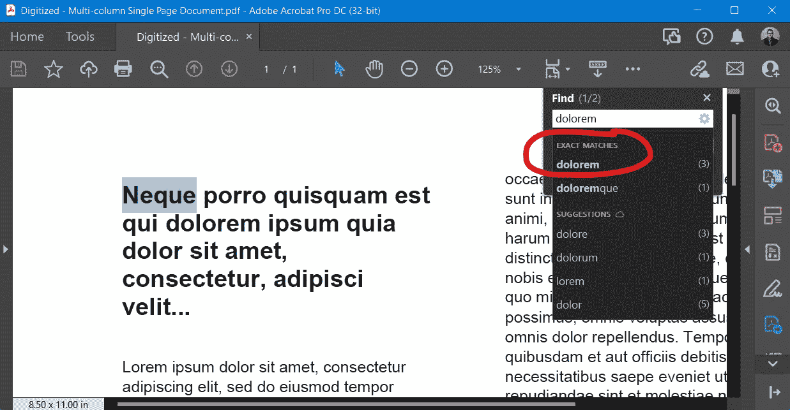

可搜索(数字化)pdf 文档的示例。作者截图。

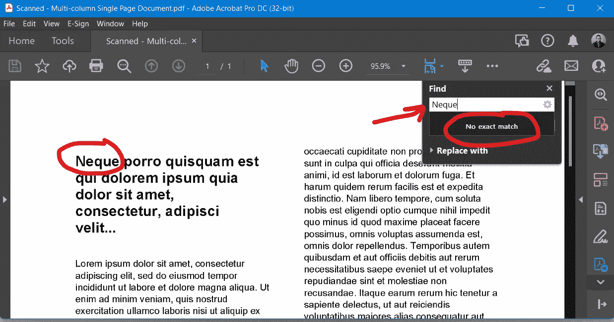

不可搜索(扫描)的 pdf 文档示例。作者截图。

# 文本提取:“文本”

使用 PyMuPDF 从可搜索的 pdf 中提取文本非常容易。在 jupyter 笔记本的单元格块中键入以下内容，然后观看神奇的事情发生:

我们使用`with fitz.open(DIGITIZED_FILE) as doc:`，这样我们就不用担心用`close()`关闭文件。接下来，如果有多个页面，我们使用一个`for`循环遍历 pdf 文档中的所有页面。文本的实际提取发生在代码块的核心部分，`text = page.get_text()`。在我们的例子中，我们使用默认参数(“text”)。下面是`print(text)`的结果:

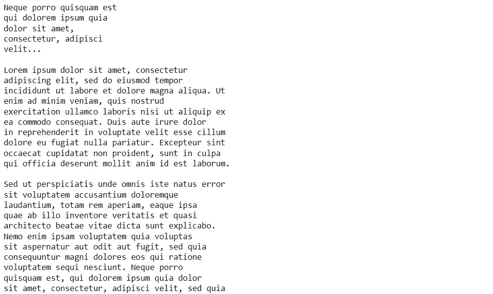

作者截图。

如果我们使用`text = page.get_text("text")`，也会得到相同的结果。其他选择包括“块”和“词”有关 get_text 方法选项的完整列表，请访问[文档](https://pymupdf.readthedocs.io/en/latest/textpage.html?highlight=get_text)。[2]

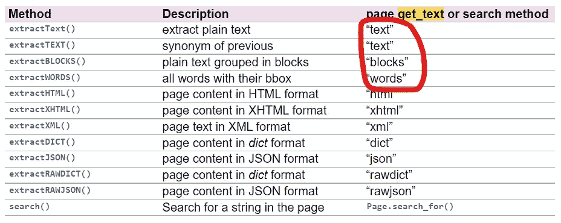

page.get_text()参数。作者截图。

有趣的是，pyMuPDF 成功地以自然阅读顺序阅读了文档，即使有两列。


PyMuPDF 从左到右阅读文档。作者截图。


PyMuPDF 无缝地读取这两列。作者截图。

# 文本提取:“块”

默认参数输出一个字符串。但是，其他参数返回不同的格式，如列表和元组。例如，`page.get_text("blocks")`返回元组的*列表。让我们试一试:*

上面，我们在`page.get_text()`里面加了`"blocks"`。结果如下:

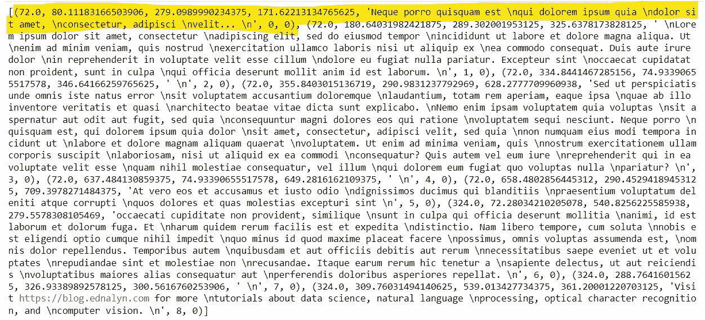

作者截图。

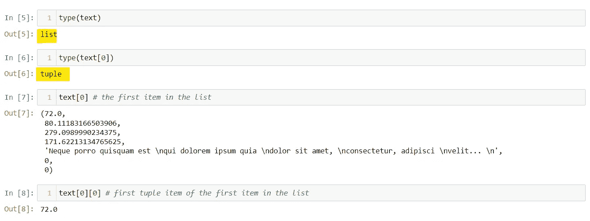

根据文档，的输出是:

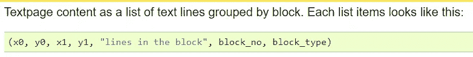

作者截图。

其中前四项是边界框坐标，第五项是文本本身(用换行符或“\n”分隔多行)，第六项是块号，第七项是块类型(0 表示文本，1 表示图像)。

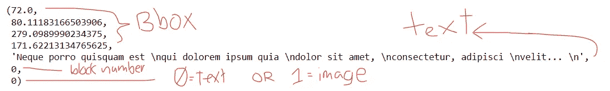

作者截图。

如果你需要知道页面上的什么地方，额外的信息是有益的。例如，如果您需要绘制边界框或高亮显示特定的块。

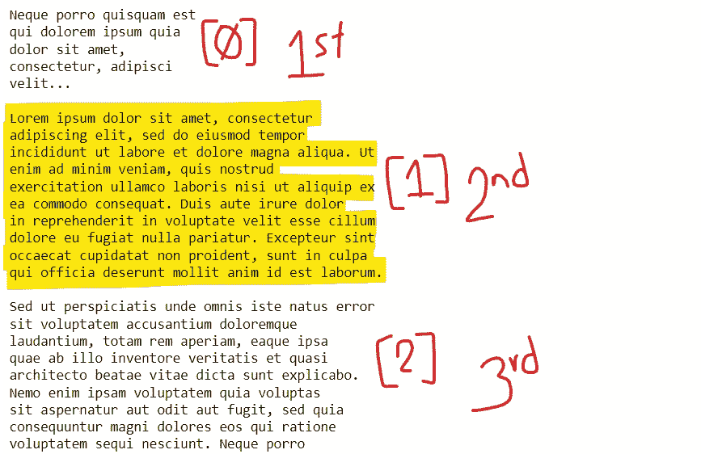

作者截图。

# 文本提取:“单词”

让我们试试“单词”参数，只是为了好玩:

结果显示，参数“words”返回一个元组的*列表，该列表逐字表示文本。*

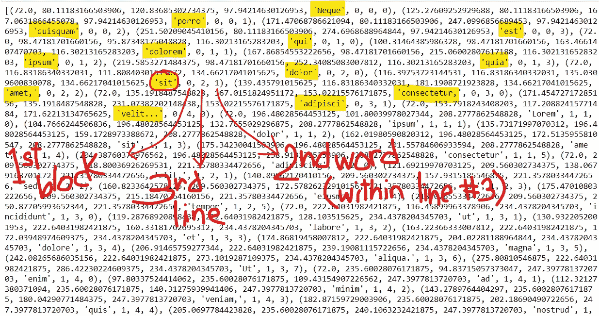

作者截图。

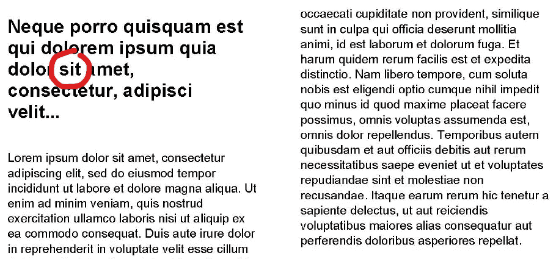

单词“sit”被标注为该页第一块的第三行中的第二个单词。作者截图。

# 严重失败

如前所述， ***pymupdf 不适用于扫描的 pdf*** 。

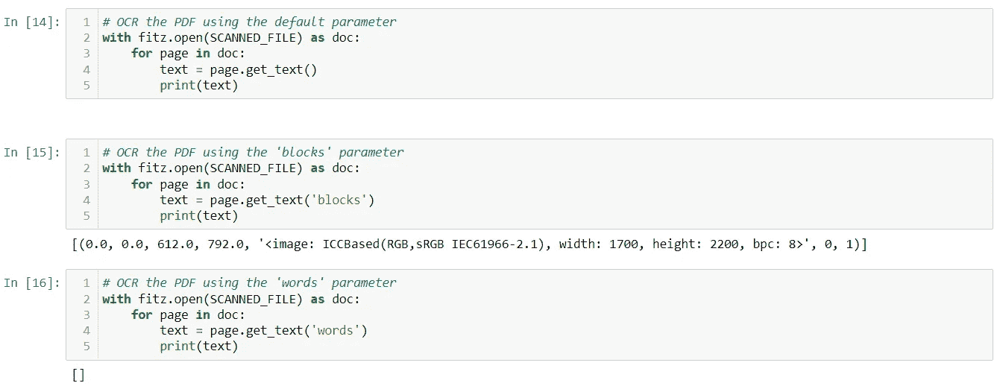

作者截图。

别担心！有一个包可以解决这个问题…

# 结论

今天，我们看到了 PyMuPDF 的行动。这是一个有价值的工具。我已经用它自动搜索了数百个 pdf 文档，而不用打开 Adobe Acrobat。

可能性是无限的。

但是扫描的 pdf 呢？！请继续关注我的下一篇文章，内容包括如何使用 pytesseracT3 阅读多列 PDF。

谢谢你过来看我的帖子。希望 PyMuPDF 能像帮助我一样帮助你！你可以在 [Github](https://github.com/ecdedios) 上这里找到我用[的笔记本。](https://github.com/ecdedios/read-multicolumn-pdf-pymupdf/tree/main/data/in)

敬请期待！

*如果你想了解更多关于我从懒鬼到数据科学家的旅程，请查看下面的文章:*

[](/from-slacker-to-data-scientist-b4f34aa10ea1) [## 从懒鬼到数据科学家

### 我的无学位数据科学之旅。

towardsdatascience.com](/from-slacker-to-data-scientist-b4f34aa10ea1) 

*如果你正在考虑改变方向，进入数据科学领域，现在就开始考虑重塑品牌:*

[](/the-slackers-guide-to-rebranding-yourself-as-a-data-scientist-b34424d45540) [## 懒鬼将自己重塑为数据科学家指南

### 给我们其他人的固执己见的建议。热爱数学，选修。

towardsdatascience.com](/the-slackers-guide-to-rebranding-yourself-as-a-data-scientist-b34424d45540) 

你可以通过 [Twitter](https://twitter.com/ecdedios) 或 [LinkedIn](https://www.linkedin.com/in/ednalyn-de-dios/) 联系我。

# 参考

[1][https://en.wikipedia.org/wiki/Optical_character_recognition](https://en.wikipedia.org/wiki/Optical_character_recognition)

[2][https://pymupdf.readthedocs.io/en/latest/textpage.html?highlight=get_text#](https://pymupdf.readthedocs.io/en/latest/textpage.html?highlight=get_text#)