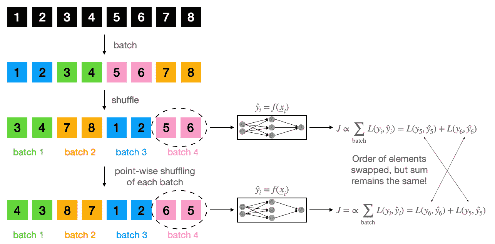

# 使用 PyTorch 数据集更快地读取. h5 文件

> 原文：<https://towardsdatascience.com/reading-h5-files-faster-with-pytorch-datasets-3ff86938cc>

# 使用 PyTorch 数据集更快地读取. h5 文件

## 使用弱洗牌的方法

图片由 [Amol](https://unsplash.com/@amoltyagi2) 提供，取自 [Unsplash](https://unsplash.com/photos/zyJyB9S1oZs) 。

最近，我使用[牛津 Pet 数据集](https://www.robots.ox.ac.uk/~vgg/data/pets/)(参考文献中的引用)进行了一个多任务深度学习项目。虽然我能够通过使用 Colab 的 GPU 来克服极其缓慢的训练速度，但在加载数据时，我很快就遇到了瓶颈。尽管使用了一个庞大的多任务模型，对于一个 32 的批量，训练速度大约是 0.5 秒，而数据加载过程大约是 12…

在互联网上深入搜索后，我发现这是许多人(参见 [PT 论坛](https://discuss.pytorch.org/t/dataloader-when-num-worker-0-there-is-bug/25643/2)、 [S/O #1](https://stackoverflow.com/questions/61915325/is-there-a-more-efficient-way-of-retrieving-batches-from-a-hdf5-dataset) 和 [S/O #2](https://stackoverflow.com/questions/68705944/reading-h5-file-is-extremely-slow) )面临的问题，也是尚未得到充分解决的问题。我想到了一个 PyTorch 解决方案，我认为它适用于大多数情况。这使得我在 Colab 上的加载时间从 12 秒减少到 0.4 秒左右。本文将首先解释瓶颈，然后介绍解决方案。随后是实证结果和对理论保证的评论。我假设您了解 PyTorch 数据集，但是对 Python 中的类有足够的工作知识就足够了。

## 瓶颈从哪里来？

PyTorch 中创建标准数据集的方式基于`torch.utils.data.Dataset`类。这些定制数据集有一个`__getitem__`方法，在调用该方法时，它会加载一组给定索引的数据。我写的数据集是这样的:

完整的数据加载器可以在 GitHub 资源库中找到，[这里](https://github.com/namiyousef/multi-task-learning/blob/main/data/data.py)。在数据集初始化时调用 **_load_h5_file_with_data** 方法，将. h5 文件预加载为生成器对象，以防止每次调用 **__getitem__** 时被调用、保存和删除。

然后，使用`torch.utils.data.Dataloader`类，我定义了一个`trainloader`来批量处理我的数据用于训练目的。这就是问题所在。

每次迭代`trainloader`时，数据集中的`__getitem__`方法被调用`batch_size`次，以生成一批数据。这对于. h5 数据集来说是有问题的，因为从它们中查询数据的时间复杂度与对它们的调用次数成线性比例。因此，如果查询单个索引的开销是 **x** ，那么在我们的例子中，我们期望每批的总时间是 **32*x** 。

这里，列车循环的每一对(输入，目标)将由**列车装载器**查询数据集 32 次(由于 **shuffle=True** )而创建。 **__getitem__** 方法被调用了 32 次，每次都使用不同的索引。然后， **trainloader** 后端聚集来自 **__getitem__** 方法的单个(输入，目标)返回，返回一个包含 32 项的(输入，目标)对用于训练循环。

## 使用弱洗牌提高速度

要认识到的关键点是，. h5 文件的瓶颈来自于寻找数据所在的索引。找到随后出现的索引几乎要花上 10 分钟的时间！

这意味着查询索引`i`处的数据的时间复杂度与查询索引`i:i+batch_size`处的数据的时间复杂度几乎相同。因此，如果我们进行批处理，然后对批处理进行混洗(我称之为‘弱混洗’)，那么我们将通过`batch_size`因子来加快数据加载过程。下图显示了这种方法与标准洗牌方式的不同之处。

这种方法的明显含义是，模型中引入了一些偏差，因为我们不是在点的水平上洗牌。虽然人们可能试图在批次级别洗牌后逐点洗牌以减少偏差，但这是徒劳的，因为损失函数是可交换的。如下图所示。

对于 **m >**

## 弱洗牌实现

数据集不需要更改。这是因为来自`__getitem__`的`index`参数可以是一个索引列表。因此，如果我们能够传递一个列表`list(range(i, i+batch_size))`，那么我们就能够通过对. h5 文件的一次查询获得整批数据。

这意味着需要改变的是数据加载器。为此，必须使用`sampler`参数创建一个自定义加载方案。如下所示:

几个要点:

*   `RandomBatchSampler`是生成索引`i:i+batch_size`的自定义采样器
*   `BatchSampler`类批量采样`RandomBatchSampler`
*   `Dataloader`的`batch_size`参数必须设置为`None`。这是因为`batch_size`和`sampler`不能同时设置

## 理论保证

迄今为止，就我们在模型中诱导的偏差而言，我还没有找到弱改组方法的理论保证。我已经在[交叉验证](https://stats.stackexchange.com/questions/562050/bias-introduced-when-using-weak-shuffling)和[数学交流](https://math.stackexchange.com/questions/4367356/theoretical-bounds-for-error-rate-in-online-learning-when-using-weakly-shuffled)上问过这个问题，如果我得到他们的回复，我会更新这篇文章。在此之前，我会感谢任何建议！

## 关键要点

*   本文描述的方法适用于无法将全部数据加载到内存中的情况
*   使用标准加载方案从. h5 文件中加载批处理很慢，因为时间复杂度与对文件进行的查询数量成比例
*   瓶颈来自于定位第一个索引，任何后续的索引(顺序排列，中间没有间隔！)可以加载，几乎不需要额外的费用
*   通过使用批量采样，我们可以批量加载数据，从而将加载时间减少一倍`batch_size`
*   这意味着数据将被弱混洗。`batch_size`的选择仅限于**batch _ size<T21【m】T7。因此，这种解决方案不适合瓶颈来自训练时间的情况。**

多任务项目的完整代码可以在[这里](https://github.com/namiyousef/multi-task-learning)找到。在不久的将来，我会发布更多关于这个项目的文章，敬请关注！

## 参考

[1] [推荐加载较大 h5 文件的方式](https://discuss.pytorch.org/t/recommend-the-way-to-load-larger-h5-files/32993/9)。PyTorch 论坛。

[2] [torch.utils.data](https://pytorch.org/docs/stable/data.html#disable-automatic-batching) 。PyTorch 文档。

[3] [如何在 Dataloader](https://stackoverflow.com/questions/61458305/how-to-use-a-batchsampler-within-a-dataloader) 中使用 Batchsampler。销售订单

[4] [是否有更有效的方法从 hdf5 数据集中检索批次？](https://stackoverflow.com/questions/61915325/is-there-a-more-efficient-way-of-retrieving-batches-from-a-hdf5-dataset)销售订单

[5] [读取. h5 文件极其缓慢](https://stackoverflow.com/questions/68705944/reading-h5-file-is-extremely-slow)。销售订单

[6] [从数据加载器](https://discuss.pytorch.org/t/random-batch-sampling-from-dataloader/113457)随机批量取样。PyTorch 论坛。

[7] [在 PyTorch](https://medium.com/analytics-vidhya/creating-a-custom-dataset-and-dataloader-in-pytorch-76f210a1df5d) 中创建一个定制的数据加载器。中等。

[8] [使用 h5py](https://stackoverflow.com/questions/33900486/shuffle-hdf5-dataset-using-h5py) 混洗 HDF5 数据集。销售订单

[9][py torch 的 HDF5 数据集](/hdf5-datasets-for-pytorch-631ff1d750f5)。中等，

## 数据集

[1] [牛津宠物数据集](https://www.robots.ox.ac.uk/~vgg/data/pets/)。许可:[知识共享署名-共享 4.0 国际许可](https://creativecommons.org/licenses/by-sa/4.0/)。

*所有图片均来自作者，除非另有说明*