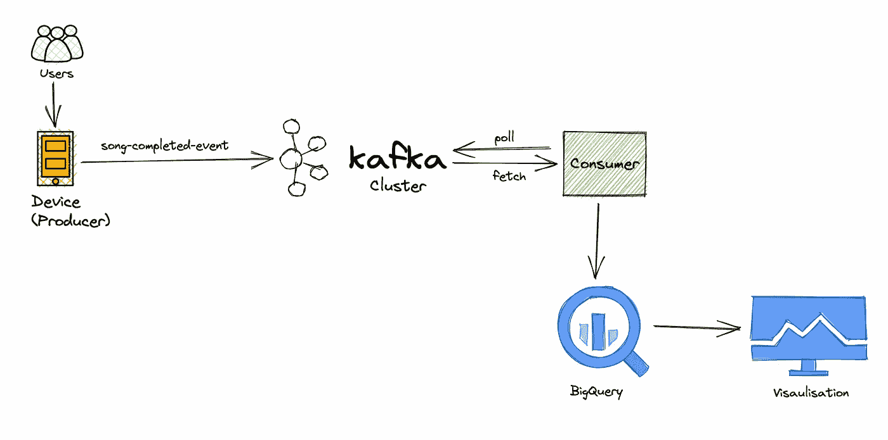
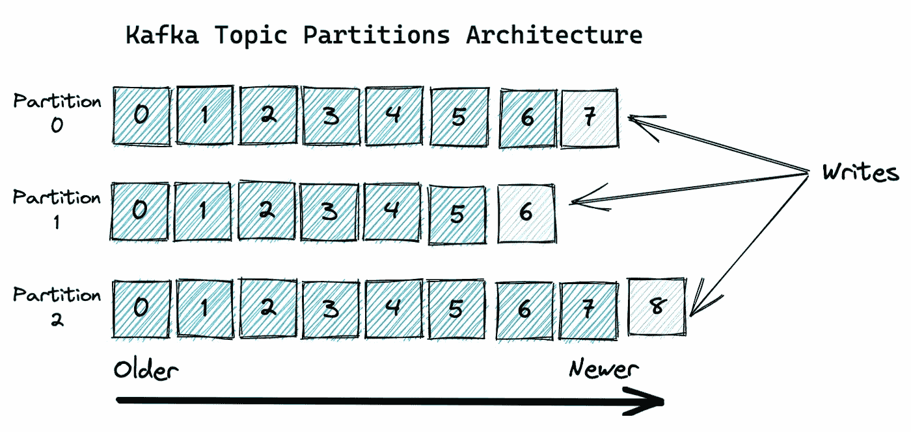
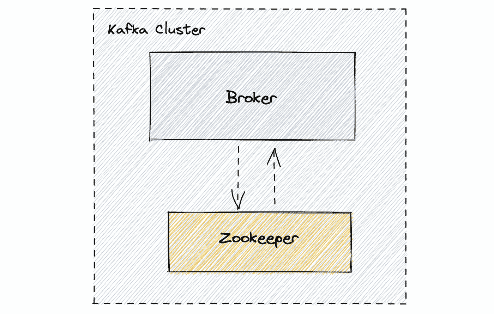
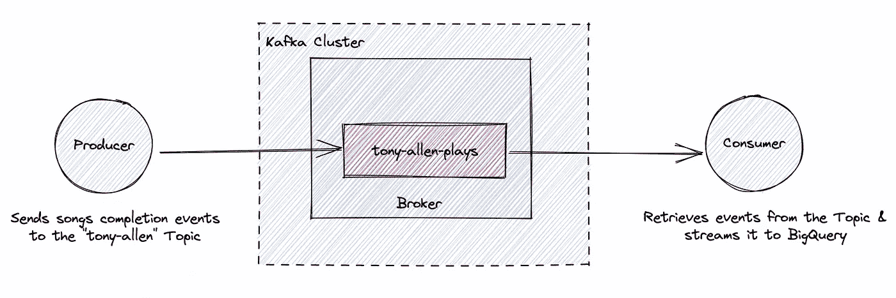
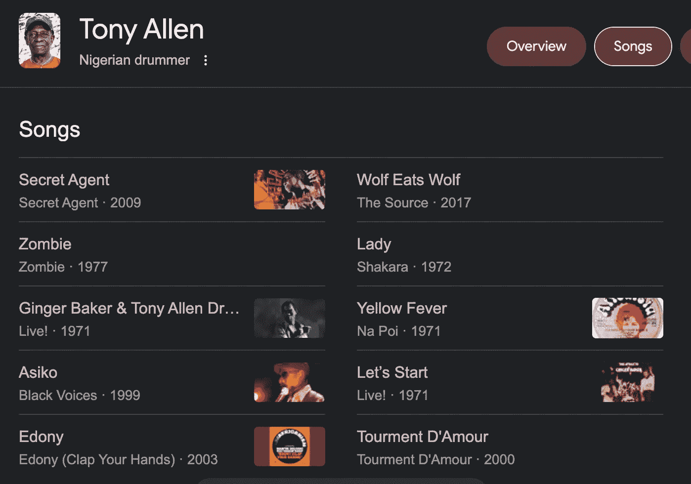
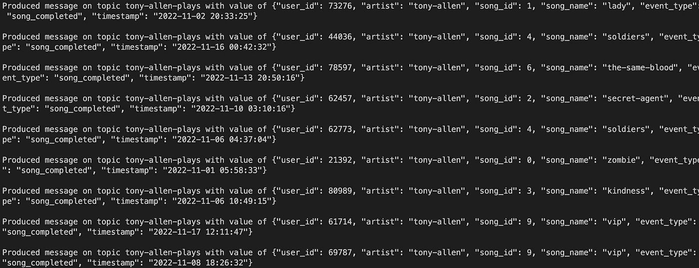
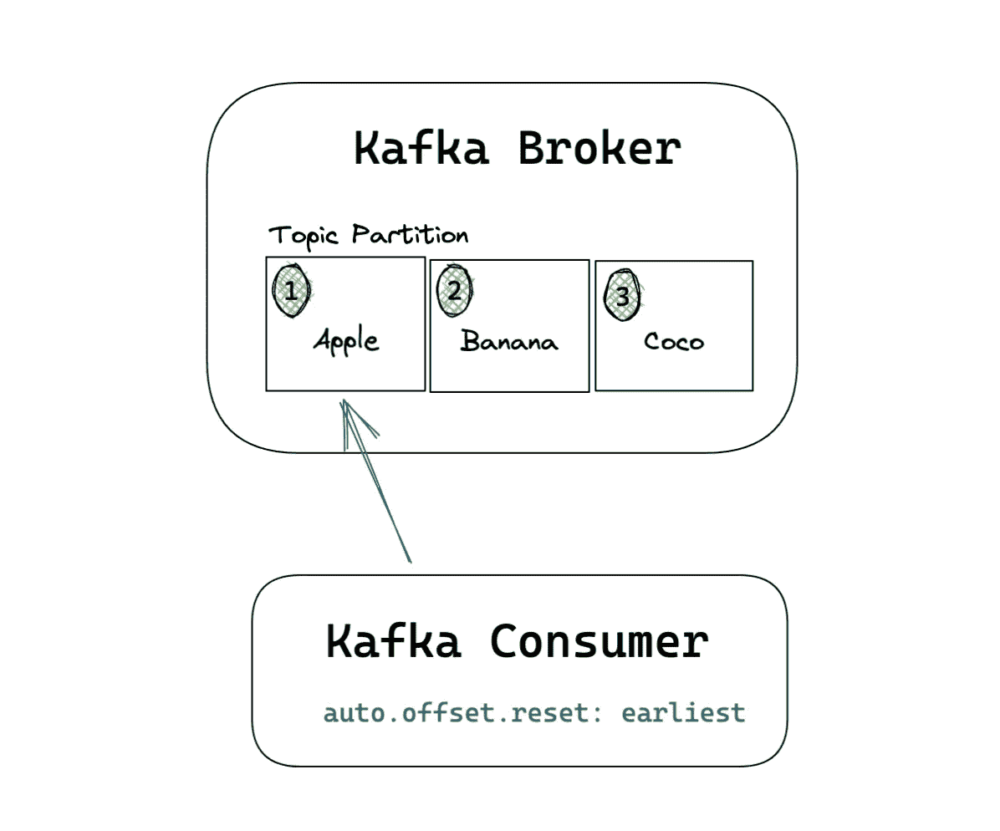
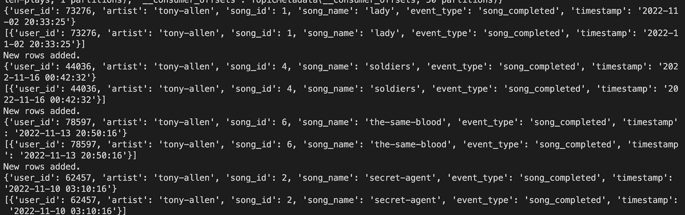
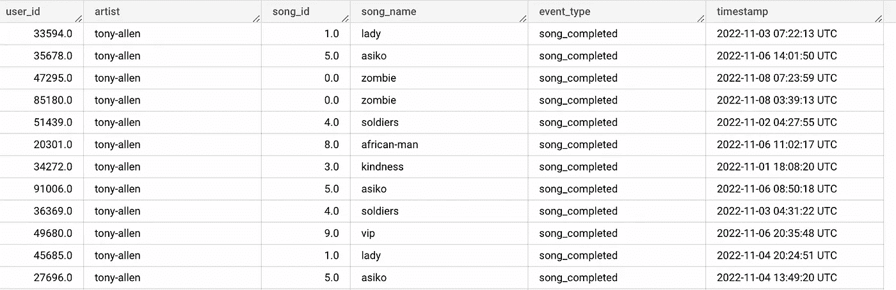
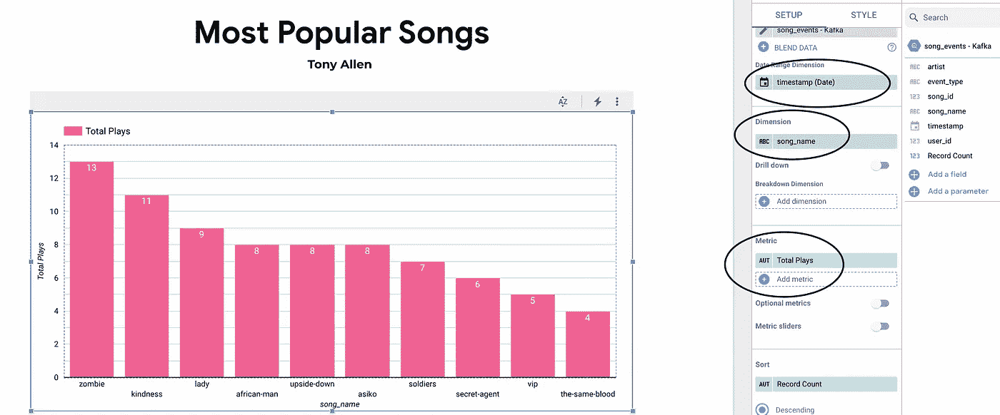

# 使用 Kafka、BigQuery 和 Looker Studio 构建实时事件流管道

> 原文：<https://towardsdatascience.com/real-time-event-streaming-with-kafka-bigquery-69c3baebb51e>

## *一个简单的数据工程项目*


[菲利普](https://unsplash.com/@fhavlik?utm_source=medium&utm_medium=referral)在 [Unsplash](https://unsplash.com?utm_source=medium&utm_medium=referral) 上的照片

实时流媒体应用有时可能会很复杂，当试图了解它们时，决定一个实际的用例对于培养有趣有效的学习体验是很重要的。因此，通过下面的例子，我希望您能够以一种简单的方式掌握构建实时应用程序的基础。

# 方案

假设我们在一家**音乐流媒体服务**公司的数据工程部门工作，我们需要创建一个**实时仪表板**，显示某个特定艺术家(比如说 [**【托尼·阿伦】**](https://en.wikipedia.org/wiki/Tony_Allen_(musician)) )一段时间内最受欢迎的歌曲。为此，我们将利用一个流行的**分布式流媒体平台 Kafka** 来制作、消费必要的歌曲事件，并将其流式传输到 **BigQuery** 中，这样我们就可以在 **Looker Studio** 的仪表盘上可视化这些流行歌曲。

我们的架构最终会是这样的:



实时流架构—作者图片

## 术语和概念

让我们快速定义一些我们将在本文中涉及的术语。

*   **Kafka**:[Apache Kafka](https://www.confluent.io/what-is-apache-kafka/)是一个开源的分布式流媒体平台，支持(除其他外)实时事件驱动应用程序的开发，非常适合我们的用例。
*   **Kafka 集群:**一组服务器(称为代理)，它们协同工作，为实时应用程序提供高可用性、容错和存储。
*   如上所述，代理是在 Kafka 集群中执行实际工作的机器。它托管一些分区集，处理向这些分区写入新事件的传入请求，并允许消费者按主题、分区和偏移量获取消息。
*   **主题**:一个主题仅仅是一个 ***事件日志*** 。来自生成器的每个新事件都被附加到主题的末尾。而话题又分为[分区](https://developer.confluent.io/learn-kafka/apache-kafka/partitions/#:~:text=Kafka%20Partitioning&text=Partitioning%20takes%20the%20single%20topic,many%20nodes%20in%20the%20cluster.)。



作者图片

*   **Producer:** 您编写的将数据发布(产生)到 Kafka 集群中的主题的应用程序。
*   **消费者:**从 Kafka 集群中实时检索数据的应用程序或最终用户。为了有效地获取实时消息，Kafka 消费者必须订阅集群中存在的各个主题。
*   **Zookeeper** :跟踪 Kafka 集群节点的状态，它还跟踪 Kafka 主题、分区等等。(*注:一个名为* [*的更新 KIP-500*](https://cwiki.apache.org/confluence/display/KAFKA/KIP-500%3A+Replace+ZooKeeper+with+a+Self-Managed+Metadata+Quorum) *移除了对 Zookeeper 的需求，但我们在本文中将不会使用那个版本的 Kafka)。*
*   **Poll**:`poll()`方法是 Kafka 消费者调用的从给定主题中检索记录的函数。

我们将在 **4 个步骤**中设置上述架构。但是在我们开始之前，请确保您具备以下先决条件:

## 先决条件

*   确保你已经安装了[Docker](https://docs.docker.com/engine/install/)。
*   在您的机器上安装`[confluent-kafka](https://pypi.org/project/confluent-kafka/)` Python 库。
*   启用 [BigQuery API](https://cloud.google.com/bigquery/docs/quickstarts/query-public-dataset-console#before-you-begin) 。
*   在 Google Cloud 中创建一个服务帐户密钥，并提供流 API 工作所需的[权限。将它保存在您的机器上，因为我们稍后会引用它。](https://cloud.google.com/bigquery/docs/streaming-data-into-bigquery#required_permissions)

# #1.用 Docker 部署 Kafka

Kafka 可以通过多种方式部署，但是我们将使用 Docker 来部署它，因为它非常简单。

我们的 Kafka 集群将有两个主要实体；

*   1 个代理实例和
*   1 个 Zookeeper 实例。



简单的卡夫卡集群——作者图片

我们将使用一个 Docker 组合文件来配置和运行这些容器。您会注意到下面的`docker-compose.yaml`文件中公开的 2 个服务和所需的端口:

确保 docker 文件与我们稍后将要编写的 Kafka 生产者和消费者文件位于同一个目录中。

要构建两个 Docker 容器，运行这个命令，您应该在几分钟内就可以启动并运行这两个容器。

```
docker-compose up -d
```

# #2.构建生成器

我们将编写一个模拟音乐流平台上用户活动的应用程序/制作程序。这个应用程序将发送一个名为`song-completed`的事件，当用户完成一首歌曲时就会触发这个事件。这个事件将被发送到一个我们称之为`tony-allen-plays`的卡夫卡主题。



一个生产者和消费者在 Kafka 集群中与主题互动的架构——作者图片

我们将使用 [Faker 包](https://faker.readthedocs.io/en/master/)为我们的应用程序生成假的流数据。我们的假事件有效负载看起来像这样:

```
{'user_id':001,
'artist': 'tony-allen',
'song_id': 03, 
'song_name':  'lady',
'event_type':'song_completed',
'timestamp': '2022-11-03 07:22:13'}
```

要安装 Faker 包，请在终端窗口中运行:

```
pip install Faker
```

## 生成一个假歌曲列表

现在，在我们的代码中，我们将启动 Faker 对象，并创建一个硬编码的托尼·阿伦 10 首随机歌曲的歌曲列表，它将成为事件有效负载的一部分。



我从他在谷歌上的歌曲列表中随机挑选了一些歌曲——作者截图

```
from confluent_kafka import Producer
from faker import Faker
import json
import time
import logging

#Create Faker object to generate fake data for Producer
fake=Faker()

#Create Tony Allen song list
songs = ["zombie", "lady", "secret-agent","kindness","soldiers","asiko","the-same-blood","upside-down","african-man","vip"]
```

## 配置日志格式

每当一个新事件可用时，日志将被附加到主目录中的一个`producer.log`文件中——我们在下面定义了它。这里，我们正在设置我们希望如何格式化该日志文件的基本配置。

```
#Configure logger
logging.basicConfig(format='%(asctime)s %(message)s',
                    datefmt='%Y-%m-%d %H:%M:%S',
                    filename='producer.log',
                    filemode='w')

logger = logging.getLogger()
logger.setLevel(logging.INFO)
```

## **发起生产者**

通过指定 Kafka 集群的端口来启动 Kafka producer 对象，如上面的 Docker compose 文件中所定义的:

```
#Create Kafka Producer
p=Producer({'bootstrap.servers':'localhost:9092'})
```

## 配置回拨

定义一个负责确认新消息或错误的回调函数。当有效消息可用时，它被解码为 utf-8 并以首选格式打印。相同的消息也会附加到日志文件中。

```
#Callback function
def receipt(err,msg):
    if err is not None:
        print('Failed to deliver message: {}'.format(err))
    else:
        message = 'Produced message on topic {} with value of {}\n'.format(msg.topic(), msg.value().decode('utf-8'))
        logger.info(message)
        print(message)
```

## 编写一个生产者循环

这是有趣的部分！这里我们只是创建了一个 3 秒延迟的循环，模拟流媒体平台上的实际用户活动。我们为 JSON 事件创建了一个模式，并利用 Faker 来生成实际的数据点。

```
#Write Producer loop 
def main():
    for i in range(20):
        random_song_id = fake.random_int(min=0, max=9)
        data={
           'user_id': fake.random_int(min=20000, max=100000),
           'artist': 'tony-allen',
           'song_id': random_song_id, 
           'song_name':  songs[random_song_id],
           'event_type':'song_completed',
           'timestamp': str(fake.date_time_this_month())    
           }
        m=json.dumps(data)
        p.produce('tony-allen-plays', m.encode('utf-8'),callback=receipt)
        p.poll(1) # Polls/checks the producer for events and calls the corresponding callback functions.
        p.flush() #Wait for all messages in the Producer queue to be delivered. Should be called prior to shutting down the producer to ensure all outstanding/queued/in-flight messages are delivered.
        time.sleep(3)
```

注意，当我们调用`p.produce`时，我们指定了我们想要发布消息的 Kafka 主题。在这种情况下，称为`tony-allen-plays`。因为这个主题在我们的 Kafka 集群中还不存在，所以它是在这个应用程序第一次运行时自动创建的。

`p.poll`很重要，因为它检查事件的生产者并调用我们之前定义的相应回调函数。

我们完整的`producer.py`脚本应该是这样的:

要确认生成器按预期工作，请在终端窗口中运行以下命令:

```
python producer.py
```

您应该看到下面的输出，它打印出每 3 秒钟发送到 Kafka 主题的事件。



终端窗口中的生产者输出—按作者分类的图像

# #3.建立消费者

消费者会做两件主要的事情:

*   从`tony-allen-plays`主题中轮询和检索事件
*   使用 BigQuery 流 API 将这些事件作为流发送到 BigQuery

## 安装 BigQuery Python 库

首先，使用以下命令安装 BigQuery Python 库。

```
pip install google-cloud-bigquery
```

然后我们可以将它导入到`consumper.py`脚本中，并设置 BigQuery 配置。

```
from confluent_kafka import Consumer
from google.cloud import bigquery
import ast
from google.oauth2 import service_account

#Create BQ credentials object
credentials = service_account.Credentials.from_service_account_file('PATH-TO-BQ-SERVICE-ACCOUNT')

# Construct a BigQuery client object.
bq_client = bigquery.Client(credentials=credentials)

#Speficy BigQuery table to stream to
table_id = 'PROJECT-ID.DATASET.TABLE-NAME'
```

## 启动消费者

接下来，我们通过指定端口来启动 Kafka 消费者，然后我们订阅主题`tony-allen-plays`。在初始化消费者时，我们指定消费者 groupid，因为所有 Kafka 消费者必须属于一个消费者组。

```
c=Consumer({'bootstrap.servers':'localhost:9092','group.id':'tony-allen-consumer','auto.offset.reset':'earliest'})
print('Kafka Consumer has been initiated...')

#Subscribe to topic
c.subscribe(['tony-allen-plays'])
```

您还会注意到有一个属性——`auto.offset.reset`——最早被设置为‘T5’。基本上是从话题划分开始就在告诉消费者消费。



卡夫卡 **auto.offset.reset:最早的** —作者图片

典型的 Kafka 消费应用程序以消费循环为中心。因此，最后一步是编写一个循环，不断地轮询主题中的新消息，如果发现新消息，就将这些消息发送给 BigQuery。

我们完整的脚本应该是这样的:

卡夫卡消费者. py

## 运行 Kafka 管道

既然已经设置了消费者和生产者，那么打开两个单独的终端窗口并再次运行生产者:

```
python producer.py
```

然后运行消费者，以便它实时从主题中读取数据:

```
python consumer.py
```

如果您看到生产者生成的消息开始出现在消费者终端窗口中，那么您的消费者正在正常工作，数据也应该流入 BigQuery:



Kafka consumer.py 输出—作者图片



《大查询》中的卡夫卡事件——作者图片

# #4.可视化数据

最后一步是将 BigQuery 表连接到 Looker Studio，并创建一个简单的条形图，以接近实时的方式显示流行歌曲。

前往 [Looker Studio](https://datastudio.google.com/u/2/navigation/reporting) ，签到并:

*   选择新的“空白报告”
*   在“连接到数据”下，选择“BigQuery”作为数据源
*   然后选择您的 BigQuery 项目、数据集和表

现在您应该看到一个类似的视图。确保*尺寸*和*度量*字段与下面的屏幕截图匹配，您应该有一个如图所示的简单条形图。



Looker 工作室截图作者。“总播放次数”由“记录计数”更名而来。—作者图片

## 接近实时的仪表板

Looker Studio 有一个 [**数据刷新**](https://support.google.com/looker-studio/answer/7020039#zippy=%2Cin-this-article) 特性，它指定了仪表板刷新的频率。您可以将其设置为 1 分钟，这是当前可用的最频繁的刷新周期，您的控制面板应该每 1 分钟刷新一次。

# 结论

我们讲述了如何用 Docker 建立一个最小的 Kafka 集群，将数据加载到一个主题中，然后消费数据并将其传输到 BigQuery。最后，我们创建了一个近乎实时的仪表板，在 Looker Studio 中呈现最终结果。

我希望你觉得这很有用，并祝你好运建立你的下一个实时应用程序！欢迎分享您的任何建议或其他使用案例。

> 你可以[成为中会员](https://medium.com/@tobisam/membership)支持我，享受更多这样的故事。

## 参考

*   [融合的卡夫卡 API](https://docs.confluent.io/kafka-clients/python/current/overview.html#ak-python)
*   [如何用 Python 构建一个简单的 Kafka 生产者和消费者](https://medium.com/towards-data-science/how-to-build-a-simple-kafka-producer-and-consumer-with-python-a967769c4742)
*   [阿帕奇卡夫卡文档](https://kafka.apache.org/documentation.html#newconsumerconfigs)
*   [卡夫卡消费抵消](https://medium.com/lydtech-consulting/kafka-consumer-auto-offset-reset-d3962bad2665)