# 网站访客预测与脸书先知:完整教程

> 原文：<https://towardsdatascience.com/real-world-website-visitor-forecast-with-facebook-prophet-a-complete-tutorial-8d135b848c5e>

## 包括安装说明、数据、参数调整以及简单和复杂的预测—第 1 部分


预测可能会拯救你或你的公司。美国国家海洋和大气管理局在 [Unsplash](https://unsplash.com/s/photos/forecast?utm_source=unsplash&utm_medium=referral&utm_content=creditCopyText) 拍摄的照片

作为微软的一名数据分析师，我每天都必须调查和理解时间序列数据。除了在历史背景下查看一些关键绩效指标，如 SRPVs、CPCs、转换率，我们有时还需要展望未来，即进行预测。对当前数据和未来的洞察有助于我们和我们的客户提前调整。

我试过很多方法。我个人最喜欢的是 LSTM。但是在现在的公司，他们雇佣了 FB Prophet。入乡随俗。因此，在这个项目中，我将坚持 Prophet 来预测欧洲某网站的唯一访客量。网站域名，后面你会看到，是捏造的。你只会在数据集中找到日期、地点和访客数量。

脸书先知有它的优势，虽然它不是特别健壮。但在预测方面，它简单、易用、全自动、快速。你不必处理数据维度，也不需要反向标准化。如果你不太熟悉 Python 和编码，并且你没有太多的时间建模，那么在我看来，这绝对是最好的选择之一。

在本文中，我将介绍，

1.  [**安装先知**](/real-world-website-visitor-forecast-with-facebook-prophet-a-complete-tutorial-8d135b848c5e)
2.  [**简单的 ETL，以及数据可视化**](/real-world-website-visitor-forecast-with-facebook-prophet-a-complete-tutorial-8d135b848c5e)
3.  [**【简单预测(默认设置的预测)**](/real-world-website-visitor-forecast-with-facebook-prophet-a-complete-tutorial-8d135b848c5e)
4.  [**预测与模型评估**](/website-visitor-forecast-with-facebook-prophet-a-complete-tutorial-1d0a5bcd1f8f)
5.  [**用调好的参数进行预测**](/website-visitor-forecast-with-facebook-prophet-a-complete-tutorial-1d0a5bcd1f8f)

但是，原文太长了。因此它现在被分成两部分——[前 3 节在第 1 部分](/real-world-website-visitor-forecast-with-facebook-prophet-a-complete-tutorial-8d135b848c5e)中，而[第 4 节](/website-visitor-forecast-with-facebook-prophet-a-complete-tutorial-1d0a5bcd1f8f)和[第 5 节](/website-visitor-forecast-with-facebook-prophet-a-complete-tutorial-1d0a5bcd1f8f)在[第 2 部分](/website-visitor-forecast-with-facebook-prophet-a-complete-tutorial-1d0a5bcd1f8f)中。如果您对安装和简单预测不感兴趣，请[点击此处进入第 2 部分](/website-visitor-forecast-with-facebook-prophet-a-complete-tutorial-1d0a5bcd1f8f)。

# **1。安装**

几年前，当 python 还处于 3.8 版本时，新的 Prophet 用户只需 pip 安装库，然后进行预测。但是，尽管大多数 Python 用户已经更新到 3.9x，甚至更高的版本，但 Prophet 遗憾的是更新不快，只支持 3.8x 或更低的 Python 版本。因此，我们大多数人都需要一个解决这个不相容问题的方法。

虚拟环境是解决这一问题的方法之一。要了解什么是虚拟环境，[请点击此处](/virtual-environments-104c62d48c54#:~:text=Well%2C%20a%20virtual%20environment%20is%20just%20a%20directory,site%20packages%20installed%20inside%20the%20given%20virtual%20environment)。

如果你只对 FB 先知感兴趣，请随意跳过。

1.  要在 Windows 10 中创建一个虚拟环境(本教程是用 Windows 10 平台编写的，而不是我曾经工作过的 Mac)，我们首先必须安装 Anaconda。请[点击这里进入官方网站](https://www.anaconda.com/products/individual)。

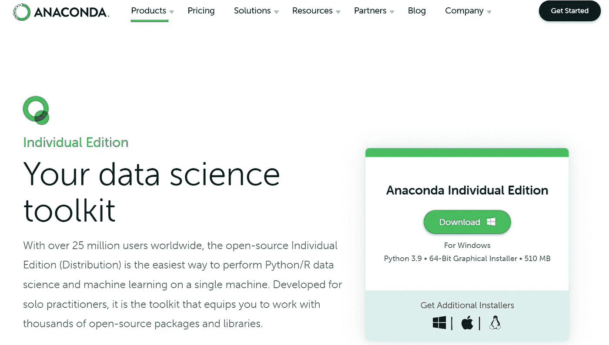

按照安装指南完成 Anaconda 安装。作者图片

然后按照安装指南完成安装。安装很容易。我们只需点击“是，是……”就能得到我们需要的东西。

**2。**安装完成后，我们将使用命令行提示。但是这一次，我们没有使用 Windows 命令提示符。相反，我们将使用 **Conda 命令提示符**。

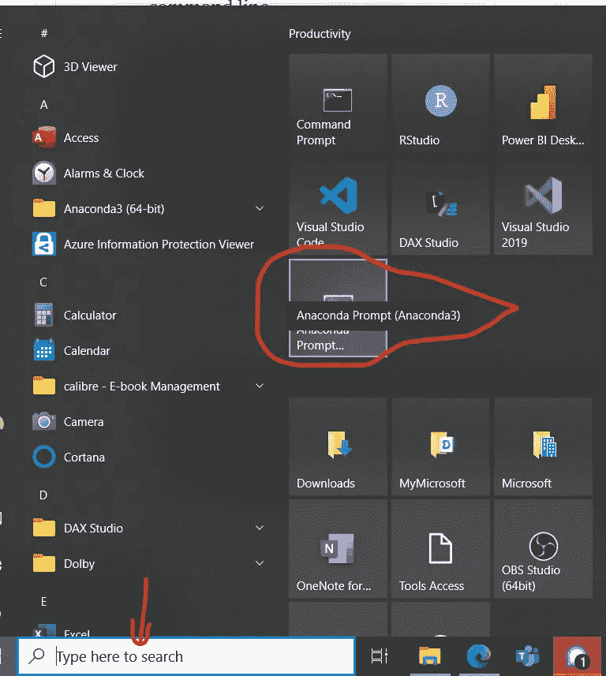

在这篇 Prophet 教程中，我们将使用 Anaconda 命令提示符。上面画圈的是 Anaconda 提示符。作者图片

如果您找不到 Anaconda 命令提示符，请转到上面红色箭头所指的搜索栏，搜索“Anaconda 提示符”。

**3。**会弹出一个小黑窗口。在这个 Anaconda 命令提示符下，输入:

```
conda create -n python_3_8 python=3.8
```

它所做的是创建一个名为 python_3_8 的新工作环境，其中安装了 python3.8。

**4。**然后我们进入:

```
conda activate python_3_8
```

输入该命令后，系统将进入虚拟环境 python_3_8。从现在开始，您的 python_3_8 虚拟环境将取代您原来的 python 环境(暂时)。您也可以选择它作为 Visual Studio 代码中的工作内核。

要在完成项目后逃离这个虚拟环境，只需输入:

```
conda deactivate
```

**5。**现在我们有了工作环境，我们需要安装库。下面是我们将需要的库和依赖项。只需逐行安装下面的代码。

```
conda install libpython m2w64-toolchain -c msys2conda install numpy cython -c conda-forgeconda install matplotlib scipy pandas -c conda-forgeconda install pystan -c conda-forgeconda install -c anaconda ephemconda install -c anaconda scikit-learnconda install -c conda-forge seabornconda install -c plotly plotlyconda install -c conda-forge optunaconda install -c conda-forge Prophet
```

安装完所有这些之后，我们现在可以开始我们的数据了。

# 2.**简单的 ETL 和数据可视化**

我们将从 csv 加载数据，并在此显示数据。因为数据是从其他数据库中提取的，所以我不会在这里介绍这些步骤。因此，我们将直接转到 csv 文件并探索。数据可以在这里[下载。](https://github.com/lorenzoyeung/prophet)

Jupyter 笔记本文件也可以在这个链接中找到— [下载笔记本](https://github.com/lorenzoyeung/prophet)。

首先，我们导入数据。

```
df = pd.read_csv(‘data.csv’)df2 = df.copy()
df2.head()
```

我们探索我们的数据。

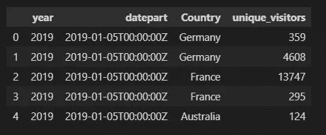

网站独特访问者的数据框架。国家一栏是网站的服务区域。作者图片

```
print(df2[‘Country’].value_counts(), “\n”)print(df2[‘Country’].nunique(), “unique values.”)
```

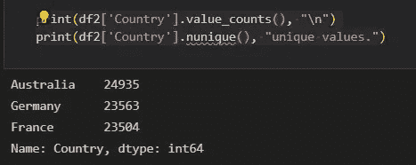

德国有 23563 个数据点。作者图片

大致了解数据集后，我们清理 DateTime 列，只过滤需要的数据点。我只对德国的数据感兴趣，所以我将使用 loc 进行过滤。

```
df2[‘date’] = pd.to_datetime(df2[‘datepart’], dayfirst=True).dt.datedf2 = df2.loc[(df2[‘Country’]==’Germany’)] # we are only interested in the visitors from Germany in this tutorial.df_de = df2.copy()
```

现在我们有了一个数据框，里面只有网站在德国的表现。

确保数据集中没有空值。

```
df_de.isna().count()/df_de.count()
```

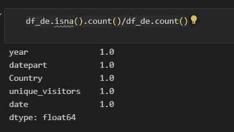

1.0 表示 100%，没有缺失数据点。作者图片

Prophet 对要馈入的 df 有严格的要求。 **ds** 和’**y**列是需要的标准列。其他的是，例如，“上限”和“下限”。我们在教程中不需要它们，因为这次我们将把模型设置为“线性”而不是“逻辑”。我将在本教程的第 2 部分中解释原因。

```
df_de2 = df_de.groupby(“date”).agg(np.sum)df_de2 = df_de2.reset_index()df_de2.columns = [‘ds’, ‘y’]df_de2 = df_de2[[‘y’, ‘ds’]]df_de2
```

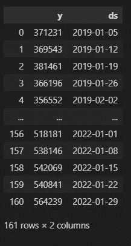

“y”是要预测的目标值，“ds”是日期。它们是先知模型的两个基本要素。作者图片

然后，我将使用 [Plotly](https://plotly.com/) 可视化我们的唯一访问者列的数据分布。Plotly 是我最喜欢的可视化库，因为它易于应用和交互。

```
import plotly.io as piopio.renderers.default = “notebook”fig_line = px.line(df_de2, x=”ds”, y=”y”, title=’The number of unique visitors of [www.lorentzyeung.com](http://www.lorentzyeung.com) in the previous 3 years’)fig_line.show()
```

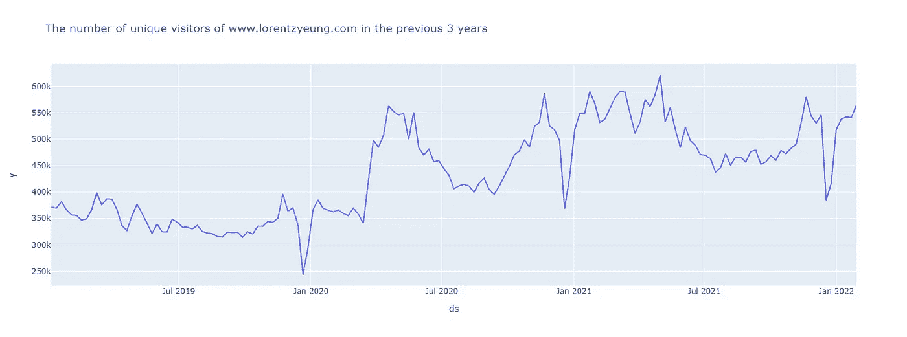

在过去的 3 年里，[www.lorentzyeung.com](http://www.lorentzyeung.com)的独立访客数量。域名是捏造的。作者图片

用均值和标准差找出可能的异常值。

```
df_stat = df_de2.describe()mean = df_stat.loc[“mean”][“y”]std = df_stat.loc[“std”][“y”]upper = mean+std*3lower = mean-std*3print(‘ Mean: ‘, mean, ‘\n’, ‘Standard Deviation: ‘, std, ‘\n’, ‘Upper Limit: ‘, upper, ‘\n’, ‘Lower Limit:’, lower)
```

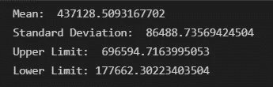

现在我们清楚地知道均值和异常值在哪里。只是我习惯用 3 个标准差作为上下大纲图截止线。作者图片

然后我们用方框图一点一点地显示可能的异常值。

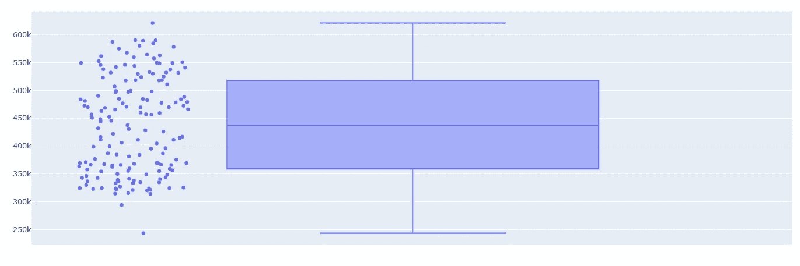

我们的数据集中没有异常值。作者图片

我们的数据集几乎显示了一个完全对称的钟形(垂直)，这意味着发现了正态分布。我们的数据集中没有异常值。这是理想的，因为正态分布是技术市场分析和其他类型的统计分析中最常见的分布类型。

# **3。简单预测(默认设置的预测)**

在这个环节中，我将从一个简单的预言开始。这很简单，因为我们不需要在这里指定任何特定的参数值。我将只使用默认设置。然后，我们将观想我们的结果。

```
m = Prophet(interval_width=0.95, weekly_seasonality=False, daily_seasonality=False)m.add_country_holidays(country_name=’DE’)m.fit(df_de2)future_df = m.make_future_dataframe(periods=52,freq=’W’)forecast_default = m.predict(future_df)plot_forecast = m.plot(forecast_default)
```

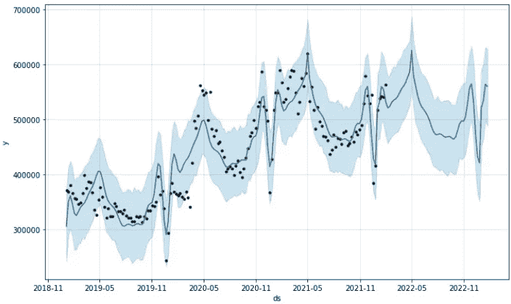

在 Prophet 中直观显示原始数据点和预测线非常简单。我们的网站前几年一直在改进，甚至在疫情时代也是如此。但奥米克隆似乎带走了势头，扭转了趋势。作者图片

这个预测和图表对人脑有意义，至少对我的大脑有意义。尽管趋势趋于平稳，但 5 %的置信区间告诉我们，未来一年可能会呈下降趋势。

```
plt_components = m.plot_components(forecast_default)
```

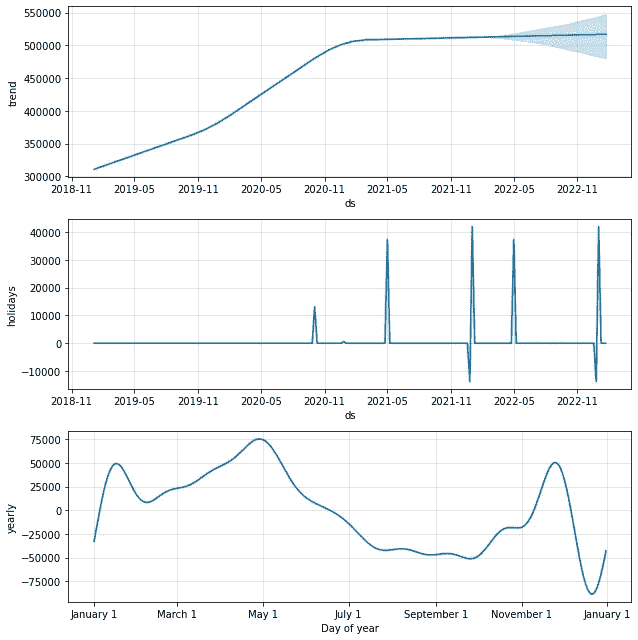

组件图。作者图片

从上面的组件图中，我们可以看到我们的访问者数量呈上升趋势，尽管假期影响了性能。似乎圣诞节是我们网站最大的障碍。然而，一月和五月的银行假日会给我们的网站带来最强劲的增长。这里的图表完全有意义，因为你的网站销售的产品与圣诞节无关。

现在，您已经学习了如何安装和预测开箱即用的 Prophet 模型。在接下来的[第二部分](/website-visitor-forecast-with-facebook-prophet-a-complete-tutorial-1d0a5bcd1f8f)中，我将展示如何[评估该模型，以及如何改进/优化它](/website-visitor-forecast-with-facebook-prophet-a-complete-tutorial-1d0a5bcd1f8f)。

感谢您的阅读。如果你喜欢这个教程，请分享给你的数据科学朋友，还有**关注我**。以下是我继续为社区做贡献的动力。

# 请继续阅读文章的第二部分。

[请点击此处进入第二部分](/website-visitor-forecast-with-facebook-prophet-a-complete-tutorial-1d0a5bcd1f8f)。

## 参考:

[](https://facebook.github.io/prophet/) [## 先知

### Prophet 是一个用 R 和 Python 实现的预测程序。它速度很快，并提供完全自动化的预测…

facebook.github.io](https://facebook.github.io/prophet/) 

## 您可能还喜欢:

[](https://medium.com/analytics-vidhya/sales-analytics-churn-analysis-and-prediction-with-pyspark-98fffc169f36) [## 销售分析:使用 PySpark 进行流失分析和预测

### 最后用保存的模型和管道进行基础数据可视化和预测

medium.com](https://medium.com/analytics-vidhya/sales-analytics-churn-analysis-and-prediction-with-pyspark-98fffc169f36) [](/pandas-data-wrangling-cheat-sheet-2021-cf70f577bcdd) [## 熊猫数据争论备忘单 2021

### 要在 Python 中 excel 数据分析/数据科学/机器学习，熊猫是你需要掌握的库。这里有一个骗局…

towardsdatascience.com](/pandas-data-wrangling-cheat-sheet-2021-cf70f577bcdd) [](/fundamental-marketing-analytics-f875018391d5) [## 基础营销分析

### 通过最近-频率-货币模型和使用 Python 的管理细分

towardsdatascience.com](/fundamental-marketing-analytics-f875018391d5)