# 用聚类算法重组体育联盟

> 原文：<https://towardsdatascience.com/realigning-sports-leagues-with-a-clustering-algorithm-d6e9de9294d0>

# 用聚类算法重组体育联盟

## 使用改进的 K-means 算法将职业运动队分组为最小化旅行距离的组

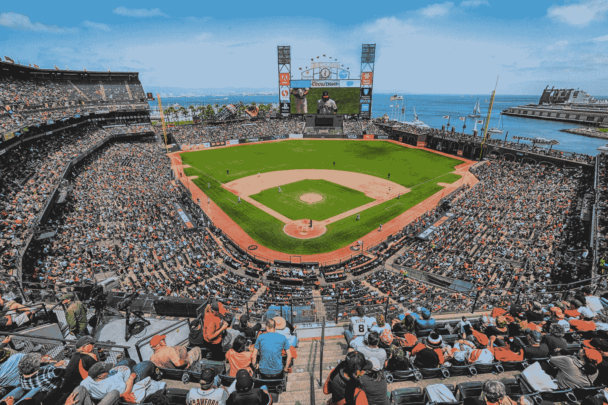

米克·豪普特在 [Unsplash](https://unsplash.com?utm_source=medium&utm_medium=referral) 上的照片

## 职业体育联盟的赛区结构解释

在美国，职业体育联盟，例如国家橄榄球联盟(NFL)、国家篮球协会(NBA)、职业棒球联盟(MLB)、国家曲棍球联盟(NHL)和职业足球联盟(MLS)将球队分成不同的组。属于同一个赛区的球队之间的比赛更频繁。这种分区结构被用来决定季后赛的参与，并滋生了激烈的竞争，因为经常在竞争中对抗的球队之间的敌意自然增长。然而，最重要的是，分区结构的作用是限制一支球队在一个赛季中为进行预定比赛而必须行进的距离。长途旅行会导致玩家疲劳、碳排放和过多的费用。理想情况下，一个赛区将由地理位置非常接近的球队组成，这样球队就不需要走很远的路去接触他们最频繁的对手。

重组，将球队组合成一个新的分区结构的过程，并不经常进行，但随着联盟期待在新的城市增加新的球队，T2 重新安置现有的球队，这可能很快就有必要了。如果联赛想要重新调整级别以最小化旅行距离，在级别数量保持不变的情况下，球队应该如何分组？此外，这些假设的最优划分与目前使用的划分相比如何？

## 约束 K-均值聚类算法

形成团队组以最小化每个组中团队之间的距离可以被视为聚类问题。K-means 算法可能特别适合，因为它寻求最小化每个点和其相关聚类中心之间的平方距离之和。然而，标准的 K 均值算法是不够的。运动分区的大小大致相同，标准的 K-means 算法不能保证得到的聚类具有这种性质。因此，我们使用一个受约束的 K-means 聚类算法，该算法将聚类数、最小聚类大小和最大聚类大小作为参数。这种改进的算法依赖于线性规划和网络流的思想。我们使用由 Joshua Levy-Kramer 创建的算法实现，其文档可以在这里找到。在这篇[文章](/advanced-k-means-controlling-groups-sizes-and-selecting-features-a998df7e6745)中可以找到该算法的高级概述，而在[原始论文](https://www.microsoft.com/en-us/research/wp-content/uploads/2016/02/tr-2000-65.pdf)中提供了详细描述。

## 定义团队之间的距离

我们使用的算法实现依赖于笛卡尔坐标系中定义的欧几里德距离。因此，我们必须在笛卡尔坐标中定义各个团队的位置。为了做到这一点，我们将首先获得每个球队主场的经度和纬度。这些信息来自维基百科，可以在 Kaggle 上找到。

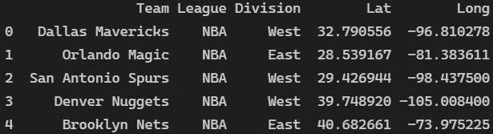

数据集|作者图片中的行示例

然后使用一些巧妙的三角学(这里描述为并在下面的函数中实现),我们将把体育场的位置转换成笛卡尔坐标，然后以有意义的方式输入到我们的算法中。

函数将纬度、经度点转换到笛卡尔坐标系

## 执行重新调整的代码

随着方法的确立，我们现在准备开始重新调整。我们首先导入必要的库并执行一些初步的数据操作。

接下来，我们将使用受约束的 K-means 算法将每个联盟中的球队分配到新的赛区。联盟和相关联的新分区分配作为键值对存储在字典中，以供以后使用。

最后，为了可视化原始的分区结构和新的重新排列的结构，我们使用了 plotly 包中的 Scattergeo 功能。

## 比较当前部门和重新调整的部门

我们将首先看一看美国职业棒球大联盟(MLB)，它由 6 个分部组成，每个分部由 5 个队组成。请注意，一些 MLB 体育场，如芝加哥的 Wrigley Field 和 Guaranteed Rate Field，彼此距离很近，这使得标记很难在地图上分辨。

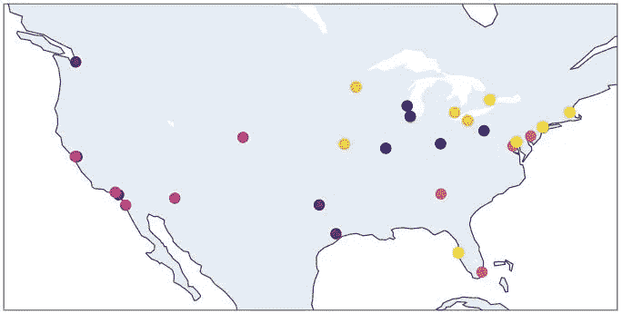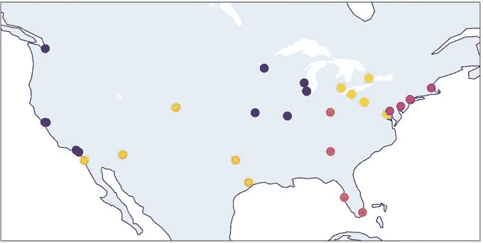

(左)目前的 MLB 部门结构|(右)重新调整的 MLB 部门结构|图片由作者提供

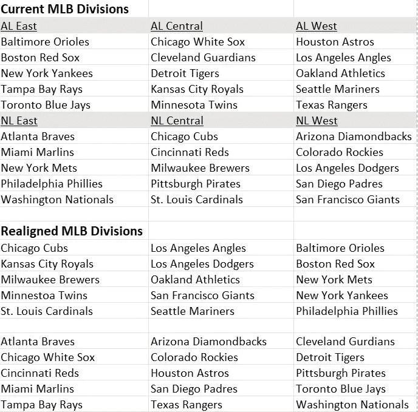

在上表中，我们放弃为重新调整的部门分配名称，因为在当前分组和重新调整的分组之间不一定存在一一对应关系。

接下来，我们考察 NFL 部门在重组后是如何变化的。NFL 分为 8 个分部，每个分部由 4 支球队组成。体育场比球队少，因为索菲体育场由洛杉矶充电器和洛杉矶公羊队共用，而大都会人寿体育场由纽约巨人队和纽约喷气机队共用。正如人们所料，那些共用一个体育场的球队在重新组合后总是被分在同一个组。

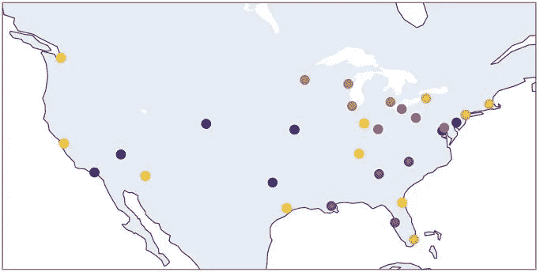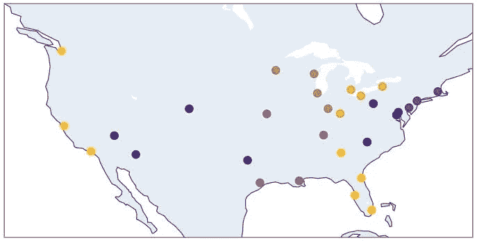

(左)当前的 NFL 部门结构|(右)重新调整的 NFL 部门结构|作者图片

NHL 分为 4 个赛区，每个赛区有 8 支球队。新泽西魔鬼队、纽约流浪者队和纽约岛民队的主场非常接近，使得标记很难在地图上分辨。

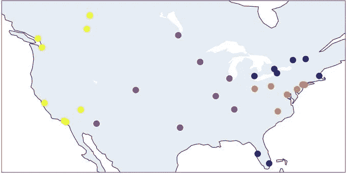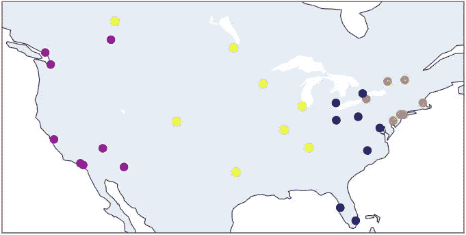

(左)当前的 NHL 部门结构|(右)重新调整的 NHL 部门结构|作者图片

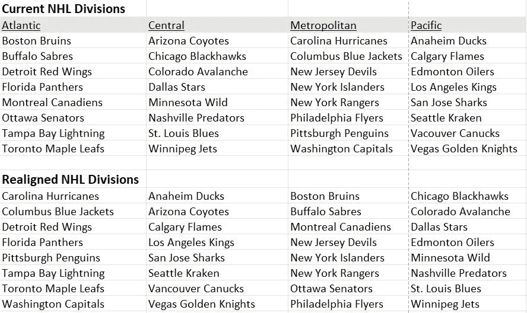

NBA 和 MLS 都分成两个部分。NBA 的 30 支球队平分秋色，东部赛区 15 支，西部赛区 15 支。MLS 东部联盟有 14 支球队，而西部联盟有 13 支球队。正如下面的地图所强调的，两个联赛的重新划分与他们现在的形式是一样的。

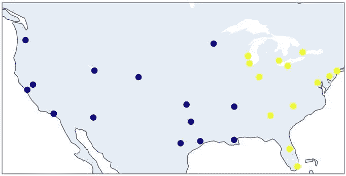

NBA 分区结构|作者图片

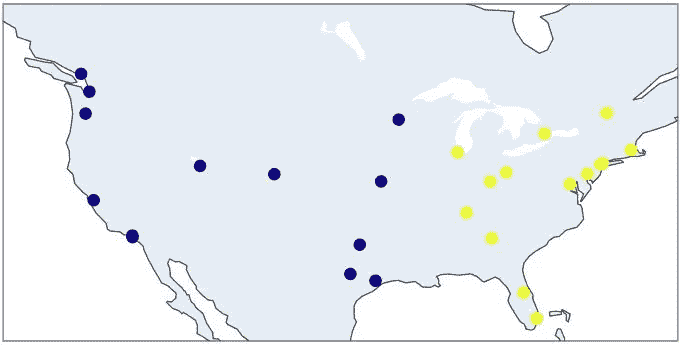

MLS 部门结构|作者图片

## 评估行驶距离的改善

最后，我们将分析通过采用我们重新调整的部门可以节省多少出行距离。为此，我们将确定每个组别的球队之间的平均距离。例如，美联东区的 MLB 球队平均相距 602 英里。然后，对于每个联盟，我们将对当前分区的值和重新调整的分区的值进行平均。这将为每个联赛产生两个数字，分别测量在当前分区结构和我们重新调整的分区结构下球队与分区间对手的平均距离。为了实现这个过程，我们首先需要定义一个函数来返回两个纬度和经度点之间的距离(以英里为单位)。这可以通过这里[描述的哈弗辛公式](https://www.geeksforgeeks.org/program-distance-two-points-earth/)完成，并在下面的函数中实现。

函数查找两个纬度、经度点之间的距离(以英里为单位)

然后，我们可以使用下面的代码计算并打印每个联盟的两个最终平均值。

在目前的分区结构下，MLB 车队与同级别其他车队的平均差距为 608 英里，而在重新调整后的分区结构下，这一差距降至 436 英里。如下表所示，NFL 和 NHL 的距离也有类似的缩短。

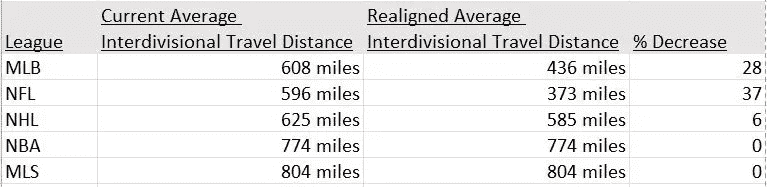

## 结论

虽然计算最优的重组部门只是一个简单的数学问题，但实施它们需要利益相关者之间的巨大合作。许多球迷、球员和团队人员无疑会引用长期部门竞争的损失作为稍微短的部门间旅行的高价格。一些人可能会说，如此激烈的重新调整会让游戏失去其“历史”和“文化”的一个基本部分，更不用说安排竞争游戏以提高收视率的机会了。然而，积极的影响将是可以衡量的和直接的。与团队交通相关的碳排放和费用将会减少，与长途旅行相关的球员疲劳也会减少。这些好处会随着重新划分的比赛和赛季数量的增加而积累。虽然一些旧的部门竞争将会失败，但这些比赛仍然会发生，因为只有一小部分比赛是针对部门间的对手。新的竞争将会随着重新组合的队伍开始频繁地相互竞争而发展。

从更广阔的角度来看，人们可以想象，用于重新排列划分的数学方法可以很容易地应用于其他地理聚类问题。例如，给定 12 个商店位置和 3 个区域经理，公司可以使用约束 K-means 聚类算法将经理最优地分配到 4 个商店的组中。

## 参考

[1] J .利维-克雷默，[k-均值约束](https://joshlk.github.io/k-means-constrained/) (2020)