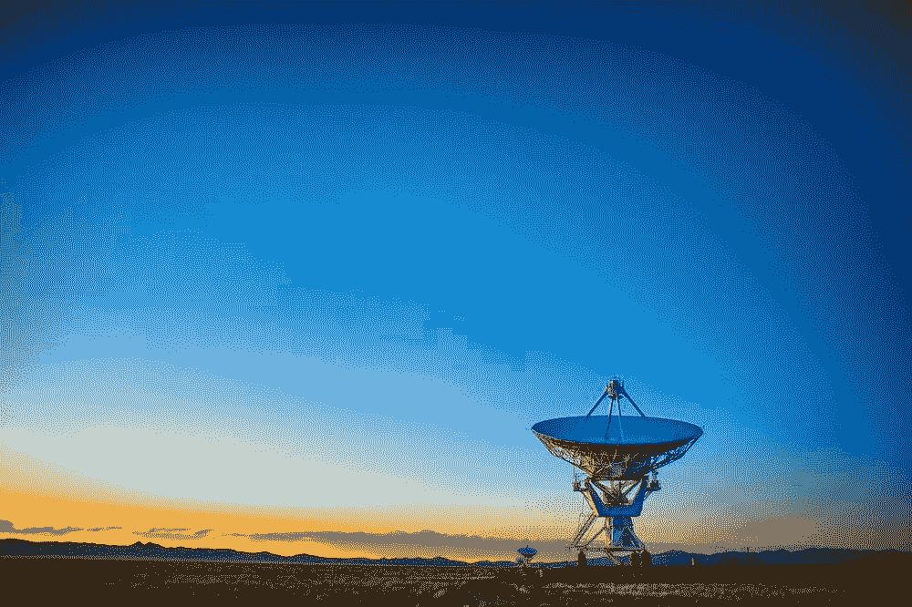
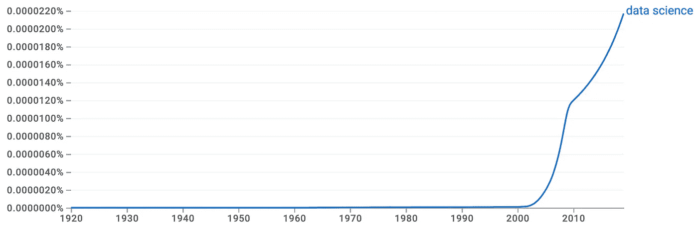
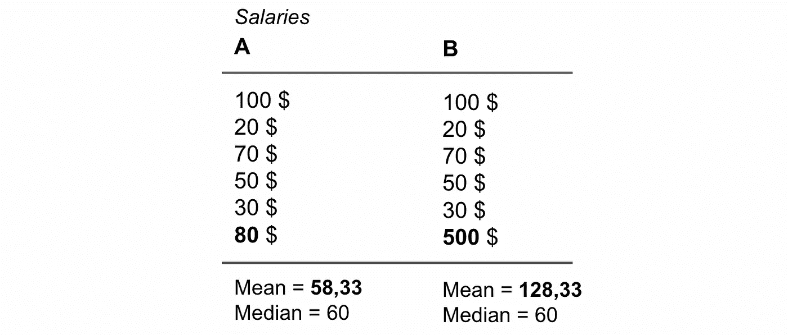
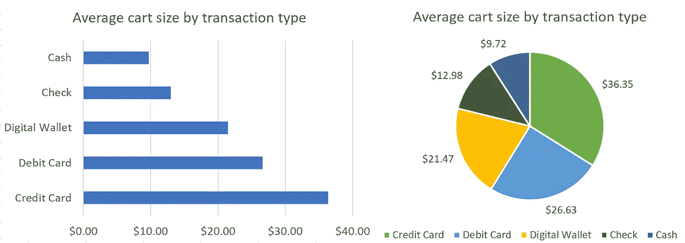

# 每个人都应该参加数据科学课程的 5 个理由

> 原文：<https://towardsdatascience.com/reasons-why-everyone-should-do-a-data-science-class-or-related-46406eea5439>

## 意见

## 为什么您应该了解数据及其科学

图片来自 [Unsplash](https://unsplash.com/photos/Wj1D-qiOseE) 。

数据科学目前是一个热门话题，你可以认为这是一个暂时的炒作——或者不是，这取决于你的**观点**。无论你持何种观点，有一件事是肯定的:数据科学是**在这里停留**。而且到处都会是**。**

****

**【1920 年至 2019 年“数据科学”的谷歌 Ngram 浏览器。数据来自谷歌，图片由作者提供。**

**那么，是什么让它如此受欢迎，为什么如此突然？“数据科学”兴起的一些原因可以总结为三个要点，上图也描述了谷歌 Ngram 查看器工具:**

*   **过去几年中**计算能力的提高****
*   **算法和框架的各种**突破和发展****
*   **收集了越来越多的数据——有一种需要利用这些数据的感觉**

**…时间会告诉我们更多数据科学作为一个领域如此重要的原因。**

**数据科学知识不仅对那些整天开发模型、处理数据、分析统计数据和编码的人有用。我建议**每个人都去上一堂数据科学的课**，不管你从事什么行业。**

> **数据科学对每个人都有用。**

**为什么？**

# **理由 1 |它让你了解统计学**

**统计学是数据科学的主要组成部分。数据科学中使用的许多流行方法在核心上依赖于经典的统计模型。参加数据科学课程会让你对统计学有一个基本的了解，通常会帮助你更好地理解描述、情况和含义。**

## **相关性与因果性**

**你会明白相关性并不总是等于因果关系，你不能仅仅因为某些事件之间存在相关性就对它们做出假设。因果关系意味着一件事**引起另一件事**，而相关性只是两个事件之间的简单**关系，这两个事件**将**相互联系起来。****

> **我们常说“相关性并不意味着因果关系”。**

**一个简单的例子可能是:我们通常观察到，当天气温暖和阳光充足时，冰淇淋的销售和鲨鱼攻击的数量会增加。但是，一个****不会导致另一个**。它们与**有关**，因为好天气会让更多的人去海滩吃冰淇淋，去海里游泳，这反过来会增加鲨鱼袭击的可能性。****

****在你的日常生活中，这将帮助你更好地理解情况和分析索赔。这将使你更有能力区分好的论点和错误的论点，并帮助你向你的同伴阐述有效和正确的论点。****

## ******平均值对中位数******

****理解平均值 **和中位数**之间的差异**也是通常被低估的事情。人们倾向于更频繁地使用平均数而不是中位数。然而，**均值可以隐藏数据上的信息**，只有通过**同时查看中值**我们才能看到这些信息。******

> **平均值是所有数据点的**平均值**-中值**将**数据分成**一半**，即 50%的点高于中值，50%的点位于中值。**

**举个例子，让我们来看看下面的数据集 A 和 B，它们是关于人们的薪水的:**

****

**具有平均值和中值的两个数据集的示例。图片作者。**

**我们可以看到，A 组的平均值**比中间值**低得多。对于 B 组，我们将数据集中的一个值改为一个比 A 组大得多的数字:我们立即可以看到平均值是如何增加的，而中位数保持不变。突然，我们意识到平均值对于这组数据来说是一个很差的指示，因为它对极端值非常敏感。**

**在你的日常生活中，这将帮助你在**更好地解释数据**，并且当你有数据呈现给你时，会让你**更加** **怀疑**。它会让你明白数据不仅仅意味着**，还会让你成为一个**更** **可信**和**精确** **展示者**，以防你自己也要展示数据。****

## ****…还有更多！****

****理解统计学的基础知识会给你带来更多的好处，上面两个只是一小部分，是它在你日常生活中潜在价值的非常基本的例子。****

# ****理由 2 |它让你了解数据****

****这是相当类似的，并与原因 1 携手并进。没有统计学知识，你很难很好地理解数据。当我开始熟悉数据时，我意识到的主要事情之一是，你可以更好地理解围绕它的**通用工具**和**技术**。****

****我的意思是:****

## ****什么是数据？****

****您将了解数据可以以何种**形式和类型**进入:从结构化数据到非结构化数据。从定量和定性值，到名义值、序数、连续值和离散值。****

****你知道**数据如何存储以及存储在哪里，举几个例子:******

*   ****CSV、XML 和 XLS 文件，以及纯文本文件****
*   ****关系和非关系数据库****
*   ****二进制数据，比如图像。****

****您还将了解如何访问数据:我们可以在编程语言(f. e. R 或 Python)的帮助下读取 CSV 文件，或者用 SQL 语言直接从数据库中查询关系数据。****

****你了解[数据的 4 个](https://www.gcu.edu/blog/engineering-technology/what-are-4-vs-big-data)(甚至[到 7 个](https://impact.com/marketing-intelligence/7-vs-big-data/#:~:text=The%20seven%20V's%20sum%20it,Veracity%2C%20Visualization%2C%20and%20Value.) ) **V:量、种类、准确性、速度等。******

****在日常生活中，这不仅会让你对 IT 有一个很好的**总体了解**，而且对于你可能正在进行的一些 **IT 相关的对话**和小型会谈来说，这也是很方便的**知识**。****

## ****我如何显示数据？****

****数据本身是第一步，**解释和可视化**是下一步。****

****大多数基础数据科学课程都会涉及到**数据可视化**的主题，很快你就会听到这样一句话:****

> ****"最好不要使用饼图来可视化数据."****

****一开始你可能会想:[为什么是](https://scc.ms.unimelb.edu.au/resources/data-visualisation-and-exploration/no_pie-charts)？但是你看到的例子越多，你就会越意识到其中的道理，很快你可能会提倡自己不要使用饼状图。****

********

****条形图与饼图比较。图片作者。****

****在上面的图片中，我们有一个很好的例子来说明为什么饼状图(一般来说)比 f. e .条形图更不利于可视化。众所周知，人眼很难理解和估计角度，尤其是 T2，饼图的碎片越多。如果没有对饼图进行注释，您会正确估计“借记卡”和“数字钱包”组值之间的差异吗？也许吧，但阅读条形图通常会更容易、更清晰，因为它让我们可以轻松地比较哪怕是最细微的数值差异。****

****在你的日常生活中，这会让你明白，你应该对你对**饼状图的解读持保留态度**，因为这些可能会误导你。这也将使你**创造更好的**演示，并成为你的数据的**更有影响力的演示者**。****

# ******理由 3 |你洞察编程逻辑******

****几乎在数据科学的每一门课中，你都可能需要学习一些**编程**的入门课程。这对你来说可能听起来很可怕——相信我，一点也不可怕。你不必为了从中获益而将你的编程技能提升到专家水平。****

****在我上第一堂数据科学课之前，我从未做过任何编程。所以当然，这是相当艰难的——但是你开始学习的每一件新东西在开始时都是艰难的。问题是:你会坚持学多久？或者说，你会有多一致？不管你会坚持多久，对编程有一点基本的了解已经有它的好处了。我的意思是:****

## ******透过更符合逻辑的镜头看问题******

****首先，你会开始有一种感觉，觉得思考**更有逻辑**，更有计划性。它将帮助你通过一个更符合逻辑的视角来看待这个世界。我们现代世界的大多数解决方案都是基于技术的，并且已经以某种方式被编程。你将会被最终理解这些事情是如何潜在工作的启发，高层次的。****

## ******自动完成自己的任务******

****更进一步，你甚至可以开始做你自己的小编程项目。你可以开始写你自己的**脚本**和**自动化**日常任务。听起来很酷，不是吗？我可以确认:**是**。****

****我给自己写了一堆脚本来自动化某些**时间密集型任务**，比如 f. e .复制粘贴或者[抓取内容](https://realpython.com/beautiful-soup-web-scraper-python/)，或者[在我的电脑上寻找重复的图像](https://medium.com/towards-data-science/finding-duplicate-images-with-python-71c04ec8051)。看到这些项目在几个小时的工作后变成现实，会带来一种令人满足的感觉。****

****你现在可能会问自己从哪种编程语言开始。在我看来，几乎任何一种编程语言都会给你一个更符合逻辑的世界观。然而，有些语言比其他语言更适合某些任务，也比其他语言更灵活。我个人从 R 开始，继续(并留在)Python，我研究了 SQL、Matlab 和 Java。****

****说到**易用性**和**对数据科学相关内容的支持**，我绝对可以推荐**从 Python** 开始。****

# ****理由 4|你知道人们谈论什么****

****你可能会遇到这样的情况:你与人交谈，然后**关于数据科学的对话**出现了。现在你将成为这次谈话的一部分，因为你对谈话的内容有了基本的了解。这可能会帮助你进行更有意义的谈话，让你比以前更容易与一些人或团队建立联系。****

****无论你身处哪个行业，你对数据科学的理解都会让你更加博学，并让你有机会成为团队之间的纽带——这个人既了解故事的**一面，**也了解故事的**数据科学部分**。****

****你可能会读到一篇关于一些人工智能算法接管世界的文章，或者一种新开发的预测算法的一些突破:现在你会对**有一个简单的了解，这是由**组成的。当然还不详细，但是足够让你理解这篇文章可能包含的内容的含义。****

****在日常生活中，人与人之间的社会联系以及跟上技术发展是我们未来的两个非常重要的部分。技术无处不在，不会少。有必要**了解**每天围绕着我们的**。******

# **理由 5|你理解其中的含义**

**上过几堂数据科学的入门课后，你会更好地理解**为什么数据如此有价值**，你能用它实现什么，以及为什么在线广告业务如此成功。**

**你会明白，数据科学中的技术是伟大的，可以用 [**做好**](https://onlinemasters.ohio.edu/blog/data-science-for-social-good/) ，但那个数据也可以是**关于**，f. e. [有偏差的时候](https://www.metabase.com/blog/6-most-common-type-of-data-bias-in-data-analysis)。可能还有关于[数据伦理](https://www.metabase.com/blog/6-most-common-type-of-data-bias-in-data-analysis)的担忧，或者关于某个算法缺乏[可解释性的担忧。](/interpretability-in-machine-learning-ab0cf2e66e1)**

**在日常生活中，这将让你很好地理解为什么会有这样的**潜力**，而且还有关于数据的**关注**。你将开始问自己更多关于你自己的数据和数据隐私的问题。**

# **结论性理由**

**总而言之，在你上完第一堂数据科学课后，你将能够更好地与数据科学家的工作联系起来，现在你知道了他们的一些技巧:你将区分**相关性与因果关系**，**，**将开始利用**中位数**，而你将尽量避免使用**饼状图**。最终，你会更擅长**解读数据**，并提供**更好的演示**。**

**我亲身经历了阅读数据科学的许多好处，因此我强烈推荐任何人参加入门课程。你不必成为一个专家，只是一个基本的了解已经将是非常有益的。希望你也这么想！🎉**

**欢迎在评论中与我分享您的反馈！💬**

***下面你会发现几个链接，我个人觉得在开始阅读和学习数据科学的时候非常有用。***

# **建议和参考:**

**[1]Coursera.com，IBM，[数据科学简介](https://www.coursera.org/specializations/introduction-data-science) (2022)(优秀的入门级课程，从基础开始)**

**[2]Coursera.com，深度学习。AI &斯坦福大学，[机器学习](https://www.coursera.org/specializations/machine-learning-introduction) (2022)(令人惊讶，但相当高级的课程，深入细节)**

**[3] [关于 Medium.com 的数据科学](https://towardsdatascience.com/)(你经常会在这里找到非常好的有教育意义的文章)**