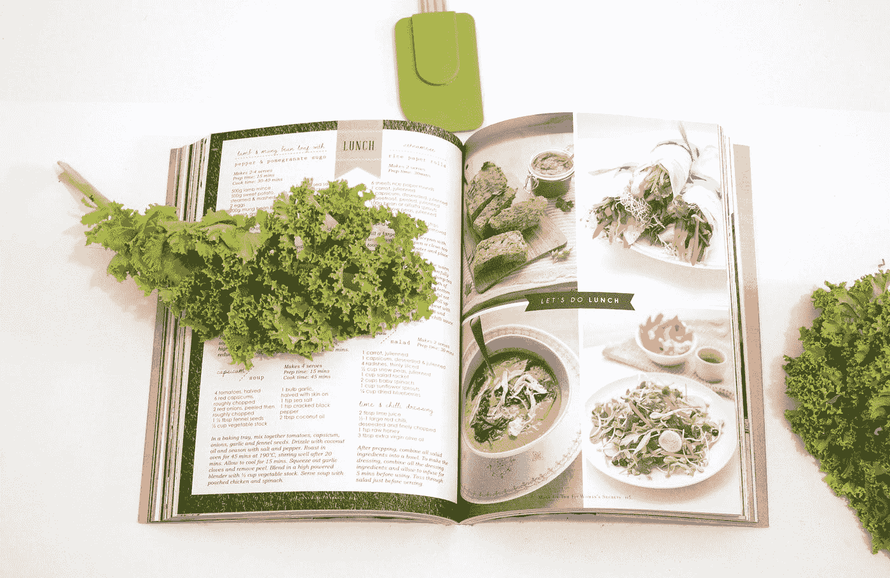
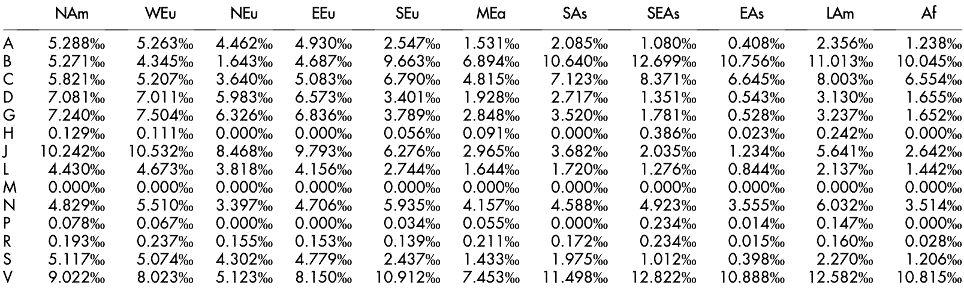
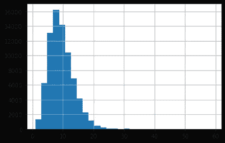
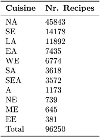
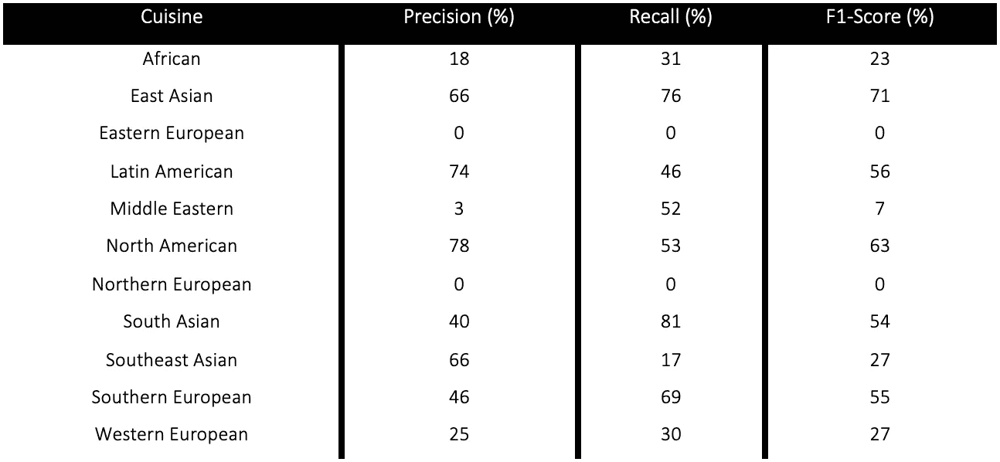
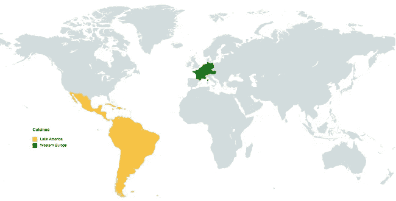

# 食谱烹饪分类

> 原文：<https://towardsdatascience.com/recipe-cuisine-classification-278ea0837c94>

## 伯特变压器&食物-药物负相互作用

在 [Unsplash](https://unsplash.com?utm_source=medium&utm_medium=referral) 上由[S O C I A L C U T](https://unsplash.com/@socialcut?utm_source=medium&utm_medium=referral)拍摄

# 介绍

几个模型架构可以用来执行烹饪分类。一些最受欢迎的模型，按照复杂程度的增加顺序，是支持向量机(Pouladzadeh 等人，2015 年)、BERT (Devlin 等人，2018 年)、RoBERTa(刘等人，2019 年)或 3(布朗等人，2020 年)模型。

## 变形金刚(电影名)

与计算机视觉不同，在自然语言处理(NLP)中，预训练模型最近才变得广泛可用。部分由于文本数据集的稀缺，NLP 的进展缓慢，直到变压器(BERT)的双向编码器表示的发布(Devlin 等人，2018)。

BERT 有两种预训练模型:基本模型和大型模型。虽然两者使用相同的架构，但前者包含 1.1 亿个参数，而后者包含 3.45 亿个参数。能够使用预先训练的模型并对其进行微调以适应不同的任务意味着即使在缺乏足够的数据来训练具有数百万个参数的模型的情况下，也可以避免模型过度拟合。较大的模型通常具有更好的性能(Devlin 等人，2018 年)。

在微调 BERT 时，有三种可能性(Devlin et al .，2018):

*   训练所有建筑
*   训练一些层，冷冻其他层
*   冻结整个网络并将额外的层附加到模型上

与其他神经网络架构一样，提供的训练数据量越大，它的性能就越好。因此，一个重要的收获是，运行更多代的 BERT 将导致更高的准确性，并有足够的数据。就所需的计算能力而言，它相当于使用多个最先进的 GPU 进行几天的训练(Devlin et al .，2018)。

BERT 的另一个特点是它的双向方法。相比之下，以前的努力要么从左到右要么结合从左到右和从右到左的训练来查看文本序列(Devlin 等人，2018 年)。

与递归神经网络和长短期记忆神经网络相比，BERT 的一个优点是它可以并行化。这意味着它可以通过在多个 GPU 中训练来加速。如果输入数据是文本序列，这意味着它可以一次接受多个标记作为输入(Devlin et al .，2018)。

变形金刚的两个后验实现分别是 Research 和 OpenAI 的鲁棒优化 BERT 预训练方法(RoBERTa)(刘等，2019)和生成预训练变形金刚 3(3)(布朗等，2020)。

BERT transformer 用于根据配料列表构建菜肴预测模型。这使得在烹饪水平上用于治疗 AD 的药物的负面食物-药物相互作用最小化。

## 烹饪/药物的负面相互作用

因为 BERT 模型以前是用数百万个样本训练的，所以它们可以通过更少的微调数据被广泛的应用程序重新调整用途(Devlin 等人，2018)。在这种特定情况下，烹饪预测。

配料和食谱的选择受地理和文化的影响很大。一些食谱比其他食谱更富含已知 AD 和/或新冠肺炎(Laponogov 等人，2021 年)打浆特性的成分。在烹饪水平上考虑这种变化允许我们在烹饪水平上预测最有可能减少与药物的负面相互作用的数量，即使没有所有成分的这种信息。食物-药物相互作用可导致药物生物利用度的显著降低，这是由于食物分子和药物化学成分之间的直接相互作用，或者是由于食物摄入的生理反应。世界上销售最多的一些药物是抗肿瘤药和针对神经系统疾病的药物。图 1 中提供的信息有助于我们根据食谱估算食谱的健康益处(Jovanovik 等人，2015 年)。

**图 1** 药物(左图)和菜肴(上图)之间现有相互作用的百分比。作为参考，对于北美料理(*)和抗肿瘤药物( *A* )，预计 0.005288%的负相互作用。[图片来源=(约万诺维克等人，2015)]*

*另一方面，与其他行业一样，推荐系统通常会将产品分为多个类别。食物推荐系统可以通过将用户导向他们最喜欢的选择而受益于美食分类(Anderson 等人，2018)。*

*一个烹饪分类器被训练、测试和验证，以预测神经(AD)和抗感染(新冠肺炎)药物与烹饪确定的食谱之间的负面相互作用。*

# *方法*

*使用 BERT 变换器，训练、验证和测试了一个根据配料列表预测菜肴的模型。*

*[Kaggle 和 Nature](https://raw.githubusercontent.com/warcraft12321/HyperFoods/master/data/kaggle_and_nature/kaggle_and_nature.csv) 数据集包含大约 100000 个配方，用于训练变压器。每个食谱都包括一份配料清单，以及相应的菜肴。一份按字母顺序排列的配料清单给了模型。数据集的 80%用于训练，10%用于验证，10%用于测试。*

*在训练模型之前，使用 BERT 记号化器，记号化步骤将每个配方分成 50 个记号。初始变压器的所有参数都被冻结。*

*为神经网络选择的体系结构包括一个下降层，一个包含 768 层 512 个节点的密集层 1 和一个包含 512 层的层 2，每个层有 11 个节点(与菜肴的数量相同)。*

*在训练时，使用了实现权重衰减为 1e-3 的 Adam 算法的优化器。负对数似然损失被用作损失函数。并且模型收敛需要 40 个时期。训练是在 Google Collab 的一个 GPU 中进行的。*

*模型的性能是通过对每种菜肴的精确度、召回率和 f1 分数来评估的。*

*最后，介绍了在抗感染类(针对新冠肺炎)和神经类(针对 AD)中具有最低数量的负面食物-药物相互作用的烹饪。*

# *结果和讨论*

## *菜肴分类*

*在图 2 中， [Kaggle & Nature](https://raw.githubusercontent.com/warcraft12321/HyperFoods/master/data/kaggle_and_nature/kaggle_and_nature.csv) 数据集基于配料数量的食谱数量分布被表示。*

**

***图 2** 配方分布在 [Kaggle & Nature](https://raw.githubusercontent.com/warcraft12321/HyperFoods/master/data/kaggle_and_nature/kaggle_and_nature.csv) 数据集中对应的配料数量*

*根据上图，Kaggle 和 Nature 数据集中的大多数食谱包含 6 到 8 种成分。平均来说，每份食谱有 12 种配料。没有一个食谱包含超过 60 种成分。*

*在图 3 中，显示了 [Kaggle & Nature](https://raw.githubusercontent.com/warcraft12321/HyperFoods/master/data/kaggle_and_nature/kaggle_and_nature.csv) 数据集中每种菜肴的食谱数量。*

**

***图 3** 在 [Kaggle & Nature](https://raw.githubusercontent.com/warcraft12321/HyperFoods/master/data/kaggle_and_nature/kaggle_and_nature.csv) 数据集中每个菜系的菜谱数量。*

*共有 96250 种食谱，涵盖 11 大菜系。食谱最多的三大菜系分别是北美、南欧和拉美，分别有 45843、14178 和 11892 种食谱。*

*在表 1 中，展示了菜肴分类器精度、召回率和 F1 分数。*

**

***表 1** 模型分类准确度——精度、召回率和 f1-分数被详细描述到训练数据集中的每一个菜系*

*南欧、拉丁美洲、北美和东亚的 F1 得分高于 55%。*

*图 4 显示了与神经系统药物(AD)和抗感染药物(新冠肺炎)的负面食物-药物相互作用最少的菜肴的地理分布。*

**

***图 4** 拉丁美洲美食与神经类药物——AD 的负面相互作用数量最低。西欧抗感染药效果最好——新冠肺炎。*

*拉丁美洲和西欧的菜肴分别显示出与神经系统药物和抗感染药物的负面相互作用最少。*

*[Kaggle & Nature](https://raw.githubusercontent.com/warcraft12321/HyperFoods/master/data/kaggle_and_nature/kaggle_and_nature.csv) 数据库包含分布在各大菜系的不平衡数量的食谱。虽然 BERT 模型是针对不平衡数据集进行训练的，但这可能仍然会影响模型的预测能力。只考虑成分列表而不考虑各自的食谱说明可能会导致较差的检测。以及北欧某些菜系的食谱数据集的有限大小。某些菜系的精确度、召回率和 f1 评分较低，可能与缺乏独特的配料有关。*

# *后续步骤*

*为了实现训练更准确的烹饪分类器的目标，我们将优化电流互感器的架构(考虑罗伯塔和 GPT-3 的实现)，并考虑烹饪过程，而不仅仅是配料。使用带有更多食谱的烹饪标签数据集也将有助于在 11 种烹饪中获得更高的检测率。*

# *参考*

*Pouladzadeh，p .，Shirmohammadi，s .，Bakirov，a .，Bulut，a .，和 Yassine，A. (2015 年)。基于云的食品分类 SVM。*多媒体工具及应用*， *74* (14)，5243–5260。[https://doi.org/10.1007/s11042-014-2116-x](https://doi.org/10.1007/s11042-014-2116-x)*

*Devlin，j .，Chang，m-w .，Lee，k .，& Toutanova，K. (2018 年)。 *BERT:用于语言理解的深度双向转换器的预训练*。*

*刘，y .，奥特，m .，戈亚尔，n .，杜，j .，乔希，m .，陈，d .，利维，o .，刘易斯，m .，泽特勒莫耶，l .，&斯托扬诺夫，V. (2019)。 *RoBERTa:一种稳健优化的 BERT 预训练方法*。*

*Brown，T. B .、Mann，b .、Ryder，n .、Subbiah，m .、Kaplan，j .、Dhariwal，p .、Neelakantan，a .、Shyam，p .、Sastry，g .、Askell，a .、Agarwal，s .、Herbert-Voss，a .、Krueger，g .、Henighan，t .、Child，r .、Ramesh，a .、Ziegler，D. M .、Wu，j .、Winter，c .……Amodei，D. (2020 年)。*语言模型是一次性学习者*。*

*Laponogov，I .，Gonzalez，g .，Shepherd，m .，Qureshi，a .，Veselkov，d .，Charkoftaki，g .，瓦西利乌，v .，Youssef，j .，Mirnezami，r .，Bronstein，m .，和 Veselkov，K. (2021)。网络机器学习绘制富含植物化学成分的“超级食物”来对抗新冠肺炎。*人类基因组学*， *15* (1)，1。【https://doi.org/10.1186/s40246-020-00297-x *

*Jovanovik，m .，Bogojeska，a .，Trajanov，d .，和 Kocarev，L. (2015 年)。使用关联数据方法推断烹饪-药物相互作用。*科学报道*， *5* (1)，9346。[https://doi.org/10.1038/srep09346](https://doi.org/10.1038/srep09346)*