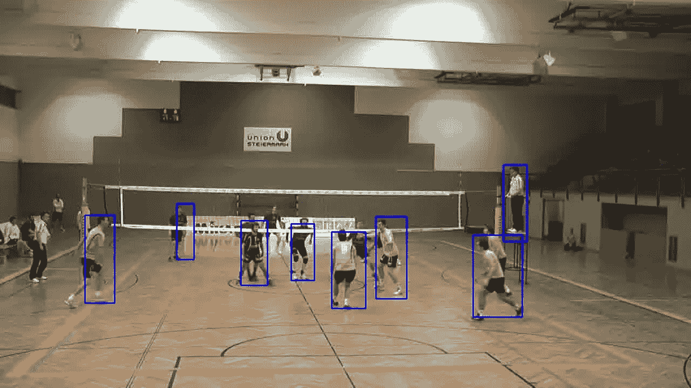

# 用机器学习识别排球比赛阶段

> 原文：<https://towardsdatascience.com/recognize-volleyball-game-stages-with-machine-learning-f7af06c414b2>

## 使用人物探测器对玩家位置进行分类

## 排球比赛阶段

用人工智能分析排球比赛有多种方法。我曾经[跟踪球](/ball-tracking-in-volleyball-with-opencv-and-tensorflow-3d6e857bd2e7)是为了把游戏时间从整个视频中分离出来。

另一种方法是确定游戏阶段，并根据阶段流程做出决策。

让我们假设排球比赛包括 4 个阶段:

*   没有游戏。没有人或几个人在院子里闲逛。
*   静止位置。上菜前人们都是站着不动的。
*   游戏。
*   欢呼。即使拉力赛输了，聚在一起互相加油也是很常见的。

所有这些阶段都因人们相对于法庭的位置和彼此的位置而不同。这意味着我们首先要做的是找到照片中的人。

## 人物检测

我在以前的文章中对[的最佳探测器做了一些研究，因此我将使用](/picking-fast-people-detector-working-with-opencv-on-cpu-in-2021-ff8d752088af) [MobileSSD](https://www.tensorflow.org/lite/examples/object_detection/overview) 来实现这个目的。

人物探测器生成带有玩家坐标的盒子。该信息将是阶段分类模型的输入。

有时探测器会漏掉人，这给数据增加了一些噪声。



## 数据准备

出于训练目的，需要手动对图片进行分类，将它们移动到 4 个不同的文件夹中。

然后是一个很好的问题，关于如何表示机器学习的输入数据。有两个主要选项:

*   使用检测到的框的数字表示
*   使用图片

我决定使用图片选项，因为:

*   输入大小应该是稳定的，但是我们事先不知道检测的次数。球场上可能有多达 12 名球员，但球迷、裁判和替补队员可能会增加这个数字。图片大小是固定的。
*   检测是无序的。为了将它们用作数组输入，我们需要以某种方式对它们进行排序，例如，从左到右、按大小排序等等，但哪种选择更好并不明显。对于图片，我们按原样使用检测。
*   人性化。看着箱子上的数字，很难说现在是什么阶段。一张图片提供了很好的线索。

为了将检测结果表示为输入图片，我将它们绘制为黑色背景上的白色实心矩形，大小调整为 64x64。

```
def get_mask(boxes):  
  pic = np.zeros((H,W,1), np.uint8)  
  clr = 255   
  for r in boxes:     
    cv.rectangle(pic, (r[0], r[1]), (r[0] + r[2], r[1] + r[3]), clr, thickness=-1)   
  pic = cv.resize(pic, (64, 64))  
  return pic
```

然后我为每个阶段准备了面具:


欢呼


不休息


玩


静止位置

## 选择分类方法

[多标签分类](https://machinelearningmastery.com/multi-label-classification-with-deep-learning/)有多种方式，所以选择并不容易。最后，我选择了两个最基本也是最流行的方法:

*   从 sklearn 最近的邻居(又名 KNN)
*   [带 Tensorflow-Keras 的简单神经网络](https://www.tensorflow.org/tutorials/keras/classification)(又名 TFK)

[KNN](https://github.com/tprlab/vball/blob/master/detect/train_knn.py) 在相同数据上显示 81%的准确率，在随机样本上显示 66%的准确率。

[TFK](https://github.com/tprlab/vball/blob/master/detect/train_keras.py) 也稳定在 80%左右。

## 测试分类

我们来挑选一个测试排球的视频。我使用了由格拉茨计算机视觉研究所提供的奥地利业余联盟的公开视频集。

1.  从游戏中提取帧。人们移动得不是很快，所以每秒 2 帧可能就足够了:

```
ffmpeg -i video.mp4 -r 2 frames/%05d.jpg
```

2.对帧运行 MobileSSD 检测器并生成 json 文件。

```
def detect_pic(ssd, img, thr = 0.3):
  rows = img.shape[0]
  cols = img.shape[1] ssd.setInput(cv.dnn.blobFromImage(img, 1.0/127.5, (600, 600), (127.5, 127.5, 127.5), swapRB=True, crop=False))
  out = ssd.forward()
  r = np.array([cols, rows, cols, rows]) boxes = []
  scores = []
  for d in out[0,0,:,:]:
    score = float(d[2])
    cls = int(d[1])
    if cls != 1:
      continue
    if score < thr:
      continue box = d[3:7] * r
    box[2] -= box[0]
    box[3] -= box[1]
    boxes.append(box.astype("int"))
    scores.append(score) if len(boxes) < 1:
    return [] dxs = cv.dnn.NMSBoxes(boxes, scores, thr, 0.1)
  return [boxes[i].tolist() for i in dxs.flatten()]
```

3.[将](https://github.com/tprlab/vball/blob/master/detect/test_utils.py#L47)检测转换成输入掩码。

4.[对输入掩码进行分类](https://github.com/tprlab/vball/blob/master/detect/test_results.py#L16)

这两种方法的表现都比训练时差:

*   KNN——72%
*   TFK——70%

5.从阶段预测中建立拉力

令人惊讶的是，就反弹的可靠性而言，即使是 KNN 也略胜 TFK，TFK 表现得更好:

*   KNN 认可了 29 次集会中的 8 次
*   TFK 承认了 20 次集会

## 结论

拉力赛削减是这项工作的最终目标，结果是有希望的。即使不够精确，TFK·卡特也能为视频编辑和观众节省一些时间。

削减反弹有多种原因:

*   密集的整场比赛录音。它使视频更小(约为原始的 30%)，存储更便宜，加载更快，对观众来说更迷人。
*   将漫长的游戏分割成有意义的部分。这对球员、他们的父母和粉丝来说很重要——小的拉力赛片段可以很容易地分享或保存在个人照片中。

到目前为止，自动对倒可能比目前更精确，第一批结果是有希望的，能够产生一些有用的结果。

## 链接

*   [移动探测器](https://www.tensorflow.org/lite/examples/object_detection/overview)
*   [最近邻分类器](https://scikit-learn.org/stable/modules/generated/sklearn.neighbors.KNeighborsClassifier.html)
*   [Tensorflow-Keras 分类器](https://www.tensorflow.org/tutorials/keras/classification)
*   [代号为](https://github.com/tprlab/vball/tree/master/detect)的 Github 回购
*   [视频数据集](https://www.tugraz.at/institute/icg/research/team-bischof/lrs/downloads/vb14/)

## 参考资料:

([视频数据集所有者要求](https://www.tugraz.at/institute/icg/research/team-bischof/lrs/downloads/vb14/)

[**利用时空上下文改进体育活动识别**](https://files.icg.tugraz.at/f/d5668bbb4a/?raw=1)
乔治·瓦尔特纳、托马斯·毛特纳和霍斯特·比朔夫
在 *Proc。DVS-体育领域计算机科学会议(DVS/GSSS)，2014 年*

[**自动化体育游戏分析的室内活动检测与识别**](https://files.icg.tugraz.at/f/43f43cbc00/?raw=1)
乔治·瓦尔特纳、托马斯·毛特纳和霍斯特·比朔夫
在 *Proc。奥地利模式识别协会(AAPR/OAGM)研讨会，2014 年*