# 矩阵分解——奇异值分解(SVD)解释

> 原文：<https://towardsdatascience.com/recommendation-system-matrix-factorization-svd-explained-c9a50d93e488>

## 利用潜在因素推荐构建推荐系统管道


图片由 [Vlado Paunovic](https://unsplash.com/@vlado) 从 [Unsplash](https://unsplash.com/photos/iBG594vhR1k) 拍摄

本文将概述推荐系统矩阵分解的直觉和 Python 实现。以下是文章的提纲。

## **目录**

*   矩阵分解背后的直觉
*   奇异值分解
    -奇异值分解的数学
    -示例演练
*   问题陈述
*   数据
    -要求
*   解决方案架构
*   SVD 推荐系统实现
    -生成用户-项目矩阵
    -计算 SVD
    -生成推荐
*   挑战
*   结束语
*   资源

# 矩阵分解背后的直觉

推荐引擎是机器学习的一个子类，旨在为一些用户或项目提供评级。在推荐系统中，矩阵分解属于协同过滤的范畴。直观地说，协同过滤旨在基于与用户 A 相似的其他用户的交互来识别用户 A 喜欢的项目。您可以将此视为一个优化问题，我们的目标是找到一种方法来为给定的产品/用户产生最佳评级。

在众多公司和行业中使用的推荐引擎存在各种各样的问题。登录脸书/ Meta、Instagram、Twitter、Pinterest、亚马逊等时。该平台会根据你自己的历史以及与你相似的其他用户的历史，向你推荐帖子/项目。相似性是一个广义的术语，你可以被认为是相似的用户，因为你有相似的品味，追随相同的人，喜欢/互动相同的帖子和用户，等等。

矩阵分解背后的直觉相当简单，给定一些用户-项目矩阵，您希望分解该矩阵，这样您就有一个独立的用户矩阵和一个项目矩阵。这允许我们对原始矩阵的每个潜在因子应用不同的正则化。例如，当产品是歌曲时，因素可以测量说唱和国家之间的比较、歌曲被播放的次数与歌曲持续时间的计数等。下图说明了输入用户项目(歌曲)矩阵 m 的分解。


矩阵分解例子。图片由作者提供。

这种方法是由西蒙·芬克在 2006 年推广的，因为它在网飞挑战赛中广泛流行[1]。Funk SVD 是 Simon Funk 提出的算法名称。尽管 SVD(支持向量分解)名副其实，但并没有 SVD 技术应用于它[1]。

# 奇异值分解

## 奇异值分解的数学

给定一些输入矩阵 M，SVD 的公式可以概括如下:

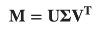

奇异值分解公式(图片由作者提供)。

```
M : An m x n matrix which you want to decompose
U : An m x m complex unitary matrix (left singular vectors)
Σ : An m x n rectangular diagonal matrix (holds the eigenvalues)
V : An n x n complex unitary matrix (right singular vectors)
```

步骤 1:通过将矩阵 m 乘以它的转置:M*Mᵀ，将它转换成方阵

第二步:计算矩阵 M*Mᵀ.的特征值和特征向量这样做的结果将对应于σ和 U 矩阵。

> 线性变换的特征向量是一个非零向量，当对其应用线性变换时，它最多改变一个标量因子。相应的特征值(通常用λ表示)是本征向量缩放的因子。
> -【4】[https://en.wikipedia.org/wiki/Eigenvalues_and_eigenvectors](https://en.wikipedia.org/wiki/Eigenvalues_and_eigenvectors)

第三步:用下面的公式求解 v:v = 1/σ*mᵀ* u

## 示例演练

我们来计算下面这个矩阵 m 的 SVD。

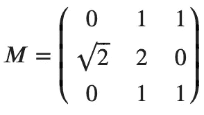

SVD 的输入矩阵。图片由作者提供

M*Mᵀ

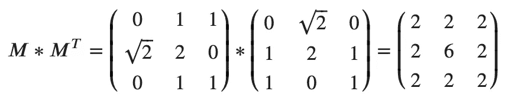

将输入矩阵 M 乘以其转置矩阵

步骤 2:计算特征值和特征向量

你可以使用下面的计算器来计算相关的特征值和特征向量。下面的链接提供了如何计算这些值的分步指南。如果你对此不感兴趣，那么就用 numpy 来计算特征值和特征向量

*   [特征值和特征向量计算器](https://www.emathhelp.net/en/calculators/linear-algebra/eigenvalue-and-eigenvector-calculator/?i=%5B%5B2%2C2%2C2%5D%2C%5B2%2C6%2C2%5D%2C%5B2%2C2%2C2%5D%5D)

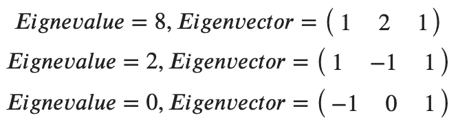

M*Mᵀ.结果的相关特征值和特征向量图片由作者提供

取非零特征值的平方根，生成σ矩阵:

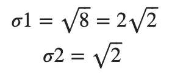

特征值的平方根。图片由作者提供。

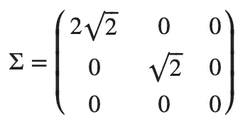

特征值的平方根在对角线上的适马矩阵。图片由作者提供。

为了计算 U 矩阵，你必须计算每个特征向量方向的单位向量。下面的链接概述了如何计算单位向量。

*   [单位矢量计算器](https://www.emathhelp.net/en/calculators/linear-algebra/unit-vector-calculator/?u=1%2C+-1%2C+1)

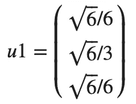

特征向量 1 的单位向量:[1，2，1]。图片由作者提供。


特征向量 2 的单位向量:[1，-1，1]。图片由作者提供。

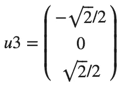

特征向量 3 的单位向量:[1，0，1]。图片由作者提供。

这就产生了最终的 U 矩阵。

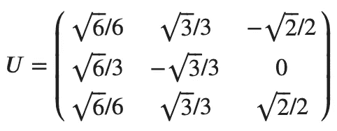

从特征向量的单位向量计算的 u 矩阵。图片由作者提供。

第三步:通过公式求解 v:v = 1/σ*mᵀ* u

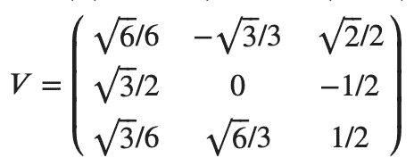

V 的计算值。图片由作者提供。

您可以参考下面的参考资料，深入了解 SVD 背后的计算。

*   [奇异值分解计算器](https://www.emathhelp.net/en/calculators/linear-algebra/svd-calculator/)

# 问题陈述

我们希望使用音乐数据集建立一个协同过滤推荐系统。生成用户项目矩阵并结合余弦相似度使用奇异值分解来识别用户可能感兴趣的歌曲。

# 数据

出于本教程的目的，我们将使用 pandas、numpy 和 random 来合成数据集。本节将提供一个脚本，该脚本将合成一个与音乐相关的数据集。该数据集将在以下部分中用于推荐系统的应用。本教程的目的不是获得有意义的结果，而是向用户展示奇异值分解背后的实现。因此，这些建议的结果将是无意义的，但这些方法将类似于工业生产级环境中的方法。

## 要求

```
python=3.8.8
pandas=1.2.4
numpy=1.20.1
```

运行该脚本后，您应该会看到一些类似于下图的示例数据(不精确，因为它是随机生成的)。

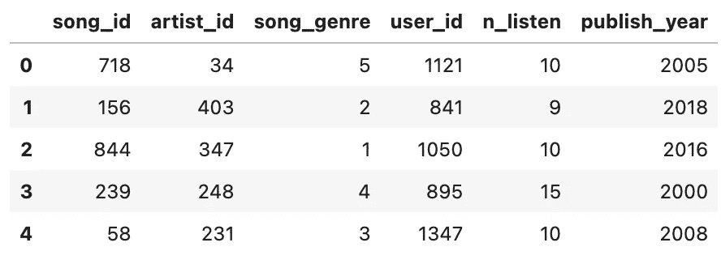

合成音乐数据。图片由作者提供。

# 解决方案架构

现在我们有了一个数据集，我们可以考虑如何解决这个问题。我们将从基于与监听次数相关的值生成用户条目矩阵开始。这种情况下的项目是 song _ ids，而用户对应于 user_id。接下来，我们可以使用 SVD 来计算相关的 U、σ和 V 矩阵。最后，我们可以使用余弦相似性来比较用户向量和项目向量，以确定用户感兴趣的前 N 个项目。

# 奇异值分解推荐系统的实现

## 生成用户-项目矩阵

## 计算奇异值分解

## 生成建议

# 挑战

在推荐系统中使用协同过滤方法会面临各种各样的挑战，其中最常见的是冷启动问题。冷启动问题指的是推荐引擎不能为新的项目/用户产生合适的预测。或者具有低交互量的用户/项目，本质上它生成的用户-项目矩阵非常稀疏。这是因为缺乏新产品或产品发布的信息。

源于冷启动问题的协同过滤的另一个常见问题是推荐的多样性。这种方法基于其他用户/产品的历史交互来推荐产品/用户，本质上意味着非常受欢迎的产品几乎总是比交互太少的其他产品更受推荐。

可扩展性是协同过滤算法的一个常见问题，随着用户、产品和交互的数量增加，用户-项目矩阵的大小也成比例地增加。当数据大量扩展时，这会导致问题，并且会增加计算时间。通常，处理较大数据集的代价是性能会提高，而速度会降低，反之亦然。

# 结束语

本文概述了矩阵分解背后的直觉、数学和实现，特别是奇异值分解(SVD)。我展示了如何使用 SVD 创建一个协同过滤推荐引擎，它使用了我们用 Python 合成的音乐数据集。

请在我的 GitHub 页面[这里](https://github.com/vatsal220/medium_articles/tree/main/matrix_factorization)查看与本教程相关的资源库。

如果你想转型进入数据行业，并希望得到经验丰富的导师的指导和指引，那么你可能想看看最敏锐的头脑。Sharpest Minds 是一个导师平台，导师(他们是经验丰富的实践数据科学家、机器学习工程师、研究科学家、首席技术官等。)将有助于你的发展和学习在数据领域找到一份工作。在这里查看。

# 资源

*   [1][https://en . Wikipedia . org/wiki/Matrix _ factorization _(recommender _ systems)](https://en.wikipedia.org/wiki/Matrix_factorization_(recommender_systems))
*   [2][https://www . emathhelp . net/en/calculators/linear-algebra/SVD-calculator/](https://www.emathhelp.net/en/calculators/linear-algebra/svd-calculator/)
*   [https://en.wikipedia.org/wiki/Singular_value_decomposition](https://en.wikipedia.org/wiki/Singular_value_decomposition)
*   [https://en.wikipedia.org/wiki/Eigenvalues_and_eigenvectors](https://en.wikipedia.org/wiki/Eigenvalues_and_eigenvectors)

如果你喜欢读这篇文章，这里有一个与数据科学和机器学习相关的列表，你可能会感兴趣。

</active-learning-in-machine-learning-explained-777c42bd52fa>  </link-prediction-recommendation-engines-with-node2vec-c97c429351a8>  </text-summarization-in-python-with-jaro-winkler-and-pagerank-72d693da94e8>  </recommendation-systems-explained-a42fc60591ed>  </word2vec-explained-49c52b4ccb71>  </support-vector-machine-svm-explained-58e59708cae3>  </build-a-collaborative-filtering-music-recommendation-system-in-sql-d9d955cfde6c> 