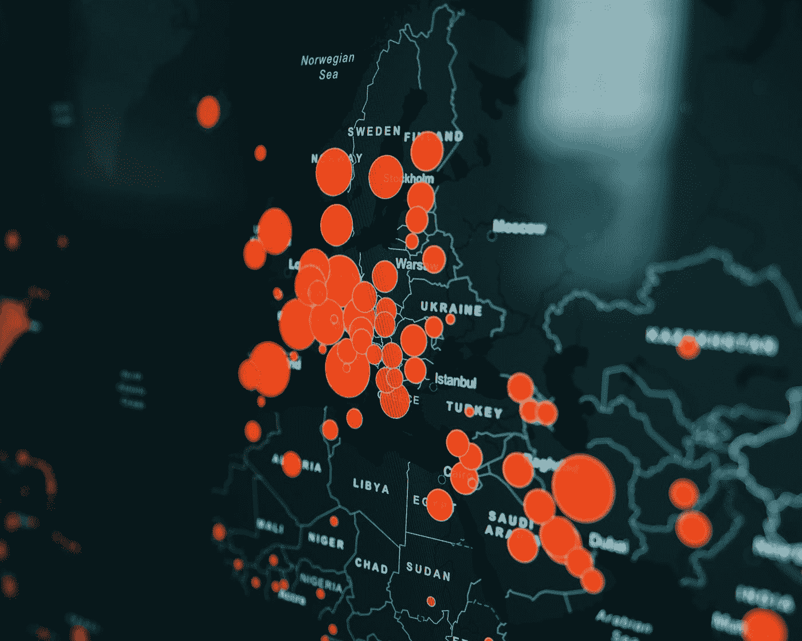
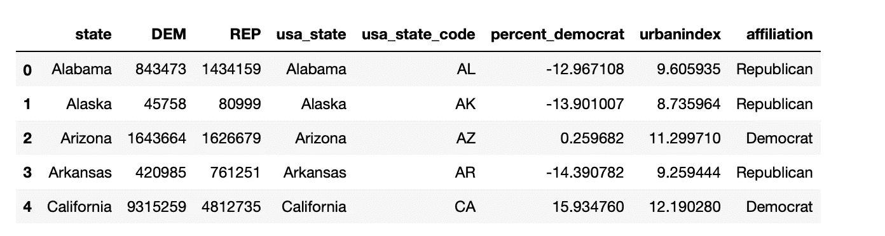
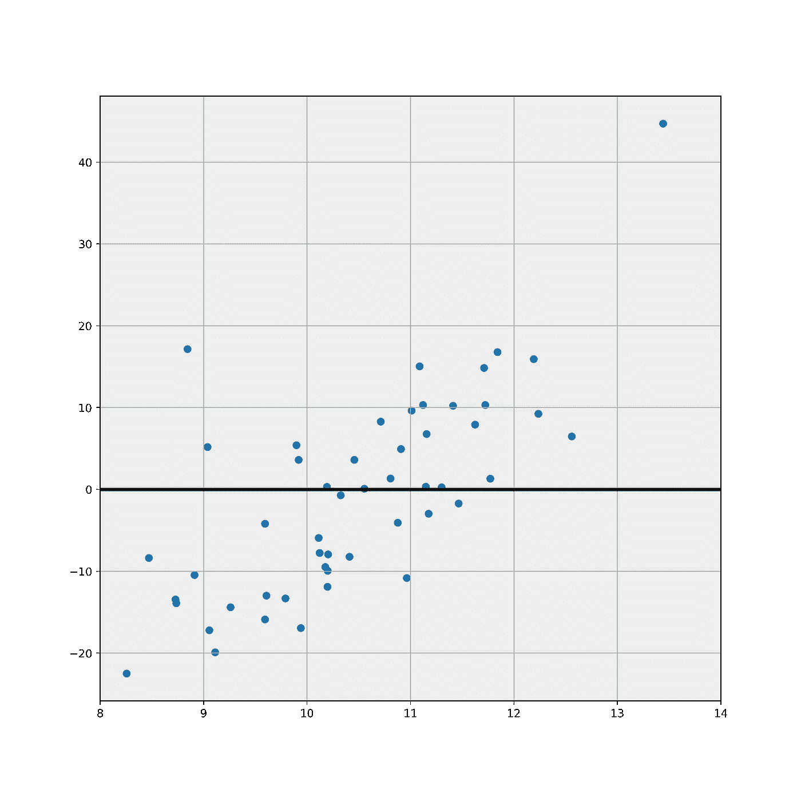
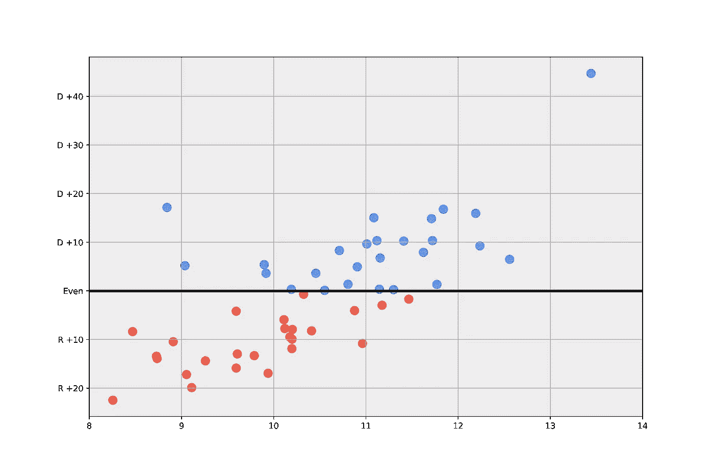
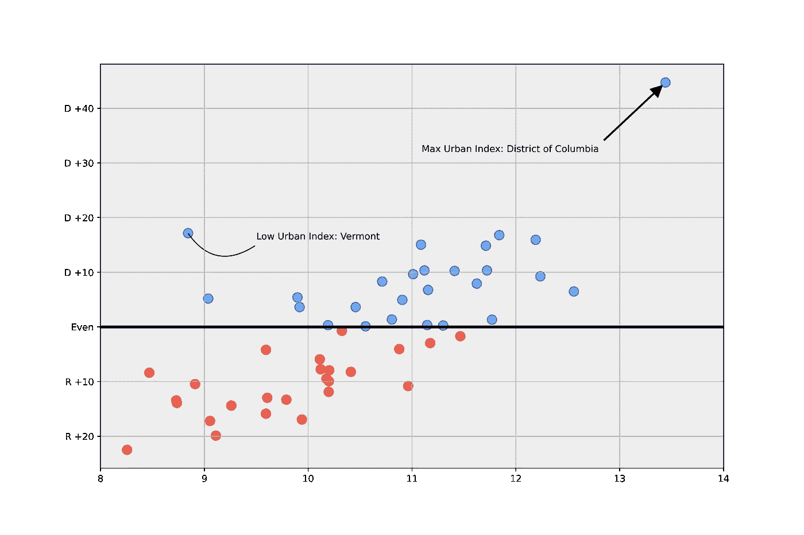

# 重建 538 选举图:制作自定义 Matplotlib 可视化

> 原文：<https://towardsdatascience.com/recreating-a-538-elections-plot-making-custom-matplotlib-visualizations-b6ede7a406b4>

## 有些情况下，您希望您的数据可视化非常复杂

[粘土银行](https://unsplash.com/@claybanks?utm_source=medium&utm_medium=referral)在 [Unsplash](https://unsplash.com?utm_source=medium&utm_medium=referral) 拍摄的照片

我最近对制作详细的和高度可定制的可视化感兴趣。虽然在许多情况下，使用基本命令生成标准绘图就足够了，但有些情况下，您希望数据可视化非常复杂。这导致转向低级函数来调整图中的每个元素。作为练习，在这个故事中，我想重现 538 年的[这个](https://fivethirtyeight.com/features/how-urban-or-rural-is-your-state-and-what-does-that-mean-for-the-2020-election/)形象。本质上，它是在描绘美国 50 个大陆州的城市化指数与政治偏好。

首先，一些设置和导入数据。我将使用的两个主要库是用于数据清理的 Pandas 和用于重新创建可视化的 matplotlib。数据集将从这里的[获取](https://github.com/fivethirtyeight/data/tree/master/urbanization-index)(这是 538 的 GitHub repo，数据由 CC BY 4.0 许可)。从那里，我们可以连接“state”列上的数据。让我们来看看结果:

作者图片

由于原始图已经计算了 y 轴上方的民主党州和下方的共和党州的“倾斜”，我将添加一个“从属”变量，计算为一个州的民主党百分比减去 50%(这将是两党都受到同等支持的情况)。

在原图中，我们可以看到一个灰色的背景，以及代表城市化指数的 x 轴和各自党派倾向的 y 轴。此外，我更改了 y 轴刻度，以反映“Party”+该方受支持程度的值。让我们先将它们添加到图中，包括我们看到的 y=0 处的粗线:

作者图片

现在，让我们自定义散点多一点:这里我们添加了一个浅蓝色和浅红色的点，这取决于他们的 y 值，以及一个边缘颜色与填充颜色的深色版本，以创建更多的对比:

作者图片

现在，我们可以添加曲线箭头，正如我们在原始图表中看到的那样。这是使用 matplotlib.patch 的 FancyArrowPatch 完成的，第一组坐标设置箭头的位置，第二组坐标设置箭头的位置。“connectionstyle”属性设置箭头的形状，如下所示:

作者图片

## 结论

原来如此！我试图重现 538 的情节，并附有一些评论。我们使用的主要函数是“annotate”、“FancyArrowPatch”和“scatter”，具有可定制的属性。我希望你喜欢这个小故事，并感谢阅读！