# 用一个真实的例子和 Python 代码解释递归神经网络

> 原文：<https://towardsdatascience.com/recurrent-neural-networks-explained-with-a-real-life-example-and-python-code-e8403a45f5de>

## 在情感分析任务中使用递归神经网络


作者图片

这是致力于深度学习系列的第二篇文章，深度学习是一组可以追溯到 20 世纪 40 年代的机器学习方法。深度学习在过去几十年中因其在图像分类、语音识别和机器翻译等领域的开创性应用而受到关注。

第一篇文章关注多层感知器。如果你想看用现实生活中的例子和一些 Python 代码解释不同的深度学习算法，请继续关注。

多层感知器的发展是人工神经网络的一个重要里程碑。第一次，我们可以*将许多感知机堆叠在一起*，并按层组织它们，以创建最能代表复杂问题的模型。

多层感知器以暂时的、离散的方式工作。它采用一个输入向量，执行一个前馈计算步骤，反向传播误差，一旦损失函数不能再最小化，就停止，生成输出。

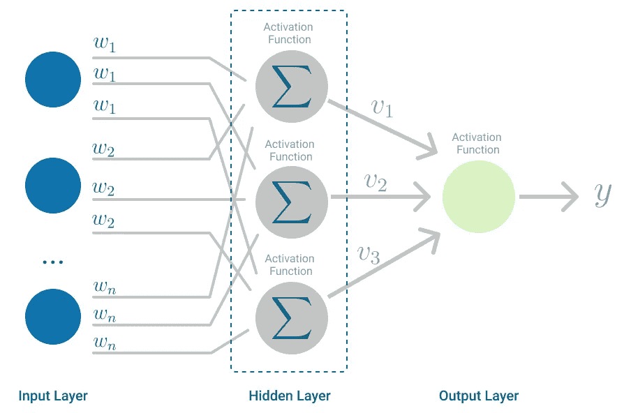

*有一个隐藏层的多层感知器的例子。(图片由作者提供)*

但是许多现实世界的问题都涉及到时间维度。当手头的问题以序列的形式出现时呢？

# 用于情感分析的神经网络

在上一篇文章中，你使用了[多层感知器进行情感分析](/multilayer-perceptron-explained-with-a-real-life-example-and-python-code-sentiment-analysis-cb408ee93141)。你拿了你父母在乡下舒适的床和早餐的评论，训练了一个多层感知器，并预测了评论的整体情绪。

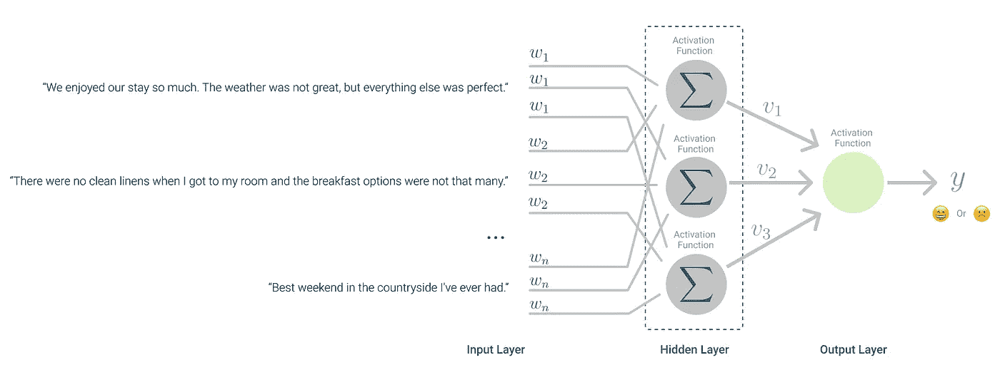

*多层感知器用来从你父母的民宿学习评论的情绪。(图片由作者提供)*

多层感知器使用每篇评论的符号化单词向量作为输入，但它*看着*每篇评论一个单独的原子单位。

分析这些评论的更精确的方法是考虑每个单词在评论中的位置，因为句子的结构在赋予其意义方面起着作用。

一个比多层感知器更强大的模型将根据每个句子的结构来分析评论。例如，使用类似于*这一次的服务很棒*和*这一次的服务很棒*这样的句子，确定这些句子有相同的情感就足够聪明了[1]。即使单词被打乱了。

为了在情感分析任务中更进一步，您需要一个不同的模型。

你需要一个模型，让*在每次评论中把*看做有序的单词序列，而不是原子单位。每个单词序列也可以有任意长度，因为每个句子可以由不同数量的单词组成。

你需要建立一个[递归神经网络](https://en.wikipedia.org/wiki/Recurrent_neural_network)。

# 递归神经网络

**循环神经网络**用于多个领域。例如，在[自然语言处理](https://en.wikipedia.org/wiki/Natural_language_processing) (NLP)中，它们被用于[生成手写文本](https://arxiv.org/abs/1308.0850)，执行[机器翻译](https://arxiv.org/pdf/1409.3215.pdf)和[语音识别](http://proceedings.mlr.press/v32/graves14.pdf)。但是它们的应用并不局限于处理语言。在[计算机视觉](https://en.wikipedia.org/wiki/Computer_vision)中，递归神经网络已经被用于像[图像字幕](https://arxiv.org/abs/1411.4389)和[图像问答](https://arxiv.org/abs/1505.02074)这样的任务中。

将**递归神经网络**与[多层感知器](/multilayer-perceptron-explained-with-a-real-life-example-and-python-code-sentiment-analysis-cb408ee93141)区别开来的是，递归神经网络是为了处理代表序列的输入而构建的，就像你父母的床和早餐的评论中的单词序列。但它也处理输出序列，比如当你把一个句子从一种语言翻译成另一种语言时。

**递归神经网络**的作用就像一条链。在每个*时间步长*执行的计算取决于之前的计算。

深度学习训练的神奇之处在于隐藏的层。

在训练的开始，网络的结构被定义，在这种情况下，是一个递归神经网络。但是我们只知道哪些输入与哪些输出匹配。该算法将学习如何使用隐藏层来对每个输入数据点进行最佳逼近以输出数据点[1]。

# 可视化递归神经网络

将递归神经网络可视化的最佳方式之一是作为循环计算图[1]。在这种表示中，递归神经网络具有三种主要状态:

*   **输入状态**，捕捉模型的输入数据。
*   **输出状态**，捕捉模型的结果。
*   **递归状态**，它实际上是一个隐藏状态链，捕获输入和输出状态之间的所有计算。

与其他[监督机器学习模型](https://en.wikipedia.org/wiki/Supervised_learning)类似，递归神经网络使用[损失函数](https://en.wikipedia.org/wiki/Loss_function)将模型的输出与基础事实进行比较。该损失稍后被反向传播，并且模型权重被更新，就像在[多层感知器](/multilayer-perceptron-explained-with-a-real-life-example-and-python-code-sentiment-analysis-cb408ee93141)中一样。

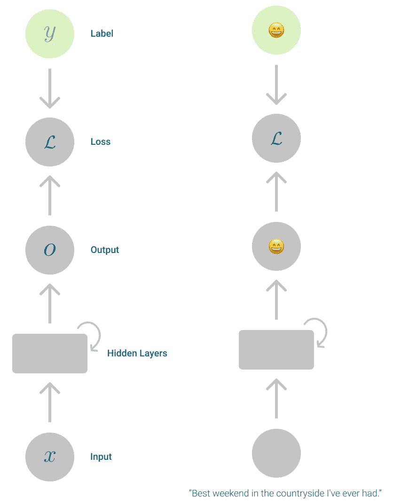

表示为计算图的递归神经网络。*(图片作者)*

这是一个*压缩视图*，更像是对递归神经网络机制的总结。在实践中，当你*展开*这个图表时，更容易形象化重现。尤其是在处理文本序列时。

在递归神经网络的*展开视图*中，每个计算对应于一个*步骤*，也称为内部状态。并且每一步都依赖于前一步的计算。

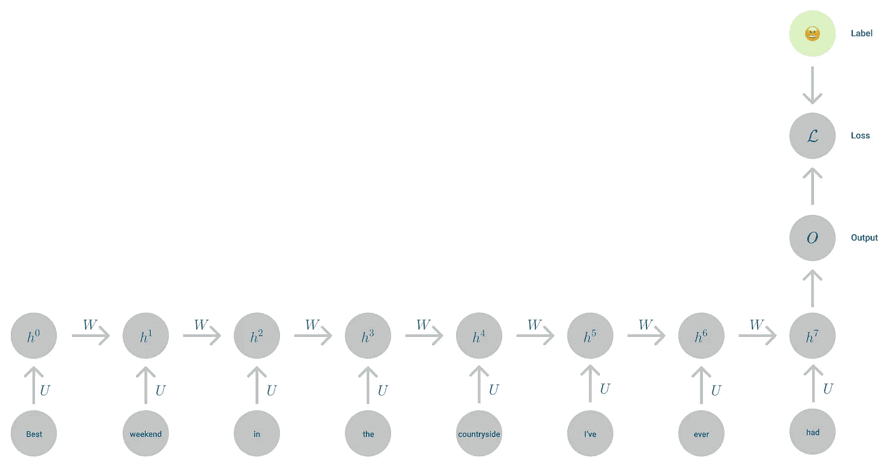

*表示为展开的计算图的递归神经网络。(图片由作者提供)*

由于每个内部状态都依赖于前一个状态，所以从序列开始起，信息就传播到了网络中的每一层神经元上。像是传递给后代的古老记忆。

如果多层感知器意味着在层中堆叠多个神经元，那么递归神经网络意味着链接多层感知器，以创建一系列相关的计算。

在递归神经网络的情况下，*存储器*是关于到目前为止应用于序列的计算的信息。

# 递归神经网络超级能力:参数共享

*网络中所有时间步长共享一个权重向量。*

递归神经网络的一个关键特征是**参数共享**。在网络的所有部分中，只有一组参数被使用和优化。如果这些参数没有被共享，模型将不得不*学习*输入序列的每个部分的参数，并且将有更困难的时间来概括它还没有见过的例子[1]。

共享参数使递归神经网络能够处理不同长度的输入，并且仍然在可接受的时间框架内执行预测。

共享参数对于概化共享输入的序列尤其重要，尽管它们位于不同的位置。在你父母的住宿和早餐评论的情况下，如果没有共享的参数，网络将会有一段非常艰难的时间，并将多次重复学习相同的语言规则，以找出类似于*这一次服务很棒*和*这一次服务很棒*的句子，具有相同的输出情绪。

这是 RNNs 的一个主要优势，因为如果没有参数共享，您必须为序列中的每个时间步长学习不同的模型，并且您需要一个大的训练集来适应不同的模型训练步骤。

实际上，参数共享意味着输出函数是前一时间步输出的结果，每一步用相同的规则更新。后者是递归神经网络的另一个重要方面，更新规则是相同的，这意味着在每个时间步，网络应用相同的激活函数。

# 许多隐藏状态，相同的激活功能

网络可以有尽可能多的隐藏状态，但有一个重要的常数。在每个隐藏状态下，你总是在计算相同的**激活函数**。使用相同的函数计算每层的输出[3]。

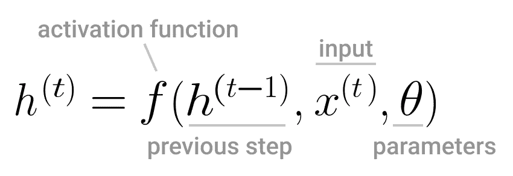

应用于递归神经网络的激活函数计算隐藏状态 *h* 。(图片由作者提供)

激活函数可以像线性函数或 [sigmoid 函数](https://en.wikipedia.org/wiki/Sigmoid_function)一样简单。但是[双曲正切](https://en.wikipedia.org/wiki/Hyperbolic_functions#Hyperbolic_tangent)也常用于深度学习，因为与 sigmoid 相比，它往往更少出现[消失梯度](https://en.wikipedia.org/wiki/Vanishing_gradient_problem)。

用双曲正切训练深度神经网络就像训练线性模型一样简单，只要计算量很小[1]。

表示为 *tanh(x)* 的双曲正切是激活函数的可靠选择。它的行为类似于零附近的恒等函数，即 tanh(0) = 0。

因此，只要这个激活函数的计算量很小，用双曲正切训练深度神经网络就像训练线性模型一样简单[1]。

# 输出层很特殊:它可能需要 Softmax

现在你可能会想*你不是说过每一层都使用相同的激活函数吗？*

是的，但是在分类任务中，输出图层是特殊的。

特别是对于处理分类问题的神经网络，还有另一个激活函数，只应用于输出层，几乎像一个后处理步骤。满足 [Softmax](https://en.wikipedia.org/wiki/Softmax_function) 功能。

二元分类问题的输出不是 0 就是 1。但有时你在处理一个多类问题，例如，如果你父母的床和早餐的评论被归类为*积极，中立或消极。*

在这种情况下，有 3 个可能的输出类，了解观察值属于正类的可能性更有用。这就是为什么除了您为网络选择的激活函数之外， **Softmax** **函数**也应用于输出层。

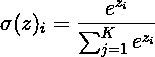

Softmax 方程。(图片由作者提供)

向量 z 是从第一层开始的所有计算的结果，它是到达输出层的向量。

例如，如果您的神经网络只有一个线性层，向量 *z* 可以看起来像:

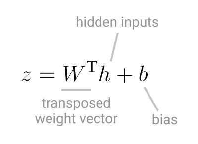

线性图层的矢量 *z* 。(图片由作者提供)

使用 Softmax，该向量被指数化，并且因为这是一个分类任务，所以在所有可能的 *K* 类中被标准化，将向量变成概率分布。这就是为什么 Softmax 也被称为归一化指数函数。

在应用 Softmax 之后，矢量 *z* 的所有值的总和总是等于 1。它的值表示在输入层给予网络的观察值属于每个类的概率。

如果不对输出层应用 Softmax，则递归神经网络的输出是一个数字

每个可能的类别。具有最高值的输出是该观察的获胜类[3]。

# 穿越时间的反向传播

到目前为止，您已经研究了递归神经的更广泛的架构和组件，即激活和损失功能。让我们把注意力放在学习上。

当计算从一层中的每个隐藏层流向下一层时，它向前移动，向输出层移动。到达输出层时，您计算损失函数，这意味着您将生成的输出与该训练观察的预期*真*值进行比较。

如果过程在此停止，网络将无法学习。这将是一个前馈网络，因为信息在网络结构中向前移动。但是学习需要某种循环。就像你在学校或自己学习一样:信息到达你的大脑，这是前馈部分，然后你处理它，当你这样做的时候，你检查自己的心智，有时重新学习某些东西，这是我称之为循环的部分。

神经网络受到大脑的启发，主要是受到神经元工作方式的启发。但是这些神经网络架构，也有这个*一个*一个*的循环部分。*他们*学习*如何将输入数据映射到一个可能的结果的部分。

回到递归神经网络！

输入通过所有层，当它到达输出层时，它计算损失函数。现在，知道计算链与预期的结果有多不同或有多远，它取损失函数的值，并计算它相对于参数的梯度。

然后，在另一种算法的帮助下，如[随机梯度下降](https://medium.com/p/b7639d5e6a32)，梯度被发送回相反的方向。一直回到输入层。

这样你就*反向传播*了损失函数。

梯度的实际计算被称为*反向传播*【1】。但是通常与实际的学习部分相混淆，实际的学习部分是通过像随机梯度下降这样的算法完成的。

到达输入层时，随机梯度下降或其他基于梯度的优化算法调整网络权重，并通过每个隐藏层再次计算激活函数。

通过从当前权重向量(θ)中减去关于损失函数(J)的梯度值来更新网络中的每个权重。这也称为*重量变化量* (vt) *。*


*反向传播权重更新规则(图片由作者提供)。*

该过程继续进行，直到损失函数不能再被最小化，因此再次调整权重没有意义，并且在给定当前训练集和架构的情况下，神经网络的性能被最大限度地提高。

更复杂的算法和神经网络架构可能会提高性能，但也会增加所有计算的复杂性，从而导致更长的训练时间。

在机器学习中，你总是要处理取舍。对于更复杂的模型，一些折衷是(a)提高性能，但是降低模型的可解释性，或者(b)提高性能，但是增加训练时间。

# 现实中的 RNNs:情感分析👍 👎

你决定使用 [TensorFlow](https://www.tensorflow.org/) 强大的库来帮助对你父母的床和早餐的评论进行分类，而不是从头开始建立一个递归神经网络。

你需要做的第一件事是[通过 *pip* 在你的机器上安装 TensorFlow](https://www.tensorflow.org/install) ，因为你将使用本地 Python 环境。

遵循 TensorFlow 文档:

```
# Requires the latest pip
> pip install --upgrade pip# Current stable release for CPU and GPU
> pip install tensorflow
```

然后你会注意到 TensorFlow 资源 [6]上有一个使用 RNNs 的[文本分类的健壮例子。这是你想做的事情的一个很好的基础，你只需要根据你自己的任务来调整它。](https://www.tensorflow.org/text/tutorials/text_classification_rnn)

一眼看去，建立一个递归神经网络来对来自你父母的床和早餐的所有评论的情绪进行分类包括:

1.  组织培训和测试文件
2.  加载训练和测试数据集
3.  维度问题:压缩数据集(矢量化)
4.  构建递归神经网络
5.  模型拟合和评估
6.  精确度和损失可视化

# 组织培训和测试文件

第一步是把你的表兄弟帮助分类的评论整理到相应的目录中。将会有*训练*和*测试*目录，每一个都有包含*正面*和*负面*评论的子目录。

在这个组织之后，如果您在您的项目目录上运行命令树*,您将会看到如下内容:*

*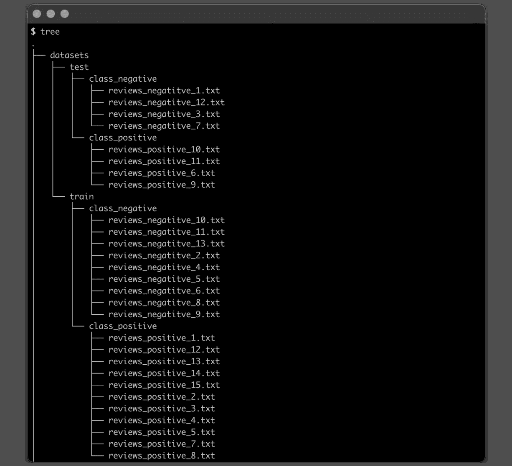*

**训练和测试数据集目录*(图片由作者提供)*

*在这一步中重要的是，每个文件只有一个检查，因此可以在下面的步骤中正确地加载和处理它。*

# *加载训练和测试数据集*

*要加载训练和测试数据集，您可以利用 Keras 实用程序方法[text _ dataset _ from _ directory](https://www.tensorflow.org/api_docs/python/tf/keras/utils/text_dataset_from_directory)，这特别需要您在上一步中整理的目录数据集结构。*

*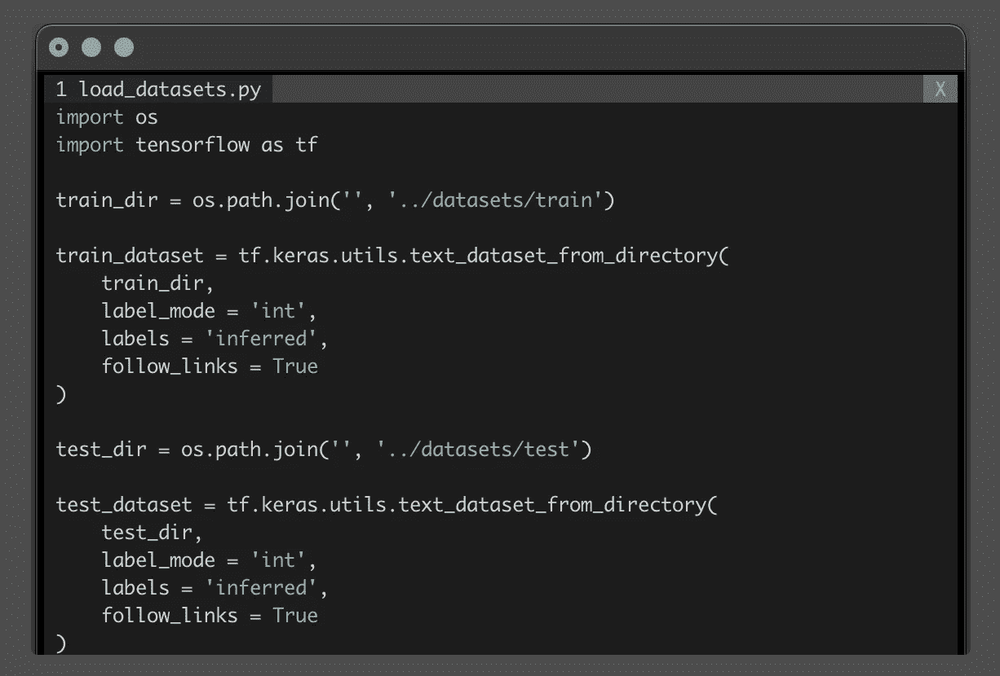*

**加载训练和测试数据集*(图片由作者提供)*

# *维度问题:压缩数据集(矢量化)*

*你父母的住宿和早餐点评没那么冗长。将会有更多热情的顾客，他们写一篇关于他们体验的短文，但是从数据的角度来看，结果是一个相对低维度的向量。*

*但是如果你父母的生意如此受欢迎，以至于旅游和休闲杂志开始写关于他们的文章，基本上是评论，那该怎么办？在这种情况下，我们谈论的是更大的数据集，每个评论都是至少 800 字的杂志文章。*

*在这个场景中，你正在处理一个维度问题。你有非常大和稀疏的向量，这使得所有矩阵计算在计算上具有挑战性。*

*为了处理这种情况，你需要做一些与主成分分析类似的事情。你想要压缩你的数据集，同时保持它所有的表达能力和核心特征。*

> *这些是通过主成分分析的变体从非常大的文档语料库中建立的。其思想是单词在嵌入空间中的位置保持语义；例如，同义词应该出现在彼此附近。”[5]*

*一个典型的预处理步骤是用 [wor2vec](https://en.wikipedia.org/wiki/Word2vec) [4]来降低维度。在 TensorFlow 中， [Keras TextVectorization](https://www.tensorflow.org/api_docs/python/tf/keras/layers/TextVectorization) 层做了类似的事情。它获取一个字符串，或者将它映射到一个一维的索引张量或者一个表示字符串中数据的一维浮点张量。*

**

**加载数据并对训练数据集进行矢量化。*(图片作者)*

*在这一步结束时，训练数据集被矢量化，数据准备阶段完成。*

*现在，您已经准备好构建递归神经网络了。*

# *构建递归神经网络*

*实际上，你的递归神经网络模型是一组[连续层](https://www.tensorflow.org/api_docs/python/tf/keras/Sequential)。*

*第一个是词汇编码器，在前面的步骤中创建。它在[嵌入层](https://www.tensorflow.org/api_docs/python/tf/keras/layers/Embedding)中使用，它将编码向量中的值转换成特定的范围。*

*例如，您的评论中的词汇由 151 个单词组成，通过运行以下命令获得:*

```
*len(encoder.get_vocabulary())*
```

*因此，模型通过 *input_dim* 将词汇大小作为输入，并返回大小为 64 的输出，使用 *output_dim* 定义。因为您指定了词汇大小 151，所以映射中最大的整数将是 150。*

*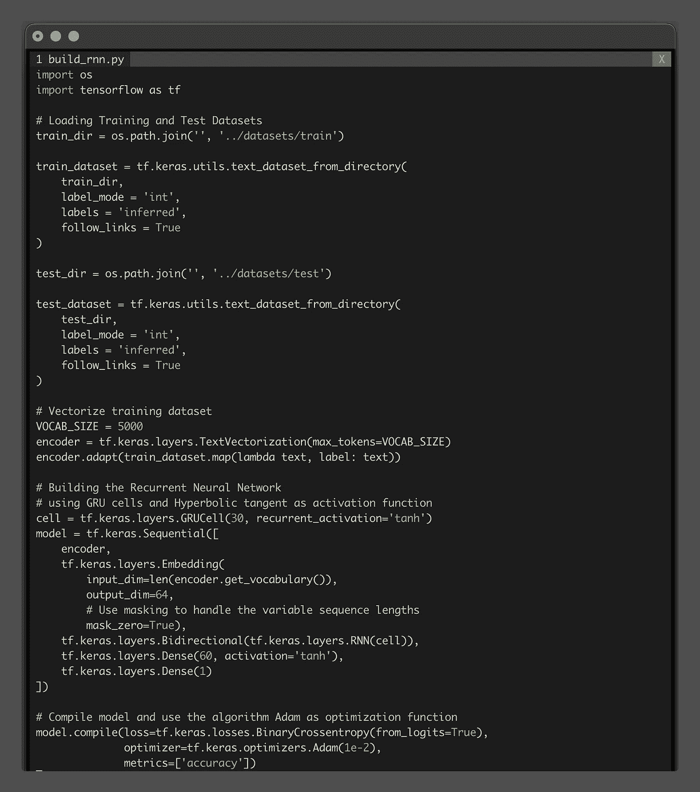*

**加载数据和矢量化训练数据集并构建 RNN。*(图片作者提供)*

*下一层，[双向](https://www.tensorflow.org/api_docs/python/tf/keras/layers/Bidirectional)，表示您想要创建一个双向递归神经网络。这意味着网络的输入通过 NRR 层向前和向后传播。网络在处理输入的过程中，随着时间的推移而产生的*记忆*，不仅被传递给后面的细胞，还被传递给前面的细胞。现在，在输入序列中，网络中的每个细胞都有关于过去和未来的信息。*

*使用双向递归神经网络的优点在于，不仅仅是网络中的先前信息对输出预测有贡献。知道在序列中什么会在前面出现对模型如何学习有重大影响。*

*这种优势是一把双刃剑。由于信息现在来回传播，这些网络往往会慢得多，因为梯度现在有一个更长的依赖链。*

*然而，你父母的住宿和早餐评论是一个小数据集。所以你决定值得一试！*

*模型中的最后两层是[致密层](https://www.tensorflow.org/api_docs/python/tf/keras/layers/Dense)。倒数第二个用于处理模型损失，双曲正切作为激活。最后一个将输出整形为大小 1，假设您希望该模式的输出为*正*或*负类*指数。*

*在这种情况下，RNN 是使用 30 个[单元](https://www.tensorflow.org/api_docs/python/tf/keras/layers/GRUCell)创建的。这些[门控递归单元](https://en.wikipedia.org/wiki/Gated_recurrent_unit) (GRU)使用双曲正切作为递归步骤的激活函数。*

# *模型拟合和评估*

*现在你已经建立并编译了递归神经网络，是时候[将它与训练数据集](https://www.tensorflow.org/api_docs/python/tf/keras/Model#fit)相匹配，并进行一些预测了。*

*您可以调整的几个参数是:*

*   **epochs* 您希望算法在整个训练集中运行多少次*
*   **混洗*如果您想在每次历元迭代之前混洗训练数据。默认为 True*
*   **验证 _ 步骤*验证步骤结束前抽取的样本批次数，算法开始新的时期*

*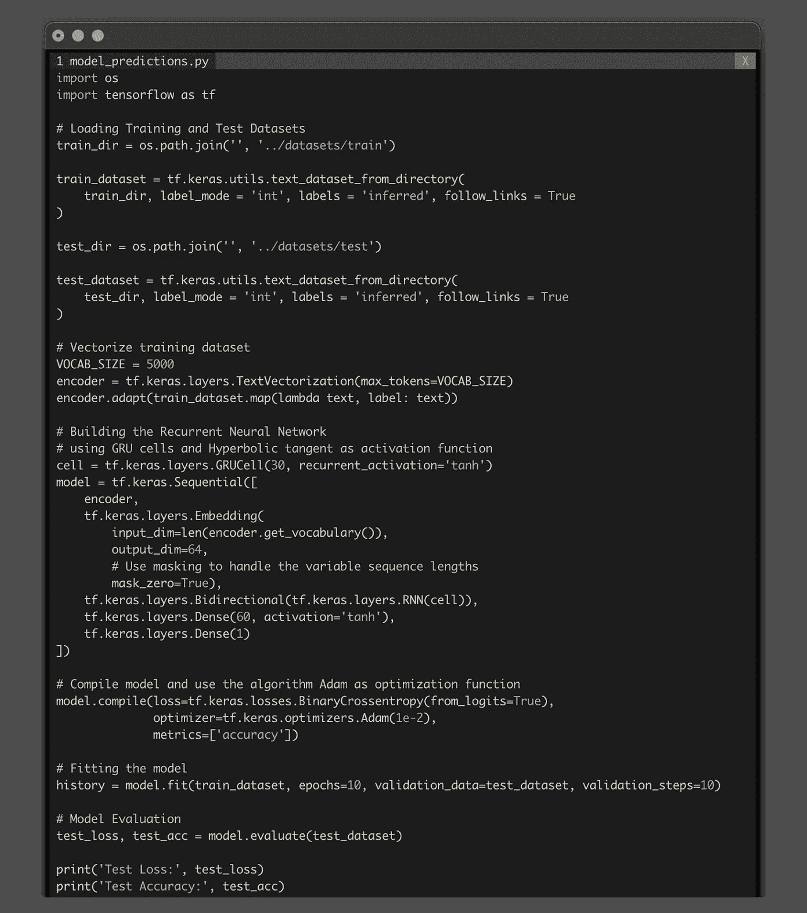*

*从*加载数据和向量化训练数据集*到*构建*和评估 RNN *。*(图片作者提供)*

# *精确度和损失可视化*

*作为最后一步，可视化模型的损失和准确性总是很有趣的。尤其是当它通过多次迭代运行时。*

```
*import os
import tensorflow as tf
import matplotlib.pyplot as plt# Loading Training and Test Datasets
train_dir = os.path.join('', '../datasets/train')train_dataset = tf.keras.utils.text_dataset_from_directory(
    train_dir, label_mode='int', labels='inferred', follow_links = True
)test_dir = os.path.join('', '../datasets/test')test_dataset = tf.keras.utils.text_dataset_from_directory(
    test_dir, label_mode='int', labels='inferred', follow_links = True
)# Vectorize training dataset
VOCAB_SIZE = 5000
encoder = tf.keras.layers.TextVectorization(max_tokens=VOCAB_SIZE)
encoder.adapt(train_dataset.map(lambda text, label: text))# Building the Recurrent Neural Network
# using GRU cells and Hyperbolic tangent as activation function
cell = tf.keras.layers.GRUCell(30, recurrent_activation='tanh')
model = tf.keras.Sequential([
    encoder,
    tf.keras.layers.Embedding(
        input_dim=len(encoder.get_vocabulary()),
        output_dim=64,
        # Use masking to handle the variable sequence lengths
        mask_zero=True),
    tf.keras.layers.Bidirectional(tf.keras.layers.RNN(cell)),
    tf.keras.layers.Dense(60, activation='tanh'),
    tf.keras.layers.Dense(1)
])# Compile model and use the algorithm Adam as optimization function
model.compile(loss=tf.keras.losses.BinaryCrossentropy(from_logits=True), optimizer=tf.keras.optimizers.Adam(1e-2), metrics=['accuracy'])# Fitting the model
history = model.fit(train_dataset, epochs=10, validation_data=test_dataset, validation_steps=10)# Model Evaluation
test_loss, test_acc = model.evaluate(test_dataset)print('Test Loss:', test_loss)
print('Test Accuracy:', test_acc)# Visualize Model Loss and Accuracy
def plot_graphs(history, metric):
  plt.plot(history.history[metric])
  plt.plot(history.history['val_'+metric], '')
  plt.xlabel("Epochs")
  plt.ylabel(metric)
  plt.legend([metric, 'val_'+metric])plt.figure(figsize=(16, 8))
plt.subplot(1, 2, 1)
plot_graphs(history, 'accuracy')
plt.ylim(None, 1)
plt.subplot(1, 2, 2)
plot_graphs(history, 'loss')
plt.ylim(0, None)*
```

*这里，您还可以利用来自 TensorFlow 文档页面的[便捷示例中的代码来绘制训练和验证数据集的损失和准确性。](https://www.tensorflow.org/text/tutorials/text_classification_rnn#setup)*

*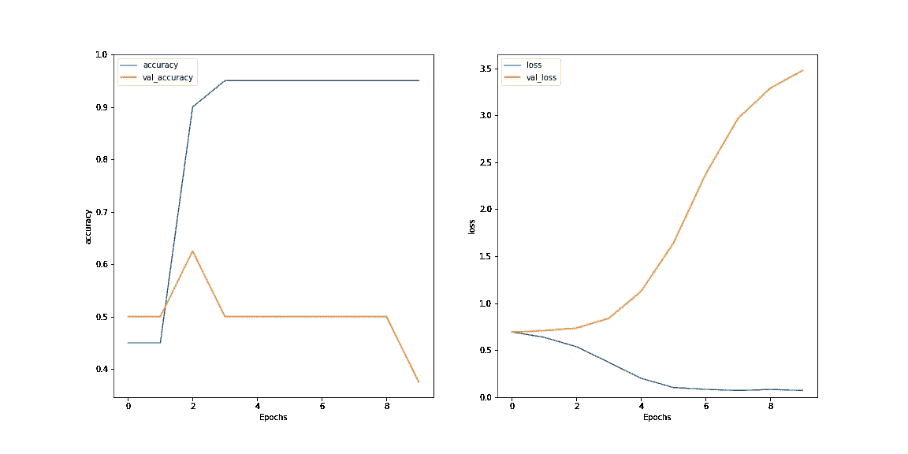*

*绘制每个时期的模型损失和精度。(图片由作者提供)*

*在对测试数据集进行预测后，准确性远非完美。它徘徊在 0.5 左右，这意味着你的模型在技术上比随机猜测好不了多少。*

*在所有评估时期，精度非常稳定地保持在 50%,在第三个时期之后，损耗开始稳定增加。*

*但是这些结果不应该让你气馁。您的数据集非常小，所用的 RNN 架构非常简单，当然还可以改进。这只是理解 RNNs 的第一步。*

# *结论*

*根据手头的任务，有几种不同的方法来建立递归神经网络。*

*它可以具有一对多的结构，就像模型必须为给定的图像创建标题一样。但是如果你把英语翻译成法语或者相反，你将会建立一个多对多结构的递归神经网络。*

*对于情感分析任务或对你父母舒适的床和早餐的所有评论进行分类，该网络具有多对一的结构，评论中的几个词构成了一个单一的输出，即情感类别。无论是积极的还是消极的。*

*你创建的网络相对简单，只有 50%的准确率。*

*但我希望你能更好地理解什么是递归神经网络，为什么它是这样一个改变游戏规则的深度学习网络架构，以及它可以应用于现实生活中的各种问题。*

**感谢阅读！**

# *参考*

1.  *古德费勒，伊恩 j，本吉奥，约舒亚和库维尔，亚伦。深度学习，麻省理工出版社，2016*
2.  *[递归神经网络的不合理有效性](https://karpathy.github.io/2015/05/21/rnn-effectiveness/)*
3.  *希顿杰夫。[深度神经网络的应用](https://arxiv.org/abs/2009.05673)*
4.  *托马斯米科洛夫程凯格雷格 s 科拉多杰弗里院长。[向量空间中单词表示的有效估计](https://arxiv.org/abs/1301.3781)。(2013)*
5.  *加雷思·詹姆斯、丹妮拉·威滕、特雷弗·哈斯蒂、罗伯特·蒂布拉尼。(2021).统计学习导论:应用于 r .(第二版)*
6.  *[使用 RNN 的文本分类](https://www.tensorflow.org/text/tutorials/text_classification_rnn)，TensorFlow 文档*