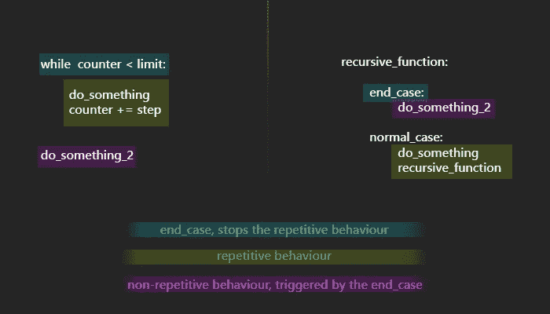
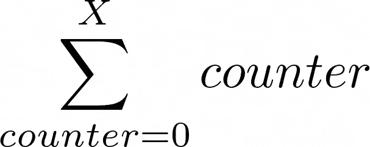
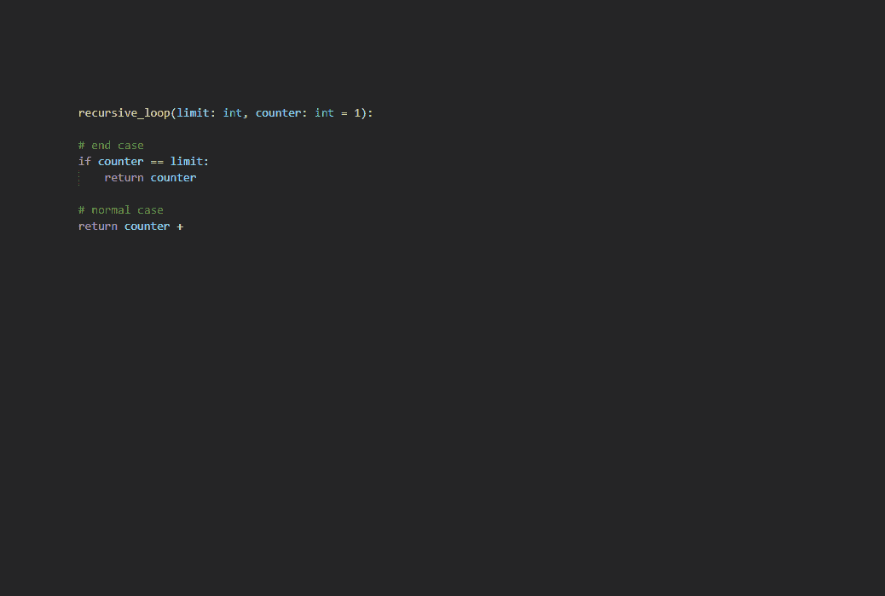
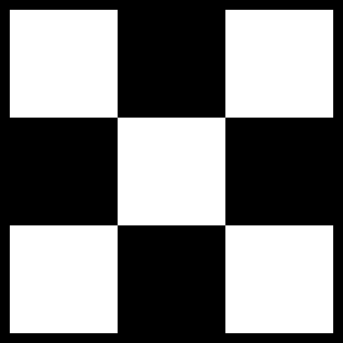
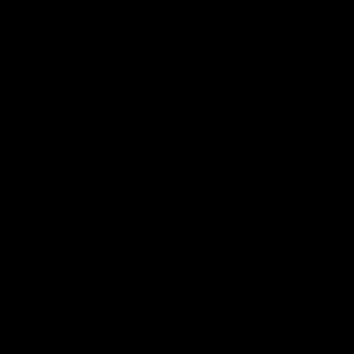
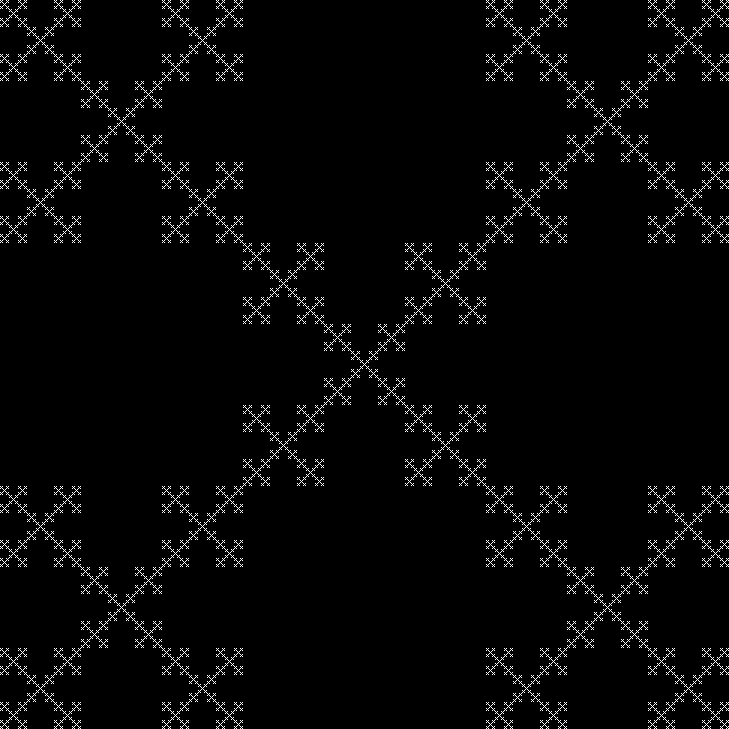

# 反复出现的关于复发的问题

> 原文：<https://towardsdatascience.com/recurring-concerns-concerning-recursions-2f89ac5e5f87>

## Python 中时髦的编程

## “跳出循环”


尼古拉斯·古雷威奇的《怪异的漩涡》。面板左侧的源。[经许可使用]

如果你跳过了处理树遍历的 CS 课程，或者你不明白如何使用 Dijkstra 算法提取从 A 到 B 的最短路径，你可能已经搜索过递归了。我假设你已经阅读了前 2 个搜索结果中的内容。

所以，我将试着用我自己的话来解释如何轻松地处理递归，以及为什么你不应该这么做。之后我们会有一些分形的乐趣。

# 循环的黑暗面

为了开始运行，我们可以把递归想象成一个循环。或者我们可以把循环想象成递归。不管怎样，他们都有一些相似之处。



循环和递归的相似性[图片来自作者]

显然，在满足某个条件之前，会重复执行一些操作。有一个条件可以停止重复，然后会有一些行动。

递归函数通常调用自己作为重复动作的一部分，常规循环没有这种行为。尽管如此，许多常规循环可以写成递归，我很乐意演示:

## 谦逊的重复

为了成功地创建一个简单的递归函数，我将遵循以下框架:

```
**recursive_function:** **end_case:
        do something before ending
        end** **normal_case:
        do something before calling the function again
        recursive_function**
```

现在，假设我们想重复某个动作 X 次。for 循环在适当的位置自然流动:

```
for i in range(X):
    repeated_action
```

和递归函数，遵循前面提到的框架:

```
def recursive_iteration(X, counter=0):

    #end_case:
    if counter == X-1:
        return

    #normal_case:
    repeated_action
    recursive_iteration(X, counter+1)
```

> 不那么光滑…等到我们开始增加它的实用性…

## 总和

假设我们想要从 0 到 x 的所有整数的和。



我向你呈现；从 0 到 X 的所有整数之和[图片由作者提供]

令人钦佩的 For 循环:

```
sum = 0
for counter in range(1,X+1):
    sum+=counter
```

以及一个严格的递归:

```
def recursive_sum(X, counter=1):

    #end_case:
    if counter == X:
        return counter

    #normal_case:
    return counter + recursive_iteration(X, counter+1)
```

# 将它分解

如果你还没有完全理解上面的代码发生了什么，这里有一个一步一步的视觉帮助，我希望它足够了:



这个例子将从 1 到 3 的所有整数相加，但是您可以推断出原理

> 哎呦，好像我用一些不同的名字制作了动画…

# 递归还是循环？

如果你在两者之间有明确的选择，选择循环。除了有时与使用递归相关的碍眼和头痛之外，另一个相当大的缺点是开销。做一个递归和一个循环来完成相同的任务，然后计时来揭示问题

仅仅因为递归函数很糟糕，循环函数不一定是最好的选择。在这里，sum 函数远远胜过它

# 递归用例

当常规循环不适合这项工作时，真正的乐趣就开始了，这就是递归的领域。在循环变得复杂和失败的地方，递归占主导地位。

一旦你能理解递归过程，你需要培养正确使用它们的意识。当我开始思考“这应该重复，但每一步都要放大”这样的问题时，我意识到递归的必要性。现在，我不会向您展示任何有用的东西，相反，我在文章的开头承诺了分形的乐趣，所以让我们开始吧。

# 分形娱乐时间

如果你在哲学演讲(或在互联网上与陌生人争论)或内省中思考，你可能会注意到一些递归思维模式的出现。似乎递归被编织进了人类的大脑。自然界的一些例子表明，美源于几何规则，递归也不例外，尽管在自然界中它们大多以分形的形式出现。

为了让这篇文章在几何上更吸引人，让我们试着解一个图形递归赋值。

## 五个人

首先，让我介绍这五位。
Five 是一个 2D 数组，记为[[1，0，1]，[0，1，0]，[1，0，1]]
为什么叫“the Five”？如果你把 1 想象成一个白色像素，把 0 想象成一个黑色像素，这看起来有点像骰子上的 5(我猜可能有人在读这篇文章时从未见过骰子…)



[1，0，1]
【0，1，0】
【1，0，1】
【图片，作者】

这很容易被硬编码，但是我们不要沉迷于这样的行为…

```
five = []
for i in range(3):
    row = []
    for j in range(3): # This is a method for generating checkerboard patterns, makes sure that the rows change the order of 1’s and 0's
        if (j+i)%2 == 0:
            row.append(1)
        else:
            row.append(0)five.append(row)
```

好了，现在我们已经定义并编码了五个。进入下一步…

## 五个组成五个

下一个需要理解的概念是。如果我们用 5 代替 1，用 3×3 零矩阵代替 0，会怎么样？



五个组成五个，第一次进化[作者动画]

有很明显的简单方法可以达到这个形状，但是我希望你能推断出它的发展方向…因为再多的硬编码也帮不了你。

## 由…制成的五个(五个由…制成的)

> 我的朋友叫我分形五



请看分形五，五的最终进化[图片由作者提供]

让我们想一个策略。这个问题可以借助我在上面*打出的递归框架来解决。
在我们的**正常情况**中，我们希望函数做 Five 的形状，但是在递归的每一级都有不同的步长。
例如，第一次迭代将整个图像(2D 矩阵)纳入范围，并将其分成 3×3 块。为此，它跨越 1/3 的范围宽度和高度。
每个块被带入第二次迭代，并定义该次迭代的范围。步幅保持 1/3 的范围，块进一步分割成 3×3 的块。
该过程以递归方式重复，这是应该的。*

这个过程需要在某个时候停止，所以我们引入了一个**结束案例。** 在这个例子中，结束的情况是当范围是 3x3 像素时。显然，更深一层意味着进入亚像素领域，我妈妈总是说永远不要去那里。相反，当我们到达 3x3 px 范围时(步长为 1)，我们将只画五个。

要使它工作，我们需要将矩阵、范围和当前的 x 和 y 坐标(以知道在哪里画白色 px)作为参数传递给函数。

```
def rec(mat,scope,x,y): stride = scope/3#### End Case ################
    if stride == 1/3:   # DO NOT go into the sub-pixel territory...
        x,y = int(x),int(y)
        mat[y,x] = 255 # Paint it white 
        return##### Normal Case ############
    remember_x = x
    for i in range(3):
        for j in range(3):
            if (j+i)%2 == 0:
                rec(mat,stride,x,y) # Call the function again
            x+= stride
        y+= stride
        x = remember_x # The loops can be done as "in range(0,3*stride,stride)
    # But this seemed more readable to me at the time # When all recursions are done, return the matrix for viewing
    if scope == mat.shape[0]:
        return mat
```

为了让这个函数对用户更友好，我把它包装到了另一个函数中

```
def fractal_five(number_of_iterations):
    dim = 3**number_of_iterations
    mat = rec(np.zeros((dim,dim)),dim,0,0)
    return mat
```

这样，可以用一个参数调用该函数，并生成一个填充有分形五的正方形 2d 矩阵。将 numpy 作为 np 导入并使用它的 ndarrays 使得稍后在 opencv 中可视化结果变得容易。

当重新思考这个过程时，似乎反过来会快得多。从 3x3 像素开始，递归到图像的全部范围，但我认为这已经足够了。递归思维过程不仅对计算机来说计算量大，对你的大脑来说也是如此。一定要振作起来，享受有规律的、线性的思维流。

免责声明:随意使用标签为[图片/作者动画]的所有内容