# 满怀期望地减少管道债务

> 原文：<https://towardsdatascience.com/reducing-pipeline-debt-with-great-expectations-f1afddbfdc0b>

## 总是知道从你的数据中可以期待什么


*本文首发于* [*海王艾的博客*](https://neptune.ai/blog/reducing-pipeline-debt-great-expectations) *。*

你是一家产品公司数据科学团队的一员。你的团队有很多机器学习模型。他们的输出指导着关键的业务决策，还有几个显示重要 KPI 的仪表板，这些 KPI 由您的主管日夜密切关注。

在那致命的一天，你刚刚为自己泡了一杯咖啡，正要开始一天的工作，这时宇宙塌了。公司的每个人都疯了。业务指标仪表板显示的似乎是随机数字(除了每隔一个小时，KPI 在短时间内看起来没问题)，模型预测该公司即将破产。更糟糕的是，每一次解决这种疯狂的尝试都导致您的数据工程和研究团队报告新的不完善的服务和模型。

那天是讨债日，未付的债务是最糟糕的一种:*管道债务*。是怎么积累起来的？让我们回到几个月前。


# 什么是管道债务？

你正要开始一个新的令人兴奋的机器学习项目。您已经找到了分散在公司数据库、功能存储和电子表格中的一些有用数据。为了使数据可用，您构建了一个*数据管道*:一组接收、处理、清理和组合所有这些数据的作业和 Python 函数。最后，您的管道将数据输入到机器学习模型中。我们可以把整个过程示意性地描述如下。

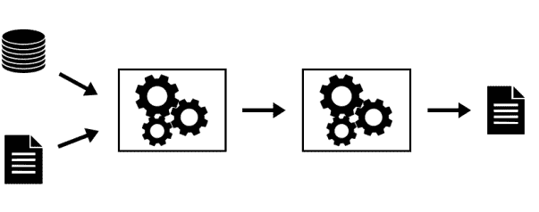

简单的数据管道易于管理。图片由作者提供。

你的数据管道工作得很好:它不断用数据填充下游的机器学习模型，模型将这些数据转化为准确的预测。然而，在云中作为服务部署的模型不太可行。为了使它更有用，您构建了一组仪表板，用于向业务涉众呈现模型的输出以及重要的 KPI，从而深化了您的管道。

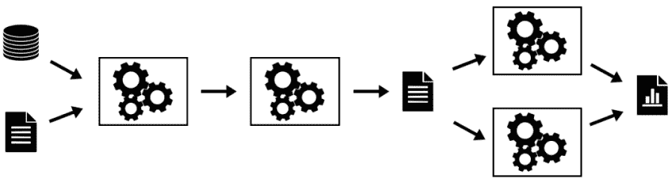

*现有管道可能会延长。图片由作者提供。*

一天，你在午餐时和研究团队的一位同事谈论你的项目。他们非常兴奋，并决定对他们的数据做一些类似的事情，使公司的数据管道更宽，跨团队边界。


管道越多，系统越复杂。图片由作者提供。

几周后，你们俩又聊了起来。当你们了解了研究团队的工作时，你们都注意到如果你们的两个团队使用彼此的数据为各自的模型和分析提供支持，这将是多么有用和有价值。在实现这个想法时，公司的数据管道是这样的。

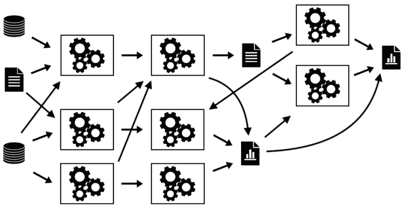

如果存在多条管道，它们将不可避免地融合在一起。图片由作者提供。

上面的图片应该已经敲响了警钟——它们显示的是管道债务的积累。

管道债务是数据管道中的技术债务**。**当您的数据管道是三 U 的时候，它就出现了:未记录的、未测试的和不稳定的。

它有多种口味，但都有一些共同的特点。这个系统是纠缠不清的，这意味着一个地方的变化可能会破坏其他地方的不同进程。这使得代码重构和调试异常困难。

> 管道债务是数据管道中的技术债务**。当你的数据管道是三 U 的时候，它就出现了:未记录的、未测试的和不稳定的。**

对于软件工程师来说，这听起来像是一个已经解决的问题，这个解决方案叫做自动化测试。然而，测试软件在两个主要方面与测试数据非常不同:

*   首先，虽然您可以完全控制您的代码，并可以在它不起作用时更改它，但您不能总是更改您的数据；在许多情况下，你仅仅是一个观察者，看着一些真实世界的过程产生的数据。
*   第二，软件代码总是有对有错:要么它做了它被设计去做的事情，要么它没有。数据从来没有对错。它只能适合或不适合某个特定的目的。这就是为什么当涉及到数据时，自动化测试需要一种特殊的方法。


# 自动化测试:拯救的期望

为数据管道量身定制的自动化测试是 Great Expectations 的前提，Great Expectations 是一个广泛使用的用于数据验证的开源 Python 包。


永远要知道从你的数据中能得到什么。

由超导公司开发并于 2018 年首次发布的《远大前程》的口号是“永远知道从你的数据中可以期待什么”，这正是它所提供的。

该包是围绕*期望的概念构建的。期望可以被认为是对数据的单元测试。它是一个声明性语句，描述数据集的属性，并以简单、人类可读的语言进行描述。*

例如，要断言某个表中“num_complaints”列的值介于 1 和 5 之间，您可以编写:

```
expect_column_values_to_be_between(
    column="num_complaints",
    min_value=1,
    max_value=5,
)
```

该语句将验证您的数据，并返回成功或失败的结果。

> 期望可以被认为是对数据的单元测试。

正如我们已经提到的，你并不总是控制你的数据，而是被动地观察它的流动。通常情况下，一个非典型的值会不时地出现在您的数据中，但不一定是令人苦恼的原因。伟大的期望通过“mostly”关键字来适应这一点，该关键字允许描述期望应该多久匹配一次。

```
expect_column_values_to_be_between(
    column="num_complaints",
    min_value=1,
    max_value=5,
    mostly=0.95,
)
```

如果至少 95%的“num_complaints”值在 1 到 5 之间，上述语句将返回成功。

为了更好地理解数据，有一些关于为什么我们期望从数据中得到某些属性的上下文是至关重要的。我们可以简单地添加它，方法是将“meta”参数传递给带有任何相关信息的期望。我们的同事甚至我们未来的自己都会为此感谢我们。

```
expect_column_values_to_be_between(
    column="num_complaints",
    min_value=1,
    max_value=5,
    mostly=0.95,
    meta={
        “created_by”: “Michal”,
        “craeted_on”: “28.03.2022”,
        “notes”: “number of client complaints; more than 5 is unusual and likely means something broke”,
    }
)
```

这些元数据注释也将形成数据文档的基础，这些数据文档是远大前程凭空产生的——稍后会有更多内容！

该包包含几十个现成可用的预期，它们都有冗长的、人类可读的名称，如“expect _ column _ distinct _ values _ to _ be _ in _ set”、“expect _ column _ sum _ to _ be _ between”或“expect _ column _ KL _ divergence _ to _ be _ less _ than”。这种语法允许人们清楚地陈述对数据的期望以及原因。

有些期望适用于列值，有些则适用于它们的集合函数或整个密度分布。当然，该软件包还可以轻松地为何时需要定制的解决方案创建定制的期望。

《远大前程》有很多不同的后台。您可以在 Pandas 数据框架上本地评估您的期望，就像在 SQL 数据库(通过 SQLAlchemy)或 Apache Spark 集群上一样容易。

那么，这些预期如何有助于减少管道债务呢？这个问题的答案是多方面的。

*   首先，制定预期的过程迫使我们坐下来思考我们的数据:它的性质，来源，以及它可能出错的地方。这有助于加深理解，并改善团队内部与数据相关的沟通。
*   第二，通过清楚地陈述我们对数据的期望，我们可以在早期检测到任何异常情况，比如系统中断。
*   第三，通过对照一组预先存在的预期来验证新数据，我们可以确保我们不会给我们的机器学习模型输入垃圾。
*   接下来，定义了期望之后，我们就非常接近拥有维护良好的数据文档了。这个清单还在继续。

我们将很快讨论了解一个人的期望的所有上述好处，但首先，让我们设置 GE 包！


# 满怀期望地开始

在本文的剩余部分，我们将介绍 GE 最有用的特性，以及这个包的几个巧妙的用例。为了保持实用性，这些例子使用了真实的数据集，所以在我们深入研究 Great Expectations 功能之前，让我们花一点时间来讨论问题设置和数据集，以及如何在您的机器上安装和设置 GE。

## 问题设置

我们将查看芝加哥市的出租车出行数据集。这些数据包含向市政当局报告的每次出租车行程的信息，例如行程的开始和结束时间、出租车 ID、行程的距离、费用、上下车地点等等。原始数据非常庞大(从 2013 年到现在每月更新一次)，因此为了演示的目的，我们将它限制在两天内:2022 年 2 月 27 日和 2 月 28 日。这相当于 13，000 多次旅行。

我们将把 2 月 27 日的数据视为我们公司的现有数据，我们将自动对其进行分析，以制作预期套件。然后，我们会将 2 月 28 日的数据视为新的传入数据，我们将根据我们的预期对其进行验证，以确保那里没有任何古怪的事情发生，并且我们可以安全地将这些新数据添加到我们公司的数据库中，并利用它们来训练机器学习模型，例如。

## 树立远大的期望

让我们从安装包开始。远大前程需要 Python 3，可以用 pip 安装。

```
pip install great_expectations
```

上面的命令不仅安装了 Python 包本身，还安装了附带的 CLI(命令行界面),它提供了从终端可用的便利实用程序。我们现在将使用其中的一个命令 *init* 来建立远大前程项目。

```
great_expectations init
```

运行此命令后，您应该会在终端窗口中看到以下提示:

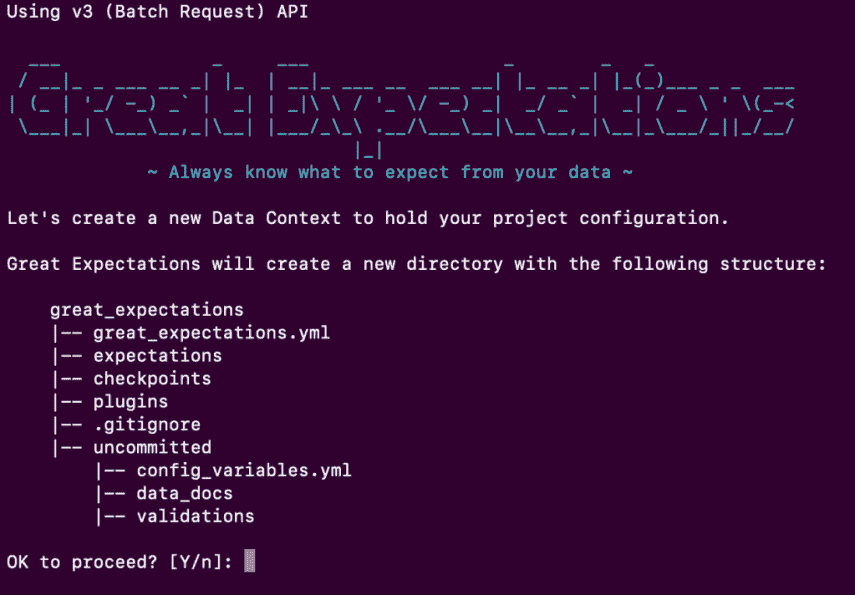

图片由作者提供。

键入 enter 继续，一个名为“great_expectations”的目录将出现在您的项目目录中，其中包含上面截图中显示的所有内容。

所有这些都被包的作者称为数据上下文。数据上下文包含了 Great Expectations 为您的项目提供服务所需的所有文件。它包含各种配置和元数据，并提供对数据源、期望和其他 GE 对象的访问。不需要太担心；现在，我们可以相信设置向导已经正确初始化了数据上下文，并继续连接一些数据。

## 连接数据

要将新的数据源连接到我们的数据上下文，我们只需在终端中运行以下命令。

```
great_expectations datasource new
```

这将生成三个提示。首先，系统会询问我们是想连接到文件系统还是数据库。由于我们在本地将出租车出行数据保存为 CSV 文件，因此我们选择前者。第二个问题是关于我们希望使用的处理引擎:pandas 还是 spark。我们喜欢熊猫。最后，我们需要输入数据文件的路径。


图片由作者提供。

提供所有必要的输入导致 Jupyter 笔记本被打开。名为“datasource_new”的笔记本提供了一些用于配置数据源的样板 Python 代码。默认设置很好，所以我们不需要改变任何东西，也许除了第二个代码单元中的数据源名称。我把我的旅行叫做“旅行”。

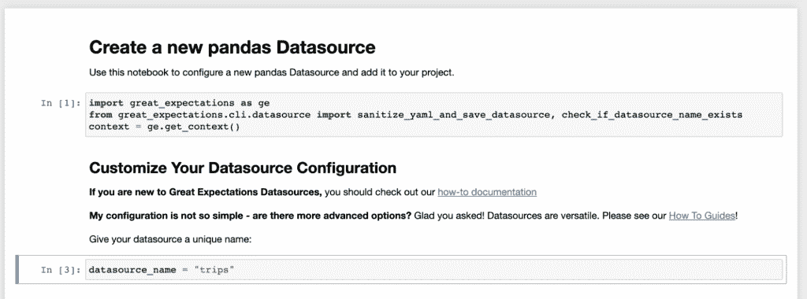

图片由作者提供。

更改名称后，我们需要运行所有的笔记本单元，这将有效地创建我们的数据源。最后一个单元格的打印输出应该确认我们的“trips”数据源存在。现在，随着数据源的创建，我们可以安全地关闭和删除笔记本了。

随着软件包的设置和数据的连接，我们可以深入了解远大前程的关键特性！


# 《远大前程》的主要特点

远大前程提供了三个非常有用的特性:

*   自动化数据分析，从手头的数据中创建期望套件。
*   数据文件的自动生成。
*   最后，对新数据进行验证，以防止新数据进入我们的数据库和机器学习模型。

让我们一个一个地看。

## 自动化数据分析

期望从何而来？您可以根据您对数据和任何相关领域知识的熟悉程度，逐个手动起草它们。然而，更常用的方法是让 GE 通过分析现有数据来自动创建它们。这是产生一套基本期望的快速方法，我们可以在以后扩展和建立这些期望。

自动分析器考虑数据的几个基本属性:列的类型、聚合统计信息(如最小值、最大值或平均值)、非重复值计数和缺失值的数量等等。

为了运行自动化概要分析，我们需要导航到终端中数据上下文所在的目录，并运行以下命令。

```
great_expectations suite new
```

系统会弹出提示，要求我们选择期望的创建方式。我们选择最后一个选项，自动分析器。

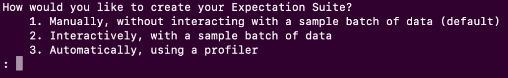

图片由作者提供。

通用电气然后询问要分析哪些数据。它在我们的数据上下文中检测到可用的 CSV 文件。如前所述，我们选择 2 月 27 日的数据进行分析。

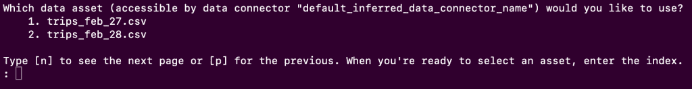

图片由作者提供。

接下来，我们又得到了两个提示。首先，我们需要键入期望套件的名称，然后确认到目前为止所做的所有选择。正如你可能已经猜到的，这将打开一个充满样板代码的 jupyter 笔记本，允许我们定制我们的期望。

在笔记本的第二个代码单元中，我们可以看到一个名为“ignored_columns”的变量，它被定义为数据中所有列的列表。这里我们需要做的是注释掉我们真正想要分析的列。让我们注释掉旅行时间、距离和费用。

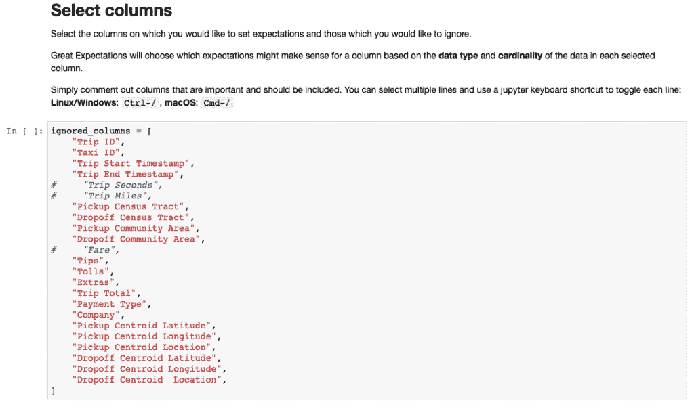

图片由作者提供。

然后，我们只需要运行整个笔记本来创建期望套件。我们的期望套件已经作为一个 JSON 文件保存在我们的数据上下文中的期望目录中。虽然我们可以浏览这个可读性很好的 JSON 文件，但是查看数据文档要方便得多，因为数据文档应该在我们运行笔记本时就已经在浏览器中打开了。这就给我们带来了《远大前程》的第二大特点。

## 数据文档

这个包自动将一个 expect suite 呈现到一个 HTML 页面中，这个页面可以作为数据文档:一个关于有什么数据以及数据应该是什么样子的真实来源。

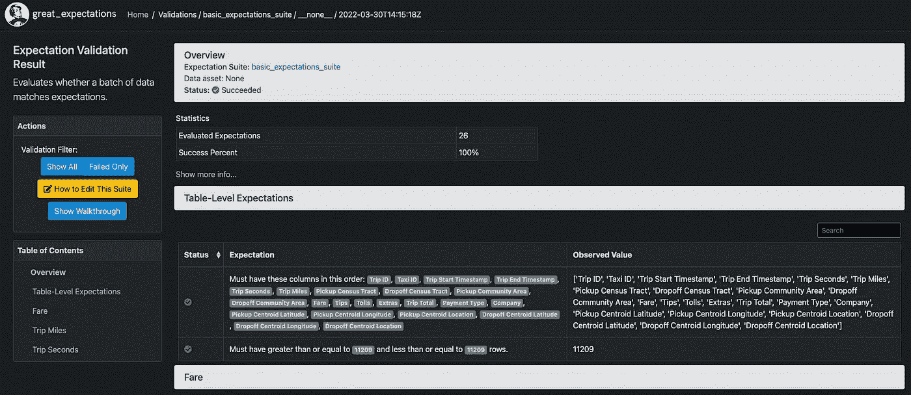

图片由作者提供。

数据文档以数据的汇总统计数据和基于它们创建的期望为特色。左侧 Action 面板中的黄色按钮指导我们编辑预期，以便我们可以修复可能错误生成的预期或添加全新的预期。随意点击，探索这个仙境！一旦你回来，我们将继续新数据的验证。

## 新数据的验证

为了防止管道债务累积，渴望进入你的数据库、分析和模型的每一部分新数据都应该得到验证。这意味着我们希望确保新数据满足我们基于现有数据和/或领域知识产生的所有期望。为了用 GE 做到这一点，我们需要建立一个用软件包的行话来说叫做检查点的东西。

一个检查点针对一批数据运行一个期望套件。我们可以通过将“checkpoint new”关键字传递给 great_expectations，后跟所选的检查点名称来实例化它。在这里，我将我的命名为“2 月 28 日检查点”。

```
great_expectations checkpoint new feb_28_checkpoint
```

这将打开另一个配置笔记本。对我们来说唯一重要的单元格是定义“yaml_config”变量的第二个代码单元格。在那里，我们可以选择应该验证哪个数据集(“data_asset_name”)以及应该评估哪个期望套件(“expectation_suite_name”)。这一次，我们可以保留所有缺省值——GE 已经推断出，因为我们只有两个数据文件，其中一个用于概要分析，所以我们可能希望验证另一个。

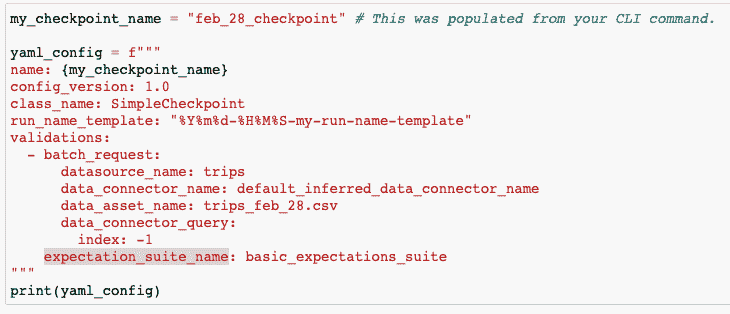

图片由作者提供。

为了运行我们的检查点，也就是评估我们对新数据的期望，我们只需要取消笔记本最后“运行您的检查点”部分的最后两行代码的注释，然后运行它。这将再次打开数据文档，这次向我们显示验证结果。

对于我们的出租车出行数据，许多期望都落空了。其中一些失败是可以预料到的:例如，基于 2 月 27 日的数据，我们已经创建了一个预期，表明中值票价应该大于或等于 21 英镑，而对于 2 月 28 日的数据，中值票价是 15 英镑。看到不同日子的中间价格不同并不奇怪。

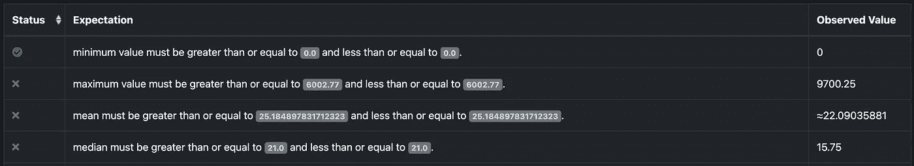

图片由作者提供。

这个例子强调了仔细分析和起草期望套件的重要性。自动化分析器生成的值应该被视为一个起点，而不是一个现成的套件。

## 手动处理期望值

在前面的章节中，我们借助 Jupyter 笔记本使用了 CLI。但是，可以手动创建和编辑预期。

如前所述，expectation suite 仅仅是一个 JSON 文件，包含我们在本文开头看到的格式的期望，例如:

```
{
      "expectation_type": "expect_column_values_to_not_be_null",
      "kwargs": {
        "column": "Trip Seconds",
        "mostly": 0.99
      },
      "meta": {}
    },
```

我们可以使用任何文本编辑器来修改这些期望或添加新的期望。这种与 GE 交互的方式非常方便，尤其是当您有一个大型的期望套件或其中的几个时。


# 远大期望的用例

在前面的章节中，我们已经经历了一个非常标准的建立数据验证过程的工作流程。让我们稍后再来看看:

*   我们使用一个自动化的数据分析器来创建一个基于现有数据的期望套件。
*   我们仔细分析预期，根据需要修正和添加更多内容(我们在本教程中并没有真的这样做，因为这是一个非常数据和领域特定的过程，但它是实践中至关重要的一步！).在这一步，我们可能会在数据中发现一些有趣或危险的属性。现在是澄清这些问题的时候了。
*   我们根据我们的期望套件运行每一批新的数据，只有当它通过验证时，才允许它进一步进入我们的数据管道。如果失败了，我们会试着去理解为什么以及是否是新的数据出现了偏差，或者可能是我们的预期没有适应某些极端情况。

现在我们知道了如何带着巨大的期望来验证数据，让我们来讨论几个具体的用例，在这些用例中，在 GE 上投入时间会得到很大的回报。

## 检测数据漂移

部署在生产中的机器学习模型的一个臭名昭著的危险是[数据漂移](/dont-let-your-model-s-quality-drift-away-53d2f7899c09)。数据漂移是指模型输入的分布发生变化的情况。发生这种情况有多种原因:数据收集设备容易损坏或需要更新软件，这会影响数据的记录方式。如果数据是由人类产生的，那么随着时尚和人口统计的快速发展，数据会更加不稳定。

[数据漂移构成了机器学习模型的严重问题](/dont-let-your-model-s-quality-drift-away-53d2f7899c09)。它可以使算法学习到的决策边界对于新状态数据无效，这对模型的性能有不利影响。

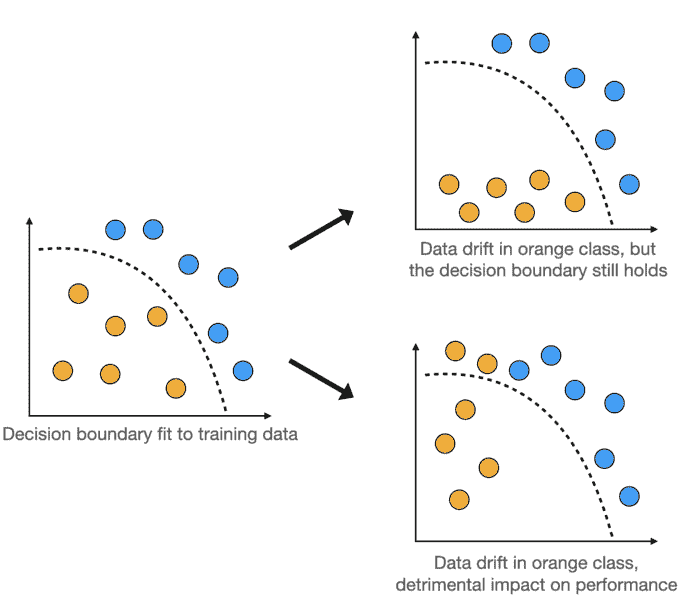

*数据漂移可能会影响模型的性能。图片由作者提供。*

输入数据验证。

在数据漂移可能令人担忧的情况下，只需对模型输入要素建立预期，以验证其长期趋势、平均值或历史范围和波动性。一旦世界发生变化，你的输入数据开始变得不一样，通用电气将会通过抛出一系列失败的测试来提醒你！

## 防止异常值扭曲模型输出

对部署在生产中的模型的另一个威胁，与数据漂移有点类似，是离群值。当一个模型得到一个不寻常的值作为输入，通常很高或很低，那么它的输出会发生什么？如果模型在训练期间没有看到这样的极值，诚实的回答应该是:我不知道预测应该是什么！

不幸的是，机器学习模型没有这么诚实。恰恰相反:模型可能会产生一些非常不可靠的输出，没有任何警告。

幸运的是，一个人可以很容易地通过适当的期望套件来防止它！只需根据模型在训练中看到的内容为模型的输入要素设置允许的范围，以确保您不会根据异常值进行预测。

## 防止管道故障蔓延

数据管道有时确实会失败。你可能错过了一个关键案例。或者您的服务器机房可能暂时断电了。不管是什么原因，一个期待新文件出现在某个地方的数据处理作业突然发现什么也没有。

如果这会导致代码失败，那也不一定是坏事。但通常不会:作业成功了，并高兴地向下游系统宣布您的网站在前一天的访问量为 0。这些数据点随后显示在 KPI 仪表盘上，甚至更糟的是，被输入到自动重新训练的模型中。如何防止这种情况发生？

当然是带着期望。简单地期望最近的数据——例如，带有足够新的时间戳——在那里。

## 检测有害的偏见

机器学习模型中的偏见是一个最近越来越受到关注和兴趣的话题。考虑到这些模型对人们生活的深远影响，这一点至关重要。公开的问题是如何检测和防止这些偏见做魅力。

虽然它们不能提供最终的答案，但远大的期望至少可以帮助我们发现危险的偏见。机器学习中的公平是一个庞大而复杂的话题，所以让我们专注于大图的两个小部分:进入模型的训练数据，以及它对不同测试输入产生的预测。

当涉及到训练数据时，我们希望它是公平和无偏见的，无论这在我们的特定情况下意味着什么。例如，如果数据是关于用户的，您可能希望以适当的比例包括来自不同地理位置的用户，以匹配他们的全球人口。在数据被允许用于训练之前，可以通过对照适当的期望套件验证每批训练数据来检查是否是这种情况。

至于模型的输出，例如，如果男女的其余特征相同，我们可能希望它对男女产生相同的预测。为了确保这一点，只需在一个保留测试集上测试模型，并根据一套预先设计好的预期运行结果。

## 改善团队沟通和数据理解

最后但同样重要的是，让我给你举一个非常有创意地使用远大前程的例子，这是我从软件包的作者之一詹姆斯·坎贝尔那里听到的，他在数据工程播客中接受了采访。

也就是说，您可以从创建一个空的期望套件开始，也就是:列出所有的列，但是不要对它们的值进行任何检查。然后，召集参与数据或业务流程的人员，询问他们:令人担忧的每月最大流失率是多少？网站粘性要降到多低才会触发警报？这样的对话可以改善团队之间与数据相关的交流，以及公司内部对数据本身的理解。


# 额外资源

要了解更多关于 Great Expectations 包的信息，包括如何使用 Apache Spark 或关系数据库，或者如何编写自定义期望，请查看该包的[官方文档](https://docs.greatexpectations.io/docs/)。写得真的很好，读起来也很愉快。你可能也喜欢听已经提到的[对 GE 作者之一](https://www.dataengineeringpodcast.com/great-expectations-technical-debt-data-pipeline-episode-117/)的采访，如果你正在寻找一个更短的资源，看看[超导公司产品负责人的这个演讲](https://databricks.com/session_na20/automated-testing-for-protecting-data-pipelines-from-undocumented-assumptions)，该公司背后是远大前程。最后，我希望你总是知道从你的数据中期待什么！


感谢阅读！

如果你喜欢这篇文章，为什么不在我的新文章上 [**订阅电子邮件更新**](https://michaloleszak.medium.com/subscribe) ？通过 [**成为媒介会员**](https://michaloleszak.medium.com/membership) ，你可以支持我的写作，并无限制地访问其他作者和我自己的所有故事。

需要咨询？你可以问我任何事情，也可以在这里 预定我 1:1 [**。**](http://hiretheauthor.com/michal)

你也可以试试我的其他文章。不能选择？从这些中选择一个:

[](/dont-let-your-model-s-quality-drift-away-53d2f7899c09)  [](/8-hazards-menacing-machine-learning-systems-in-production-5c470baa0163)  [](/8-tips-for-object-oriented-programming-in-python-3e98b767ae79) 