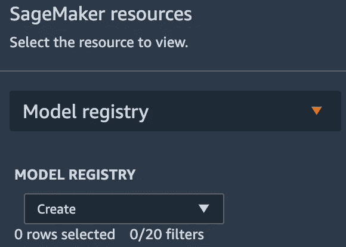
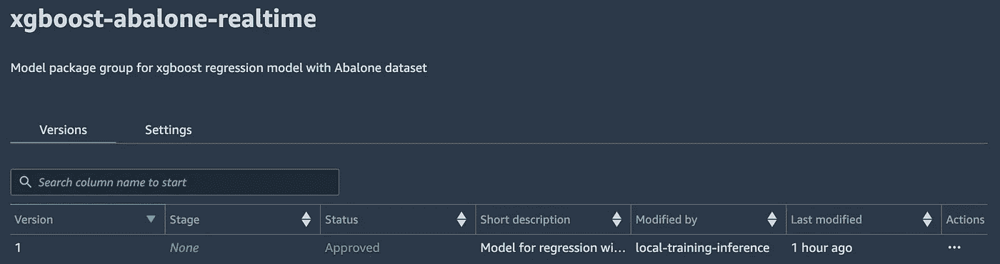
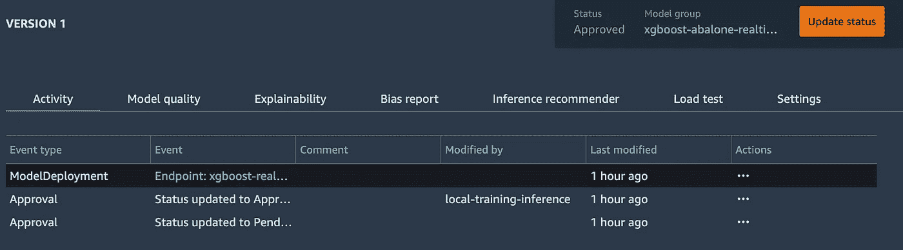
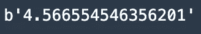

# 用 SageMaker 模型注册中心注册和部署模型

> 原文：<https://towardsdatascience.com/register-and-deploy-models-with-sagemaker-model-registry-5af42d678912>

## SageMaker 模型注册中心介绍

图片来自[杰瑞米·贝赞格](https://unsplash.com/@unarchive)拍摄的 [Unsplash](https://unsplash.com/photos/g_QfZECYmno)

在 ML 生命周期中管理模型的不同版本是很重要的。当您训练各种模型时，您将需要在各种注册表中对它们进行分类。 [SageMaker 模型注册中心](https://docs.aws.amazon.com/sagemaker/latest/dg/model-registry.html)帮助您管理不同的模型版本及其元数据。

使用 Model Registry，您可以创建包含模型不同版本的[模型包组](https://docs.aws.amazon.com/sagemaker/latest/dg/model-registry-model-group.html)。您可以为您可能处理的特定模型集创建各种模型包组。在本文中，我们将探索一个训练样本 [SageMaker XGBoost](https://docs.aws.amazon.com/sagemaker/latest/dg/xgboost.html) 回归模型的例子，然后为模型注册中心创建一个模型包组。使用这个设置，我们将演示如何直接从模型注册中心将模型部署到一个 [SageMaker 实时端点](https://docs.aws.amazon.com/sagemaker/latest/dg/realtime-endpoints.html)。

**注意**:对于刚接触 AWS 的人来说，如果你想继续学习，请确保在下面的 [**链接**](https://aws.amazon.com/console/) 中注册账户。**本文将假设一个新手对 AWS 和 SageMaker 有中级的了解。**

# 目录

1.  设置和模型培训
2.  模型注册和部署
3.  其他资源和结论

# 1.设置和模型培训

对于这个例子，我们将在 [SageMaker 工作室](https://aws.amazon.com/sagemaker/studio/)工作，这是 SageMaker 提供的 IDE。Studio 将是我们超越经典笔记本实例的选择，因为它为我们将要使用的工具提供 UI 支持，例如模型注册。要全面了解 SageMaker Studio 的设置，请遵循此[文档](https://docs.aws.amazon.com/sagemaker/latest/dg/onboard-quick-start.html)。

在 Studio 中，我们将使用一个基本的数据科学内核和一个简单的计算实例(ml.c5.large)作为我们的笔记本实例。启动笔记本后，我们将快速进行一些设置步骤。首先，我们有与 SageMaker 一起工作的 AWS SDK Python 客户端。利用这些，我们将协调从培训到模型注册再到部署的整个过程。

设置

我们现在可以检索公共的[回归鲍鱼数据集](https://archive.ics.uci.edu/ml/datasets/abalone)，并将其上传到我们的工作室环境。

访问鲍鱼数据集

现在我们已经设置好了，我们将继续进行模型训练。对于这篇文章，我们不会关注训练的深度，但如果你想要一篇关于在 SageMaker 上训练 XGBoost 算法的文章，请查看我的另一篇文章[这里](https://aws.plainenglish.io/end-to-end-example-of-sagemaker-xgboost-eb9eae8a5207)。

我们可以用鲍鱼数据集设置我们的训练输入，并为我们正在检索的 SageMaker XGBoost 算法配置我们的[超参数](https://docs.aws.amazon.com/sagemaker/latest/dg/xgboost_hyperparameters.html)。

培训设置

这里的关键部分是我们检索到的**图像**。这个图像将在我们的模型注册中使用，以正确地对我们训练过的模型进行分类。带有我们的**模型数据**和图像的元数据对于稍后的端点创建至关重要。使用它，我们现在可以训练 XGBoost 估计器，并从训练作业中检索模型数据。

从培训作业中检索模型数据

# 2.模型注册和部署

我们使用模型注册中心的第一步是创建一个模型组。这个模型组包含一组版本化的模型，我们将为我们的案例处理这些模型。我们可以使用之前用 SageMaker 定义的 boto3 客户机创建一个模型组。

模型组创建

在这个模型组中，我们还没有定义任何特定于我们模型的信息。这是我们传入正在处理的 XGBoost 图像和模型数据的地方。这有助于为部署提供必要的元数据。

将图像和模型数据传递给模型组

在这个调用中，我们还可以指定输入数据的类型(CSV、JSON ),以便我们的端点知道在创建时会发生什么。我们可以通过[list _ Model _ packages](https://boto3.amazonaws.com/v1/documentation/api/latest/reference/services/sagemaker.html#SageMaker.Client.list_model_packages)API 调用看到这个模型组的资源 arn 和版本。

ARN 车型套装

使用[describe _ model _ package](https://boto3.amazonaws.com/v1/documentation/api/latest/reference/services/sagemaker.html#SageMaker.Client.describe_model_package)API 调用，我们可以看到我们指定的所有细节。

模型包详细信息

现在，我们可以使用检索到的 model_package arn 来批准这个模型。我们可以通过更新模型包状态来做到这一点。

批准模型包

令人惊叹的是，您现在还应该能够在 Studio 的 Model Registry 选项卡中看到这个模型包。如果您在 Studio 的左侧面板中选择了最底部的图标，您应该能够选择 Model Registry 来查看您的模型包组。

模型注册用户界面(作者截图)

如果我们仔细观察，可以看到我们的特定组和我们刚刚批准的版本。

已批准的包(作者截图)

通过批准模型包，我们现在已经准备好创建端点了。这通过一系列三个步骤来实现: [SageMaker 模型](https://sagemaker.readthedocs.io/en/stable/api/inference/model.html)创建、[端点配置](https://docs.aws.amazon.com/sagemaker/latest/APIReference/API_CreateEndpointConfig.html)创建和[端点](https://docs.aws.amazon.com/sagemaker/latest/APIReference/API_CreateEndpoint.html)创建。我们可以通过类似地使用 boto3 客户端来完成所有这些步骤。

我们首先创建一个 SageMaker 模型实体，在这里我们可以传递我们的 model_package arn，而不必指定任何关于模型数据或所用图像的细节。

SageMaker 模型创建

使用这个 SageMaker 模型，我们可以创建一个端点配置，它包含关于实例类型和端点后面的计数的细节。

端点配置创建

使用这个端点配置，我们可以将它输入到我们的端点中，并监控它的创建，直到它成功投入使用。

端点创建

我们还可以看到这个端点在我们的 Model Registry UI 中成功创建。

从模型包成功创建端点(作者截图)

一旦创建了您的端点，我们就可以用一个示例负载来调用它，并查看调用。

祈祷

结果(作者截图)

# 3.其他资源和结论

## 额外资源

  

关于示例的完整代码，请查看上面的资源库。我在下面附上了额外的例子和资源。

*   [管道+注册表示例](https://github.com/aws/amazon-sagemaker-examples/blob/main/sagemaker-pipelines/tabular/train-register-deploy-pipeline-model/train%20register%20and%20deploy%20a%20pipeline%20model.ipynb)
*   [模式注册公告](https://aws.amazon.com/about-aws/whats-new/2021/12/sagemaker-model-registry-endpoint-visibility-custom-metadata-model-metrics/)

## 结论

SageMaker Model Registry 是一个极其可扩展和强大的工具。对于这个用例，我们只经历了一次训练迭代和一个模型。但是，当你有一个模型，你可能是针对多个数据集进行训练，它的真正威力会多次显现出来。使用 boto3 客户端与 Model Registry 进行交互，可以非常容易地对不同的模型集合进行分组和编目。

我希望这篇文章是关于模型注册中心、SageMaker 和 MLOps 的好入门。在以后的文章中，我们将探讨如何使用 SageMaker 管道将 SageMaker 模型注册中心整合到整个 MLOps 生命周期中。

*如果你喜欢这篇文章，请在*[*LinkedIn*](https://www.linkedin.com/in/ram-vegiraju-81272b162/)*上联系我，订阅我的媒体* [*简讯*](https://ram-vegiraju.medium.com/subscribe) *。如果你是新手，使用我的* [*会员推荐*](https://ram-vegiraju.medium.com/membership) *报名。*