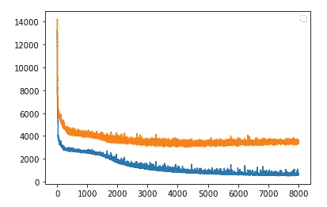

# TensorFlow 中使用顺序 API 和函数 API 的回归

> 原文：<https://towardsdatascience.com/regression-in-tensorflow-using-both-sequential-and-function-apis-314e74b537ca>


玛利亚·诺沃塞列茨卡娅在 [Unsplash](https://unsplash.com?utm_source=medium&utm_medium=referral) 上的照片

## 演示几种不同类型的模型结构

Tensorflow 可以说是深度学习和神经网络领域中最受欢迎的包。我以前写过一些不同的教程，关于规则密集神经网络、CNN 结构和 RNNs。但是我在 Tensorflow 上的所有教程都是关于分类问题的。有时是图像分类，有时是自然语言分类。

> 在本文中，我想解决一个回归问题，并演示一些顺序 API 和函数 API 的模型。

我已经清理了所有的数据。因为这篇文章将完全集中于回归问题中的张量流。因此，我不想在这里展示数据清理操作。

可从以下链接下载干净并可用于模型数据集中的产品:

<https://github.com/rashida048/Tensorflow/blob/main/auto_price.csv>  

[原始数据集](https://archive.ics.uci.edu/ml/datasets/Automobile)取自 UCI 机器学习知识库。

> [这里说的是用户权限](https://archive.ics.uci.edu/ml/citation_policy.html)。

因此，我在这里导入数据集:

```
import pandas as pd
df = pd.read_csv("auto_price.csv")
```

我已经在清理中处理了一些空值。但是，如果有更多的空值，我会直接删除它们:

```
df = df.dropna()
```

在进入张量流模型之前，去掉所有的空值是很重要的，因为数据集中的空值会给你带来错误。

在该数据集中,“价格”列将被用作输出变量或标签。其余的特征将被用作训练特征。

```
X = df.drop(columns ="price")
y = df['price']
```

接下来，我将执行另一个常见任务。也就是分割数据集用于训练、验证和测试。

```
from sklearn.model_selection import train_test_split
from sklearn.preprocessing import StandardScalerX_train_full, X_test, y_train_full, y_test = train_test_split(X, y)
X_train, X_valid, y_train, y_valid = train_test_split(X_train_full, y_train_full)
```

与分类不同，回归问题不能用精度来评价。在这里，我将使用均方根误差作为评估指标。

```
import tensorflow as tf
from tensorflow.keras import Sequential
from tensorflow.keras.optimizers import Adam
from tensorflow.keras import backend as K
from tensorflow.keras.layers import Densedef rmse(y_true, y_pred):
    return K.sqrt(K.mean(K.square(y_pred - y_true)))
```

## 模型开发

在 TensorFlow 中，模型开发是有趣的部分。对于大多数现实世界的问题，您将为一个项目尝试多个 TensorFlow 模型。在我开始写作之前，我尝试了这个项目的八个模型。我在这里分享其中的一些。

我将从使用顺序 API 的常规 DNN 模型开始，然后展示一些使用函数 API 的模型。所以，你会看到不同之处。

我试过四款 DNN 车型，这款给我的效果最好:

```
model4= Sequential([
    tf.keras.layers.Input(shape = X_train.shape[1:]),
    Dense(300, activation='tanh'),
    Dense(300, activation='tanh'),
    Dense(300, activation='tanh'),
    Dense(300, activation='tanh'),
    Dense(300, activation='tanh'),
    Dense(300, activation='tanh'),
    Dense(1)
])
```

正如你所看到的，我们有六个隐藏的致密层，有 300 个神经元和' tanh '激活功能。请随意尝试一些其他的激活功能、不同的层数和不同数量的神经元。我将在本文中保持激活函数的一致性，并对模型进行比较。

因为这是一个回归问题，对于给定的输入，这里只有一个输出。所以，最后的输出层有一个神经元。**输入形状和特征的数量。**

让我们再次使用“rmse”作为损失、adam optimizer 和评估指标作为“rmse”来编译这个模型。

```
model4.compile(
    loss=rmse,
    optimizer=Adam(),
    metrics=[rmse]
)
```

最后运行模型 20000 个时期:

```
history4 = model4.fit(X_train, y_train, epochs=20000, validation_data=(X_valid, y_valid))
```

输出:

```
Epoch 1/20000
4/4 [==============================] - 0s 40ms/step - loss: 14714.9736 - rmse: 15355.5986 - val_loss: 17081.0312 - val_rmse: 15776.2559
Epoch 2/20000
4/4 [==============================] - 0s 9ms/step - loss: 14792.2432 - rmse: 15059.4141 - val_loss: 17076.2695 - val_rmse: 15771.4033
Epoch 3/20000
4/4 [==============================] - 0s 9ms/step - loss: 14842.5195 - rmse: 15015.9941 - val_loss: 17074.5098 - val_rmse: 15769.6104
...
...
Epoch 19997/20000
4/4 [==============================] - 0s 8ms/step - loss: 7850.9614 - rmse: 8218.5664 - val_loss: 9565.8027 - val_rmse: 8386.0020
Epoch 19998/20000
4/4 [==============================] - 0s 7ms/step - loss: 7826.3198 - rmse: 7867.3975 - val_loss: 9565.8008 - val_rmse: 8386.0020
Epoch 19999/20000
4/4 [==============================] - 0s 7ms/step - loss: 7857.6772 - rmse: 7917.7451 - val_loss: 9565.8135 - val_rmse: 8386.0088
Epoch 20000/20000
4/4 [==============================] - 0s 8ms/step - loss: 7846.6616 - rmse: 8078.2676 - val_loss: 9565.8145 - val_rmse: 8386.0088
```

正如上面的输出所示，训练损失和验证损失分别从 14714 和 17081 开始。在 20000 个时期之后，训练和验证损失是 7846 和 9565。

在训练中使用了训练和验证数据。看看它在完全看不见的数据上的表现会很好。我将测试数据以评估 TensorFlow 模型的性能:

```
model4.evaluate(X_test, y_test)
```

输出:

```
2/2 [==============================] - 0s 2ms/step - loss: 7129.9590 - rmse: 7222.2402
```

Out[209]:

```
[7129.958984375, 7222.240234375]
```

在测试中，数据丢失是 7129，rmse 是 7222。看起来损失和“rmse”比验证损失和“rmse”要小得多。还不错！

让我们尝试改进这些结果 TensorFlow 提供了功能 API 来开发更复杂的模型。

## 使用功能 API 开发 Tensorflow 模型

使用函数式 API 构建宽深度神经网络的一种方法。在这种方法中，部分或全部输入层通过隐藏层中的所有变换到达输出层(深度路径)。另外，输入层也可以直接到输出层(宽路径)。

下面是一个使用函数式 API 的模型。你看到模型后，我会向模型解释:

```
input = tf.keras.layers.Input(shape = X_train.shape[1:])
hidden1 = tf.keras.layers.Dense(300, activation='relu')(input)
hidden2 = tf.keras.layers.Dense(300, activation='relu')(hidden1)
concat = keras.layers.Concatenate()([input, hidden2])
output = keras.layers.Dense(1)(concat)
model51 = keras.models.Model(inputs=[input], outputs=[output])
```

区别非常明显。每一层都有一个名称。在输入层之后，一个隐藏层照常被创建。它被命名为 hidden1。一旦创建了 hidden1，它就作为一个传递输入层的函数。同样，hidden2 也被创建，它也将作为一个函数。hidden1 的输出传递给 hidden2。

这个模型只有两个隐藏层。下一层是 concatenate()层，它也将充当添加了 hidden2 层的输入层和输出层的函数。顾名思义，这一层连接了输入层和 hidden2 层的输出。最后，输出层被创建，和其他层一样，它也被用作一个函数。“concat”的输出被传递到输出层。**因此，在输出层，我们将 hidden1 和 hidden2 层的原始输入和转换输入连接在一起。**

在最后一行，创建了一个 Keras 模型，其中明确指定了输入和输出。

编译和训练过程与之前相同。这一次，训练只运行了 8000 个周期，而不是 20000 个周期。因为带函数 API 的 TensorFlow 模型应该收敛得更快。

```
model51.compile(
    loss=rmse,
    optimizer=Adam(),
    metrics=[rmse]
)history5 = model51.fit(X_train, y_train, epochs=8000, validation_data=(X_valid, y_valid))
```

输出:

```
Epoch 1/8000
4/4 [==============================] - 1s 64ms/step - loss: 13258.9883 - rmse: 13171.9844 - val_loss: 14222.4844 - val_rmse: 12949.8066
Epoch 2/8000
4/4 [==============================] - 0s 8ms/step - loss: 11380.7041 - rmse: 11492.8750 - val_loss: 12479.9932 - val_rmse: 11245.1924
Epoch 3/8000
4/4 [==============================] - 0s 10ms/step - loss: 9632.6230 - rmse: 10223.1465 - val_loss: 10826.7109 - val_rmse: 9650.0918...
...
Epoch 7998/8000
4/4 [==============================] - 0s 7ms/step - loss: 619.7231 - rmse: 626.7860 - val_loss: 3652.3462 - val_rmse: 2738.8286
Epoch 7999/8000
4/4 [==============================] - 0s 7ms/step - loss: 661.9867 - rmse: 680.8888 - val_loss: 3569.5647 - val_rmse: 2896.3765
Epoch 8000/8000
4/4 [==============================] - 0s 6ms/step - loss: 607.5422 - rmse: 579.1271 - val_loss: 3477.7332 - val_rmse: 2928.8345
```

经过 8000 个周期后，训练数据的“rmse”下降到 579，验证数据的“RMSE”下降到 2928。与 8078 和 8386 型号 4 相比，它要好得多。

训练和验证“rmse”值非常不同。很明显过度配合了。完全看不见的数据的“rmse”是多少？以下是测试数据的检查:

```
model51.evaluate(X_test, y_test)
```

输出:

```
[2501.0322265625, 2517.703125]
```

它给出的“rmse”为 2517，更接近验证“rmse”。

下图显示了训练损失和验证损失如何随时期变化:

```
plt.plot(history5.history['loss'])
plt.plot(history5.history['val_loss'])
plt.legend()
```



model51 的结构是功能 API 上的一个非常简单的模型。你可以设计比这复杂得多的网络。下一个模型是 model5，它有点复杂，只是为了演示如何使用它。

但是如果一个简单的模型可以完成这项工作，我就不喜欢复杂的模型。模型越简单越好。但如果有必要，我们可能需要在一些复杂的项目中使用更复杂的模型来获得更好的结果。所以，这里我有一个演示:

```
input = tf.keras.layers.Input(shape = X_train.shape[1:])
hidden1 = tf.keras.layers.Dense(300, activation='relu')(input)
hidden2 = tf.keras.layers.Dense(300, activation='relu')(hidden1)
hidden3 = tf.keras.layers.Dense(300, activation='relu')(hidden2)
hidden4 = keras.layers.Concatenate()([input, hidden3])
hidden5 = tf.keras.layers.Dense(300, activation='relu')(hidden4)
concat = keras.layers.Concatenate()([input, hidden5])
output = keras.layers.Dense(1)(concat)
model5 = keras.models.Model(inputs=[input], outputs=[output])
```

通常，第一层是输入层

第二层是 hidden1 层，输入层在此处传递。

hidden1 层的输出被传递到 hidden2 层。

hidden2 层的输出被传递到 hidden3 层。

然后，我们将输入层与 hidden3 层的输出连接起来，并将其命名为 hidden4。

然后，hidden4 层的输出被传递到 hidden5。

然后我们再一次把输入和隐藏的输出连接起来。

最后，有一个输出层和指定输入和输出的模型开发。

接下来的步骤与之前相同:

```
model5.compile(
    loss=rmse,
    optimizer=Adam(),
    metrics=[rmse]
)
history5 = model5.fit(X_train, y_train, epochs=8000, validation_data=(X_valid, y_valid))
```

输出:

```
Epoch 1/20000
4/4 [==============================] - 1s 50ms/step - loss: 13927.1045 - rmse: 13915.9434 - val_loss: 13678.9092 - val_rmse: 12434.3320
Epoch 2/20000
4/4 [==============================] - 0s 8ms/step - loss: 10047.6201 - rmse: 9563.8525 - val_loss: 9203.7637 - val_rmse: 8289.6582
Epoch 3/20000
4/4 [==============================] - 0s 7ms/step - loss: 8499.3525 - rmse: 8310.4893 - val_loss: 9033.5527 - val_rmse: 8297.1348
...
...
Epoch 19998/20000
4/4 [==============================] - 0s 9ms/step - loss: 287.1166 - rmse: 261.8001 - val_loss: 3024.3147 - val_rmse: 2331.6790
Epoch 19999/20000
4/4 [==============================] - 0s 9ms/step - loss: 227.0752 - rmse: 238.3496 - val_loss: 2957.6494 - val_rmse: 2263.0854
Epoch 20000/20000
4/4 [==============================] - 0s 9ms/step - loss: 187.4945 - rmse: 180.5027 - val_loss: 3016.0168 - val_rmse: 2355.3120
```

正如您可以看到的，训练数据和验证数据的“rmse”都在这个模型中得到了进一步改善。

这一次，训练和验证数据集的“rmse”值分别为 180 和 2355。显然，存在过度拟合。

用测试数据评估:

```
model5.evaluate(X_test, y_test)
```

输出:

```
[2499.998291015625, 2547.47216796875]
```

“rmse”是 2547，超过了看起来非常正常的验证“rmse”。但是“rmse”非常接近模型 51 的评估。所以，我们实际上不能说这个模型很好地改善了结果。

**复杂和更大的模型并不总是意味着更好的结果。**我们可以尝试不同的型号。以前在我身上发生过很多。我先试着做一个简单的模型，然后做了很多越来越复杂的模型。但最终还是回到了更简单的模型。

> 可以只变换一部分输入要素，而不是通过变换使用所有输入要素，并且可以将一部分输入要素直接添加到输出图层。

对于此模型，前 15 个特征保存为输入 1，后 18 个特征保存为输入 2。由于要素总数为 26，因此有些要素重叠。因此，一些特性将同时存在于输入 1 和输入 2 中。

模型如下:

```
input1 = tf.keras.layers.Input(shape = [15])
input2 = tf.keras.layers.Input(shape = [18])
hidden1 = tf.keras.layers.Dense(300, activation='relu')(input2)
hidden2 = tf.keras.layers.Dense(300, activation='relu')(hidden1)
hidden3 = tf.keras.layers.Dense(300, activation='relu')(hidden2)
hidden4 = keras.layers.Concatenate()([input2, hidden3])
hidden5 = tf.keras.layers.Dense(300, activation='relu')(hidden4)
concat = keras.layers.Concatenate()([input1, hidden5])
output = keras.layers.Dense(1)(concat)
model6 = keras.models.Model(inputs=[input1, input2], outputs=[output])
```

模型结构几乎与之前的模型一样。唯一的区别是，input2 通过隐藏层中的转换传递。Input1 与最后一个隐藏层(hidden5)连接在一起，就在输出之前。因此，input1 没有完成隐藏层中的所有转换。

所以，我们应该分离特征:

```
X_train1, X_train2 = X_train.iloc[:, :15], X_train.iloc[:, 7:]
X_valid1, X_valid2 = X_valid.iloc[:, :15], X_valid.iloc[:, 7:]
X_test1, X_test2 = X_test.iloc[:, :15], X_test.iloc[:, 7:]
```

现在让我们编译并使输入和输出数据适合模型。记住，这次我们必须将 input1 和 input2 都作为输入进行传递。

```
model6.compile(
    loss=rmse,
    optimizer=Adam(),
    metrics=[rmse]
)
history6 = model6.fit((X_train1, X_train2), y_train, epochs=20000, validation_data=((X_valid1, X_valid2), y_valid))
```

输出:

```
Epoch 1/20000
4/4 [==============================] - 1s 53ms/step - loss: 14018.6748 - rmse: 14139.8809 - val_loss: 13892.1895 - val_rmse: 12647.2930
Epoch 2/20000
4/4 [==============================] - 0s 6ms/step - loss: 10192.4922 - rmse: 9930.0068 - val_loss: 9372.5049 - val_rmse: 8391.0254
Epoch 3/20000
4/4 [==============================] - 0s 8ms/step - loss: 8807.8857 - rmse: 8779.3643 - val_loss: 9259.1514 - val_rmse: 8631.5068
...
...
Epoch 19998/20000
4/4 [==============================] - 0s 8ms/step - loss: 495.4005 - rmse: 509.9180 - val_loss: 3193.6880 - val_rmse: 3008.2153
Epoch 19999/20000
4/4 [==============================] - 0s 8ms/step - loss: 405.2184 - rmse: 446.1824 - val_loss: 3340.9062 - val_rmse: 3053.0967
Epoch 20000/20000
4/4 [==============================] - 0s 8ms/step - loss: 405.8342 - rmse: 387.4508 - val_loss: 3277.2720 - val_rmse: 3060.6477
```

最后，训练和验证数据的“rmse”值变成了 387 和 3080。

以下是评价:

```
model6.evaluate([X_test1, X_test2], y_test)
```

输出:

```
[2547.850830078125, 2735.259033203125]
```

评估的“rmse”也是 2735。看起来这种方法并没有更好。事实上，它比以前的型号做得更差。

## 结论

我想在 Tensorflow 中使用顺序 API 和函数 API 演示几种不同风格的回归模型，并在这个特定项目中对它们进行比较。但这些结果不能一概而论。不同的模型架构更适合不同的项目。我们需要为每个项目尝试不同的模式，看看哪种模式效果最好。所以，有很多不同的事情可以尝试。请随意尝试更多的模型，看看是否可以改善结果。

请随时在 [Twitter](https://twitter.com/rashida048) 、[脸书页面](https://www.facebook.com/Regenerative-149425692134498)上关注我，并查看我的 [YouTube 频道](https://www.youtube.com/channel/UCzJgOvsJJPCXWytXWuVSeXw)。

## 更多阅读

</simple-explanation-on-how-decision-tree-algorithm-makes-decisions-34f56be344e9>  </what-is-a-recurrent-neural-network-and-implementation-of-simplernn-gru-and-lstm-models-in-keras-f7247e97c405>  </developing-a-convolutional-neural-network-model-using-the-unlabeled-image-files-directly-from-the-124180b8f21f>  </chi-square-test-for-correlation-test-in-details-manual-and-python-implementation-472ae5c4b15f>  </understanding-regularization-in-plain-language-l1-and-l2-regularization-2991b9c54e9a>  <https://pub.towardsai.net/data-analysis-91a38207c92b> 