# Python 和 Pandas 中的正则表达式(Regex)示例

> 原文：<https://towardsdatascience.com/regular-expressions-regex-with-examples-in-python-and-pandas-461228335670>

## Python 中正则表达式的实用实践教程


图片由来自 Pixabay 的 Josefine 提供

在很长一段时间里，我在复制粘贴的 [stackoverflow](https://stackoverflow.com/) 代码中使用正则表达式，并且从不费心去理解它，只要它能工作。

然而，我很快意识到，要处理软件和数据相关的任务，如网页抓取、情感分析和字符串操作，regex 是一个必备的工具。

本文旨在通过一次一个地解决正则表达式字符和处理它们的 python 函数，同时提供清晰简单的例子，来揭开它们的神秘面纱。

**什么是正则表达式？**简单地说，它是一个组成模式的字符序列，用于查找、替换和提取文本数据。Regex 包含自己的语法和字符，在不同的编程语言中略有不同。

**模式** —这是一个正则表达式字符串，包含我们在长字符串中寻找的信息。它可以是一个单词，一系列正则表达式特殊符号，或者两者的组合。

**Match** —如果在字符串中找到了模式，我们称这个子串为匹配，并说模式已经匹配。一个操作中可以有多个匹配项。

**正则表达式的优势:**

*   正则表达式操作比手动字符串操作执行起来更快。
*   每种现代编程语言都包含一个用于处理正则表达式的 regex 引擎，同样的逻辑也适用于各种语言。
*   Regex 提供了一种快速编写处理复杂字符串操作的模式的方法，为您节省了时间。

## Python 中的正则表达式

Python 处理正则表达式的引擎在名为`[re](https://docs.python.org/3/library/re.html).`的内置库中。一旦将该库导入到代码中，就可以使用下面提到的任何一个强大的函数。

这些函数接受以下参数:

*   要搜索的*图案*，
*   要搜索的*文本*的字符串
*   一个可选的*标记了*参数，该参数改变了正则表达式引擎的行为。例如 *flags=re。这使得模式不区分大小写。此处涉及的其他旗帜有 *re。M* ， *re。S* 和 *re。L* 。*

使用 re 库，您可以:

*   检查字符串中是否存在模式。
*   返回模式出现的次数。
*   获取模式的位置。

**注意:** Regex 从左到右搜索文本。一旦匹配，字符串的这一部分就用完了，不能在同一操作中再次匹配。

**re.findall(pattern，text)** —该函数返回列表中所有匹配的字符串。下面的代码在文本中搜索‘The’并返回所有匹配字符串的列表。

```
text = 'There was fur**the**r decline of **the** UHC're.findall("the", text)
###Output
[’the’, 'the’]
```

regex 模式区分大小写，所以使用参数`flags=re.I`或`flags=re.IGNORECASE`来区分大小写。

```
re.findall("the", text, flags=re.I)
###Output
[’The’, 'the’, 'the’]
```

请注意' **The** re '和' fur **the** r '的部分也是如何匹配的，因为不管前面或后面是什么，它都会查找这个精确的字符序列。

**re.search(pattern，text)** —返回第一个*匹配项作为匹配对象。*

```
re.search("the", text)
###Output
<re.Match object; span=(13, 16), match='the'>
```

match 对象包含关于匹配字符串的信息，比如它的跨度(文本中的开始和结束位置)，以及匹配字符串本身。您可以通过调用它的*来进一步提取这些细节。group()，。span()，。start()，*和*。【T21 结束()】方法如下所示。*

```
match_obj = re.search("the", text)*#index span of matched string*
print(**match_obj.span()**)
### (13, 16)*#the matched string*
print(**match_obj.group()**)
### the*#start position of match*
print(**match_obj.start()**)
### 13*#end position of match*
print(**match_obj.end()**)
### 16
```

**re.match(pattern，text)** —检查模式文本的开头。如果在*开始*时出现，则返回匹配对象，否则不返回。在下面的代码中，“the”(区分大小写)没有出现在开头，因此没有输出。

```
re.match('the', text)
### No output
```

我们还可以使用 if-else 语句，不管模式是否存在，它都会打印一条定制消息。

```
text = 'The focus is on 2022'
is_match = re.match('the', 
                    text, 
                    re.I)
if is_match:
    print(f"'{is_match.group()}' 
          appears at {is_match.span()}")

else:
    print(is_match) #None###Output
'The' appears at (0, 3)
```

**re.finditer(pattern，text)** —这将返回一个匹配对象的迭代器，然后我们用一个列表包装这些对象以显示它们。

```
text = 'There was further decline of the UHC'match = re.finditer('the', text, 
                    flags=re.I)
list(match)###
[<re.Match object; span=(0, 3), match='The'>,
 <re.Match object; span=(13, 16), match='the'>,
 <re.Match object; span=(29, 32), match='the'>]
```

**re sub(pattern，repl，text)** —用`‘repl’`字符串替换匹配的子字符串。

```
text = 'my pin is 4444'
re.sub('4', '*', text)###Output
'my pin is ****'
```

**re.split(pattern，text)——**将匹配位置的文本分割成列表中的元素。

```
text = "wow! nice! love it! bye! "
re.split("!", text)###Output
['wow', ' nice', ' love it', ' bye', ' ']
```

## 正则表达式元字符

元字符是在正则表达式语言中具有特殊含义的符号，这就是正则表达式的威力所在。

在这一节中，我们将探索不同的元字符，并使用`re.findall()`来检查字符串中模式的存在，并返回所有匹配的子字符串。

**使用 r (python 原始字符串):**在一个模式前面加一个 r 会将该模式的所有字符转换成正常的文字，去掉任何特殊的含义，比如作为转义字符的反斜杠。regex 引擎现在可以搜索它的特殊字符，正如您将看到的，反斜杠非常突出。

**用反斜杠对正则表达式字符进行转义:**当你想在一个文本中精确地搜索下面的任何正则表达式符号时，你必须用反斜杠对它们进行转义(同时也使用 r raw 字符串)，这样它们也就失去了特殊的正则表达式含义。

1.  **。**(点字符或通配符)—匹配并返回字符串中的任何字符，除了新行。这可以是数字、空格、字母或标点符号。

```
pattern = r'.'
re.findall(pattern,
        "Wow! We're now_25")###Output
['W', 'o', 'w', '!', ' ', 'W', 'e', "'", 'r', 'e', ' ', 'n', 'o', 'w', '_', '2', '5']
```

2. **\w** (小写 w) —任何字母数字字符(字母、数字或下划线)。

```
pattern = r'\w'
re.findall(pattern,
        "Wow! We're now_25")###Output
['W', 'o', 'w', 'W', 'e', 'r', 'e', 'n', 'o', 'w', '_', '2', '5']
```

3. **\W** (大写 w) —任何非 W 的内容，如空格和特殊字符。

```
pattern = r'\W'
re.findall(pattern,
        "Wow! We're now_25")###Output
['!', ' ', "'", ' ']
```

4.**\ d**—0 到 9 之间的任意数字。

```
pattern = r'\d'
re.findall(pattern,
        "Wow! We're now_25")###Output
['2', '5']
```

5. **\D** —任何非数字。否定\d。

```
pattern = r'\D'
re.findall(pattern,
        "Wow! now_25")###Output
['W', 'o', 'w', '!', ' ', 'n', 'o', 'w', '_']
```

6. **\s** (小写 s) —一个空格。

```
pattern = r'\s'
re.findall(pattern,
        "Wow! We're now_25")###Output
[' ', ' ']
```

7. **\S** (大写 s) —求反\S。返回非空格的任何内容。

```
pattern = r'\S'
re.findall(pattern,
        "Wow! Now_25")###Output
['W', 'o', 'w', '!', 'N', 'o', 'w', '_', '2', '5']
```

**字符集**

8. **[]** 匹配方括号内的任意字符。例如，模式“[abc]”在文本中查找 a 或 b 或 c，也可以写成“a|b|c”。您也可以使用破折号在括号内定义一个范围，而不是写下每个字符。例如，[a-fA-F]匹配从 a 到 F 的任何小写或大写字母，下面的代码返回任何元音字母。

```
pattern = r'[aeiou]'
re.findall(pattern,
        "Wow! We're now_25")###Output
['o', 'e', 'e', 'o']
```

9.**【^】**在左方括号后有一个帽子^字符否定了字符集。它返回方括号内的相反字符或范围。下面的代码返回除字母 m 到 z 之外的所有内容。

```
*#Any char except letters m to z*
pattern = r'[^m-zM-Z]'
re.findall(pattern,
        "Wow! We're now_25")###Output
['!', ' ', 'e', "'", 'e', ' ', '_', '2', '5']
```

**重复正则表达式模式**

也称为量词，这些特殊字符写在模式或字符之后，告诉 regex 引擎匹配它的次数。

10.`**+**`(一次或多次)—如果前一模式出现一次或多次，则匹配。下面的代码匹配前面有`‘hell’`的字符`‘o’`。

```
*#match o in hello once or many times*
text = 'hell hello ago helloo hellooo'
pattern = r'hello+'
re.findall(pattern, text)###Output
['hello', 'helloo', 'hellooo']
```

11.`*****`(零个或更多)—如果前一模式出现零次或多次，则匹配。

```
*#match o in hello zero or many times*
text = '**hell hello** ago **helloo hellooo**'
pattern = r'hello*'
re.findall(pattern, text)['hell', 'hello', 'helloo', 'hellooo']
```

12.`**?**`(零次或一次)—如果前一模式出现零次或一次，则匹配。

```
*#match o in hello zero times or once*
text = '**hell hell**o ago **hello**o **hello**oo'
pattern = r'hello*'
re.findall(pattern, text)['hell', 'hello', 'hello', 'hello']
```

13.**{ n }**—定义匹配前一个字符或模式的确切次数。例如`‘d{3}’`匹配`‘ddd’`。

```
*#Extract years*
text = '7.6% in 2020 now 2022/23 budget'
pattern = r'\d{4}'
re.findall(pattern, text)['2020', '2022']
```

14.**{最小，最大}** —定义匹配先前模式的最小(min)和最大(max)时间。例如`'d{2,4}’`匹配`‘dd’`、`‘ddd’`和`‘dddd’`。

```
*#Dot followed by 2 to 5 word chars*
text = 'may@gmail.com cal@web.me ian@me.biz'
pattern = r'\.\w{2,5}'
re.findall(pattern, text)['.com', '.me', '.biz']
```

15. **{min，}** —匹配前一个元素至少`‘min’`次。

```
*#Long words*
text = 'universal healthcare is low'
pattern = r'\w{5,}'
re.findall(pattern, text)['universal', 'healthcare']
```

**贪婪量词—** 上述所有量词都被认为是贪婪的，因为它们试图在每个匹配中占据尽可能多的字符，只要满足模式，就会产生最长的匹配。例如，`re.findall(‘b+’, ‘bbbb’)`返回一个匹配`[‘bbbb’]`，这是最长的可能匹配，即使`[‘b’, ‘b’, ‘b’, ‘b’]`仍然是有效的匹配，但匹配较短。

**不贪(懒)——**可以通过加一个问号(？)在量词后面。这意味着 regex 引擎将在每次匹配时返回最少的*个字符。下图显示了量词在贪婪和非贪婪模式下的行为比较。*

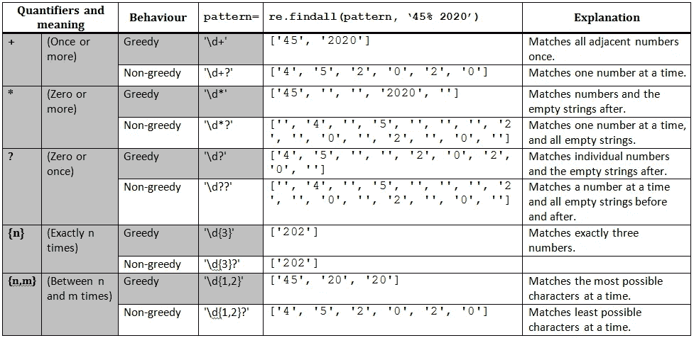

作者图片

**边界/锚点**

16. **^** —只匹配文本的开头，因此^被写成模式中的第一个字符。请注意，这不同于[^..]它否定了方括号中的模式。

```
*#Starts with two digits*
text = '500,000 units'
pattern = r'^\d\d'
re.findall(pattern, text)###Output
['50']
```

17. **$** —匹配字符串的结尾，因此写在模式的结尾。

```
*#Ends with two digits*
text = '500,000 units'
pattern = r'\d\d$'
re.findall(pattern, text)###Output
[]
```

18. **\b** (单词边界)—匹配单词前后的边界，或 a \w 和 a \W 之间的空字符串。

```
pattern = r'\b'
re.findall(pattern,
           "Wow! We're now_25")###Output
['', '', '', '', '', '', '', '']
```

要查看边界，使用`re.sub()`功能将`\b`替换为~符号。

```
pattern = r'\b'
re.sub(pattern, 
       '~',
       "Wow! We're now_25")###Output
"~Wow~! ~We~'~re~ ~now_25~"
```

**组**

19. **()** —当你写一个正则表达式模式时，你可以用括号定义组。这对于从字符串中提取和返回细节很有用。请注意，圆括号不会改变模式的结果，而是将它分组为可以单独检索的部分。

```
text = 'Yvonne worked for von'
pattern = r'(.o.)'
re.findall(pattern, text)###Output
['von', 'wor', 'for', 'von']
```

**使用** `**m.group()**` **访问匹配的组—** 在下面的代码中，我们将电子邮件的不同部分分成 3 组。`m.group()`和`m.group(0)`都返回整个匹配的字符串。`m.group(1)`、`m.group(2)`、`m.group(3)`分别返回不同的组。括号是访问匹配组的一种便捷方式。

```
text = 'this is @sue email sue@gmail.com'
pattern = r'(\w+)@(\w+)\.(\w+)\b'
m = re.search(pattern, text)#match object
print(m)
### <re.Match object; span=(19, 32), 
                match='sue@gmail.com'>#full match
m.group(0)
### 'sue@gmail.com'm.group(1)
### 'sue'm.group(2)
### 'gmail'm.group(3)
### 'com'
```

**使用** `**\group_num**`引用组—一个正则表达式模式可以包含几个组，如前面包含 3 个组的电子邮件示例所示。您可以在 regex 模式中使用\1、\2…从 1 开始按位置引用和匹配一个组。下面的代码查找字符重复出现的子字符串。

```
text = 'hello, we need 22 books'
pattern = r'(\w)\1'
list(re.finditer(pattern, text))###Output
[<re.Match obj; span=(2,4), match='ll'>,
 <re.Match obj; span=(11,13), match='ee'>,
 <re.Match obj; span=(15,17), match='22'>,
 <re.Match obj; span=(19,21), match='oo'>]
```

**分别使用** `**?P<name>**` **和** `**?P=name**` **命名和访问捕获的组** —您可以为组指定一个名称，以便以后访问。当您有许多组时，这比`\grp_number`符号要好，并且它增加了您的正则表达式的可读性。要访问匹配的组，请使用`m.group(‘name’)`。

```
text = '08 Dec'
pattern = '(?P<day>\d{2})\s(?P<month>\w{3})'
m = re.search(pattern, text)
m.group('day')###
'08'
```

**非捕获组**

20.**？:** —匹配但不捕获组。将`?:`包含在您希望忽略的组中。下面的代码匹配带有百分号的数字，并且只返回数字。

```
text = 'date 23 total 42% date 17 total 35%'
pattern = r'(\d+)(?:%)'
re.findall(pattern, text)###
['42', '35']
```

21. **|** (or) —这将返回一种或另一种模式的所有匹配。

```
text = 'the **sun**ny **sun** **shine**s'
re.findall(r'sun|shine', text)###Output
['sun', 'sun', 'shine']
```

## 熊猫和正则表达式

Pandas 是一个强大的 Python 库，用于分析和操作数据集。在 Pandas 中搜索和清理基于文本的列时，正则表达式非常方便。

Pandas 包含几个支持正则表达式模式匹配的函数，就像我们看到的`re`库一样。下面是我们将在本教程中使用的三个主要函数。点击阅读其他熊猫正则表达式函数[。](https://kanoki.org/2019/11/12/how-to-use-regex-in-pandas/)

*   **Series . str . contains(pattern)**—此函数检查列(Series)中的模式，在模式匹配的地方返回 True 和 False 值(掩码)。然后可以将掩码应用于整个数据帧，以便只返回真行。
*   **Series.str.extract(pattern，expand，flags)** —要使用此函数，我们必须在模式中使用括号定义组。该函数提取匹配项，并将组作为数据帧中的列返回。当模式中只有一个组时，使用`expand=False`返回一个系列，而不是 dataframe 对象。
*   **Series.str.replace(pattern，repl，flag)** —与`re.sub()`类似，该函数用 repl 字符串替换匹配项。

在本节中，我们将处理七个正则表达式任务来执行以下操作；

*   筛选数据以返回符合特定条件的行。
*   从列中提取子字符串和其他详细信息。
*   替换列中的值。

为了说明这一点，我使用了 Kaggle 提供的 titanic 数据集，这里是 GNU 自由文档许可证下的。在新的 Jupyter 笔记本上，导入熊猫并加载数据。

```
import pandas as pd
df = pd.read_csv('titanic.csv')
```

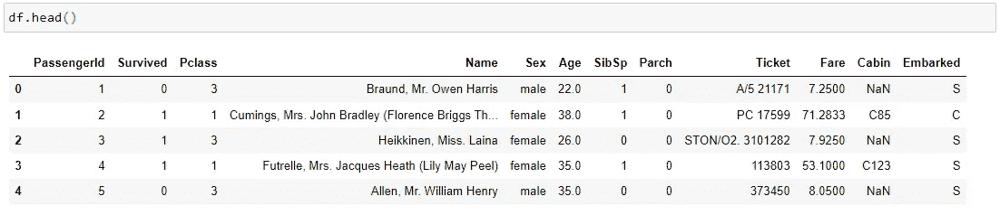

按作者分类的数据集

**过滤数据帧—** `**s.str.contains(pattern)**`

**任务 1:** 过滤数据帧，返回票号为 C 和 a 的行

下面是所有必须匹配的“C A”票变体的列表。

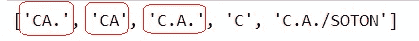

作者图片

regex 模式以大写字母 C 开头，后面跟一个可选的点，然后是大写字母 A，后面跟一个可选的点。我们对点符号进行了转义，以精确匹配句点，而不是通配符正则表达式字符。

```
pattern = r'C\.?A\.?'
mask = df['Ticket'].str.contains(pattern)
df[mask].head(10)
```

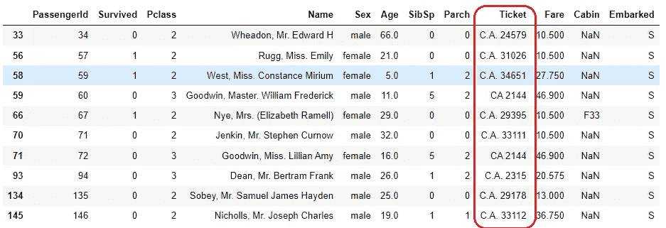

作者图片

要获得 CA 的总行数，使用`mask.sum()`，它将所有显示为 1 的`True`值和显示为 0 的`False`值相加。

```
mask.sum()
### 42
```

**提取数据—** `**s.str.extract(patt)**`

任务 2: 从乘客姓名中提取所有唯一的头衔，如先生、小姐和夫人。

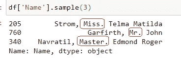

作者图片

Regex 模式:这将搜索一个空格，后跟一系列字母(括在括号中)，然后是一个点字符。我们使用括号将想要捕获和返回的子串分组。`expand=False`返回一个系列对象，使我们能够在其上调用`value_counts()`。

```
pattern = '\s(\w+)\.'
all_ts = df['Name'].str.extract(
                    pattern, 
                    expand=False)
unique_ts = all_ts.value_counts()
```

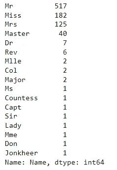

作者图片

**Task 3a:** 从“Name”列中提取职位、名字和姓氏，并在新的 dataframe 中将它们作为列返回。

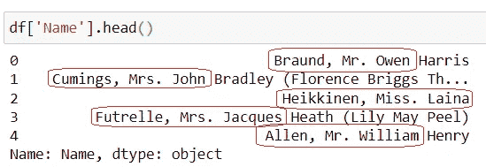

作者图片

正则表达式模式；每个名字包含“一个或多个单词字符序列”(姓氏)，然后是逗号、空格、另一个字符序列(头衔)、句号、空格、另一个字符序列(名字)，然后是零到许多其他字符。

```
pattern = r'(\w+), (\w+\.) (\w+).*'
df_names = df['Name'].str.extract(
                            pattern, 
                            flags=re.I)
df_names
```

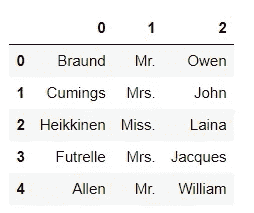

作者图片

**任务 3b:** 用名为的*和*的有序*列清理上面的数据帧。*

如前所述，**命名组**对于捕获和访问组非常有用。对于 Pandas，这尤其方便，因为这些名称现在将成为我们新数据框架中的列名。

下面的正则表达式与上面的相同，除了使用`(?P<name>).`命名组。代码提取三个命名的列，然后我们使用`df.reindex()`对它们重新排序。

```
pattern = r'(?P<lastname>\w+),\s
                (?P<title>\w+\.)\s
                (?P<firstname>\w+).*'
df_named = df['Name'].str.extract(
                            pattern,  
                            flags=re.I)
df_clean = df_named.reindex(
                        columns = 
                            ['title', 
                             'firstname',
                             'lastname'])
df_clean.head()
```

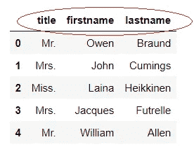

作者图片

**替换列中的值—** `**s.str.replace(pattern, repl)**`

**任务 4a:** 用大写字母替换所有标题。

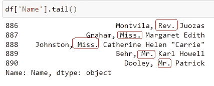

作者图片

regex 模式搜索空格，然后是一个或多个单词字符(用括号括起来)，最后是一个句点。然后，我们将捕获的组替换为大写的组。

```
pattern = r’\s(\w+)\. '
df[’Name’].str.replace(pattern, 
            lambda m:m.group().upper())
```

上面的 [lambda 函数](/lambda-functions-with-practical-examples-in-python-45934f3653a8)的意思是，对于每一行，取抓取的组，转换成大写。

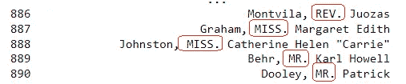

作者图片

任务 4b: 仅大写`Mr.`和`Mrs.`标题。在这种情况下，我们在括号内使用|。

```
pattern = r'\s(Mr|Mrs)\.\s'
df['Name'].str.replace(pattern, 
            lambda m:m.group().upper(),
                      flags=re.I)
```

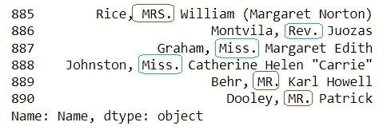

作者图片

**任务 5:** 通过插入破折号来显示日、月和年，从而清除下面一列中的日期。我们要保存列中的其他字，因此不能直接调用`[pd.to_datetime()](https://www.w3resource.com/pandas/to_datetime.php)`。

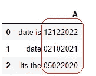

作者图片

模式:搜索两位数，然后再次搜索两位数，然后搜索四位数，并用括号将它们分成三组。 [lambda](/lambda-functions-with-practical-examples-in-python-45934f3653a8) 功能意味着对于每场比赛，在第一组和第二组之后用破折号连接各组。

```
pattern = r'(\d{2})(\d{2})(\d{4})'
d['A'].str.replace(pattern,
        lambda m: m.group(1)+'-'+
                   m.group(2)+'-'+
                   m.group(3))
```

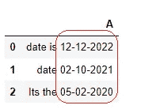

作者图片

## 结论

在本文中，我们学习了正则表达式，并使用 Python re 库和 Pandas 字符串函数来探索不同的特殊正则表达式元字符。

我们还了解到，在每个模式前面加上一个 r raw 字符串以消除任何特殊的字符串含义，以及在字符串中精确匹配特殊的正则表达式字符时用反斜杠对它们进行转义是很重要的。你可以在 GitHub 上找到所有的代码[。](https://github.com/suemnjeri/medium-articles/blob/main/Regex/Regex%20in%20python.ipynb)

请记住，大多数正则表达式都是特定情况下特有的，所以只需尝试每种可能的情况，以避免错误匹配和遗漏。大多数时候，有许多方法可以编写正则表达式，所以选择最简单和最明智的。你可以使用 regex101.com[等网站进行测试，直到满意为止。](https://regex101.com/)

我希望你喜欢这篇文章。每当我发表文章时，想收到更多这样的消息，请在这里订阅。如果你还不是一个媒体成员，并且愿意支持我成为一名作家，请点击[这个链接](https://medium.com/@suemnjeri/membership)，我将获得一小笔佣金。感谢您的阅读！

## 进一步阅读

*   [正则表达式—学习正则表达式](https://regexone.com/)
*   [Finxter 的 Python 正则表达式超级能力【完整教程】](https://blog.finxter.com/python-regex/)
*   [通过部分字符串或模式过滤熊猫数据帧](/8-ways-to-filter-a-pandas-dataframe-by-a-partial-string-or-pattern-49f43279c50f)