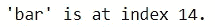
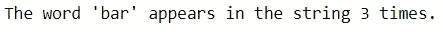
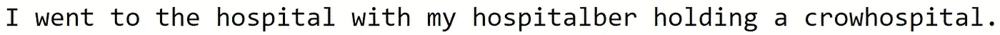
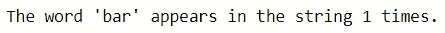
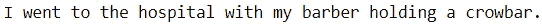
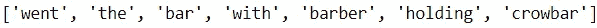
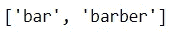
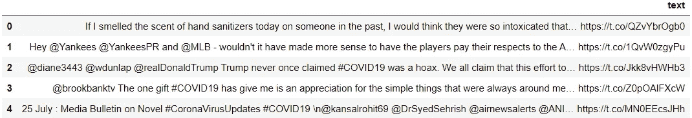
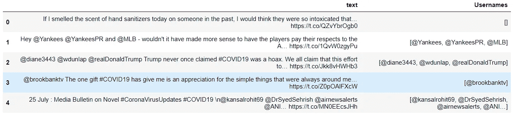
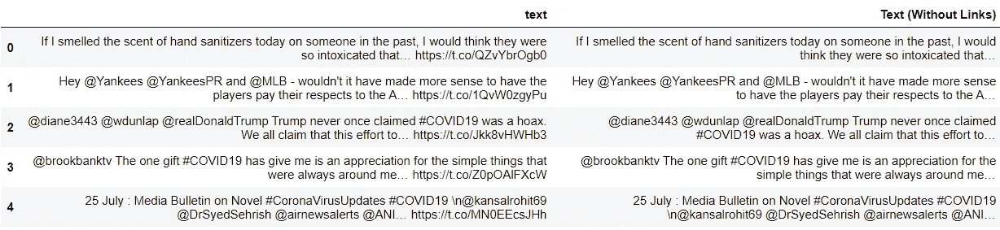

# 正则表达式:文本分析的瑞士刀

> 原文：<https://towardsdatascience.com/regular-expressions-the-swiss-knife-for-text-analysis-76a34ac71c97>

## 检查促进高级字符串操作的最佳方法


在 [Unsplash](https://unsplash.com?utm_source=medium&utm_medium=referral) 上由 [Patrick](https://unsplash.com/@pf91_photography?utm_source=medium&utm_medium=referral) 拍摄的照片

从数据科学开始，我养成了依赖 Python 内置函数进行字符串操作的习惯，这是可以理解的。

这些功能易于理解和实现。

不幸的是，当执行需要更复杂的文本处理的 NLP 任务时，这些方法变得不够用了。

结果，我发现自己很不情愿地熟悉了正则表达式和 Python 的 RE 模块。这是一项艰巨的任务，因为学习正则表达式几乎类似于学习一门新语言。

然而，一旦我掌握了 RE 的基础知识，我就再也没有回头。现在，RE 是我处理大部分文本相关任务的首选工具。

对于那些不愿意学习正则表达式的人(像我一样)，我将解释它优于使用 Python 的基本字符串方法的原因，然后探索它的应用。

## 正则表达式

利用正则表达式需要使用特殊的字符串来定义特定任务的搜索模式。

这些图案由通常被称为*元字符*的特殊字符组成。

有了元字符，用户可以用很少的代码和最少的努力完成复杂的处理过程。

虽然这听起来不错，但正则表达式确实有一个缺点。使用这种方法可能需要大量特殊字符的知识。

看看这个[备忘单](https://www.debuggex.com/cheatsheet/regex/python)，看看要定义搜索模式需要知道多少元字符。

虽然这些元角色很容易单独理解，但将它们组合在一起可能会是一个更加艰苦的过程。

例如，以下表达式可用于匹配帐户密码:

```
^(?=.*[a-z])(?=.*[A-Z])(?=.*\d).{10,}$
```

如果您熟悉所使用的特殊字符，您应该能够判断出该表达式匹配的字符串长度为 10 个或更多个字符，并且至少有 1 个小写字母、大写字母和数字。

然而，对于没有受过训练的人来说，这种表达可能看起来像是敲击键盘时产生的简单的胡言乱语。

鉴于新手很难理解搜索模式，Python 的内置字符串方法相比之下更有吸引力(你可以在这里查看方法列表)。

那么，当我们可以坚持使用这些更容易理解的方法时，为什么还要去学习正则表达式呢？

## 字符串方法的缺点

尽管简单明了，Python 的内置方法有两个主要缺陷。

**1。它们的可用性有限**

考虑下面的句子:

```
“I went to the bar with my barber holding a crowbar.”
```

下面是你如何在文本中找到单词“bar”的位置。



代码输出(由作者创建)

*find* 方法可以用来定位文本中某个单词的索引。不幸的是，这些类型的功能用途非常有限。

您可以使用它们来查找特定的字符序列。在该示例中，对序列“b”、“a”和“r”执行搜索。

但是，如果您希望执行更广泛的搜索，该怎么办呢？如果您希望找到任何 3 个字母的单词，而不是“bar ”,该怎么办？如果您希望找到以“b”开头、以“r”结尾的单词，该怎么办？

如果用户希望使用 Python 的字符串方法来搜索一般的字符模式，而不是特定的字符序列，他们将需要在代码中增加更多的复杂性来考虑所有情况。

这自然会是一项繁琐的任务。

**2。它们会产生不准确的结果。**

即使用户愿意在基本的字符串方法上投入额外的时间和精力，他们也有可能从查询中获得误导性的结果。

让我们继续上一个例子，执行另一个任务。

我们可以找到“bar”在句子中出现的次数，而不是定位单词“bar”。



代码输出(由作者创建)

使用 *count* 方法，我们看到“bar”在字符串中出现了 3 次。字符“b”、“a”和“r”的序列出现在单词“bar”、“barber”和“crowbar”中。

但是，如果您搜索的是单词“bar ”,而不是字符序列，会怎么样呢？在这种情况下，代码输出会不准确，因为单词在字符串中只出现一次。

这可能看起来是无害的差异，但根据具体情况，它可能会导致严重的问题。

例如，如果我们想修改句子，将“酒吧”一词替换为“医院”，会发生什么情况？

下面是用*替换*方法执行操作的结果:



代码输出(由作者创建)

呀。那对眼睛不太好。

即使可以通过某些措施纠正这些错误，也需要不必要的时间和精力来减轻不必要的风险。

幸运的是，使用正则表达式，可以克服 Python 的字符串方法的局限性。

## 该环形模块

使用正则表达式，用户可以避免低效率，并抑制在文本分析中实现错误方法的风险。

在 Python 中，正则表达式可以与 [RE 模块](https://docs.python.org/3/library/re.html)一起使用。

与只适用于特定字符序列的基本字符串方法不同，RE 提供了进行更广泛查询的自由和使用元字符执行更高级操作的能力。

为了简要演示 RE 模块的功能，我们可以使用上一个示例中的句子:

```
“I went to the bar with my barber holding a crowbar.”
```

1.  **找出单词“bar”在句子**中出现的次数

我们希望避免以前的错误，在计算“bar”的出现次数时，我们包括了单词“barber”和“crowbar”。

虽然用基本的字符串方法搜索这种情况可能不可行，但用 RE 却非常简单。

让我们创建一个搜索模式，忽略以“bar”开头或结尾的单词。在这种情况下，元角色 *\b* 是最有用的。



代码输出(由作者创建)

*\b* 是一个特殊字符，它定义了单词和非单词之间的界限。在这种情况下，在表达式中的“bar”之前和之后添加 *\b* 可以确保不会选择以“bar”开头或结尾的单词。

**2。将“酒吧”一词改为“医院”。**

我们可以修改案文，将“酒吧”改为“医院”，而不包括“理发师”和“撬棍”等案件。

RE 有自己的替换方法可以完成这项任务。



代码输出(由作者创建)

很好。没有“医院”或“拥挤医院”的踪影。

总而言之，我们可以看到使用正则表达式如何使用户避免搜索中的错误和文本中的修改。让我们更进一步，探索该模块的其他一些功能。

**3。查找包含 3 个或更多字符的单词。**



代码输出(由作者创建)

**4。找出以“b”开头，以“r”结尾的单词。**



代码输出(由作者创建)

自然，正则表达式的功能数不胜数，不可能在一个简短的演示中涵盖。

但是，本练习可以展示 RE 模块的功能。请注意，如何通过定义所需的表达式和使用单一方法来回答每个问题。

不用正则表达式也能达到同样的效果，但需要更费力的方法(例如，创建用户定义的函数、使用循环等。).

## 应用程序

正则表达式有两个主要功能:信息提取和文本处理。

换句话说，它可以帮助用户从给定的文本中获取所需的信息，或者修改整个文本。

这个技术时代的文本可以以各种形式出现。文章、电子邮件和社交媒体帖子等文档以其独特的格式存储有价值的信息。

使用正则表达式，可以创建合适的表达式来搜索或修改任何场景中的文本。

作为一个例子，让我们在一个包含 tweets 的数据集上使用 RE(在参考资料部分引用)。这里的可以得到[的数据。](https://www.kaggle.com/datasets/gpreda/covid19-tweets)



代码输出(由作者创建)

通过使用 RE 模块获取每条 tweet 中提到的所有用户名，我们可以看到 RE 模块的信息提取功能。



代码输出(由作者创建)

接下来，让我们通过使用 RE 来处理 tweet，删除每个 tweet 中不需要的链接。



代码输出(由作者创建)

注意:对于这个简单的例子，假设所有链接都以“https”开头。

## 结论


在 [Unsplash](https://unsplash.com?utm_source=medium&utm_medium=referral) 上 [Prateek Katyal](https://unsplash.com/@prateekkatyal?utm_source=medium&utm_medium=referral) 拍摄的照片

考虑到创建复杂搜索模式时必须学习的所有元字符，学习使用正则表达式确实需要一些练习。

然而，投入时间和精力来熟悉这个工具无疑会有回报。

我祝你在数据科学的努力中好运！

## 参考

1.  Preda，G. (2020)。COVID19 推文，版本 24。于 2022 年 4 月 16 日从 https://www.kaggle.com/datasets/gpreda/covid19-tweets.取回