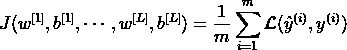
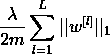
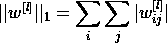
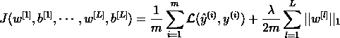
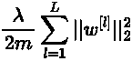
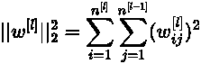
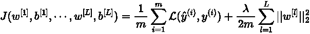
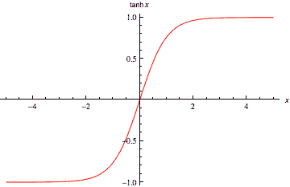
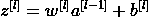
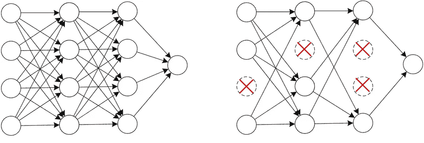

# 神经网络的正则化技术

> 原文：<https://towardsdatascience.com/regularization-techniques-for-neural-networks-379f5b4c9ac3>

## 当训练深度神经网络时，在训练集和验证集上实现相同的性能通常很麻烦。验证集上相当高的误差是过度拟合的明显标志:网络在训练数据中变得过于专门化。在本文中，我提供了一个关于如何绕过这个问题的综合指南。


来源:pixabay.com

# 神经网络中的过拟合

在处理任何机器学习应用程序时，对模型的偏差和方差有一个清晰的理解是很重要的。在传统的机器学习算法中，我们谈到了[偏差与方差权衡](https://en.wikipedia.org/wiki/Bias%E2%80%93variance_tradeoff#:~:text=In%20statistics%20and%20machine%20learning,bias%20in%20the%20estimated%20parameters.)，这包括试图最小化模型的方差和偏差时的斗争。为了减少模型的偏差，即减少错误假设的误差，我们需要一个更复杂的模型。相反，减少模型的方差，即模型在捕捉训练数据的变化时的灵敏度，意味着更简单的模型。很明显，在传统的机器学习中，偏差与方差的权衡来自于同时需要更复杂和更简单的模型的冲突。

在深度学习时代，有一些工具可以只减少模型的方差而不损害模型的偏差，或者相反，减少偏差而不增加方差。在探索用于防止神经网络过度拟合的不同技术之前，澄清高方差或高偏差的含义是很重要的。

考虑一个常见的神经网络任务，如图像识别，并考虑一个识别图片中熊猫存在的神经网络。我们可以自信地估计，人类可以以接近 0%的误差完成这项任务。因此，这是图像识别网络准确性的合理基准。在训练集上训练神经网络并评估其在训练集和验证集上的性能后，我们可能会得出这些不同的结果:

1.  训练误差= 20%，验证误差= 22%
2.  训练误差= 1%，验证误差= 15%
3.  训练误差= 0.5%，验证误差= 1%
4.  训练误差= 20%，验证误差= 30%

第一个例子是高偏差的典型实例:训练集和验证集的误差都很大。相反，第二个例子的方差很大，在处理模型没有从中学习的数据时，准确性要低得多。第三个结果代表低方差和偏差，模型可以被认为是有效的。最后，第四个示例显示了高偏差和方差的情况:与基准相比，不仅训练误差大，而且验证误差也更高。

从现在开始，我将介绍几种正则化技术，用于减少模型对训练数据的过度拟合。它们对于情况 2 是有益的。第四。前一个例子。

# 神经网络的 L1 和 L2 正则化

类似于经典回归算法(线性、逻辑、多项式等。)，L1 和 L2 正则化也为防止高方差神经网络中的过拟合找到了位置。为了保持这篇文章简短切题，我不会回忆 L1 和 L2 正则化是如何在回归算法上工作的，但是你可以查看[这篇文章](https://neptune.ai/blog/fighting-overfitting-with-l1-or-l2-regularization)以获得更多信息。

L1 和 L2 正则化技术背后的思想是将模型的权重限制得更小，或者将其中一些缩小到 0。

考虑经典深度神经网络的成本函数 J:



当然，成本函数 j 是每一层的权重和偏差的函数，L. m 是训练样本的数量，ℒ是损失函数。

## L1 正则化

在 L1 正则化中，我们将以下项添加到成本函数 J 中:



其中矩阵范数是网络的每一层 1，…，L 的权重的绝对值之和:



λ是正则项。这是一个必须仔细调整的超参数。λ直接控制正则化的影响:随着λ增加，对权重收缩的影响更加严重。

L1 正则化下的完整成本函数变成:



对于λ=0，L1 正则化的效果为零。相反，选择太大的λ值会过度简化模型，很可能导致网络不匹配。

L1 正则化可以被视为一种神经元选择过程，因为它会使一些隐藏神经元的权重为零。

## L2 正则化

在 L2 正则化中，我们添加到成本函数的项如下:



在这种情况下，正则项是每个网络图层权重的平方范数。这个矩阵范数称为 Frobenius 范数，具体计算如下:



请注意，相对于层 l 的权重矩阵具有 n^{[l]}行和 n^{[l-1]}列。

最后，L2 正则化下的完整成本函数变成:



同样，λ是正则项，对于λ=0，L2 正则化的效果为零。

L2 正则化使权重值趋于零，从而产生更简单的模型。

## L1 和 L2 正则化如何减少过度拟合？

L1 和 L2 正则化技术对训练数据的过拟合有积极影响，原因有两个:

*   一些隐藏单元的权重变得更接近(或等于)0。结果，它们的作用被削弱了，最终的网络更简单了，因为它更接近于一个更小的网络。如介绍中所述，较简单的网络不容易过度拟合。
*   对于较小的权重，隐藏神经元的激活函数的输入 z 也变得较小。对于接近 0 的值，许多激活函数表现为线性。

第二个原因不是微不足道的，值得扩展。考虑双曲正切(tanh)激活函数，其图形如下:



双曲正切值

从函数图中我们可以看出，如果输入值 x 很小，函数 tanh(x)几乎呈线性。当 tanh 用作神经网络隐藏层的激活函数时，输入值为:



这对于小重量 w 也接近于零。

如果神经网络的每一层都是线性的，我们可以证明整个网络的行为是线性的。因此，约束一些隐藏单元来模拟线性函数，导致更简单的网络，并且因此有助于防止过度拟合。

一个更简单的模型通常是[不能捕捉训练数据中的噪声](/regularization-in-deep-learning-l1-l2-and-dropout-377e75acc036)，因此过拟合不太频繁。

# 拒绝传统社会的人

退出正则化的思想是随机删除网络中的一些节点。在训练过程之前，我们为网络的每个节点设置一个概率(假设 p = 50%)。在训练阶段，每个节点被关闭的概率为 p。退出过程是随机的，并且针对每个训练示例单独执行。因此，每个训练示例可能在不同的网络上训练。

至于 L2 正则化，丢弃正则化的结果是更简单的网络，更简单的网络导致更不复杂的模型。



简单网络中的掉线效应。来源:作者

## 实际辍学

在这个简短的部分中，我将展示如何在实践中实现辍学正规化。我将通过几行简单的代码(python)。如果你只对正则化的一般理论感兴趣，你可以很容易地跳过这一节。

假设我们已经在 numpy 数组`a4`中存储了网络第 4 层的激活值。首先，我们创建辅助向量`d4`:

```
# Set the keeping probability
keep_prob = 0.7# Create auxiliary vector for layer 4
d4 = np.random.rand(a4.shape[0], a3.shape[1]) < keep_prob
```

向量`d4`具有与`a4`相同的维数，并且包含基于概率`keep_prob`的值`True`或`False`。如果我们设置 70%的保持概率，这是给定的隐藏单元被保持的概率，因此，在给定的`d4`元素上具有`True`值的概率。

我们将辅助向量`d4`应用于激活`a4`:

```
# Apply the auxiliary vector d4 to the activation a4
a4 = np.multiply(a4,d4)
```

最后，我们需要用`keep_prob`值来缩放修改后的向量`a4`:

```
# Scale the modified vector a4
a4 /= keep_prob
```

需要这最后一个操作来补偿层中单元的减少。在训练过程中执行该操作允许我们在测试阶段不应用退出。

## 辍学如何减少过度拟合？

退出的效果是暂时将网络转换成一个更小的网络，我们知道更小的网络不太复杂，也不容易过度拟合。

考虑上面所示的网络，重点关注第二层的第一个单元。因为它的一些输入可能会由于退出而暂时关闭，所以该单元在训练阶段不能总是依赖它们。因此，隐藏单元被鼓励将它的权重分散到它的输入上。扩展权重具有降低权重矩阵的平方范数的效果，导致一种 L2 正则化。

设置保持概率是有效的丢失正则化的基本步骤。通常，为神经网络的每一层分别设置保持概率。对于具有大权重矩阵的层，我们通常设置较小的保持概率，因为在每一步，我们希望相对于较小的层保持成比例的较少权重。

# 其他正则化技术

除了 L1/L2 正则化和退出，还有其他正则化技术。其中两个是数据扩充和提前停止。

从理论上，我们知道在更多的数据上训练网络对减少高方差有积极的作用。由于获取更多数据通常是一项艰巨的任务，对于某些应用程序来说，数据增强是一种允许机器学习实践者几乎免费获取更多数据的技术。在计算机视觉中，数据增强通过翻转、缩放和平移原始图像来提供更大的训练集。在数字识别的情况下，我们也可以对图像施加失真。您可以检查[手写数字识别数据增强的应用](/generating-synthetic-data-to-train-an-ocr-learning-algorithm-4889f443fe92)。

早期停止，顾名思义，包括在最初定义的迭代次数之前停止训练阶段。如果我们将训练集和验证集上的成本函数绘制为迭代的函数，我们可以体验到，对于过拟合模型，训练误差总是保持减小，但是验证误差可能在一定次数的迭代之后开始增大。当验证误差停止减小时，正是停止训练过程的时候。通过更早地停止训练过程，我们迫使模型更简单，从而减少过度拟合。